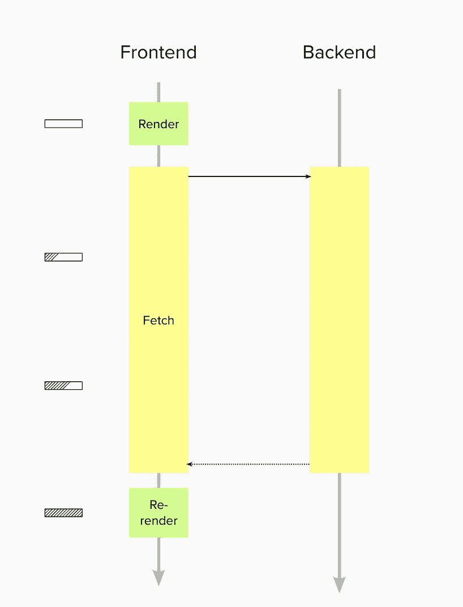
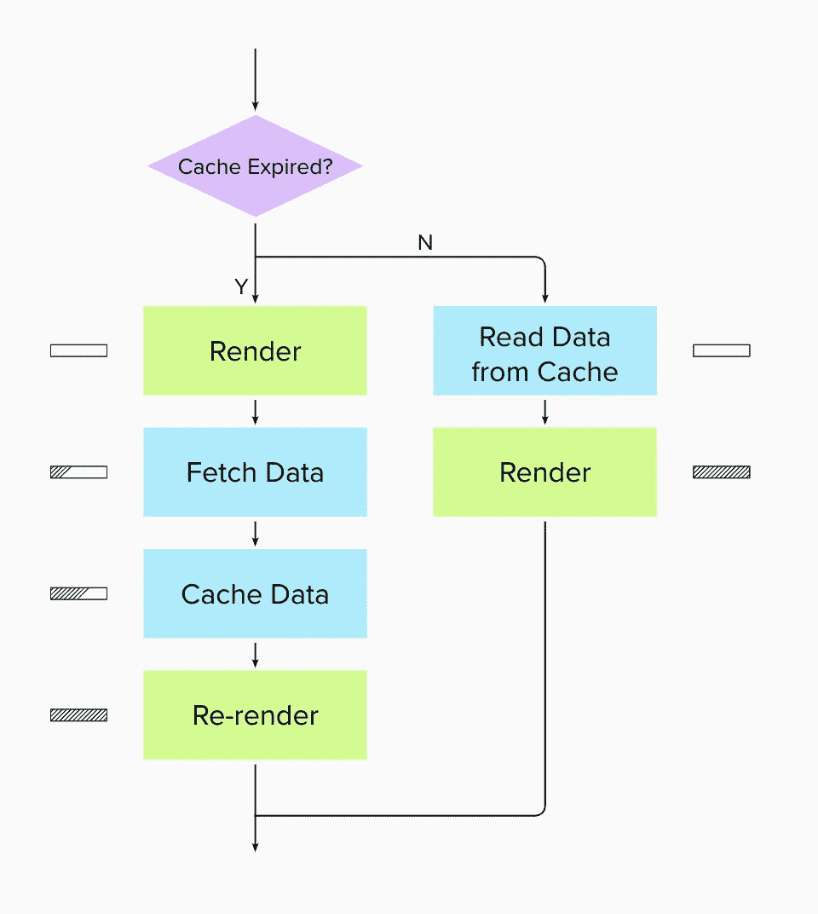
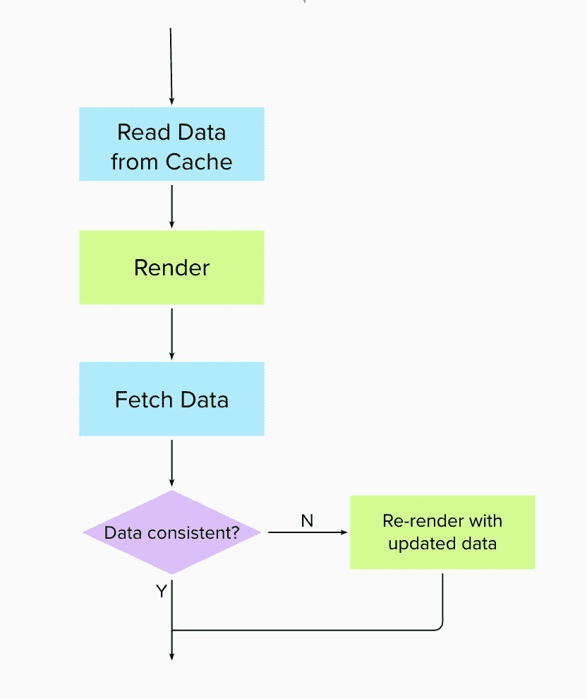
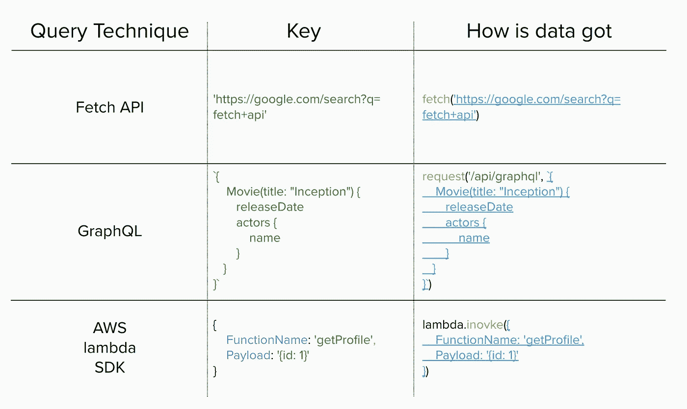

# SWR:前端数据获取和缓存

> 原文：<https://medium.com/nerd-for-tech/swr-frontend-data-fetching-and-caching-ca0313239d6f?source=collection_archive---------2----------------------->

从最近公布的 [*Tech Radar vol.24*](https://www.thoughtworks.com/radar) 中，我们可以看到 ThoughtWorks 已经将 SWR 从评估走向试验，这意味着这项技术值得追求。在这篇文章中，我想分享**为什么我们应该尝试 SWR，以及在使用 SWR** 时我们必须注意什么。

# 这篇文章是为谁写的？

前端开发人员。这是一篇关于为 SPA 获取和缓存数据的好模式的文章。您可能知道其他一些获取和缓存数据的方法。SWR 是一个值得一试的策略。

体验设计师。在我与 XDs 的日常工作中，我发现 XDs 总是有更好的静态 UI 设计感。但是对于单个框架之外的东西，UI 开发人员对可访问性、性能和一些与其他系统更好交互的技术有更多的见解。众所周知，等待是用户体验的一个因素，我们很难在一个 UI 原型中设计出来。因此，作为减少等待焦虑的一项措施，**缓存是一个值得 XD 与 UI 开发人员交流的话题**。

本文也适用于产品开发团队中的其他角色。对于服务器开发人员来说，了解客户端如何保持数据同步是很有意义的。一个 QA 应该明白 SWR 的质量弱点是什么。

# 最简单的数据获取模型

首先，让我们考虑一下 SPA 如何从 API 端点获取数据，然后在 UI 中呈现它。

首先，我们发送一个请求并等待响应。我们知道这可能需要几秒钟。得到响应后，我们需要更新 UI 状态并触发一个重新呈现器。让我们在下面画一个序列图，以便更好地理解数据获取中发生的事情。

前端数据提取

这是一个很好的数据获取模型，易于实现，在许多小型网站上运行良好。我们总是在进入基于这个模型的页面时获得新的数据。但是，我们可以想象**访问者如果频繁访问这个页面**，需要反复观看加载动画。

# 如何通过应用缓存来提升用户体验？

幸运的是，有一种比从远程服务器获取数据更快的方法来获取我们需要的信息。我们可以将数据存储在内存或磁盘中，使其立即呈现。人们通常称这个动作为**缓存**。

**缓存完数据，加载阶段太短感觉不到。**真酷。但是，用户在第一次访问时仍然需要等待数据加载。预取技术可以加快速度。预取是在用户有意访问数据之前进行的数据提取。总的来说，**如果使用缓存和其他一些基于缓存的技术，我们可以减少很多等待时间**。

cache 带给我们的另一个优势是在不稳定的网络连接下**可靠性的提升。因为有了缓存，页面已经得到了它需要的数据，不管后端服务器的响应质量如何。**

但是，缓存并不总是可靠的。**与我们最简单的获取模型不同，缓存最明显的问题是数据过期。**因此，将数据存储在缓存中并且从不更新数据是不明智的。想想修改用户资料的场景——如果我们在用户修改资料后不更新出现在其他页面上的资料，那就太奇怪了。解决方案是结合数据获取和缓存策略。

为了让页面知道它是需要获取最新的数据还是只从缓存中读取数据，我们可以设置缓存的最大年龄。当数据超过其最大年龄时，我们获取一个新数据并替换它。下图是这个策略的逻辑。

最大年龄缓存策略

目前，我们已经有了一个优秀的 SPA 网页——它节省了大量的数据流量时间，用户不需要在打开页面时加载动画。**然而，计算出合适的最大年龄并不容易，如果数据过期，仍然会有一个加载期。**

SWR 以友好的设计提供了全面的解决方案。

# 失效但重新验证策略

SWR 代表过时而重新验证。这意味着**它首先返回一个缓存值以使 UI 立即呈现，同时它也重新验证数据(获取最新数据并比较差异)**并在有任何变化时更新状态。

虽然它仍然有一个类似的 max-age 的概念来取消短时间内发生的重新验证，但设置一个小值是安全的，因为如果没有数据差异，用户不会看到任何 UI 更改。

重新验证时的状态

**SWR 在不稳定的网络环境下也能很好地工作。**与加载时间长相比，显示陈旧数据可以减少焦虑，SWR 可以在网络状况恢复时重新验证。默认情况下，当组件获得焦点时，SWR 的大多数主要实现都会重新验证数据。**该设计旨在保持数据与远程服务器同步，并且仅在必要时同步。**

另外值得一提的是，由于 SWR 是关于缓存的，**直接缓存突变有时是需要的**。当用户修改他的配置文件时，缓存的配置文件数据显然是过时的。最好将这个缓存数据标记为过时，并强制其重新验证数据，或者我们可以在预见到某些端点的响应更新时直接覆盖缓存。

同样，SWR 更多的是关于缓存策略而不是发送请求，所以 **SWR 兼容多种数据获取技术**。除了标准的 Fetch API 和 Axios 之类的一些其他 HTTP 请求库，它还应该支持不同的基于键的查询，包括 GraphQL 甚至云函数调用。我们使用键来索引缓存的数据，并且根据查询技术，键可能有不同的格式。

**SWR 实施**

目前，有几个图书馆支持 SWR。这是一份排名靠前的名单。

*   [SWR](https://swr.vercel.app/)——一个**轻量级** React 钩子库，由著名框架 Next.js 背后的同一个团队创建
*   [React 查询](https://react-query.tanstack.com/)—**React 最强大的**数据提取库。下面是 React 查询团队维护的库的详细比较:[https://react-query.tanstack.com/comparison#_top](https://react-query.tanstack.com/comparison#_top)。
*   [swrv](https://github.com/Kong/swrv)—React 的 SWR 的一个 **Vue** 端口，使用 Vue3 的组合 API。
*   [Apollo](https://www.apollographql.com/)——实际上，不是 SWR 的实现，但是它支持基于流行的 **GraphQL** 的类似特性。

# 警告

我们从缓存中受益，但应该对缓存保持谨慎。

使用 SWR 时，**总是将数据查询视为对缓存的读取**。这意味着我们立即得到的数据并不总是代表来自服务器的事实。当不能容忍过时数据时，可以跳过 SWR，直接获取数据。

并且，我们应该**而不是**假设我们的组件总是能够立即从缓存中获取数据。对于一个你以前从来没有查询过的键，包括在以前的渲染中查询或者通过预取查询，如果没有给定初始值，SWR 只能用一个未定义的值来响应。在这种情况下，像加载动画这样的状态转换仍然是必要的，我们也应该**而不是**忘记测试中的场景。