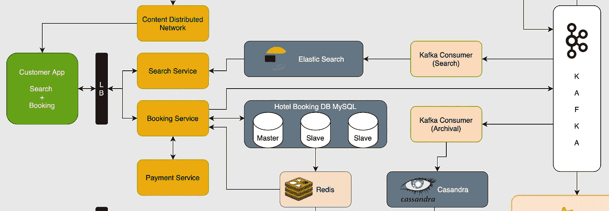
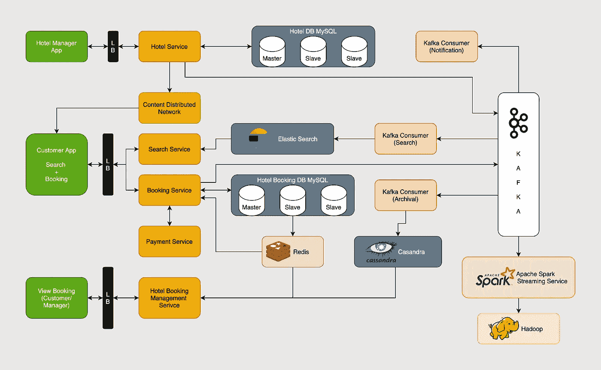

# 酒店预订应用程序的系统设计架构(如 OYO 的 Airbnb)

> 原文：<https://medium.com/nerd-for-tech/system-design-architecture-for-hotel-booking-apps-like-airbnb-oyo-6efb4f4dddd7?source=collection_archive---------0----------------------->

像 Airbnb、Booking.com 和 OYO 这样的酒店预订应用程序是如何提供如此顺畅的流程，从酒店列表到预订，再到支付？而且没有一点小故障！在这篇博客中，你会得到对此的详细解释。

爱德华·约翰逊在 [Unsplash](https://unsplash.com?utm_source=medium&utm_medium=referral) 上拍摄的照片

这些是如此巨大，他们有大量的用户流量需要处理。因此，为了管理这些，我们必须遵循微服务架构。这意味着我们必须为每种类型的任务将系统分成小块。

让我们一个一个的了解流程。我把它分成三部分:

*   酒店管理服务
*   客户服务(搜索+预订)
*   查看预订服务
*   完工图纸

# 酒店管理服务

这是将提供给酒店经理/业主的服务。在这里，经理可以管理他们酒店的相关信息。在这里，管理人员有一个单独的门户来访问和更新数据。

酒店管理服务架构

每当从 hotel manager 应用程序触发 API 时，初始请求会被发送到负载平衡器，然后负载平衡器会将请求分发到所需的服务器进行处理。酒店服务集群有多个服务器，这些服务器包含与酒店服务相关的 API 的容器。

现在，这个酒店服务与遵循主从架构的酒店数据库集群进行交互，以减少数据库中的负载。基本上，在这种方法中，我们创建了一个主数据库的副本，称为从数据库。主数据库用于写操作，从数据库仅用于读操作。每当在主数据库上执行写操作时，它都会将数据同步到从数据库。

每当数据库中有数据更新时，API 会将数据发送到 CDN(内容分布式网络)和消息队列系统(如 Kafka、RabbitMQ)进行进一步处理。CDN 是一组地理上分散的服务器，它们协同工作，提供互联网内容的快速交付。

# 客户服务(搜索+预订)

这是将提供给客户的服务。在这里，顾客可以搜索和预订酒店。在这里，客户有一个单独的门户来访问和处理数据。

客户服务架构

CDN 应用程序向客户显示内容，如附近的酒店、推荐、优惠等。

正如我们在上一节中讨论的，酒店数据被发送到消息队列系统进行处理。这里我们有一个消息队列消费者，它从队列中获取数据，并将数据存储在弹性搜索中。

客户应用程序点击 API，然后负载平衡器将请求重定向并分发到相应的服务以处理请求。这里我们有两个服务，一个用于搜索酒店，一个用于预订酒店的预订服务，预订服务还与第三方服务支付服务交互。

搜索服务必须从弹性搜索中获取数据。Elasticsearch 是一个 NoSQL 数据库，它的搜索引擎功能最好。

预订服务与 Redis 和预订数据库集群通信。Redis 是一个缓存系统，它存储临时数据，这样数据就不需要从数据库中取出，最终可以减少数据库的负载，也减少了 API 的响应时间。

在数据库中所做的任何更改都将被发送到消息队列。然后，消费者将从队列中取出数据，并将其放入 Casandra。对于存档，我们使用 Casandra，因为随着时间的推移，数据库中的数据量会增加，从而增加查询时间。这就是为什么我们可能需要从数据库中删除旧数据。卡珊德拉是 NoSQL 的一个数据库，擅长处理大量的数据。

# 查看预订服务

这里向用户显示了所有当前和以前的预订详细信息。经理和客户都使用这项服务。

查看预订架构

客户/经理应用程序将请求发送到负载平衡器，它将请求分发到预订管理服务器。然后服务通过 Redis 和 Cassandra 请求数据。通过 Redis，它请求最近的数据，因为它是一个缓存服务器。这可以减少应用程序端的加载时间。

# 完工图纸

酒店预订系统设计

在上面的设计中可以看到，有一个 Kafka 用于通知消费者，通知消费者发送通知。这可能是针对客户/经理的，比如每当客户预订酒店时，都会向经理发送通知，或者如果有新的报价，就会通知客户。

Apache Streaming service 从消息队列中获取数据，并将其存储在 Hadoop 中，Hadoop 可用于多种目的的大数据分析。比如商业分析、寻找潜在客户、受众分类等。