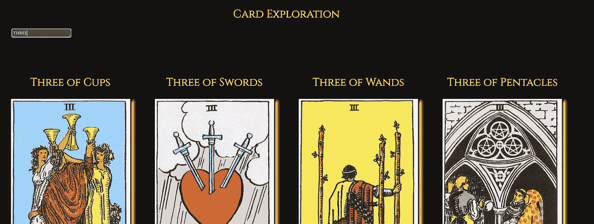
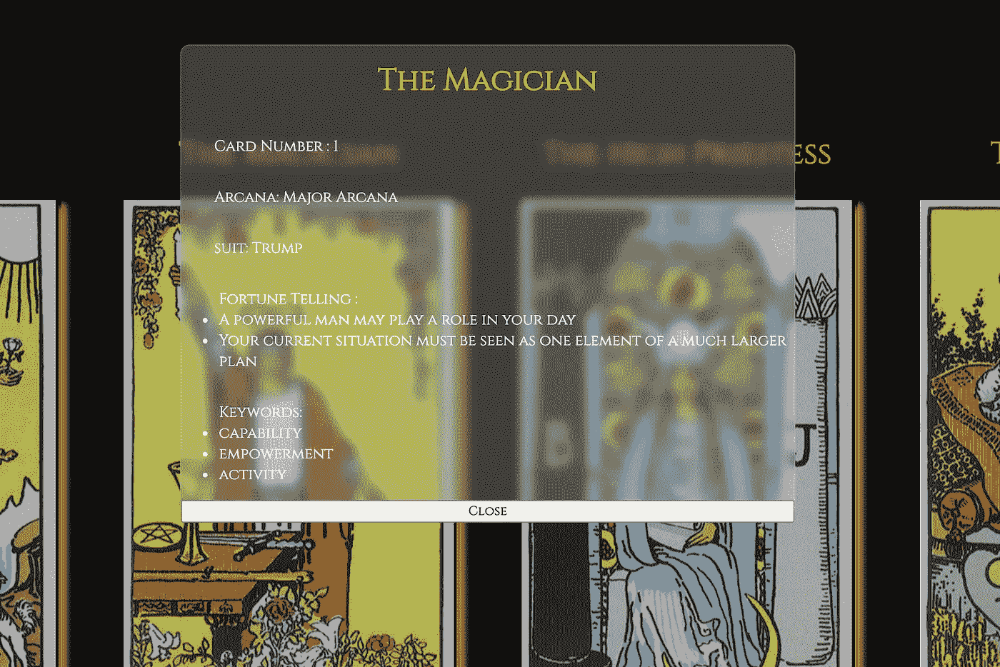
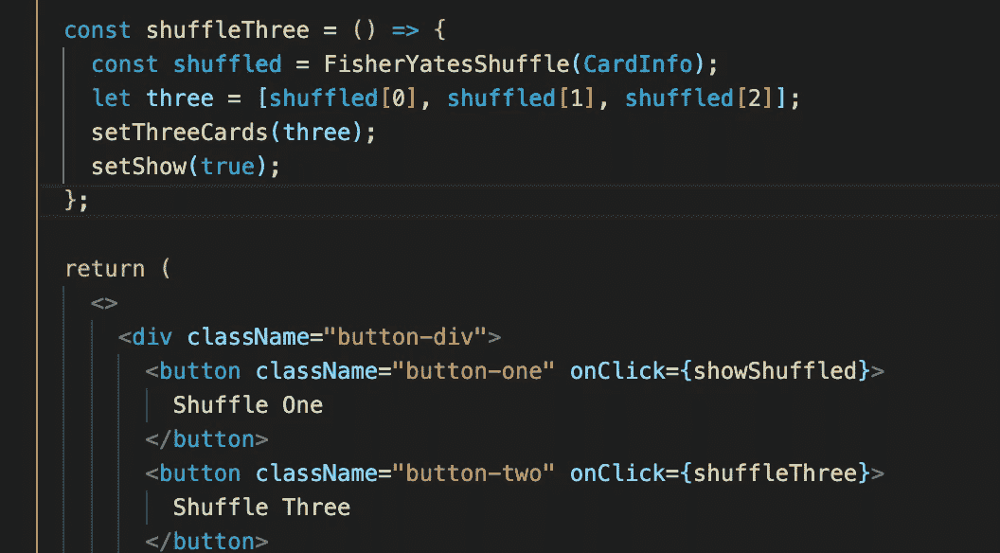

# 塔罗牌应用程序早期开发

> 原文：<https://medium.com/nerd-for-tech/tarot-card-app-early-development-3f4046125f95?source=collection_archive---------17----------------------->

继上周的博客规划个人项目 React 塔罗牌应用程序之后，我现在将详细介绍我在项目开发的早期阶段于本周完成的一些工作。

截至上周撰写本文时，我只在一种我称为 AllCards 的概述组件中完成了图像和信息的获取和显示。该页面组件按顺序显示塔罗牌。它由 SingleCard 组件组成，我将在应用程序的其余部分使用它。

我决定应用程序的黑色和金色主题，所以你会看到这反映在我在网站范围内做出的风格决定。

我对 AllCards 页面做的第一个改进是搜索功能。这需要创建一个 SearchBar 组件，本质上只是一个样式化的输入字段，它接受 AllCards 页面中的 searchTerm 和 changeHandler 属性。使用这些信息，用户可以在键入时创建动态搜索。例如，这在寻找标题中带有“三”的卡片时特别有用。

这是通过过滤从 CardInfo 获取的映射结果来实现的，以包括输入字母的状态。

我的下一步是创建一个显示每张卡片 onClick 信息的模型。SingleCard 组件有一个连接到 state 的侦听器，它指示模式是否显示。一旦打开，模式就会关闭，并带有一个标记为“关闭”的按钮，或者当用户在模式外部单击时关闭。

SingleCard 和 InfoModal 组件展示了 React 的模块化和可重用特性。一旦我设置了洗牌组件逻辑，就很容易插入这些组件来显示和给出洗牌的细节。

对于那些对塔罗牌的最初目的感兴趣的人来说，他们可以找到通过阅读页面组件讲述的个人故事，阅读页面组件由几个洗牌组件组成。

我实现了 Fisher Yates 洗牌算法。我把这个函数变成了它自己的组件，因为我多次重用了它。我将 CardInfo 数组插入到算法中，将结果设置为一个变量，并在第一个(以及第二个和第三个，如果适用的话)索引处返回卡片，该索引设置为 state。

这是随机播放的部分渲染功能。

在阅读页面上，我允许用户洗牌并返还一张或三张随机卡片。然后，他们可以单击这些卡片，从 InfoModal 组件获取卡片信息。

阅读材料页在这一点上还相当初级。在返回的洗牌之前，有一个空牌组组件，基本上只是三张空牌。我计划将它制作成 CSS 动画或过渡，最终增强卡片的显示效果。但是现在，它是固定的，显示与否取决于用户是否点击了其中一个按钮。

我该项目的下一步是美化造型。然后，我将重构项目，使用 Redux 进行状态管理。

之后，我将集成一个后端。有了这些，我就可以创建用户了，用户可以保存他们的阅读材料并创建笔记。我还打算为洗牌创建更复杂的布局，并允许用户创建自定义布局和洗牌。