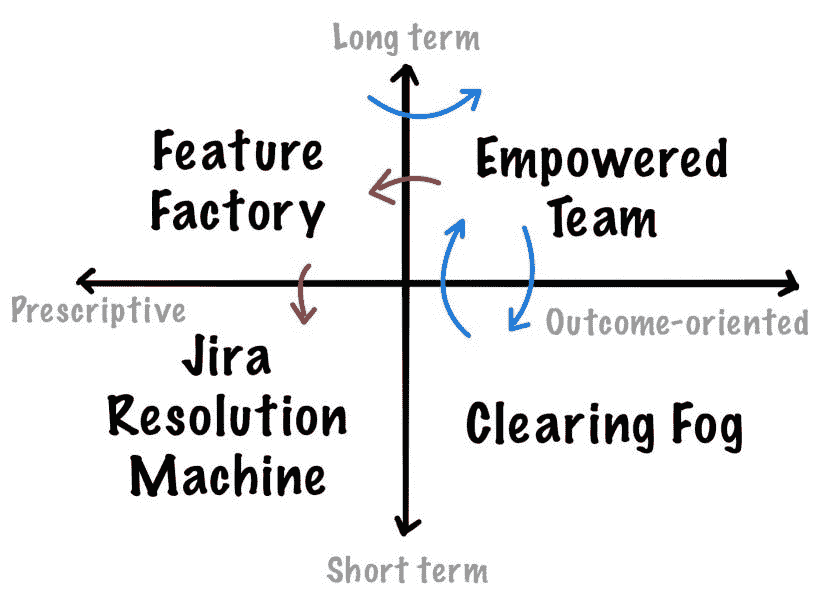

# 团队授权协调

> 原文：<https://medium.com/nerd-for-tech/team-empowerment-alignment-7feb29d5b0d0?source=collection_archive---------3----------------------->

我非常支持授权产品团队，并帮助许多公司向这种文化健康过渡。然而，我经常遇到这样的高管，他们认为自己已经做到了这一点，而事实上，他们创造了昂贵的吉拉决议机器。我认为，在某些情况下，向授权产品团队的转变可能并不最适合公司。这篇文章将帮助你诊断你处于哪种状态，以及你是否应该考虑以某种方式积极推动。

考虑下图。我将团队分成了与我们的讨论特别相关的两个方面:

**目标类型:**团队是否接到具体的任务去执行，这是*规定的*，或者是一个大问题去解决，这是*结果导向的*。

**视野:**前路有多清晰？它目前的路径周围有多少雾？*短期*思考是在没有明确前进道路的时候，而*长期*思考是在我们拥有足够清晰的时候。

# 吉拉分辨率机器

这些团队受到严格的控制，没有长远的愿景，并且不断地接受特定的任务和交付指令。这通常是用于次要和耗时任务的离岸团队的情况。一个典型的例子是，公司必须创建许多不同的 API 集成，这不需要太多的资历或创造力。太多的公司以这种不必要的模式运作，经理们倾向于微观管理，仅仅是因为他们不知道做什么不同。

# 特色工厂

这可能是大多数现代和有意识的团队现在正在走向的模式。这是因为这通常是实现真正授权的产品团队的先决条件。在这种模式下，团队致力于长期愿景，负责产品的一部分，通常是跨职能的。这听起来像是它勾选了所有正确的方框，除了没有伟大的产品领导(产品和工程经理)的事实，它经常最终只交付授权承诺的一部分。

这些团队通常非常有生产力，并且能够一致地交付特性。然而，他们仍然被喂食特定的任务。在这些组织中，OKR 的“目标”可能是“提供新的入职功能”这错过了授权和 OKRs 的本质，团队被给予一个要实现的结果，而不是预先规定要做的工作。

# 驱散迷雾

正如我在 [*科技高管操作系统*](https://techexecutiveoperatingsystem.com) 中解释的那样，每一家创新型公司都会经历未来更加模糊的时期。这意味着一个结果驱动的团队可以执行短时间的迭代和集中的实验，以获得最佳前进道路的清晰性。一个例子是授权和高级团队还没有达到产品市场适合。

尽管这些团队缺乏长期愿景，但就目前而言，他们有确定愿景的权力。他们专注于短期目标，帮助验证正确的前进道路。

# 授权团队

圣杯，团队被给予一个商业成果，然后被释放。凭借卓越的产品领导力，这些团队可以独立运作，寻找创造性的解决方案，创新他们的行业，并主导市场。我一点也不夸张——这就是为什么我的人生使命是帮助创造更多这样的东西。然而，这并不容易，而且经常是仓促的。当你把这种心态强加给一个还没有准备好的团队时，通常会导致高管在几个月后才意识到浪费了很多时间。

这可能为时过早的例子包括承诺一个尚未得到足够验证的长期愿景，允许不够资深的团队拥有这种独立性，或者在波动性很大的时期(例如，疫情刚刚起步，可能会改变你的行业)。

# 过渡

你可能已经在上面的描述中发现了你的团队。然而，本文的重点不仅仅是描述可能性，而是帮助您认识到何时应该进行转换。团队是活的有机体，有时需要调整他们的运作模式。

在上图中，我列出了一些你应该记住的常见转换:

*为授权团队拨开迷雾:*一个非常自然的过渡，表明团队已经成功拨开迷雾！一旦我们明确了前进的道路，团队可以继续以类似的方式运作，并专注于长期愿景。如果你一直在以看板模式运行，执行大量实验，现在已经实现了产品与市场的契合，并且可以提前计划一个更具体的路线图，并且你非常确定在未来 6 个月或 12 个月内仍然相关，那么这是有意义的。

*授权团队驱散迷雾:*相反的转变也是可能的，并不一定意味着会发生任何错误。当公司转向新的机会、市场出现混乱(如监管变化)或正在考虑新的创新概念时，我看到了这种情况。

*向授权团队展示工厂:*这些团队正在“成长”最后，有了足够的高级人才和正确的心态，他们就可以着手解决实质性的问题，充分发挥他们的潜力。一旦团队获得高级领导(产品经理和工程经理)以及高管团队和利益相关者的支持，这种情况就会发生。

*授权团队展示工厂:*镜像案例通常不是好消息，但它确实发生了。我见过这种情况，当团队失去了他们的领导者，又没有现成的替代者。在这种情况下，假装一切正常是没有意义的，而进入这种“战争模式”直到合适的人上船才是有意义的。

*特色工厂给吉拉解析机器:*坦白说，这不好。我提到它的唯一原因是，如果你，作为一名高管，发现了这种情况，这通常意味着你的一位经理决定比以前更微观地管理团队。这可能是因为他们是新来的，也可能是因为他们有压力。我的建议是不要忽视它，考虑一下原因，以帮助减轻他们的恐惧。

*Aviv Ben-Yosef 2022 —最初发表于* [*科技高管最佳时事通讯*](https://avivbenyosef.com/newsletter/)