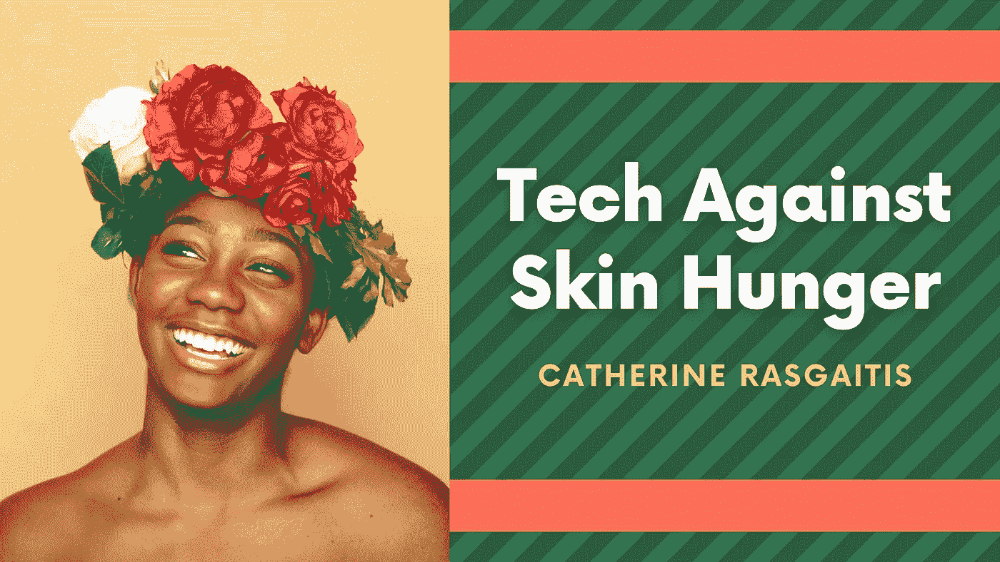
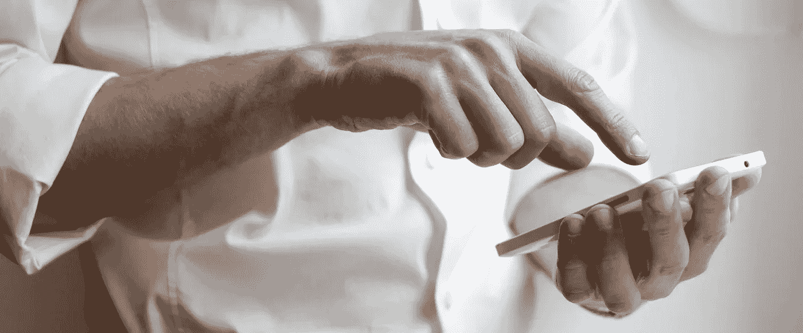

# 对抗皮肤饥饿的技术

> 原文：<https://medium.com/nerd-for-tech/tech-against-skin-hunger-18f0b22682b2?source=collection_archive---------19----------------------->

## 由人类“肉”制成的手机

照片由[秋古德曼](https://unsplash.com/@auttgood)拍摄，由 [Unsplash](https://unsplash.com/photos/vTL_qy03D1I) 提供

“皮肤饥饿”是一种现象，源于自然的、生物的对人类接触的渴望。

研究表明，没有经常与人接触的婴儿实际上可能会停止生长，甚至死亡，这取决于他们与外界隔绝的时间。从零岁到五岁，如果一个发育中的孩子没有得到足够的刺激，他们将永远不会充分发挥他们的能力。虽然这类实验的伦理性值得怀疑，但它们清楚地表明了人类对触摸的真实的、与生俱来的需求。

这其实也是新生儿重症监护室的婴儿被放在父母裸露的胸部上的原因。事实上，小时候被展示更多皮肤接触的孩子长大后更不容易有暴力倾向或卷入犯罪。

但是即使我们长大了，触觉仍然很重要。在被诊断患有多动症的年龄较大的孩子中，按摩可以减少他们坐立不安的习惯，孩子们声称总体上感觉更放松。与不健康的烟瘾或瘾作斗争的人也可以用按摩来抑制吸烟的冲动。

触摸也不仅仅是从日常焦虑中愉快地转移注意力——它是一种生物反应，字面上的*是*降低你的压力水平。从科学的角度来看，当一个人被触摸时，这种接触会激活你皮肤下的压力传感器，向你大脑中一种叫做迷走神经的特殊神经发送信息。迷走神经活动的增加会导致你的神经系统变慢。因此，你的心率和血压会降低，你的脑电波也呈现放松状态。与此同时，皮质醇等与压力相关的激素减少。

有趣的是，由于皮质醇水平降低，人类接触在帮助艾滋病毒或癌症患者方面是有效的。皮质醇分解攻击异物的白细胞。当皮质醇水平过高时，细胞就无法抵抗这些类型的病毒。通过人类的触摸，我们可以降低皮质醇水平，从而自然增加这些细胞。

照片由[诺德伍德主题](https://unsplash.com/@nordwood)拍摄，由 [Unsplash](https://unsplash.com/photos/q8U1YgBaRQk) 提供

如今，大多数技术界面都相当冷淡。但是，认识到皮肤饥饿的重要性，Skin-On 项目采取了一种独特的方法，通过皮肤使这些界面更加人性化。

Skin-On 作为一种类似皮肤的包裹或覆盖物，包裹着您的移动设备。这层皮肤由硅树脂制成，以模仿真实皮肤的纹理和延展性。可以添加额外的硅氧烷，以使模具达到所需的肥度。同样，绘画和化妆可以把皮肤变成想要的颜色。

顶层下面是一个垂直的网格，形成一个电极板。这些电极随后连接到硬件感测平台，该平台感测来自用户的触摸。

这使得“皮肤”对不同的手势有类似人类的反应，比如戳、戳、捏和挠痒痒。皮肤也可以对用户的情绪做出反应。例如，非常强烈或突然的压力象征着愤怒，而小心的抚摸代表着安慰。

从视觉上看，皮肤接触乍一看可能有点令人吃惊，甚至令人毛骨悚然:

 [## 马克·泰西耶

### 皮肤界面是敏感的类似皮肤的输入方法，可以添加到现有的设备上以增加它们的…

marcteyssier.com](https://marcteyssier.com/projects/skin-on/) 

皮肤接触推动了我们应该在多大程度上应对让技术更“人性化”的挑战。人造皮肤与人类皮肤不同，但当真的皮肤不可用时，它可能会给一些人带来安慰。因此，虽然许多人现在觉得皮肤覆盖的手机令人不安，但皮肤覆盖和类似的产品可能有一天会成为规范。

羽衣甘蓝先生。"皮肤饥饿有助于解释你对人类接触的极度渴望."*连线英国*，连线英国，2020 年 4 月 29 日，[www . WIRED . co . UK/article/skin-hunger-coronavirus-human-touch。](http://www.wired.co.uk/article/skin-hunger-coronavirus-human-touch.)

麦克唐纳汉娜。"这款由人造人类皮肤制成的手机壳不仅仅是用来吓人的." *Mental Floss* ，Mental Floss，2019 年 10 月 24 日，[www . Mental Floss . com/article/604791/phone-case-of-artificial-human-skin。](http://www.mentalfloss.com/article/604791/phone-case-of-artificial-human-skin.)

"皮肤对皮肤的接触和人类接触的好处." *MedBroadcast* ，MedBroadcast，[www . med broadcast . com/channel/mental-health/stress/skin-to-skin-contact-and-the-benefit of-human-touch。](http://www.medbroadcast.com/channel/mental-health/stress/skin-to-skin-contact-and-the-benefit-of-human-touch.)

莎拉维兹，玛雅。“感人的共情。”*今日心理学*，苏塞克斯出版社，[www . psychologytoday . com/us/blog/born-love/201003/touching-empathy。](http://www.psychologytoday.com/us/blog/born-love/201003/touching-empathy.)

泰瑟尔马克。"移动设备的人造皮肤."马克·泰瑟尔，marcteyssier.com/projects/skin-on/.