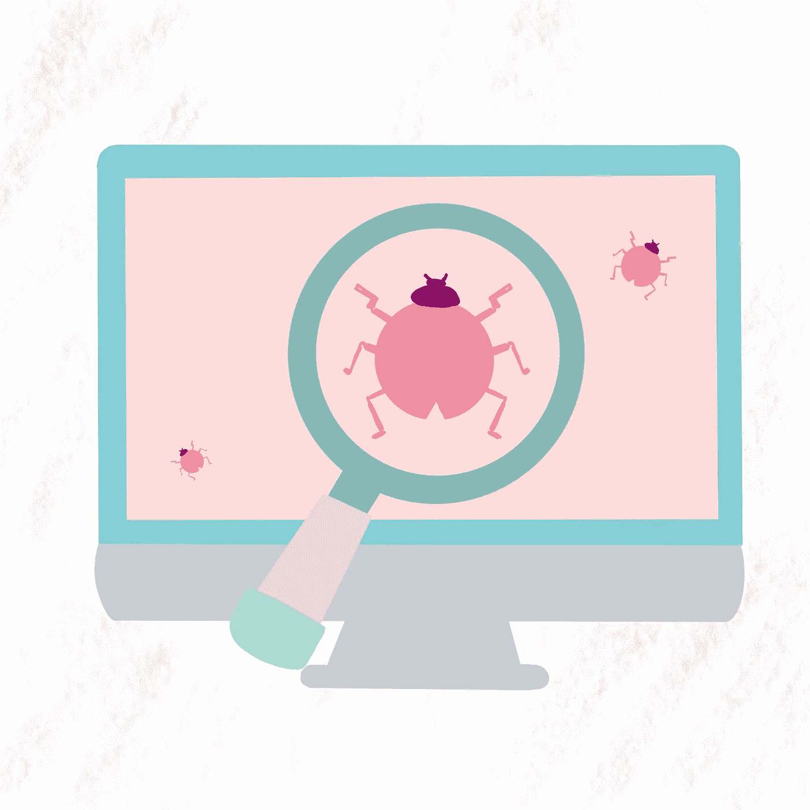

# 测试您的第一个烧瓶应用程序

> 原文：<https://medium.com/nerd-for-tech/testing-your-first-flask-application-c04052baddba?source=collection_archive---------21----------------------->

在这里，我们将通过非常基础的设置和测试烧瓶端点。Flask 是一个 python 框架，它不是预装的，所以您需要先下载才能使用它。

**创建我们的 Flask 应用:**

我们创建一个名为 app 的变量，并给它分配一个 Flask 对象。Any _abc_ 是一个，双下划线是 python 中唯一的字符串。__name__ 变量包含我们当前运行的模块的相对路径。

然后我们定义第一个端点，告诉它 app . route(“/”)中的端点是什么，这类似于输入我的 site.com/。这为我们的应用程序创建了主页。当 URL 被点击时，def home()将运行。

为了运行这个应用程序，我们需要调用 main，所以当我们运行 app.py 时，_name_ 将等于 main。如果我们导入另一个文件，该文件将是 _main_。this _ File，当这个文件正在运行时。

app 是一个重要的变量，因为测试将导入这个变量，并且可以访问 flask app。

当另一个文件导入这个文件时，名称将不是 main，这个文件将不会运行，这是一件好事，因为我们可以包括属性，而不必总是运行应用程序。

还有一点，端点不能返回字典，只能返回字符串。或者 json 字符串。所以我们导入 jsonify 来将我们的字典转换成端点的字符串。

**我们的第一个系统测试:**

系统测试，将整个系统作为系统的客户进行测试。

变量 app 有 flask app 定义，仔细观察这里我们不要求服务器在后台运行。我们只需要导入变量，就可以执行测试。Flask 提供了测试功能，我们不需要每次都运行应用程序。我们可以要求 flask 给我们一个 test_client。

我们正在创建上下文管理器，它以“with”开头，是整个块。像 test_client 这样的设置有助于快速运行系统测试。

**重构我们的系统测试:**

为了消除测试代码中的所有重复，我们可以引入一个名为 BaseTest 的类，这个模式需要遵循另一个测试，这不是测试的默认设置，因为这个类实际上不会包含在测试中。引入它是为了消除重复。

我们在所有的测试类中导入基本测试，以消除所有测试类中的任何重复。另外，app.testing = True 会启用 app，告诉 flask 在应用程序的生命周期中，它处于测试模式。

你可以在这个回购中找到完整的代码。在构建这个简单的应用程序时，我学到了很多技术，这在一个庞大的系统中经常被忽略。希望这也能帮助你。:)

 [## purple state/TDD-博客

### 用 TDD - PurpleState/TDD-blog 编写的命令行设置示例

github.com](https://github.com/PurpleState/TDD-blog/tree/main/flaskapp)