# 邻里之战——美国各州相邻城市的比较。

> 原文：<https://medium.com/nerd-for-tech/the-battle-of-neighborhoods-comparison-of-neighboring-cities-of-us-states-5079a9889b66?source=collection_archive---------20----------------------->

图片作者:wallpaperaccess.com

# A.介绍

众所周知，购物、去一家特别的美食餐厅/快餐店或电影院给许多人提供了一种放松和娱乐的方式。但是由于服务不到位或距离太远，他们不得不长途跋涉，这导致他们在享受之前就已经筋疲力尽了。此外，许多利益相关者，房地产经纪人和商业人士正在寻找更好的方法来找出最佳的解决方案，在搜索一个有利可图的投资或项目。他们也有兴趣通过观察某个特定行业的不可用性或低竞争来了解公众的需求。在正确的地方开展正确的业务，可以让他们获得持续的利润，而不用担心亏损，最终因为竞争太激烈或没有需求而关闭业务。它也有利于普通人，因为现在他们将有奢侈的机会去参观那些现在就在他们附近的地方，而不用去想太多。任何商业决策都需要认真考虑，而且比看起来要复杂得多。因此，我们在力所能及的范围内提出了最好的解决方案。

**A.1 .业务问题**

这个顶点项目的目标是分析一组相似的城市，并将其划分为给定美国州的集群，同时选择该州城市的最佳位置来开设新的特定业务。该项目使用数据科学方法和聚类等机器学习技术，旨在提供解决方案来回答商业问题:在美国的任何一个州，哪个城市最适合开设哪种业务？

**A.2 .目标受众**

这个项目对股东、投资者、房地产经纪人、房地产开发商和其他希望在任何特定业务领域开业或投资的商业人士特别有用。根据 Convergehub (2019)的数据，超过 50%的小企业在第一年就失败了，超过 95%的小创业公司在头五年内失败了。根据 CB Insights (2019)，新企业失败的主要原因是缺乏市场需求。事实上，42%的小企业因为这个原因而失败。

# B.数据

**B.1 .为了解决问题，我们将需要以下数据:**

*   美国各州及其邻近城市列表。这定义了这个项目的范围，仅限于美国。
*   邻近城市的经纬度坐标。这是绘制地图和获取场馆数据所必需的。
*   场馆数据，任何特定城市的所有顶级场馆。我们将使用这些数据根据相似性对邻近城市进行聚类。

**B.2 .数据来源和提取数据的方法:**

这个大英百科全书页面([https://www . Britannica . com/topic/list-of-city-and-towns-in-the-United States-2023 068](https://www.britannica.com/topic/list-of-cities-and-towns-in-the-United-States-2023068))包含了美国所有州及其邻近城市的列表。我们将使用网页抓取技术从网页中提取数据，并将数据转换为 CSV 文件，以便于执行和使用。然后，我们将使用 Python Geocoder 包获得任何特定州的相邻城市的地理坐标，它将为我们提供相邻城市的经度和纬度坐标。

之后，我们将使用 Foursquare API 获取这些城市的场馆数据。Foursquare 拥有 1.05 亿多个位置的最大数据库之一，被许多开发者使用。Foursquare API 将提供许多类别的场馆数据，我们稍后将使用这些数据将城市分类为相似性/相异性，以帮助我们解决提出的业务问题，如当当前城市中没有该业务时，开设类似于另一个城市的业务结构的盈利概率是多少。这是一个将利用许多数据科学技能的项目，从网络抓取(大英百科全书)，数据清理和争论，与 Foursquare API 合作，到地图可视化(follow)和机器学习(K-means 聚类)。在下一部分中，我们将介绍方法部分，其中我们将讨论在该项目中采取的步骤、我们所做的数据分析以及所使用的机器学习技术。

# C.方法学

**C.1 .使用数据框&叶地图**

首先，我们需要获得美国所有州及其邻近城市的列表。幸运的是，这个列表可以在大英百科全书页面上找到([https://www . Britannica . com/topic/list-of-city-and-towns-in-the-United States-2023 068](https://www.britannica.com/topic/list-of-cities-and-towns-in-the-United-States-2023068))。之后，我们将使用 Python requests&beautiful soup 包进行 web 抓取，以提取邻近城市数据的列表。然后，我们将把它转换成数据帧和 CSV 文件，以便于执行和使用。为了能够使用 Foursquare API，我们还需要获得所选州(这里我取了阿拉巴马州)所有城市的经纬度形式的地理坐标。为此，我们将使用 Geocoder 包，它允许我们将地址转换为经度和纬度形式的地理坐标。

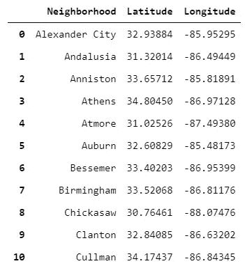

作者图片

收集完数据后，我们将把数据放入熊猫数据框，然后用 follow 包在地图上显示邻近的城市，坐标叠加在上面。这允许我们执行健全性检查，以确保 Geocoder 返回的地理坐标数据正确地绘制在阿拉巴马州。从数据帧中获得以下视觉效果:

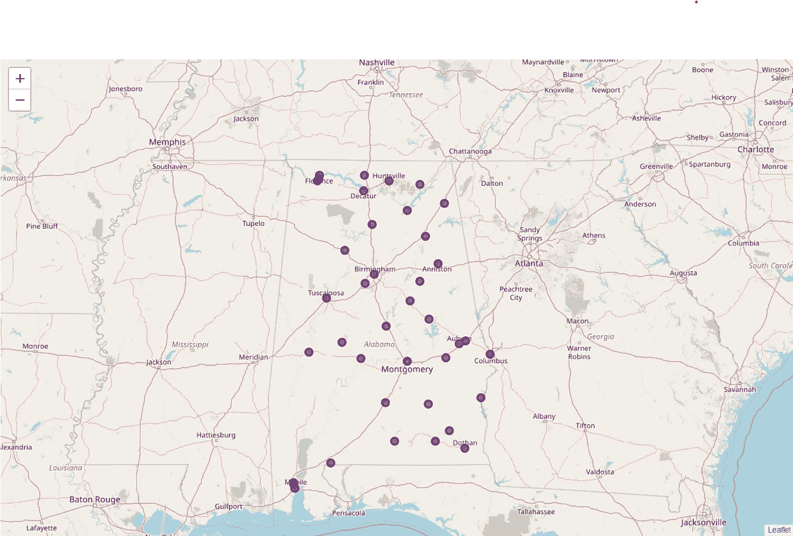

阿拉巴马州(作者图片)

接下来，我们将使用 Foursquare API 获得 15 公里半径内的前 1400 个地点。(您可以根据自己的喜好更改场地和半径的限制。)我们需要注册一个 Foursquare 开发者账户，以便获得 Foursquare 凭证。然后，我们对 Foursquare 进行 API 调用，在 Python 循环中传递邻居的地理坐标。Foursquare 将以 JSON 格式返回场馆数据，我们将提取场馆名称、场馆类别、场馆经纬度和距离。这是一个来自 Foursquare API 的地点名称，类别，纬度和经度信息列表的标题。

作者图片

有了这些数据，我们现在可以检查所选州的每个邻近城市返回了多少个场馆。(这里是阿拉巴马州)并检查从所有返回的场馆中可以策划多少独特的类别。(在本例中为 218)。然后，我们将对数据帧进行排序，并为每个唯一的场馆分配一个场馆编号，以便绘图&还可以查看哪个场馆类别在任何特定的州出现了多少。我们还将为要绘制在地图上的不同场馆类别定义一个配色方案。之后获得了以下图像:

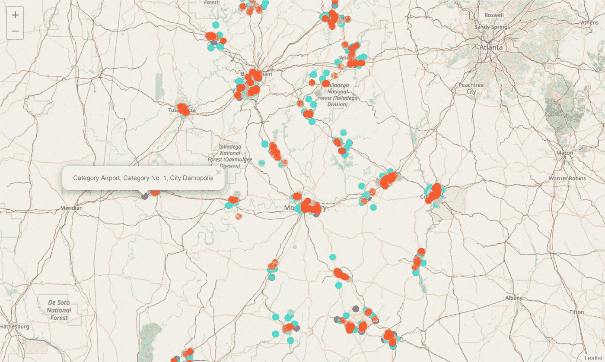

在这里，我们可以看到每个场馆类别都有不同的编号和颜色。(您可以在放大的地图中区分点)按作者分类的图像

我们也可以通过对特定城市重复上述方法来查看单独城市的图示，即检查独特的场馆类别、分类，然后形成具有独特场馆编号的数据框架。这里我举了一个“伯明翰”的例子。将获得以下图像:

作者图片

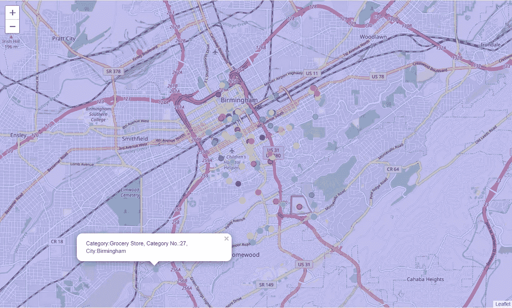

阿拉巴马州伯明翰(图片由作者提供)

我们还可以检查每个城市返回的场馆数量，并绘制它们以查看哪个城市有更多受欢迎的场馆以及受欢迎的数量。

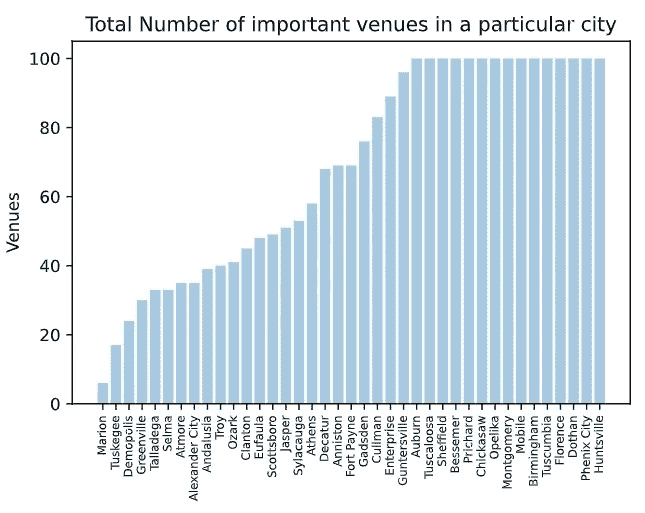

作者图片

在这里，我们可以看到一些热门城市是如何达到场馆的极限(100 个)的。另一方面；马里昂，塔斯基吉，德莫波利斯，格林维尔，塔拉迪加，塞尔玛，阿特莫尔，亚历山大市，安达卢西亚在我们给定的经纬度坐标下有 40 个场馆。

**C.2 .分析**

现在，我们将通过按相邻城市对行进行分组并取每个场馆类别出现频率的平均值来分析每个相邻城市。通过这样做，我们还准备了用于聚类的数据。此外，在这里我们可以检查任何特定类别的场所在所选州的所有城市中的存在百分比。比如海鲜餐厅。

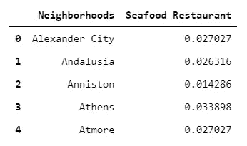

作者图片

现在，让我们创建一个表格，显示每个邻近城市的前 10 个场馆类别。

作者图片

最后，我们将使用 K-means 算法对具有相似公共场馆类别的邻近城市进行聚类。这是最简单和最流行的无监督机器学习算法之一，特别适合解决这个项目的问题。我们将根据相似性将邻近的城市分为 5 类。结果将允许我们识别哪个城市与哪个城市相似。基于此，它将帮助我们回答“在美国的任何一个州，哪个城市最适合开设哪种业务？”根据某一类场馆的有无。

包含每个相邻城市的聚类标签的合并表。(图片由作者提供)

我的目标之一是显示每个城市排名前三的场馆信息，以便进行更深入的研究，如在该特定城市有多少特定的顶级场馆，从而证明该场馆类别在那里是有利可图的，是否有太多的场馆可以在那里开设更多的业务。因此，我根据前 3 个场馆的数量对每个城市进行了分组，并将这些信息组合在“前 3 个场馆”列中。

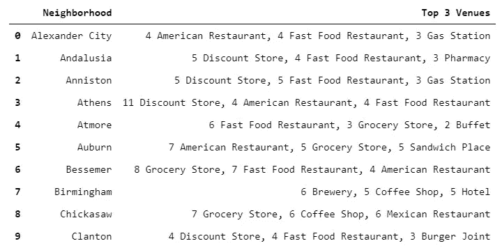

城市及其排名前三的场馆数量(图片由作者提供)

# D.结果

k-means 聚类的结果表明，我们可以将城市分为 5 个具有相似场馆类别的聚类。聚类的结果显示在下图中，聚类 1 为红色，聚类 2 为紫色，聚类 3 为浅蓝色，聚类 4 为薄荷绿，聚类 5 为黄色。

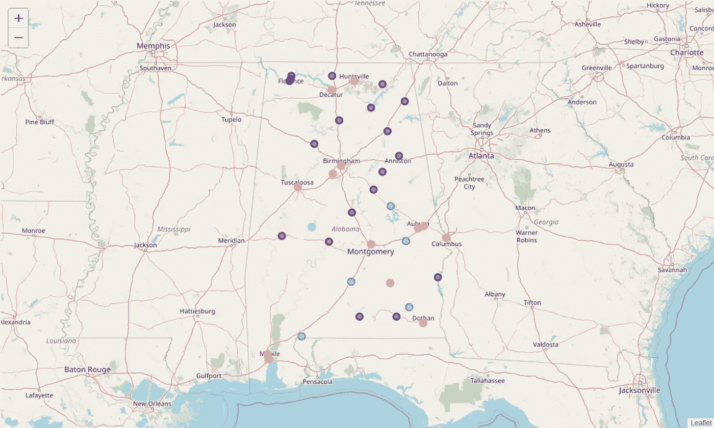

相似城市的 k 均值聚类(图片由作者提供)

我们还可以估计每个集群中第一最常见场馆、第二最常见场馆和第三最常见场馆的数量。因此，我们可以创建一个条形图，它可以帮助我们找到哪个场馆集中在哪个集群。

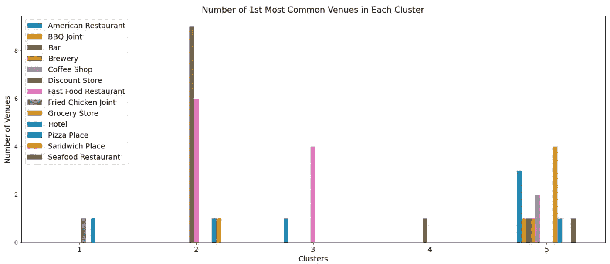

图表 1(图片由作者提供)

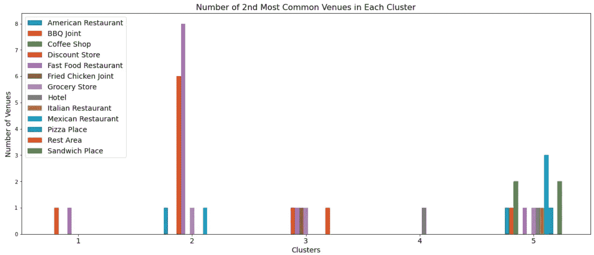

图表 2(图片由作者提供)

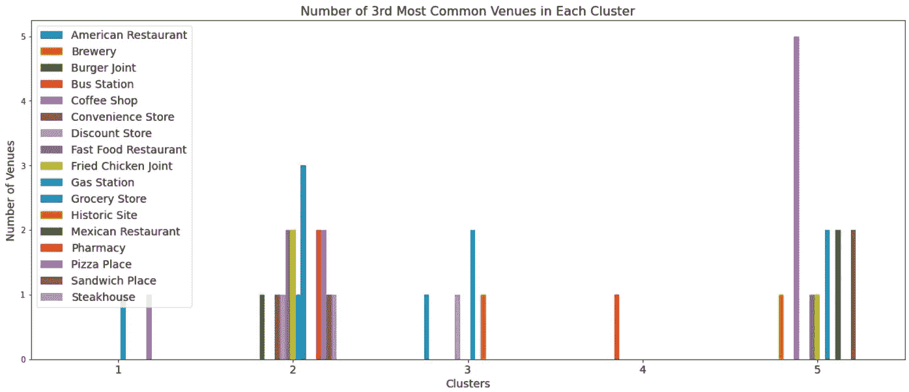

图表 3(图片由作者提供)

# E.讨论

正如我们从结果部分的地图中得到的观察结果，大多数邻近的城市都集中在第 2 和第 5 类中。另一方面，聚类 1 和 3 各只有两个城市，而聚类 4 非常独特，只有一个城市。我们还可以从图表中观察到，集群 5 缺失或“折扣店”和“快餐店”非常少。这代表了在集群 5 城市开设或投资这些场馆类别的巨大机会，反之亦然。我们可以观察到，与集群 5 相比，集群 2 缺少“咖啡店”或“咖啡店”数量较少，因此也创造了在该类别开设或投资的巨大机会。从另一个角度来看，研究结果还表明，在集群 2 的城市中，折扣店和快餐店都存在供过于求的现象。具有独特销售主张的房地产开发商将脱颖而出，此外，如果他们抓住上述机会，他们将不会面临或很少面临竞争。因此，该项目建议房地产开发商利用这些发现在特定城市或地区开设或投资任何业务类别。此外，如果房地产开发商或投资者想在集群 1 城市开设“折扣店”，他们应该小心谨慎。这也有利于想搬到一个新地方的人，如果他们特别需要一个像“折扣店”这样的经济友好型住宿场所，那么他们可以搬到集群 2 城市。此外，我们可以比较该州所有城市的相似或不同之处。因此，他们之间的战斗。

# F.结论

在这项研究中，我分析了某个州的城市之间的相似性和差异性。我确定了场馆的不同类别并进行分类。然后，通过图形表示& k-means 聚类，我将不同的城市分成不同的聚类组。该模型将帮助许多利益相关者和商人预测在特定地区开设特定业务的利润，或者他们是否应该开设该特定业务。人们开始转向大城市创业或工作。他们可以通过访问提供此类信息的平台获得更好的结果。而且，不仅是投资者，城市管理者也可以通过使用类似的数据分析类型或平台来更有规律地管理城市。

查看我的 GitHub 库以了解更多细节。

[https://github.com/vishalraj247/Battle_of_Neighborhoods.git](https://github.com/vishalraj247/Battle_of_Neighborhoods.git)

谢谢你们坚持到最后。我希望你们都喜欢阅读这篇文章。祝大家说的精彩！

为了未来，

Vishal Raj

# G.参考

 [## 美国城镇列表

### 这是一份美国选定的城市、城镇和其他有人居住的地方的列表，按字母顺序排列…

www.britannica.com](https://www.britannica.com/topic/list-of-cities-and-towns-in-the-United-States-2023068) 

[https://developer.foursquare.com/](https://developer.foursquare.com/)