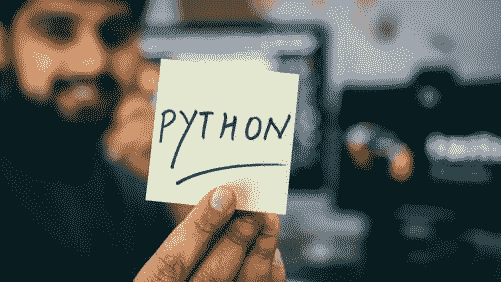
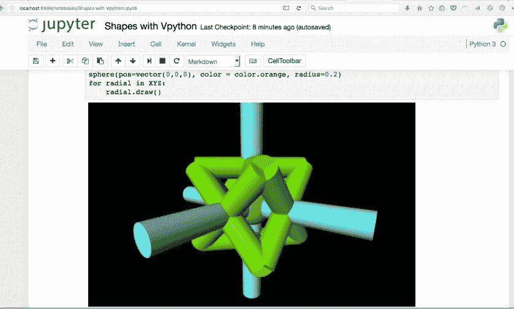
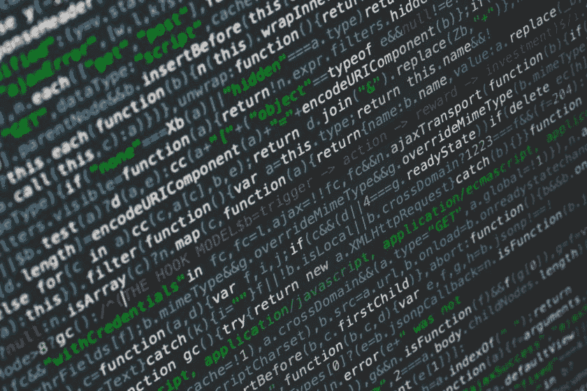

# 数据科学机器学习的最佳编程语言

> 原文：<https://medium.com/nerd-for-tech/the-best-programming-languages-for-data-science-machine-learning-ec2e00ab5a90?source=collection_archive---------5----------------------->

*(可以在这里* *找到原刊* [*)。您可以在*](https://ethno-data.com/the-best-machine-learning-programming-languages/)[*【http://ethno-data.com/*](http://ethno-data.com/)*查看其余文章。)*

[数据科学](https://ethno-data.com/data-science-and-machine-learning-summary/)或者人工智能的新人经常问我学习构建[机器学习](https://ethno-data.com/data-science-and-machine-learning-summary/)算法的最佳编程语言。因此，我写这篇文章作为任何想知道这个问题答案的人的参考。这些是我认为最重要的三种语言，根据在数据科学社区的总体受欢迎程度和我自己的个人经验，按照有用性进行排名:

# #1 编程语言:Python

Python 是用于机器学习的最流行的语言，有三个很好的理由。

首先，它基于包的风格允许您利用其他人已经制作的高效的机器学习和统计包，防止您必须不断地为常见问题重新发明轮子。许多最好的软件包(如 NumPy、pandas、scikit learn 等)。)都是 Python 里的。这几乎允许你在编写机器学习算法时“作弊”。

其次，Python 是一种强大而灵活的通用语言，因此如果您正在构建一种机器学习算法来做一些事情，那么您可以轻松地为其他整体产品或系统构建代码，您将在其中使用该算法，而不必切换语言或软件。它支持面向对象、函数式和面向过程的编程风格，在如何编码方面给予程序员灵活性，允许您使用您最喜欢或适合特定环境的任何风格或各种风格的组合。

第三，与 Java 或 C++等语言不同，Python 不需要复杂的设置来编写一行代码。即使您可以根据需要轻松构建编码基础设施，如果您只需要运行一个简单的命令或测试，您也可以立即开始。

当我用 Python 编程时，我个人喜欢使用 [Jupyter Notebook](https://jupyter.org/) ，因为它的界面允许我既可以编码，又可以轻松地将我的代码和发现显示为报告或文档。另一个数据科学家可以同时读取和分析我的代码及其输出。我个人希望更多的数据科学家在 Jupyter 笔记本或其他类似的笔记本上发表他们的论文和报告。

如果你有时间学习机器学习的单一编程语言，我会强烈推荐它是 Python。接下来的三种语言，R、Java 和 C++，在数据科学中没有它的易用性和受欢迎程度。

# #2 编程语言:R

[R](https://www.r-project.org/) 是[统计学家](https://ethno-data.com/data-science-vs-statistics/)的一种流行语言，一种专门为高级统计分析定制的编程语言。它包括许多开发良好的机器学习包，但不像 Python 那样受数据科学家的欢迎。例如，在《走向数据科学》的[调查](https://towardsdatascience.com/what-is-the-best-programming-language-for-machine-learning-a745c156d6b7)中，57%的数据科学家报告使用 Python，33%优先考虑它，只有 31%报告使用 R，17%优先考虑它。这似乎表明，对于数据科学和机器学习来说，R 是一种补充语言，而不是主要语言。大多数 R 包在 Python 中都有对应的版本(某种程度上反过来也一样)。与 Python 不同，Python 是一种通用语言，除了分析数据和开发机器学习算法之外，还能做其他事情，R 是专门为统计和数据分析量身定制的，除此之外不能做太多事情。尽管如此，R 程序员正在为它开发越来越多的包，让它做越来越多的事情。

# #3 编程语言:Java

Java 曾经是最流行的语言，但是在过去的几年里，Python 已经取代了它。作为一个热衷于用 Java 编程取乐的 Java 程序员，把它放在列表的最后让我很伤心，但 Python 显然是数据科学和机器学习的更好语言。如果您在一个仍然使用 Java 作为其部分或全部软件基础设施的组织或其他环境中工作，那么您可能会坚持使用它，但是最近的发展，特别是机器学习方面的发展，已经出现在 Python 和 R(以及其他一些语言)中。因此，如果您使用 Java，您会经常发现自己必须重新发明轮子。

此外，Java 的一个主要缺点是不可能进行快速、不间断的分析，因为在编写一行代码之前，必须编写整个编码系统。Java 在某些情况下可能会很受欢迎，在这些情况下，利用机器学习算法的周围应用程序/软件都是 Java 语言，常见于金融、前端开发和一直使用基于 Java 的软件的公司。

# #4 编程语言:C/C++

同样朝向数据科学[调查](https://towardsdatascience.com/what-is-the-best-programming-language-for-machine-learning-a745c156d6b7)我上面提到的把 C/C++列为继 Python 之后第二受欢迎的数据科学和机器学习语言。Java 紧随其后，但是我把 Java 而不是 C/C++放在第三位，因为我个人认为 Java 是比 C 或 C++更好的语言。在 C 或 C++中，你可能会经常发现自己在重新发明轮子——不得不开发其他人已经用 Python 构建的机器学习算法——但在一些用 C 或 C++构建的后端系统中，如工程和电子领域，你没有太多的选择。C++和 Java 也有类似的问题:如果不构建完整的基础设施，就无法快速进行编码。

# 结论

> 对于数据科学领域的初学者来说，学习单一编程是进入该领域最有帮助的方式。使用学习编程语言来评估数据科学是否适合你:如果你挣扎着不喜欢编程，那么以开发机器学习算法为生可能不太适合你。

许多团队正在尝试开发无需编程就能实现机器学习的软件: [DataRobot](https://www.datarobot.com/) 、 [Auto-WEKA](https://www.cs.ubc.ca/labs/beta/Projects/autoweka/) 、 [RapidMiner](https://rapidminer.com/) 、 [BigML](https://bigml.com/) 和 [AutoML](https://cloud.google.com/automl/) 等等。这些软件的优点和缺点以及成功和失败保证了一个单独的博客帖子(我最终打算写一篇)。然而，到目前为止，无论是在开发复杂的机器学习算法的实际能力方面，还是在证明你拥有该领域的技术计算/编程技能方面，这些都没有取代编程语言。

对于数据科学领域的初学者来说，学习单一编程是进入该领域最有帮助的方式。使用学习编程语言来评估数据科学是否适合你:如果你挣扎着不喜欢编程，那么以开发机器学习算法为生的数据科学可能不太适合你。根据您的工作地点或您正在从事的领域/任务类型，您可能最终会使用您的团队所使用的语言或软件，以便您可以轻松地与他们共同完成项目。对于某些领域的工作或任务，可能更喜欢某些包和语言。如果你能证明你已经掌握了一门复杂的编程语言，比如 Python(或者 Java 或者 C++)，即使这不是他们团队的首选语言，那么你也有可能向任何一位招聘经理证明你可以学习他们的特定语言或者软件。

图片鸣谢#1: [ThisIsEngineering](https://www.pexels.com/@thisisengineering) 在[https://www . pexels . com/photo/woman-coding-on-computer-3861958/](https://www.pexels.com/photo/woman-coding-on-computer-3861958/)

照片来源# 2:https://unsplash.com/photos/D9Zow2REm8U[的 Hitesh choudh ary](https://unsplash.com/photos/D9Zow2REm8U)

图片鸣谢# 3:the kirbster at[https://www . Flickr . com/photos/Kirby urner/30491542972/in/photo list-MQ rueh-2g 3 E1 wf-nsr 8 q 9-HDKJxu-22VkHJU-2 bwrxy 2/light box/](https://www.flickr.com/photos/kirbyurner/30491542972/in/photolist-MQRUEh-2g3E1wf-Nsr8q9-HDKJxu-22VkHJU-2bWRXY2/lightbox/)(是的，虽然看起来很酷，但这不是我的代码。)

照片来源# 4:https://unsplash.com/photos/WDf1tEzQ_SY[的斯坦纳·恩格兰德](https://unsplash.com/photos/WDf1tEzQ_SY)

照片致谢# 5:https://unsplash.com/photos/jUWw_NEXjDw[的 Markus Spiske](https://unsplash.com/photos/jUWw_NEXjDw)

*原载于 2020 年 1 月 3 日 https://ethno-data.com***。**