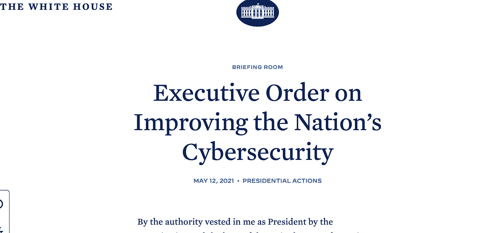

# 拜登网络安全 EO:推动更好的软件

> 原文：<https://medium.com/nerd-for-tech/the-biden-cybersecurity-eo-a-push-for-better-software-a0689b282ae3?source=collection_archive---------6----------------------->

关于网络安全的住宅行政命令(EO)并不新鲜。你甚至可以说他们正在变老。现在已经有五位总统的名字出自[，从 2000 年的比尔·克林顿开始](https://clintonwhitehouse4.archives.gov/WH/Work/021600.html)，这意味着现存的这一堆名字始于 20 多年前。

所有这些，尽管都是善意的，充满了有价值的建议、规劝甚至命令，但都没有以任何主要的方式打击网络犯罪。如果说有什么不同的话，那就是它比以往任何时候都更加猖獗，因为几乎每天都有关于攻击的头条新闻提醒我们，从身份盗窃到间谍活动，到关键供应链的重大中断。

就在上周，联邦网络安全和基础设施安全局(CISA)报告称，去年有三起针对水处理厂的[勒索软件攻击；在美国拥有数十家电视台的辛克莱广播集团(Sinclair Broadcast Group)称，它的一些服务器和工作站遭到勒索软件的攻击。](https://us-cert.cisa.gov/ncas/alerts/aa21-287a)

那么，为什么清单上的最新一项——总统乔·拜登于 5 月 12 日发布的关于[“改善国家网络安全”](https://www.nist.gov/itl/executive-order-improving-nations-cybersecurity)(更官僚地称为 EO 14028)的行政命令——会有什么不同呢？

也许不会。正如老话所言，时间会证明一切，针对《欧洲操作条例》采取行动的最后期限将延续到 2022 年。但是一些网络安全专家认为这个有一些潜力。

就在 EO 发布后，罗伯特·切斯尼和特雷·赫尔在 Lawfare 博客上写道,“值得你关注。”。它包含了具体的措施，以应对从最近的危机中吸取的教训，特别是网络安全管理软件产品和微软交易所的妥协。”

新思公司网络安全研究中心的首席安全策略师蒂姆·麦基和安全风险管理公司切尔托夫集团的网络安全董事总经理大卫伦敦在最近的一次网络研讨会中指出，EO 包含“15 页中的 74 项指令”，其中一些“提高了安全软件开发的标准”

当然，对私营部门来说，指令不是命令——至少不是直接命令。实施强制要求需要通过法律，这是国会的职权范围。

但是，正如赫尔和切斯尼所说，EO 传达的政策指令“可以用来要求联邦实体采取从网络安全角度看有用的行动。”

**没有法律的杠杆**

这意味着，除了其他事情之外，总统可以利用行政命令进行采购——要求联邦机构只购买符合特定标准的产品或服务。这意味着，想要向政府出售商品的私营部门供应商将不得不满足这一标准，不管是否有法律规定。如果他们花费金钱和时间来进行这些改进以获得政府合同，那么期望是他们会为其他人这样做。称之为涓滴质量、安全和保障。

伦敦表示:“你将看到的是，人们的预期可能会从欧洲经济办公室和美国政府转向其他关键基础设施。”。

EO 涵盖多个问题，包括共享威胁信息、保护云以及更好地检测和应对网络事件。

但是，运行网络世界中所有系统、网络、应用和设备的软件是提高网络安全的核心。EO 的第 4 部分名为“增强软件供应链安全”，旨在解决漏洞，这些漏洞使攻击者不仅能危及私营公司的底线，还能危及美国经济和关键基础设施。

它要求对“关键软件”进行定义，联邦国家标准与技术研究所(NIST)已经发布了该定义。在本月早些时候发布的白皮书中，NIST 表示，关键软件是“任何具有或直接依赖于一个或多个组件的软件，这些组件至少具有以下属性之一:”

*   设计为以提升的权限或管理权限运行；
*   对网络或计算资源有直接或特许的访问权；
*   旨在控制对数据或运营技术的访问；
*   履行对信任至关重要的职能；或者，
*   以特权访问在正常信任边界之外运行。

伦敦表示，自该定义发布以来，NIST 已经发布了一系列针对关键软件的安全要求，这些要求与 NIST 和其他组织已经提供的标准一致，涵盖了访问控制、数据保护、备份和日志记录以及测试等措施。

他说，其中一些测试措施“已经被认为是最佳实践，例如威胁建模、混合[静态](https://www.synopsys.com/software-integrity/security-testing/static-analysis-sast.html?cmp=pr-sig&utm_medium=referral)和[动态](https://www.synopsys.com/software-integrity/application-security-testing-services/dynamic-analysis-dast.html?cmp=pr-sig&utm_medium=referral)分析、秘密审查的硬编码以及黑盒测试”。

这将如何影响商业世界？这是网上研讨会的主要焦点，因为正如已经说过很多次的那样，今天的每个公司都是软件公司——那些没有建立它的公司仍然必须购买和使用它。

伦敦说，那些构建它的人“需要理解他们生产的软件，如果通过理解它在客户环境中的关键功能，它属于关键软件的范畴”。

麦基说，软件的建造者和购买者都需要知道“软件代码来自哪里，起源于哪里，谁创作了它，它为什么在那里，以及它是如何被测试的”。

怎么做呢？其中一个主要的，并且很快是强制性的(至少对于联邦政府的供应商来说)方法是软件材料清单(SBOM)。

Mackey 说:“EO 很早就认识到并一直坚持的一件事是，需要理解代码来自哪里。”

符合《雇佣条例》的 SBOM 必须包括:

**供应商名称:**创建、定义和标识组件的实体的名称。

**组件名称:**分配给原始供应商定义的软件单元的名称。

**组件版本:**供应商使用的标识符，用于指定软件相对于先前确定版本的变更。

**其他唯一标识符:**用于识别组件或作为相关数据库的查找关键字的其他标识符。

**依赖关系:**描述上游组件 X 包含在软件 y 中的关系

**SBOM 数据的作者:**为该组件创建 SBOM 数据的实体的名称。

**时间戳:**记录 SBOM 数据集合的日期和时间。

维护这样的信息的需要似乎是显而易见的—一个组织如何管理、保护或检查它甚至不知道它正在使用的东西的质量呢？但是 SBOMs 仍然不是主流。

“从历史上看，软件成分有很多不透明的地方，尤其是开源和第三方代码，”伦敦说。“这里有明显的安全隐患。”

**无尽的兔子洞**

软件不透明和 SBOMs 不是主流的一个可能原因是编译和维护它们会令人眼花缭乱地复杂。跟踪单个应用程序中组件的数量就像试图在一个无尽的兔子洞网络中导航。

Mackey 谈到了一个应用程序，从表面上看，它只有八个“依赖项”或来自其他供应商的组件。但是这八个中只有一个有 15 个自己的依赖项。这 15 个人中的一个有 30 多个。

“所以，当你剥开洋葱皮时，(这个应用程序)实际上有 133 个独立的组件，深入八个层次，”麦基说。“决定使用它意味着我现在有 133 个组件，它们是我的整个供应链的一部分，来支持这个应用程序。”

“试图找出所有这些依赖性可能是一个非常困难的挑战，但这也是一个规模问题，”他说。

这不是唯一的挑战。Mackey 指出，如果应用程序将被打包到容器中，“我需要处理一些额外的攻击配置文件，因此当 Docker 映像的构建过程运行时，它实际上引用了正确的工件，并且它用于基本映像的映像实际上被强化为某种形式的行业标准。”

然后就是寿命终结的问题。如果一个组件的创建者放弃它，将其置于“废弃”状态，这意味着如果发现漏洞，将不再发布补丁和更新，这将使它成为黑客越来越有吸引力的目标。

这种复杂性的结果是可以预测的。麦基引用了[开源安全和风险分析](https://www.synopsys.com/software-integrity/resources/analyst-reports/open-source-security-risk-analysis.html?intcmp=sig-blog-ossra1?cmp=pr-sig&utm_medium=referral)，这是 Synopsys 关于开源软件的使用和安全的年度报告，开源软件现在是大多数代码库的绝大部分。最新的报告发现，普通的商业代码库有 528 个组件。

此外，毫不奇怪，它发现 75%的组织需要一周以上的时间来解决高严重性漏洞。

这意味着，即使编纂了 SBOM，仍有大量的工作要做。“SBOM 只是一个开始，”麦基说。“你需要定义你的过程。

“这包括为你获得 SBOM 奖后要做的事情制定实施计划。您将如何处理遗留系统？您是否有任何法规层面的合规性问题？你是如何自动化这一切的？对于与供应链问题相关的任何事情，您的漏洞响应计划是什么？”

**自动化！**

显然，没有办法手动完成所有这些工作。所以解决方案是“自动化，自动化，自动化，”他说。

幸运的是，自动化工具是可用的。Mackey 指出，Black Duck(在 Synopsys 内部)提供了一个自动化的[软件组成分析](https://www.synopsys.com/software-integrity/security-testing/software-composition-analysis.html?cmp=pr-sig&utm_medium=referral)工具，帮助组织找到开源软件组件以及任何已知的漏洞和可能的许可冲突。他说，黑鸭现在能够出口符合“NTIA(国家电信和信息管理局)7 月 12 日阐明的”EO 的 SBOM。它将生成一个 SBOM，您可以将其用作您的组织围绕 EO 的任何要求的一部分。”

所有这些都表明，从现在起一年后，软件安全的世界可能真的会不同，无论催化剂是来自 EO 还是市场压力。

Synopsys 软件完整性小组的首席科学家 Sammy Migues 在最近的[福布斯关于未来一年技术趋势的报道中说,“更多的人会要求知道他们的软件是由什么组成的。无论是“营养标签”、“材料清单”还是类似的东西，组织都会要求供应商说明应用程序和设备中使用的所有软件，软件来自哪里，如何构建和测试，以及如何维护。”](https://www.forbes.com/sites/forbestechcouncil/2021/10/15/16-experts-predict-the-tech-trends-that-will-dominate-industry-in-2022/?sh=7a0f9cb76480)

“几年后，销售不透明软件将是例外，而不是常规，”他说。

这对好人来说是好事，对坏人来说是坏事。