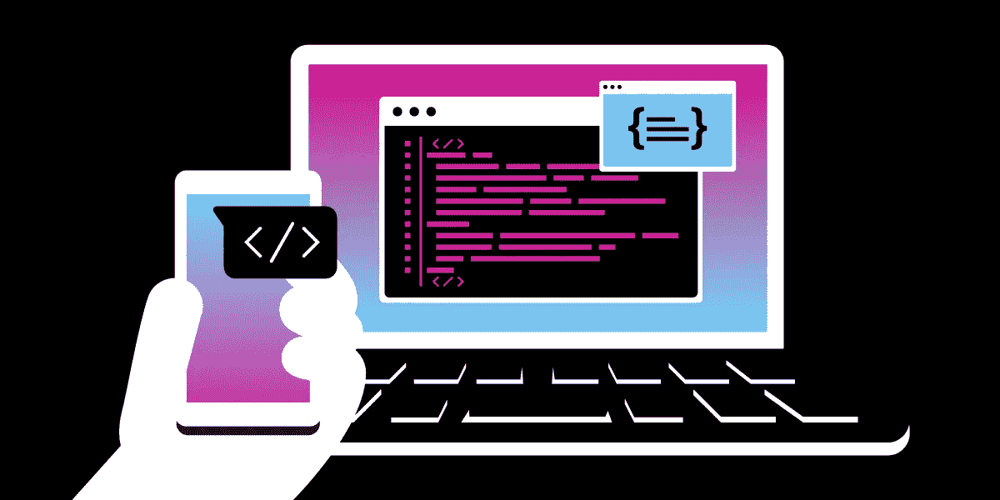
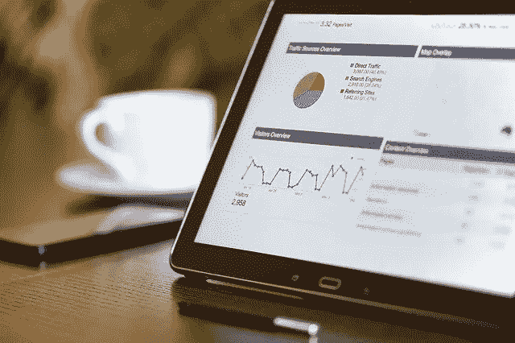
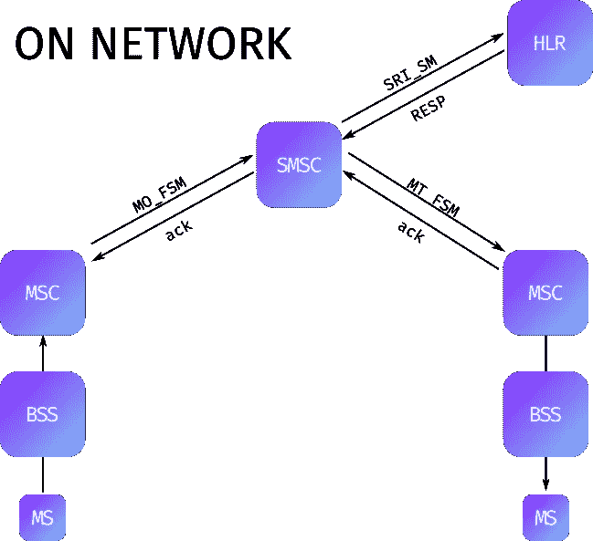
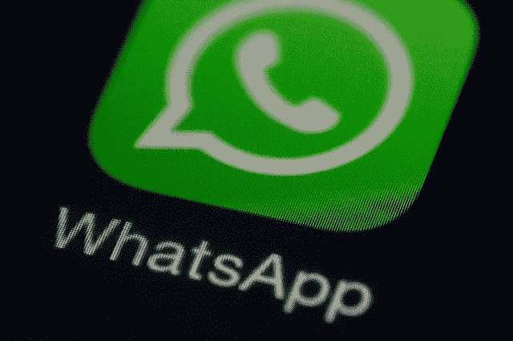

# 短信编码者指南

> 原文：<https://medium.com/nerd-for-tech/the-coders-guide-to-sms-93c2f4685caf?source=collection_archive---------6----------------------->

作为一名程序员，你可能接触过 SMS(短消息服务)，但可能不太了解。SMS 是一种使用标准化通信协议通过无线网络发送短消息的服务。尼尔·帕沃斯在 1992 年 12 月 3 日发送了第一条短信。尽管离圣诞节还有近一个月，他还是给他的同事理查德·贾维斯写了圣诞快乐。SMS 消息是发送文本消息的两种技术之一:另一种被称为 MMS。

今天，每年有超过 40 亿人使用短信和彩信等技术发送短信。公司越来越多地使用手机短信联系他们的客户，因为他们方便，[而且客户更喜欢他们。短信也有 98%的打开率，明显高于电子邮件等其他沟通形式。作为一名程序员，有必要了解 SMS 消息是如何工作的，因为许多公司都在使用它们。](https://www.pcmag.com/news/businesses-take-note-your-customers-prefer-texts)

在本指南中，你将学到作为一名程序员需要了解的关于 SMS 的一切。您将了解什么是短信，它是如何工作的，以及公司如何使用短信与他们的客户沟通。您将了解 SMS、MMS 和 OTT 应用程序之间的区别，以及一些没有多少人知道的很酷的 SMS 功能。最后，我还将向您介绍一些资源，这些资源将教您如何用几行代码以编程方式发送文本消息。

尼尔·帕沃斯在 1992 年发送了第一条短信，但短信的起源却在近十年前就开始了。Friedhelm Hillebrand 和 Bernard Ghillebaert 于 1984 年在法德 GSM 公司发明了 SMS。通常被称为短信之父的马蒂·马柯能也经常被认为是这个想法的创造者，尽管[认为是 Hillebrand 和 Bernard](https://techcrunch.com/2015/07/22/why-isnt-the-inventor-of-sms-better-known/) 发明了这个创意。

1993 年，当诺基亚发布支持这种新技术的手机时，短信开始流行起来。从 1993 年到 1994 年，手机只支持多次点击短信(你必须点击数字才能获得字母)。1995 年，Cliff Kushler 发明了预测文本技术 T9，短信变得更快，但 1997 年，诺基亚在其手机上添加了 QWERTY 键盘，短信变得更加方便。

彩信于 2002 年出现在手机上，允许用户开始互相发送照片和视频。2007 年，苹果推出了 iPhone，这有助于进一步普及短信。从那以后，短信数量持续增长，如今全世界每月发送 60 亿条短信。

# 公司如何使用短信？

越来越多的公司使用短信与他们的客户交流，因为[客户更喜欢短信而不是其他交流方式。](https://www.pcmag.com/news/businesses-take-note-your-customers-prefer-texts)

一些公司使用短信进行双重认证，这是一种帮助确认客户拥有他们注册服务时使用的电话号码的流行方式。

公司也使用短信发送营销信息。由于 98%的打开率，SMS 消息是让客户了解他们的订单、销售以及客户需要知道的任何其他重要信息的最有效方式之一。短信阅读速度也很快: [90%的短信在三秒钟内被阅读](https://www.tatango.com/blog/sms-open-rates-exceed-99/)，这意味着短信非常适合像闪电销售这样的事情。

一些公司也使用短信为客户服务。例如，许多酒店采用短信作为更好地与客人沟通的方式。

SMS 消息的另一个用例是警告和提醒。例如，发廊经常使用短信提醒客户他们即将到来的约会，而银行在认为客户的卡可能受损时会通过短信发送警报。

# SMS 标准

SMS 允许您发送 160 个字符的文本或 70 个 Unicode 字符。但是，当然，你以前可能发过超过 160 个字符的短信，这怎么可能呢？当您发送的短信长度超过 160 个字符时，您的手机运营商会将这些短信拆分并发送多条短信。然而，您的手机运营商会确保它们按顺序到达，这就是为什么您可能从未注意到 160 个字符的限制。

当您发送短信时，它不会直接发送到收件人的手机上。相反，你的信息首先被发送到一个短消息服务中心(SMSC)，它查找收件人并把信息发送给他们:类似于 SMTP。

下图显示了它的工作原理:

左下方和右下方的 MS 代表移动台:发送和接收短信的手机。当您发送信息时，您的手机首先会将信息发送到 BSS，它代表基站子系统。BSS 管理无线网络。然后，BSS 将您的消息发送到 MSC 或移动交换中心。MSC 是服务于您所在区域(例如，您所在的城市)的电话交换机。然后，您的文本消息从 MSC 传送到 SMCS(短消息服务中心)。你的手机有一个 SMCS 地址，看起来像是手机里配置的电话号码，有时在你的 SIM 卡上(尽管 iphone 的做法略有不同)。然后，您的 SMSC 使用 HLR(家庭位置寄存器)来查找收件人的位置。它为接收者获得一个 SMSC 地址，并将其发送到他们的 MSC，然后通过相同的路径返回到接收者的电话。

# 短信与彩信

正如您之前了解到的，当人们说文字信息时，他们指的是 SMS 和 MMS。MMS 代表多媒体信息服务，允许您通过无线网络发送包含多媒体内容的信息。

当您发送只有文字的短信时，您的手机会使用短信，但如果您在短信中包含图片或视频，它会使用彩信。因为 SMS 消息只包含文本，并且有 160 个字符的限制，所以发送起来比 MMS 消息便宜。此外，许多美国人也有无限短信计划，所以使用短信通常意味着你的用户不必支付任何费用。与短信不同，短信有 160 个字符的限制，您可以发送多达 1，000 个字符的彩信。

在决定是否使用 SSM 或彩信时要记住的另一件事是，虽然大多数人都有智能手机，但不是每个人都有，没有智能手机的客户无法接收彩信。

不过，彩信确实有一些优势。因为彩信可以包括视频和图片，所以它们通常有更高的参与率，并且可能在社交媒体上得到更多的分享。

## iMessage 和 WhatsApp 用短信吗？

苹果的 iMessage、WhatsApp、微信和 Facebook Messenger 都是“Over the Top”或 OTT 应用的例子。与短信不同，WhatsApp 等 OTT 应用不需要用户连接到蜂窝网络。

像 iMessage 和 WhatsApp 这样的 OTT 应用都不使用短信。然而，这并不意味着 iPhones 不能发送短信:它们可以。只有当您和收件人都有 iPhone 时，您才能发送 iMessage。如果你在 iPhone 上给另一个苹果用户发短信，苹果会用 iMessage 发送短信，你的 iPhone 会用蓝色高亮显示短信。如果你向另一个设备(如 Android)发送一条文本消息(无多媒体)，苹果将使用短信发送，该消息将为绿色。另一方面，当两个 Android 设备通信时，Android 设备经常使用一种称为 Android Messages 的服务。

OTT 应用的优势在于，它们对拥有无限数据套餐的客户是免费的(对没有套餐的客户来说也不贵)，允许用户发送视频和其他多媒体，通常还具有视频聊天等附加功能。

然而，SMS 比 OTT 有几个优点。OTT 应用是“有围墙的花园”，这意味着脸书信使上的人不能给 WhatsApp 上的人发消息。这也意味着你不能向使用 OTT 应用的电话号码发送消息:你只能向下载了该应用的人发送消息。有了短信，你可以给任何有电话号码的人发信息。此外，短信不像 OTT 应用那样依赖互联网连接。与 OTT 应用程序不同，您可以通过短信向连接到蜂窝网络的任何人发送消息。

## 短信能做什么？

短信有很多很酷的鲜为人知的功能。例如，你知道你可以在发送短信后编辑它吗？你可以的！您可以“覆盖”以前发送的短信。但是，您必须提前进行设置。您不能编辑昨晚已经发送给某人的文本！

您还可以使用 SMS 发送即时消息，也称为零级消息。紧急消息是在您的手机上弹出的消息，但默认情况下，不会保存到您的收件箱中。快速消息的目的是让你发送一些默认情况下接收者不会保存的信息。换句话说，即时消息是 Snapchat 著名的短暂消息的前身。然而，就像 Snapchat 可以截屏消息一样，也可以下载零级消息(或截屏)，所以你不能完全依赖它来保密。快速消息的另一个用例是发送您希望收件人立即阅读的消息。

## 以编程方式发送 SMS 消息

您可以使用类似于我们在 Vonage 拥有的 API，通过编程轻松发送 SMS 消息。

使用我们的 API 以编程方式发送短信很简单:只需几行代码就可以发送一条短信。

你可以通过[阅读我们的 SMS API 文档](https://developer.nexmo.com/messaging/sms/overview)来学习如何用我们的 API 发送 SMS 消息。

我们也有许多博客文章，引导您使用各种技术发送短信。例如，这篇文章向你展示了[如何使用 Python 和 Flask](https://learn.vonage.com/blog/2017/06/22/send-sms-messages-python-flask-dr/) 发送短信，这篇文章[教你如何使用 Node Red 发送短信。](https://learn.vonage.com/blog/2019/04/24/receive-sms-messages-node-red-dr/)

你也可以在这里浏览我们所有的短信文章和教程。

## 最后的想法

由于其便利性、普遍性和高开放率，SMS 是商业通信的基石。由于它在商业世界中的频繁使用，所有程序员都需要熟悉 SMS 以及如何发送 SMS 消息。

既然您已经阅读了本指南，我希望您对 SMS 有一个基本的了解，并准备好继续了解这种越来越重要的通信方式。

如果您想以编程方式发送 SMS 消息，那么 [Vonage SMS API 文档](https://www.vonage.com/communications-apis/sms/)是最好的起点。

[你可以在这里创建一个免费账户并开始使用 Vonage 的 SMS API。](https://dashboard.nexmo.com/sign-up)

我希望你喜欢这个指南，[如果你有任何问题，请通过 Twitter](https://twitter.com/VonageDev) 联系我们！

*原载于*[*https://learn . vonage . com/blog/2021/08/19/the-coders-guide-to-SMS-1/*](https://learn.vonage.com/blog/2021/08/19/the-coders-guide-to-sms-1/)