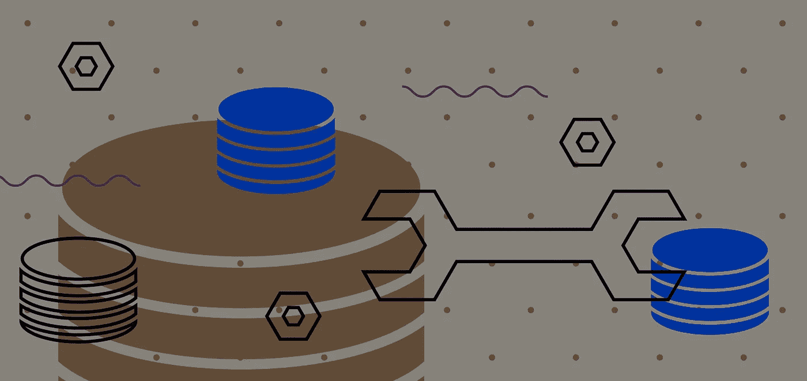

# 完整的客户数据堆栈:数据收集(第 1 部分)

> 原文：<https://medium.com/nerd-for-tech/the-complete-customer-data-stack-data-collection-part-1-af4df3dc9134?source=collection_archive---------26----------------------->

# 类别的重要性

没有数据，即使是最好的数据堆栈也是毫无用处的。因此，在构建数据基础设施时，我们总是面临的第一个问题是我们要收集什么数据，从哪里收集，以及应该如何收集。

当然，在试图找出我们将要处理的数据时，我们还应该记住其他一些事情。例如，我们需要什么样的交付语义，或者我们以后将如何处理数据。

最终，我们将使用的数据和我们将使用的基础设施只是同一枚硬币的不同面。出于这个原因，我们应该始终尝试对数据和基础架构有一个整体的看法。

但是让我们从基础开始，为不同的数据建立一个实用的分类法，它可以覆盖大多数公司的大多数用例。

正如我们将要看到的，我们将要处理的数据可以分成几个类别。根据不同的类别，我们需要不同的基础设施，我们可以支持不同的业务目标。这篇文章将涵盖第一个主要类别，事件数据，以及如何收集它。在第二部分中，我们将讨论关系数据，并注意一些其他常用的数据源。

# 事件数据

在这一类别中，我们主要处理点击流数据。我们需要合适的基础架构来捕获、路由和交付数据到不同的目的地。在大多数情况下，这些数据代表一些行为，包括最常见的客户行为。

事件数据的特征:

*   事件数据不会更新。
*   通常，它们以高容量和高速度出现。
*   相对低的维度。
*   它们与时间序列数据有许多共同的特征。

事件数据不是不可变的，它们可以改变，但主要是通过向数据添加维度或纠正捕获过程中出现的错误。但是它们很少改变，尤其是当我们将它们与 OLTP 数据库的行进行比较时。

这些数据的数量和速度也很快。即使是中等规模的公司，每月处理数十亿次事件也并不少见，尤其是在 B2C 领域。

事件数据的维度也很低。这些数据中的大部分可以在数据库中用一个表来表示，并且它们的属性在大多数情况下以十进制来度量。

最后，时间是这个数据的一个重要维度；这就是为什么它们与时序数据有许多共同的特征。实际上，它们是多维时间序列数据。

# 如何收集事件数据

当涉及到事件数据时，都是关于流的。您需要能够以可靠且可伸缩的方式处理数据流的基础设施。

您需要可靠性和高可用性，因为捕获数据很容易导致数据丢失。网络往往会中断，尤其是当你从移动设备上收集数据的时候。基础设施的构建必须具有可靠性和高可用性，从数据捕获点开始，到将数据交付到最终目的地结束。

不过，事件数据的好处是，少量的数据丢失不会要了你的命；客户行为数据不是 P&L 报告条目。

# 捕获

处理事件数据从捕获事件数据的地方开始。这通常是通过使用一些 SDK 来实现的，这些 SDK 可以集成到您的 web 应用程序、移动应用程序或网站中。然后使用 SDK 在每次动作发生时生成一个事件，并用有用的元数据丰富它，这触发了事件。

# 传递

在 SDK 捕获事件后，它将被推送到数据基础设施中。SDK 需要在尊重主机资源的同时处理任何故障，例如，您不希望 SDK 破坏移动设备的 CPU 或内存。请记住，保证零数据丢失是不可能的。例如，一个移动应用程序必须将数据推送到基础架构，网络中断，用户决定关闭该应用程序。

# 长队

数据交付给数据基础设施后，通常会被接收到一个队列系统中，该队列系统可以维护事件的顺序。这一点很重要，尤其是如果事件驱动了某种行为。这就是为什么像卡夫卡这样的系统有非常明确的排序语义的原因。

# 过程

在事件数据在这样的系统中排队之后，它们可以以流的方式被处理。在这种情况下，最好有一个能够维持高吞吐量的排队系统，因为这些应用程序通常是实时的。

# 商店

最后，数据也可以存储起来进行批处理或存档。

# 第二部分

在下一篇文章中，我们将讨论另一大类常用数据，关系数据。我们将概述如何收集它，我们还将简要描述另外两个常见的数据源。

# 免费注册并开始发送数据

测试我们的事件流、ELT 和反向 ETL 管道。使用我们的 HTTP 源在不到 5 分钟的时间内发送数据，或者在您的网站或应用程序中安装我们 12 个 SDK 中的一个。[入门](https://app.rudderlabs.com/signup?type=freetrial)。

**本博客原载于** [**https://rudder stack . com/blog/the-complete-customer-data-stack-data-collection-part-1**](https://rudderstack.com/blog/the-complete-customer-data-stack-data-collection-part-1)