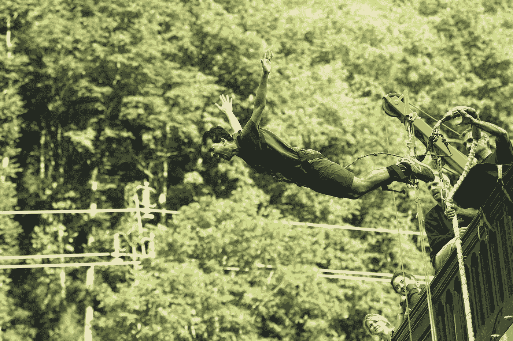

# 放手的勇气

> 原文：<https://medium.com/nerd-for-tech/the-courage-to-let-go-9b1e061aaee7?source=collection_archive---------23----------------------->

在过去的几周里，我参加了很多讲座、网络研讨会和播客采访(科技高管操作系统 的发布进展顺利，谢谢提问！).我经常谈到当你将常规创新融入团队的时间表时会发生的奇迹。不出所料，我一次又一次地注意到来自世界各地的领导者和各种规模的团队的同样的反对意见。他们似乎都有相同的下意识反应，充满了怀疑，*“你的意思是我们应该就让他们做他们想做的事？?"*

我想在我的演讲中提出的具体案例中解决这一异议，但在本文中，我想解决这一问题的根源，以及它与不良工程影响的联系。

# 恐惧

在所有的领导和管理阶层，从团队领导到高层，经常不愿意真正让员工自己做事情。这可能是基于糟糕的过去的经验或者普遍不相信团队可以被给予这种自由。

你会想，如果任其自生自灭，团队可能会日复一日地浪费时间做不相关的事情。他们可能会冒犯其他人(例如，添加产品不想要的功能)。也许他们会使用非常尖端的技术，以至于你永远无法雇佣一个有经验的人。我相信你已经可以列出不少噩梦场景了。

但是，只要你有这种恐惧，你就无法真正让你的团队成长并变得自主。我们的最终目标是将每个工程师的影响力提高两倍或三倍，以创建一个我们可以信任的组织，让人们在完全自主和授权的产品团队结构中工作。但是，只要你觉得有必要约束他们，那就永远不会发生。

# 一个巴掌拍不响

毫无疑问，你可以列出充分的理由不给你的团队更多的回旋余地。然而，我在这里要说的是，你的团队并不是在真空中工作。只要你和领导团队的其他成员能够做到，你担心会发生的任何事情都有可能发生。通常情况下，这种恐惧根植于领导层太多的自我，以至于不能让团队失败并靠自己学习。这里没有恶意行为。这仅仅是一个随着时间的推移获得一个扭曲的视角的问题。人们有一种天生的偏见，认为别人没有能力完成你认为自己知道如何去做的事情。这是我们的大脑对我们开的一个奇怪的玩笑，让我们产生了类似守门人的想法，即使我们没有意识到。

你已经花了几十、几百、有时几千个小时在你的团队中获得这种才能。你每月付给他们一大笔钱。然而，你认为不能给他们一些自由来决定接下来的步骤或他们应该做什么。

这里有两个常见的问题。第一个是我谈到的这种信念，这种守门偏见。解决办法从你开始——不要认为他们做不到。我总是以我在以色列情报部门的服务为例:你能想象让一群没有任何经验的 18 岁年轻人负责提供任务关键和生命关键情报的系统吗？知道一个漏洞可能是及时阻止恐怖袭击的区别？

这是由于许多原因，但其中之一是一个事实，即体验加速压力锅被创造出来(我即将到来的 [*的主题之一)你刚刚浪费了一个好的危机吗？*](https://bit.ly/wasted-crisis) 免费网上研讨会。然后，这迅速推动人们通过一个“高级化”过程，培养出[产品工程师](https://avivbenyosef.com/less-principal-engineers-more-product-engineers/)。不要试图保护你的自我，不让你看到团队在没有你的情况下成功(或看到他们在你的监督下失败)，也不要溺爱他们，让我们让他们变得独立。不要做一个拉着木偶线的木偶大师——让他们成为像皮诺曹一样的真正的孩子！(好吧，我就此打住类比)

第二个潜在的问题是，你的团队可能倾向于做错误的事情，因为你没有教会他们什么是真正重要的。当你认为他们不知道他们的注意力应该放在哪里时，这意味着你在一开始就没有把注意力放在哪里。我不停地谈论产品掌握(这是科技高管操作系统中两个不同章节的主题)，正是因为它是达成一致的促成因素。这种精通依赖于领导团队的指导，而不是工程师。

所有这些都是为了说明，无论是什么阻碍了你的团队获得更多的自主权，其根本原因——几乎总是——是领导团队需要提升自己的水平。我在世界各地的客户身上成功地看到了这种转变；你也能做到。做一次信仰的飞跃，放开对他们的引导。然后围绕他们建立组织，以促进他们的成长。没有其他的成功之路。

*Aviv Ben-Yosef 2021 —在我最近出版的书中获得更多信息:* [***科技高管操作系统***](https://techexecutiveoperatingsystem.com/)