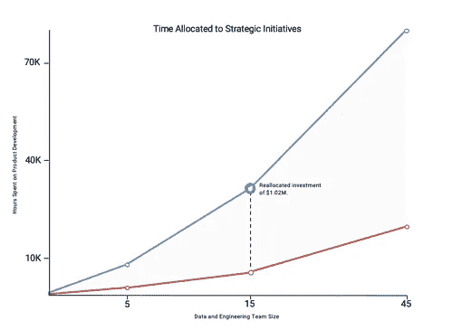

# 数据清理和数据丰富之间的区别

> 原文：<https://medium.com/nerd-for-tech/the-difference-between-data-cleansing-and-data-enrichment-d4ab0e1f800e?source=collection_archive---------21----------------------->

隐藏在互联网的门户网站中，以不同的格式，错误的标题，奇怪的编码，等等——[**数据的世界可能是危险的**](https://www.thinkdataworks.com/harness-your-data) ，尽管“数据科学家”被称为本世纪最性感的工作，但每个数据专业人士都知道它并不都是浮华和迷人的。从获得数据到准备好进行建模和分析之间有很多步骤。今天，我们来看看数据清理和数据丰富的区别。

> 把数据清理想象成一个厨师的工作:把好的和坏的分开；洗掉污垢；衡量；切割成合适的尺寸；然后将碎片放入贴有标签的容器中。另一方面，数据丰富是厨师的拿手好戏:将不同的食材组合在一起，做出一道比单个食材的总和还要好的菜肴。

## 什么是数据清洗？

概括地说，数据清理包括检查和格式化数据，使其适合于分析。为了让数据对数据科学家有用，需要纠正数据中的问题，这些问题可能简单或复杂，快速而轻松，也可能耗时而乏味。常见的数据问题包括:不正确的数据类型(如货币字段中的文本单元格，或姓名列中的整数)；不符合要求或模式的数据(例如日期和时间、邮政编码格式、电子邮件、电话号码)；数据中的不一致(如同一企业的地址冲突、行重复)；还有很多。

## 什么是数据丰富？

在数据被清理之后，它可以被丰富。数据丰富是通过向现有数据集追加额外信息来增强数据的过程。结果是一个更丰富的数据集，更容易获得更多更好的见解。例如，假设您有一个包含企业名称、电话号码和地址的数据集。现在，我们可以通过从股市指数中提取记录来丰富这些数据，从而获得每家公开交易企业的股价和估值。此外，我们可以从在线地图 API 获取精确位置或添加额外的地理空间信息。可能性几乎是无穷无尽的，在获取和组合数据时，完全理解您试图解决的问题是至关重要的。

## 数据多样性的影响

来自组织内部和外部的大量来源的数据带来了数据多样性。取决于你是谁，数据多样性听起来可能是一种祝福，也可能是一种诅咒。虽然多样性对于获得无偏见的、确证的数据至关重要，但这也意味着在任何数据可以被有效地设计或以有意义的方式一起使用之前，要跨越巨大的障碍以实现数据的均等。像任何事情一样，一盎司的预防抵得上一磅的治疗——从项目开始就有一个数据多样化的解决方案是确保始终一致的进展的最简单的方法。

## 为什么这些事情很重要？

为什么需要清理数据？为什么需要丰富？最重要的是，为什么数据清理和准备对您的组织如此重要？

一个字的答案是:“钱。” [**洞察驱动的组织正以每年 30%的速度增长**](https://go.forrester.com/press-newsroom/insights-driven-businesses-will-take-1-2-trillion-a-year-by-2020/) ，并有望在 2020 年前赚取 1.2 万亿美元——看看这些数字，忽视数据驱动战略的价值将是彻头彻尾的糟糕生意。

无论团队有多大，数据多样性对每个人来说都是一个障碍。尽管大多数公司担心数据方面的人才短缺，但问题的根源是战略短缺。查找和准备数据是数据科学家工作中最耗时、最不愉快的部分。下图强调了团队利用数据准备自动化工具时投资的重新分配。

随着越来越多的组织开始采用数据驱动的业务方法，仅仅依靠内部数据已经不足以保持竞争力。为了保持领先地位，组织需要将外部数据源引入其数据管道的每一部分，这意味着实施采用策略和方法(如 [**数据操作**](https://blog.thinkdataworks.com/want-to-be-data-driven-better-start-thinking-about-dataops) )以确保高性能和一致的成功结果。

ThinkData 提供的数据远不止这些——来自全球超过 75 个国家的超过 25 万个数据集。立即浏览 [Namara Marketplace](https://marketplace.namara.io/) 或[向我们的数据专家咨询](https://meetings.hubspot.com/eugene)外部数据。

*原载于*[*https://blog.thinkdataworks.com*](https://blog.thinkdataworks.com/the-difference-between-data-cleansing-and-data-enrichment)*。*