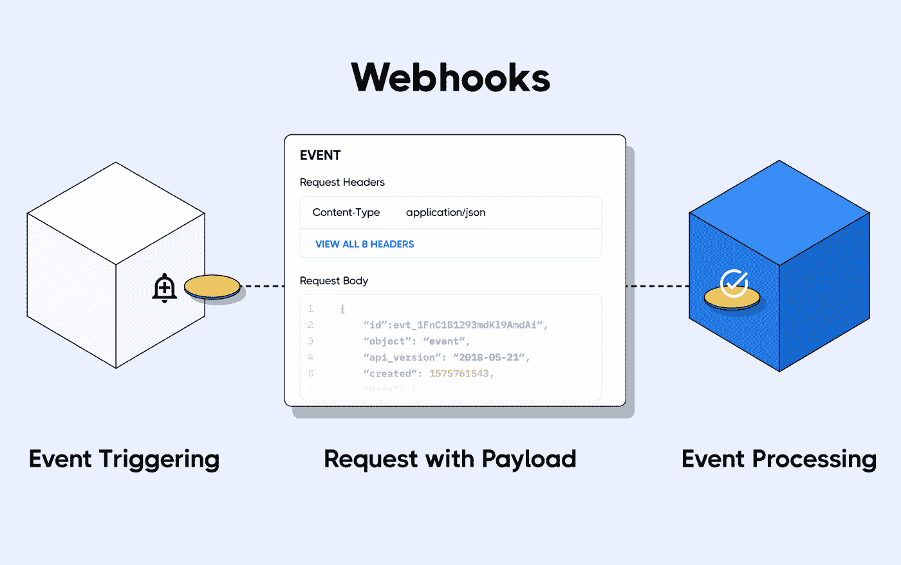
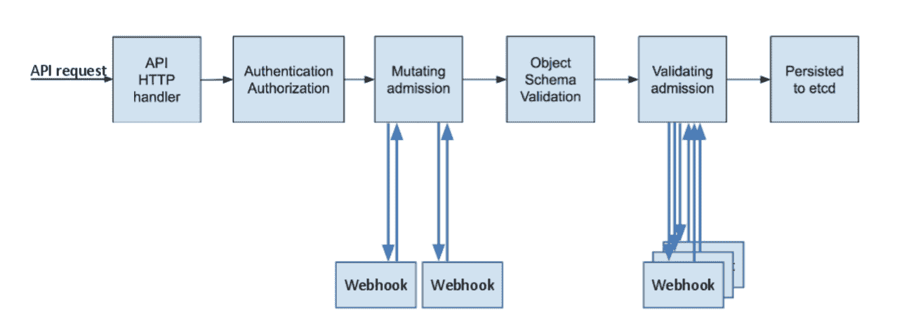

# 验证和变异 Webhooks 的区别

> 原文：<https://medium.com/nerd-for-tech/the-difference-between-validating-and-mutating-webhooks-167757f8db5f?source=collection_archive---------0----------------------->



[图像来源](https://miro.medium.com/max/1400/1*D0JykQxrL0IpYCZ6LH0CiA.png)

Kubernetes 是 Google 开发的一个流行的容器编排工具。软件工程师使用它在 DevOps 管道中部署和扩展基于容器的应用程序。由于 Kubernetes 的流行，许多组织现在都采用它在云中部署应用程序。

Kubernetes [API 服务器](https://kuberty.io/blog/what-is-kubernetes-api-server/)执行收到的请求以创建 Kubernetes 组件，如 pod、服务、部署、存储和持久卷，并将组件的状态存储在 etcd 中。您可以使用命令行将请求传递给 Kubernetes 服务器。然而，开发人员更喜欢 YAML 文件格式的数据，因为它易于使用，没有陡峭的学习曲线。

# Kubernetes 服务器

您可以轻松定制 Kubernetes 服务器的工作方式。Kubernetes 提供定制资源(CRD)和定制控制器来扩展/定制 Kubernetes 服务器的内置功能。如今，Kubernetes 提供了另一个有用的特性:webhook，用于**修改(变异)**传入的请求**对象(数据)**和**批准或拒绝(验证)**请求。为了验证和变更请求对象，您需要一个 [Kubernetes 准入控制器](https://www.armosec.io/blog/kubernetes-admission-controller/)。

如果你不理解突变和确认，这将是非常困难的。所以，首先，你需要理解什么是验证。让我们看一个简单的用例。

例如，假设您正在创建一个名为“app-oracle”的 pod。您的组织可能有一些关于 pod 名称的规则。他们可能不想在 **pod** 名称中使用数据库和通用语言名称。因此，如果 pod 创建请求的名称违反了您组织的策略，您必须拒绝该请求。这可以使用验证控制器来完成。

每当您请求创建包含不适当名称的 pod 时，如果您使用验证 webhook，则 pod 创建将会失败。这只是验证的一个例子。验证就像验证手机号码、电子邮件、信用卡号等。因此，您可以使用 validation webhook 创建定制的验证规则。

变异意味着您可以根据自己的需要修改请求。比方说，您正在向 Kubernetes 服务器传递一个创建 pod 的请求，但是它缺少一些标签。这意味着你没有给一些标签一个值。就语法而言，这些标签不是强制性的。然而，假设您需要那些[标签](https://www.educba.com/kubernetes-labels/)。通过使用变异 webhook，您可以在验证之前在请求中添加缺失的标签。因此，验证不会拒绝请求。即使开发人员未能创建标签，变异 webhook 也会添加带有一些默认值的标签。

这种变异是这个过程中的第一个网络钩子。它将根据条件修改请求数据。然后，验证 webhook 将验证该请求，无论该请求是否包含有效数据。如果验证通过，那么验证 webhook 将允许执行代码，并将 Kubernetes 组件的状态存储在 etcd 中，并给出一个成功的响应。如果验证失败，它将发送一个错误响应。

# 准入控制器

在将对象存储在 etcd 中之前，但是在传入的请求被认证和授权之后，准入控制器拦截对 Kubernetes API 服务器的传入请求。变异和验证可以使用准入控制器来完成。Kubernetes API 服务器有两个准入控制器。他们分别是**变异 adminmissionweb hook**和**验证 adminmissionweb hook**。

下图解释了请求是如何传递给 Kubernetes API 服务器的。首先，对 API 请求进行身份验证和授权。然后，变异 webhook 根据条件修改请求数据。此后，验证 webhook 验证请求数据以批准或拒绝请求。如果验证成功，就会创建 Kubernetes 组件并存储在 etcd 中。



[图像来源](https://d33wubrfki0l68.cloudfront.net/af21ecd38ec67b3d81c1b762221b4ac777fcf02d/7c60e/images/blog/2019-03-21-a-guide-to-kubernetes-admission-controllers/admission-controller-phases.png)

Kubernetes 默认启用许多准入控制插件。使用以下命令查看启用的准入控制插件列表。

```
kube-apiserver -h | grep enable-admission-plugins
```

下面给出了上述命令的输出示例。

```
CertificateApproval, CertificateSigning, CertificateSubjectRestriction, DefaultIngressClass, DefaultStorageClass, DefaultTolerationSeconds, LimitRanger, MutatingAdmissionWebhook, NamespaceLifecycle, PersistentVolumeClaimResize, PodSecurity, Priority, ResourceQuota, RuntimeClass, ServiceAccount, StorageObjectInUseProtection, TaintNodesByCondition, ValidatingAdmissionWebhook
```

使用 **enable-admission-plugins** 命令启用所需的准入插件。

```
kube-apiserver — enable-admission-plugins=NamespaceLifecycle, LimitRanger …
```

要禁用许可插件，使用**禁用许可插件**命令。

```
kube-apiserver — disable-admission-plugins=PodNodeSelector, AlwaysDeny …
```

# 验证和变异 Webhook

GitHub 包含一个简单的[验证和变异 webhook](https://github.com/slackhq/simple-kubernetes-webhook) 。代码是用 GO 语言写的。

这个项目还没有准备好投入生产。它演示了如何在 Kubernetes 中创建一个简单的轻量级 webhook。这个演示包含了验证和变异 webhooks。验证 webhook 将检查 pod 名称，看它是否包含不适当的名称。如果 pod 不满足此验证，pod 创建将失败，变异 webhook 将注入一些需要的标签，如 KUBE:真实和最短 pod 寿命。

# 摘要

软件行业开发了许多工具来减轻开发人员和运营团队的工作。Kubernetes 就是这样一个工具。有了它，可以轻松创建可伸缩的基于容器的应用程序。这对于部署团队和 DevOps 工程师来说是一大福音，提供了各种方法来覆盖其内置功能。Webhook 是一种修改 Kubernetes 内置功能的有用方法。

可以使用准入控制器创建 Webhooks。准入控制器具有变异和验证 webhooks。变异 webhook 在验证 webhook 之前执行。变异 webhook 将根据条件修改请求数据。验证 webhook 将批准或拒绝该请求。如果您需要请求中不存在的数据，变异会添加数据以避免被验证 webhook 拒绝。