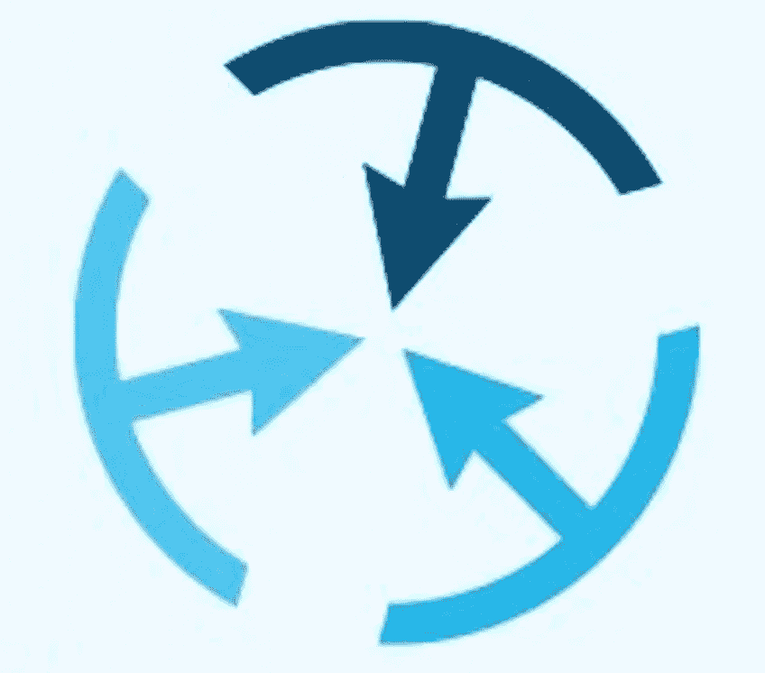

# 产品经理和开发人员思维方式的差异

> 原文：<https://medium.com/nerd-for-tech/the-difference-in-mindset-between-product-managers-and-developers-34d9cd3db8cc?source=collection_archive---------5----------------------->

这篇文章没有什么技术性的内容，我想严肃地谈谈一个开发人员的优势，但不知何故，这些优势也成了阻止我们成为经理的障碍(当然，如果你想成为经理的话)。如果只是想走技术路线，我觉得是没有问题的。这里没有对错，问题只是选择，取决于每个人的个性和能力。然而，在这篇文章中，我将关注另一条道路，即从开发人员到经理。

图片鸣谢: [@benwhitephotography](https://unsplash.com/@benwhitephotography)

# 我自己的一点经验

我最常犯的一个错误是，当我刚开始的时候， ***说了正确的话，但对错误的人说了*** 。打电话给我的客户解释为什么内存泄漏，应用程序因性能问题而崩溃。他不懂，也不在乎。他关心的是需要多长时间完成，他的客户是否乐意多付钱？

另一个错误是，我经常因为我的提议不被接受而难过或生气。那个解决方案很好，很现代，比旧的有很多优点，总的来说，我有足够的理由确信我的技术比团队正在使用的更好(通常是一团糟)。听起来很熟悉？

是的，我可能是完全正确的，但是谁来支付团队开发者重新开始的费用呢？谁来出钱让 QA 团队反复测试。 ***不代表你的客户/你的老板不知道，但那不是合适的时机*** 。

# 经典 T 型

我想我们大多数人都已经熟悉了这个 T——垂直代表专业知识，水平是广义的。可悲的是，当我们追逐他们中的任何一个时，我们常常会忘记另一个(或者可能没有足够的时间)。我们有技术团队的称号，当然，我们总是热爱和追求最先进的技术，最新和最有效的解决方案。我们的价值观无可争议。

但当缩小图片时，严峻的现实是，我们——能够带来出色技术解决方案的开发者——只是一个需要考虑的因素。如果我们看似完美的解决方案需要三倍的时间，并且对用户不友好，它甚至不是一个好的选择，更不用说是最好的了。我从产品管理工作中学到的最大的东西是 ***用户体验*** — ***成本*** — ***技术方案之间的平衡。***

# 有什么区别，如何改进

在我看来，阻碍一个开发者成为管理者的有两个重要因素:视角和同理心。

一个开发人员不仅应该关注他们自己的技术问题，还应该关注业务、客户和用户的困难和需求。令人痛苦的是，我们经常不关心这些事情，因为我们通常会收到客户或经理的要求(如果你在外包环境中工作)。

因此，无论何时提出解决方案，都要从用户和企业所有者的角度考虑其他因素，如时间、成本和效率。最后但同样重要的是，要理解你的客户和你的团队 BA / QA。毕竟，你的客户最了解市场，最了解用户角色。

# 结论

我知道有些人会说，“现实没那么容易”——哈哈，我完全同意，因为即使对于写这些的我来说，仍然有客户或时刻让我抓狂。显然，一个开发者要成为一个管理者并不容易，需要改变很多习惯、性格、思维和视角。

你的高层观点越多，你能做出的选择就越好，你的决策权就越大，甚至在最糟糕的情况下，你也可以说不，而不会让大多数人(大多数不是全部)失望。