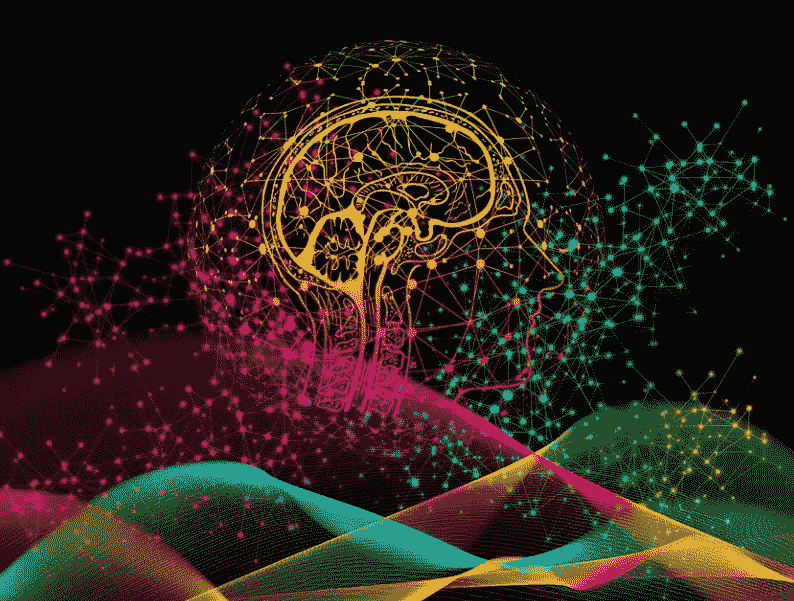

# 数字时代与认知适应

> 原文：<https://medium.com/nerd-for-tech/the-digital-age-cognitive-adaptation-c9a22f617359?source=collection_archive---------2----------------------->

图片由[皮克斯拜](https://pixabay.com/?utm_source=link-attribution&utm_medium=referral&utm_campaign=image&utm_content=5137349)的 Gerd Altmann 提供

T4:人类都是动物。更确切地说是哺乳动物。我们花了很长时间来假装我们不是，我们是不同的。我们不同于其他动物，因为我们有社交能力，集体组织能力，也许最重要的是，创造和传播文化的能力。事实证明，我们的大脑也比其他任何动物进化得更快。但我们仍然是动物。这给我们的数字时代带来了一些适应挑战。特别是在时间和空间方面。

你刚刚花了一天时间徒步旅行了一条令人惊叹的新荒野小径。呼吸着树林里肥美的气息，或许涉水穿过一条湍急的小溪。在湖边的大石头上吃午饭，听大自然的声音。你带着你的智能手机，但只是为了紧急情况，也许是一些照片。但很大程度上，你被拔掉了插头。你感觉很好。

又是一个工作日的结束。你在家工作，但你的大脑疲惫不堪。四次视频会议和几个小时的时间将一份报告整合在一起，在应用之间移动，将所有内容放入幻灯片或电子表格中。进出空闲频道，在吉拉移动卡片，回复电子邮件。智能手机上的信息。你甚至有几次感觉你的大脑“眨了一下眼”。可能是的。这叫做注意力眨眼，实际上是你的大脑在进行硬重置。因为认知超负荷。

这就是我们在今天的数字世界中的生活方式，在这个世界中，物理和数字已经结合在一起。有时很好，有时不好。

我们的数字技术虽然对我们日常生活的许多方面都有很大的好处和非常有用，但也给我们自己、文化和社区带来了新的压力。这还不错。确实如此。正如已经说过的；首先我们塑造技术，然后它塑造我们。

我们大脑面临的两大挑战，以及我们在哪里发现如何适应，在一定程度上与时间和空间有关。数字通信工具总是对我们的速度提出要求。而在很多方面，消除空间或地方。我们觉得有义务几乎立即回复电子邮件、短信和信息。现实世界中的事件和活动在时间和地点上是固定的。我们发送电子邮件、信息、推文，然后它们进入网络空间。收件人收到邮件时，我们不必亲自到场。可能在地球的另一边，隔着几个时区。物质世界移动得更慢。

几千年来，我们的大脑已经适应了物质世界的生活。随着帆船和马拉车的出现，以及汽车和飞机、无线电和电话的出现，生活确实加快了。有趣的是，几十万年前，我们的大脑要大得多。科学家认为，主要是因为我们为了生存不得不记录更多的东西；不断地倾听和寻找那些认为我们是睡前美味点心的捕食者。适应天气，草和灌木的运动等等。随着这些威胁因为我们的适应而消退，我们的大脑变得更小了。

很久以前，很久以前，人类不知何故意识到生物适应对于我们的生存来说太慢了。我们的大脑发挥了关键作用。它们比其他动物进化得更快，因为我们的大脑更具可塑性，所以我们发展了文化。我们把文化交流作为一种生存机制。文化是我们用来导航生活的知识。

但是，数字技术，特别是那些影响我们认知能力的技术，如社交媒体、软件和智能手机，正在对我们的大脑提出几十万年来从未经历过的新的认知需求。从某种意义上说，随着我们进入[认知时代](/@gilescrouch/welcome-to-the-cognitive-age-a216816f9270)，我们的大脑面临着新的适应挑战。

我们现在生活在两个世界。我们以前从来没有这样做过。我们知道如何在物理世界中管理时间和空间，但在数字世界中却不那么好。这给我们带来了新的认知压力。这些症状在一天结束时会因为使用如此多不同的软件应用和服务、设备通知而耗尽。我们必须在比以往更多的地方和空间更快地处理更多的信息。

这就是为什么我们谈论数字排毒，走进树林，关掉一切。这就是为什么我们慢慢地教彼此如何在网上行为，发展我们数字生活中的游戏规则。这就是为什么在加拿大安大略省，政府最近引入了“[断开](https://www.ctvnews.ca/business/ontario-s-right-to-disconnect-law-who-qualifies-and-what-are-the-loopholes-1.5936773)权利法，这样雇主就不能强迫员工在下班后处理电子邮件。

所有这些都是我们互相学习和教导的方式，关于同时生活在两个世界。然而，科学表明，在认知时代，我们更有可能适应。具体如何，还有待观察，我正在探索。但随着我们开发人工智能和机器人等技术，我们将学会适应并将其融入我们的文化和社会。道路上会有，也已经有，坎坷，但这是我们的天性。进化有利于我们的大脑及其进化能力。文化使我们能够适应。我们如何去做是有趣的部分。