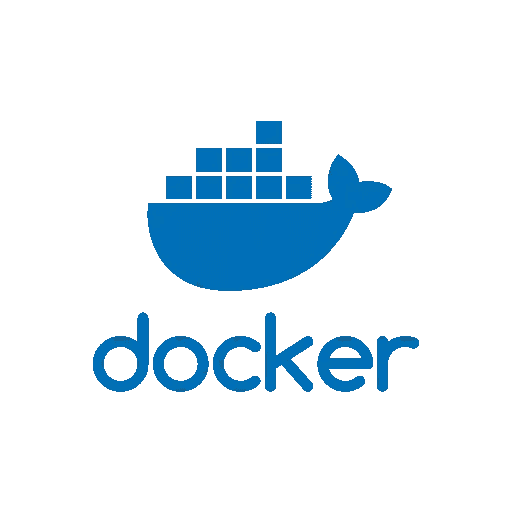

# 码头运营视角

> 原文：<https://medium.com/nerd-for-tech/the-docker-ops-perspective-b67520672660?source=collection_archive---------9----------------------->



# 运营侧将包括:

*   下载图像
*   启动一个新容器
*   登录到新容器
*   在其中运行一个命令
*   然后摧毁它。

当我们安装 Docker 时，我们得到了两个主要组件。

1.  码头客户
2.  Docker 守护进程

这个守护进程支持 Docker 远程 API。在默认的 Linux 安装中，客户端通过/var/run/docker.sock 下的本地 IPC/Unix 套接字与守护程序进行辩论。在 Windows 上，这是通过 npipe:////处的命名管道实现的。/pipe/docker_engine。我们可以用 docker version 命令测试客户端和守护进程是否正在运行，是否可以相互通信。

```
**$ docker version** 
**Client:**
**Version: 17.05.0-ce**
**API version: 1.29**
**Go version: go1.7.5**
**Git commit: 89658be**
**Built: Thu May 4 22:10:54 2017**
**OS/Arch: linux/amd64**
**Server:**
**Version: 17.05.0-ce**
**API version: 1.29 (minimum version 1.12)**
**Go version: go1.7.5**
**Git commit: 89658be**
**Built: Thu May 4 22:10:54 2017**
**OS/Arch: linux/amd64**
**Experimental: false**
```

如果我们从客户端和服务器组件得到响应，我们就可以开始了。[如果我们使用的是 Linux 并从服务器组件得到错误响应，请再次尝试前面带有 sudo 的命令:](https://www.technologiesinindustry4.com/) sudo docker 版本。我们将需要添加我们的用户帐户到本地 docker 组，如果它与 sudo。

# 形象

包含操作系统文件系统和应用程序的对象称为 Docker 映像。如果我们在运营部门工作，这就像一个虚拟机模板。在 Docker 世界中，图像实际上是一个停止的容器。如果我们是开发人员，我们可能会将图像视为一个类。在我们的 docker 主机上运行 Docker 镜像 ls 命令。

```
**$ docker image ls**
**REPOSITORY        TAG       IMAGE ID        CREATED               SIZE**
```

如果我们从新安装的 Docker 主机上工作，它将没有图像，看起来与上面的输出类似。将图像接收到我们的 Docker 主机上被称为“拉取”。[如果我们在追随 Linux，请下载最新的 Ubuntu。如果我们继续使用 Windows，请使用 Microsoft/powershell:nano server 镜像。一个映像包含足够的操作系统(OS ),以及运行任何应用程序所需的所有代码和依赖项。](https://www.technologiesinindustry4.com/)

# 容器

我们可以使用 docker 容器运行命令来启动容器。

对于 Linux:

```
**$ docker container run -it ubuntu:latest /bin/bash**
**root@6dc20d508db0:/#**
```

对于 Windows:

```
**> docker container run -it microsoft/powershell:nanoserver PowerShell.exe**
**Windows PowerShell**
**Copyright (C) 2016 Microsoft Corporation. All rights reserved.**
**PS C:>**
```

从上面我们应该注意到，shell 提示符在每个实例中都发生了变化。这是因为我们的外壳现在连接到了新容器的外壳上——确切地说，我们在新容器的内部！docker 容器运行告诉 Docker 守护进程启动一个新的容器。-it 标志表示守护进程创建容器交互，并将当前终端附加到容器的外壳上。接下来，该命令告诉 Docker 我们希望容器基于 Ubuntu: latest 映像或者 Microsoft/PowerShell [: Nano 服务器映像(如果我们跟随 Windows](https://www.technologiesinindustry4.com/) )。最后，我们告诉 Docker 我们希望在容器内部运行哪个进程。我们为 Linux 示例运行 Bash shell，因为 Windows 容器运行 PowerShell。从容器内部运行 ps 命令，列出所有正在运行的进程。

请注意，与我们运行的容器相比，我们的 Docker 主机上多运行了多少进程。在前面的步骤中，我们按 Ctrl-PQ 退出容器。在一个容器内这样做将使我们离开容器而不会杀死它。我们可以使用 docker container ls 命令来理解系统中所有正在运行的容器。

```
**$ docker container ls**
**CONTAINER ID IMAGE COMMAND CREATED STATUS NAMES**
**e2b69eeb55cb ubuntu:latest "/bin/bash" 6 mins Up 6 min vigilant_borg**
```

上面的产量显示了一个运行的容器。我们之前创建了这个容器。我们的容器在这个输出中的出现表明它正在运行。我们也可以意识到它是 6 分钟前创建的，已经运行了 6 分钟。

# 附加到运行中的容器

我们可以用 docker container exec 命令分配我们的 shell 来运行容器。让我们重新连接到它，因为前面步骤中的容器仍然在运行。

**Linux 举例:**

这个实例放置了一个名为 vigilant_borg 的容器。记住用 Docker 主机上运行的容器的名称或 ID 替换 vigilant_borg，因为我们的容器名称会不同。

```
**$ docker container exec -it vigilant_borg bash**
**root@e2b69eeb55cb:/#**
```

**Windows 示例:**

这个实例提到了一个名为 pensive _ hamilton 的容器。记住用 Docker 主机上运行的容器的名称或 ID 替换 pensive _ hamilton，因为我们的容器名称会不同。

```
**> docker container exec -it pensive_hamilton PowerShell.exe**
**Windows PowerShell**
**Copyright (C) 2016 Microsoft Corporation. All rights reserved.**
**PS C:>**
```

请注意，我们的 shell 提示符又变了。我们回到了集装箱里。docker 容器执行命令的格式是 docker 容器执行选项。在我们的实例中，我们使用-it 选项将我们的外壳附加到容器的外壳。我们按名称放置容器，并将其表示为运行 bash shell。这就是 Windows 示例中的 PowerShell。我们可能只是通过 ID 来引用容器。通过按 Ctrl-PQ 再次退出容器。我们的 shell 提示符应该返回到我们的 Docker 主机。再次运行 docker 容器 ls 命令，验证我们的容器是否仍在运行。

```
**$ docker container ls**
**CONTAINER ID IMAGE COMMAND CREATED STATUS NAMES**
**E3b78eeb88cb ubuntu: latest "/bin/bash" 9 mins Up 9 min vigilant_borg**
```

现在使用 docker container stop 和 docker container rm 命令停止并销毁容器。记住替换我们自己集装箱的名称/id。

```
**$ docker container stop vigilant_borg**
**vigilant_borg**
**$$**
**docker container rm vigilant_borg**
**vigilant_borg**
```

通过运行另一个 docker 容器 ls 命令确认容器已成功删除。

```
**$ docker container ls**
**CONTAINER ID IMAGE COMMAND CREATED STATUS PORTS NAMES**
```

更多详情请访问:[https://www . technologiesinindustry 4 . com/2020/11/what-is-the-docker-ops-perspective . html](https://www.technologiesinindustry4.com/2020/11/what-is-the-docker-ops-perspective.html)