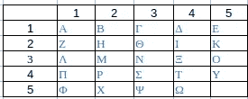
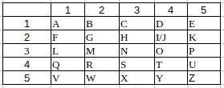
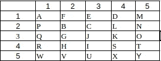

# 使用 Python 加密的早期。波利比乌斯广场(下)

> 原文：<https://medium.com/nerd-for-tech/the-early-days-of-encryption-using-python-polybius-square-part-2-deb4100ab68?source=collection_archive---------8----------------------->


恩尼格玛加密机(照片由[毛罗·斯比格](https://unsplash.com/@maurosbicego?utm_source=unsplash&utm_medium=referral&utm_content=creditCopyText)在 [Unsplash](https://unsplash.com/license?utm_source=unsplash&utm_medium=referral&utm_content=creditCopyText) 上拍摄)

在我以前的一篇题为“使用 python 加密的早期—凯撒密码(第 1 部分)”的文章中([https://medium . com/nerd-for-tech/The-early-days-of-Encryption-using-Python-Caesars-Cipher-1-602201 f 44 FDA](/nerd-for-tech/the-early-days-of-encryption-using-python-caesars-cipher-1-602201f44fda))，我谈到了凯撒密码，并且我使用 Python 实现了它，还进行了加密和解密。本文将讨论另一种早期的加密技术，名为波利比乌斯广场，它使用多字母密码。正如在第一篇文章中所写的，早期的加密是加密的开始，是一种简单的加密，现在在专业加密中已经不再使用或很少使用。另一方面，由于其简单性，学习加密入门的人可以学习它，因此他们很容易知道什么是加密。

波利比乌斯广场也被称为波利比乌斯棋盘，是由古希腊人克利奥塞纳斯和德谟克利特发明的，并因历史学家和学者波利比乌斯而闻名[1]，它使用多字母密码[2]。多字母密码是基于使用多个替换字母的替换的任何密码[2]。20 世纪 30 年代末和战争期间使用的 Enigma I 机器使用多字母密码[3]。

波利比乌斯正方形包含 5 行和 5 列，分别从 1 到 5 开始。最初的正方形使用的希腊字母布局如下[1]:



带有希腊字母的波利比乌斯广场

而波利比乌斯广场则用拉丁字母排列如下[1]:



带有拉丁字母的波利比乌斯广场

在本文中，我们使用波利比乌斯广场如下[4]:



带有拉丁字母的波利比乌斯广场

字母表的顺序不是序列，所以这使得密码比序列更难破解。在这样的波利比乌斯广场上，对于 A，它用 11 表示，对于 B 是 22，D 是 41，而首先提到的是行号。例如，如果我们想写“红色的鱼”，密码将是“14 31 41 21 34 44 24”。

**波利比乌斯平方用 Python** 波利比乌斯平方用于加密可以用编程语言实现，比如 Python。波利比乌斯方加密的算法为:
1。
创建明文列表(plainnya)和密文列表(cipher nya)2。初始化用于存储密码输出的列表(bil_huruf)
3。输入文本
4。将输入文本的每个字母转换成大写字母
5。基于输入文本的循环
5a。在输入的循环文本中，plainnya
5b 的循环。在循环输入的文本中，检查输入的文本上是否有空格，追加存储到索引 26 的列表，表示是空格
5c。将 plainnya 的每个成员与输入文本的每个成员进行比较。如果相同，将平原索引存储在 bil_huruf
6 中。使用 bil_huruf 索引通过 print ciphernya 打印结果

代码如下所示:

```
# Encryption 1 — Caesar’s Cipher
plainnya=[“A”,”B”,”C”,”D”,”E”,”F”,”G”,”H”,”I”,”J”,”K”,”L”,”M”,”N”,”O”,”P”,”Q”,
 “R”,”S”,”T”,”U”,”V”,”W”,”X”,”Y”,”Z”,” “]
ciphernya=[“11”,”22",”32",”41",”31",”21",”23",”24",”34",”33",”43",”42",”51",”52",”53",
 “12”,”13",”14",”44",”54",”35",”25",”15",”45",”55",”Z”,” “]
```

上面的代码为明文(plainnya)和密码(ciphernya)创建列表

```
bil_huruf=[]
sente=input(“Sentence :”)
sentence_up=sente.upper()
```

然后初始化保存匹配字母名称的列表(bil_huruf)。也转换每一个字母输入大写。

```
for i in range(len(sentence_up)):
   for j in range(len(plainnya)):
      if (sentence_up[i]==” “):
         bil_huruf.append(26)
         break

      if plainnya[j]==sentence_up[i]:
         bil_huruf.append(j)
```

然后循环比较 plainnya 列表中的每个字母和输入的每个字母。如果匹配，将普通列表的索引存储在 bil_huruf 上。

```
print(“Result :”)
for k in range(len(bil_huruf)):
 print(ciphernya[bil_huruf[k]],end=” “) 
print(“\n”)
```

最后用基于 bil_huruf 索引的循环密码算法打印出结果。


加密的结果

对于解密算法，它与加密相反，需要注意的是，我们必须考虑加密文本有 2 个数字来表示普通列表(plainnya)中的一个字母，因此我们将每 2 个数字与 plainnya 中的一个字母进行比较。为此，我们在每个循环中将输入文本的当前索引与 index+1 连接起来。这将使循环不会在最后一个索引处终止，而是在最后一个索引-1 处终止。解密代码如下:

```
# Decryption 1 — Caesar’s Cipherplainnya=[“A”,”B”,”C”,”D”,”E”,”F”,”G”,”H”,”I”,”J”,”K”,”L”,”M”,”N”,”O”,”P”,”Q”,“R”,”S”,”T”,”U”,”V”,”W”,”X”,”Y”,”Z”,” “]
ciphernya=[“11”,”22",”32",”41",”31",”21",”23",”24",”34",”33",”43",”42",”51",”52",”53",“12”,”13",”14",”44",”54",”35",”25",”15",”45",”55",”Z”,” “]bil_huruf=[]
sente=input(“Sentence :”)for i in range(len(sente)):
 for j in range(len(ciphernya)):
   if (sente[i]==” “):
       bil_huruf.append(26)
       break

    if i==len(sente)-1:
       break
    else: 
       sentenya=sente[i]+sente[i+1]
       if ciphernya[j]==sentenya:
          bil_huruf.append(j)print(“Result :”)
for k in range(len(bil_huruf)): 
  print(plainnya[bil_huruf[k]],end=” “)print(“\n”)
```

解密代码的结果如下:


解密的结果

这些加密和解密代码，我也上传到了我的 github 账户上([https://github.com/sofwanbl/encrypt-decrypt-2](https://github.com/sofwanbl/encrypt-decrypt-2))

**结论**

波利比乌斯广场使用多字母芯片是加密时代的开端。它仍然很容易理解，为了使我们的工作更容易加密和解密一些文本，我们可以使用编程语言如 Python 来实现它们。

**参考**

[1]维基百科，波利比乌斯广场，2021 年 4 月 30 日。2021 年 5 月访问[在线]。可用:[https://en.wikipedia.org/wiki/Polybius_square](https://en.wikipedia.org/wiki/Polybius_square)

[2]维基百科，多字母密码，2021 年 3 月 26 日。2021 年 5 月访问[在线]。可用:[https://en.wikipedia.org/wiki/Polyalphabetic_cipher](https://en.wikipedia.org/wiki/Polyalphabetic_cipher)

[3]维基百科，[《谜机》，2021 年 5 月 13 日。2021 年 5 月访问[在线]。可用国家:https://en.wikipedia.org/wiki/Enigma_machine](https://en.wikipedia.org/wiki/Enigma_machine)

[4] Zainul Franciscus，什么是加密，它是如何工作的？，2018 年 12 月 28 日。2021 年 5 月访问[在线]。可用:[https://www . how togeek . com/how to/33949/htg-explains-what-is-encryption-and-how-it-work/](https://www.howtogeek.com/howto/33949/htg-explains-what-is-encryption-and-how-does-it-work/)