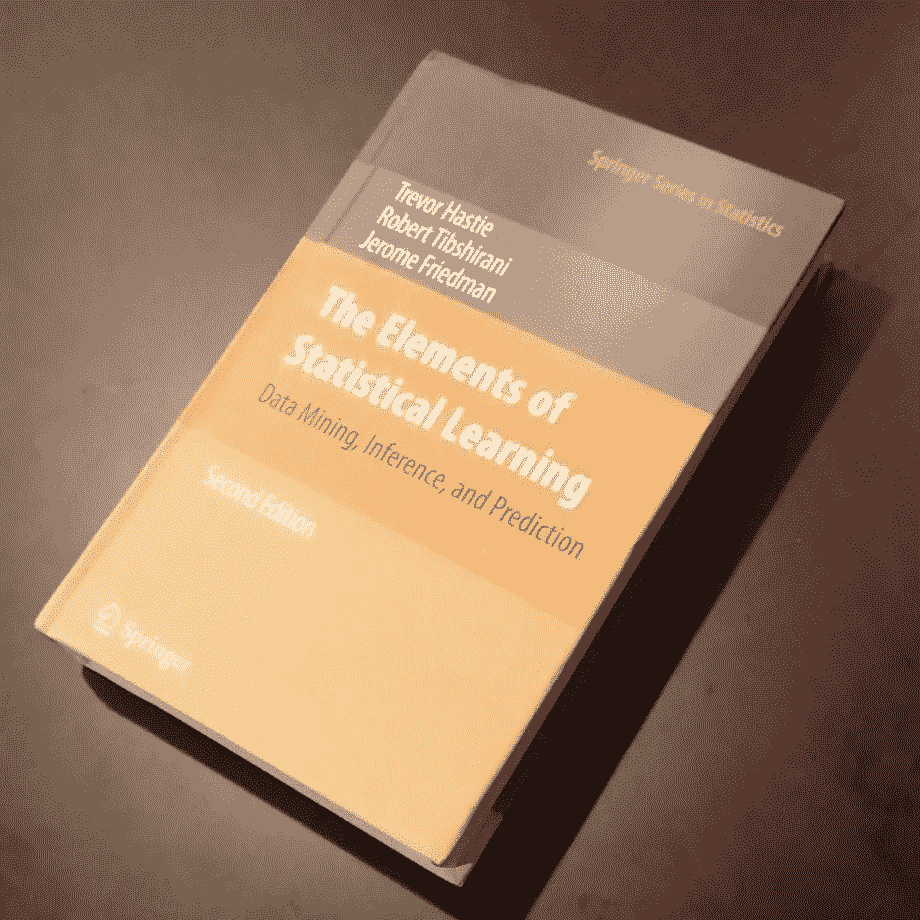
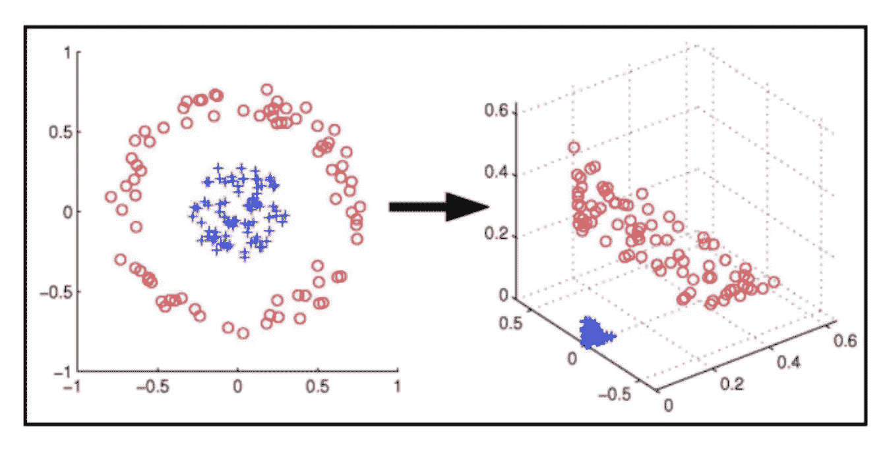

# 统计学习的要素 1

> 原文：<https://medium.com/nerd-for-tech/the-elements-of-statistical-learning-introduction-82c4c8295967?source=collection_archive---------7----------------------->

## 介绍

我保证这将是唯一无聊的照片

最近，除了数据科学项目或概念的随机突发之外，我一直在考虑一个新的项目——当然是与数据科学相关的。我遇到了一份非常困难但又很有必要的工作，我自己也需要阅读:统计学习的要素。在所有这些令人头疼的事情之后，我希望有人能够用通俗易懂的语言把它分解成更短的摘要，并且有一种有趣的互动方式。然后，我明白了。那个人可能是我。

这本书基本上是关于监督学习的。无监督学习不是主要的焦点，因此在第 14 章之前它将退居二线。既然我假设对这个领域不感兴趣的普通人不会关注我的博客，我也假设你在表面上理解了监督和非监督学习。因此，我也将跳过介绍的前半部分，它给出了监督和非监督学习问题的例子，并跳转到更重要的内容:这本书是如何结构化的，以及我将如何涵盖这些主题。

**结构**

这本书的结构就像一个链条，把所有的想法连接在一起。它在第 2 章中以监督学习问题的概述开始，使读者跟上速度，接着是第 3-4 章中的线性方法。这本书相信对简单方法的牢固掌握，比如线性方法，会让位于对第 5-6 章中更复杂方法的理解。当然，复杂的方法只不过是后面章节中高维度学习技术的基础。从这里开始，这本书暂停了单独研究方法的工作，而是把重点放在整体方法上，不久之后又回到了单独的方法上。

第 7 章和第 8 章分别关注评估和模型推理，然后是第 10 章中的相关程序，特别是 boosting。我能想到的对比第 2-6 章和第 7，8，10 章的最佳类比是人体:第 2-6 章是内脏，第 7，8，10 章是饮食和表演。如果你不理解像评估、模型推理和相关程序这样的术语，那么你就在正确的地方，否则你就不需要读这篇文章。随着链 7、8、10 的完成，这本书将我们的焦点分别带回到方法上，但是是不同种类的方法。

第 9-13 章关注结构方法。是的，我知道我的类比是站不住脚的，但是有一个很好的理由:第 10 章可以分为单独的方法或作为一个整体的方法。结构方法的进一步划分将是回归、分类和无监督学习:9-11 侧重于回归，12-13 侧重于分类，我们不受欢迎的堂兄 14 侧重于无监督学习。在接近尾声时，这本书转向了更新的技术，如第 15-16 章的随机森林和集成学习，第 17 章的图形模型，最后是第 18 章的高维问题。好了，我们已经完成了这本书想让我们怎么读，但是我要怎么写博客，这是一个不同的故事。

**我将如何讲述这些话题**

我知道后面的章节听起来很吓人，尤其是第 18 章，但是这些复杂的想法只是前面章节中简单想法的宏观视图。例如，更高维度的问题仅仅通过引入新的术语(或特征)来区分不可微分的实例来解决。我这么说是什么意思？信不信由你，我们都很熟悉，在成长的岁月里都用过同样的技巧来完成正方形。

在图的左侧，不可能在实例蓝色“+”和红色“o”之间画一条线。但是如果我们引入一个新的特征，深度，两组可以用一条线分开

哇，完成正方形，多么遥远的一个术语，但是不要担心当第 18 章到来时我会刷新和解释。现在，让我解释一下我将如何组织这个项目。

我的目标是发布一个新的博客，每两周总结一个章节的一部分。每章大约有 9-14 节(希望我能在你的曾孙庆祝他们 50 岁生日之前完成)。我从未从事过如此大规模的工作，所以对我来说这是一个反复试验的过程。这意味着我可能会根据主题的复杂程度缩短或延长发布时间。因为我想保持它的简短，困难的材料可能会被分解成许多部分，而多余的部分将被压缩。因此，总结的频率将基于复杂性，而不是严格地每两周一节。总之，复杂的部分将被分割，简单的部分将被合并。

谢谢你跟着我走了这么远，给自己一点奖励，陪我迈出千里之行的第一步。下一节见。