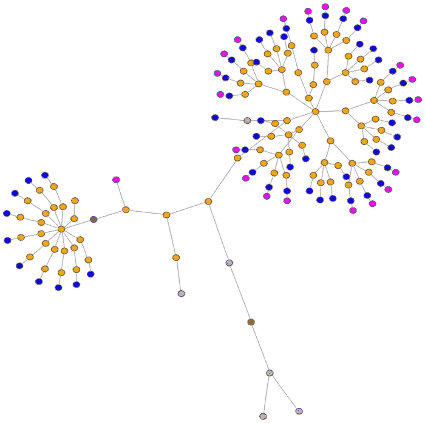
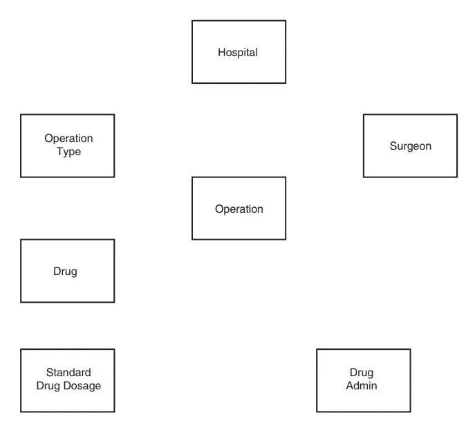
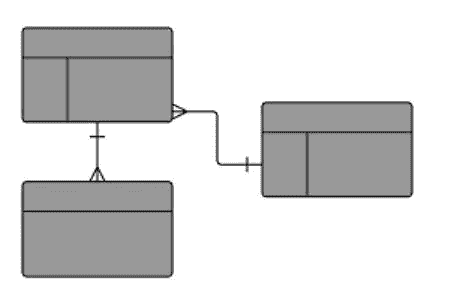

# 实体关系方法

> 原文：<https://medium.com/nerd-for-tech/the-entity-relationship-approach-b317c0ca104b?source=collection_archive---------12----------------------->

关系

**简介**

本次讨论的重点是确保数据满足业务需求。

大部分讨论都致力于术语和图表惯例的正确使用，它们在数据需求的技术和业务视图之间架起了一座桥梁。

**图示**

每个手术只能由一个外科医生执行(因为手术台的每一行只允许一个外科医生编号)这一事实是数据模型强加的一个重要约束，但并不立即显现出来。

流程建模者通过使用图来解决这类问题，比如数据流图和活动图，显示他们的模型的最重要的特征。我们可以用同样的方式处理数据模型。

1.  基本符号:方框和箭头

我们首先用两个符号将我们的模型表示为数据结构图:

a.一个“盒子”(严格地说，是一个长方形)代表一张桌子。

b.在两个框之间画出的箭头表示一个外键，该外键指向表，它在表中显示为主键。

箱子

2.外键的图示

在绘制 ER 图时，我们使用了以下图形约定:用外键列名标记关系线。这就清楚了子表中的哪一列是父表的外键。可以通过给有问题的属性加下划线来指示主键状态。

外键

3.解释图表

前两条规则在关系表示中是显而易见的，其他两条则不那么明显。有了这个图，我们已经成功地总结了由我们的
主键和外键所隐含的表之间的关系，而根本不需要实际列出任何列名
。

4.可选性

该图还可能会提高根本不涉及
任何实体的手术的可能性:“当我们治疗
有小切口的患者时，我们通常不涉及外科医生，但我们仍然需要记录是否使用了任何药物
”。

5.验证模型

该图为用户和业务专家验证模型
提供了一个很好的起点。对图表上的每个箭头进行智能、彻底的检查通常会揭示不合理的假设和误解，或者同样有用的是，增加利益相关者对模型的
可行性的信心。

6.多余的箭头

这个箭头增加了我们对模型支持的业务规则
的了解吗？它告诉我们每个操作必须在一个实体上执行
。但是我们可以从另外两个箭头推断出这一点，这两个箭头
指定每个操作必须由一个实体管理。箭头还显示了程序可以直接从表中的一行“导航”到相应的。

**自顶向下的方法:实体关系建模**

尽管该图包含的新信息很少，但它更清楚地传达了模型中一些最重要的规则，因此如果不画一个模型，就不应该查看或展示它。为这样的数据库准备一个图表并展示给程序员和分析师是很有趣的。

1.  自上而下开发图表

自顶向下的方法也克服了自身使用的
规范化的大部分限制。我们不需要从极其复杂的单个表格开始，也不需要接受由我们历史选择的决定因素隐含定义的表格
。

2.术语

我们对于概念模型的术语更加面向业务。同样，有三个基本概念:

*A.* ***实体类*** *:业务感兴趣的事物类别；由图上的方框表示，通常实现为表格*

*B.* ***属性*** *:我们想了解的实体类；通常不在图上显示，通常作为表格中的列来实现*

*C.* ***关系*** *:用带鱼尾纹的线条表示(既然说到概念模型，我们就把“箭头”这个术语去掉)，一般通过外键实现。*

**实体类**

实体类是真实世界的类，如医院。我们区分实体(如“RSUD Cengkareng”)和实体类(有时称为实体类型)，如“医院”

只要我们乐于让“事物”包含更抽象的概念，如事件(如操作)和分类(如操作类型)，所有的实体类都将满足“我们需要保存信息的一类事物”的标准。

1.  实体图表惯例

实体类由带圆角的方框表示。

2.实体类命名

实体类的名称必须是单数，并且引用单个
实例(在关系术语中是一行),而不是整个表。因此，像文件、表格、目录、历史和时间表这样的集合术语是不合适的。

我们这样做有三个原因:
*A.* ***一致性*** *:它是实体类的一个命名标准的开始。
B.* ***沟通*** *:实体类是“我们想要保存信息的东西”，比如客户而不是客户文件。
C.* ***生成业务断言*** *:如果我们遵循一些简单的规则来命名一个 E-R 模型的组件，我们可以自动生成语法上
合理的断言，供涉众检查。*

3.实体类定义

定义必须支持实体类名。我们不能过分强调好的实体类定义的重要性。有时，数据建模者会陷入冗长的争论，而没有明显的进展。几乎无一例外，他们没有付出足够的努力来确定一些工作定义，他们在不断地进行微妙的心理调整，但从未被记录下来。建模者
经常(可能是无意中)改变定义，以便在讨论中支持
自己的立场。

**人际关系**

例如，在药品支出模型中，方框之间的线条可以在现实世界中解释为实体类之间的关系。例如，医院和外科医生之间以及手术和药物管理之间都有关系。

1.  关系图约定

我们已经使用了一个约定来注释这些行，以描述它们的
含义(关系名)、基数(鱼尾纹可以解释为“多”，它的缺失表示“一”)，以及可选性
(圆圈和横条分别代表“可选”和“强制”)。

2.多对多关系

在实践中，多对多关系经常出现在 E-R 图中。多对多关系是一种基数类型，指的是两个实体 A 和 B 之间的关系，其中 A 可能包含一个父实例，B 中有许多子实例，反之亦然。

3.一对一的关系

术语一对一关系是指两个项目之间的关系，其中一个项目只能属于另一个项目。

4.自我参照关系

这种类型的关系有时被称为“令人头疼的事情”，不仅仅是因为它的出现，而是因为许多人难以理解它所代表的递归结构。

5.涉及三个或更多实体类的关系

每当您遇到看似更高级别的关系时，您应该检查它实际上不是由参与实体类之间的单个多对多关系组成的。这两种情况是不等价的，选择错误的表示可能会导致规范化问题。

6.可转移性

关系的一个重要属性是可转移性，但它没有得到作者和工具开发者应有的重视。我们怀疑
对它的忽视有两个原因。

首先，它对关系数据库设计的影响是间接的。将关系从可转移更改为不可转移不会影响概念模型到关系表的自动转换。

第二，大多数图表工具不支持用符号来表示可转移性。然而，有些确实规定在支持文档中记录它，Chen E-R 约定支持与弱实体类密切相关的概念。

7.从属和独立实体类

独立的实体类是其实例可以独立存在的类。相比之下，依赖实体类的实例只能与另一个实体类的实例一起存在，并且不能在另一个实体的实例之间转移。换句话说，当(且仅当)一个实体类与另一个实体类有强制的、不可转移的多对一(或一对一)关系时，它就是依赖的。

**属性**

我们有时会在图上显示一些属性，以澄清实体类的含义(或者说明某一点)，一些建模工具支持包含指定的属性子集。但是我们通常不会在图上显示所有的属性，主要是因为我们最终会淹没在细节的“大画面”中。

1.  属性识别和定义

为了澄清
实体类的含义(或者为了说明某一点)，我们有时会在图上显示一些属性，一些建模工具支持包含属性的指定子集。但是我们
通常不会在图上显示所有的属性，主要是因为
我们最终会淹没在细节的“大画面”中。

2.主键和概念模型

回想一下，在关系模型中，每个表都必须有一个主键。在 E-R 建模中，我们可以在定义它们的键之前识别实体类。
在某些情况下，实体类的任何属性(单独或组合)都不适合作为主键。

**神话和民间传说**

与任何相对较新的学科一样，数据建模已经获得了自己的“指南”和“规则”的民间传说其中一些可以追溯到鼓励良好和一致的实践的真正尝试。当更准确的描述应该是“可能但不太常见”时，将许多情况标为“不可能”明智的数据建模师会被这种情况提醒，但不会仅仅因为模型违反了某些法令就拒绝它。

1.  没有关系的实体类

拥有一个与任何其他实体类都不相关的实体类是完全可能的，尽管并不常见。偶尔出现的一个小例子是
一个只包含一个实体类的模型。其他反例出现在支持管理信息系统的模型中
，这可能需要来自不同来源的
数据。

2.基数和可选性的允许组合

双向强制关系的问题可能是“先有鸡还是先有蛋”的问题:哪个先出现？我们无法
记录没有账户的客户，也无法记录没有客户的账户
。事实上，这个问题是虚幻的，因为我们在一次交易中创建了
客户和账户。数据库在交易开始和结束时都满足
规定的约束。

**创造力和 E-R 建模**

正如我们所预期的，选择的元素在 E-R 建模中比在规范化中更明显。在 E-R 建模中，我们定义我们的数据类别。在规范化中，在我们开始之前就已经确定了(通常由其他人确定)。分类的过程是如此主观，以至于即使将数据最广泛地划分为实体类和关系，也能提供一些选择。

**总结**

数据模型可以用图解法表示，用一个方框表示每个表，用一条线表示每个外键关系。进一步的图表约定允许显示关系的名称、基数和可选性。我们可以将方框视为代表实体类——业务需要保存信息的事物——而将线条视为代表实体类之间的业务关系。由此产生的模型通常被称为实体关系(E-R)模型。

实体类识别本质上是一个对数据进行分类的过程，在选择最有用的分类时有相当大的选择和创造空间。实体类的命名和定义至关重要。要在其中一种表示法中模拟这种关系，必须使用一个交集实体类。

许多民间传说围绕着关系。在某些上下文中，可选性、基数性、可转移性和递归的大多数组合都是可能的。建模者应该警惕不寻常的组合，但是从基本原则出发检查每一种情况。

**参考**

数据建模理论与实践