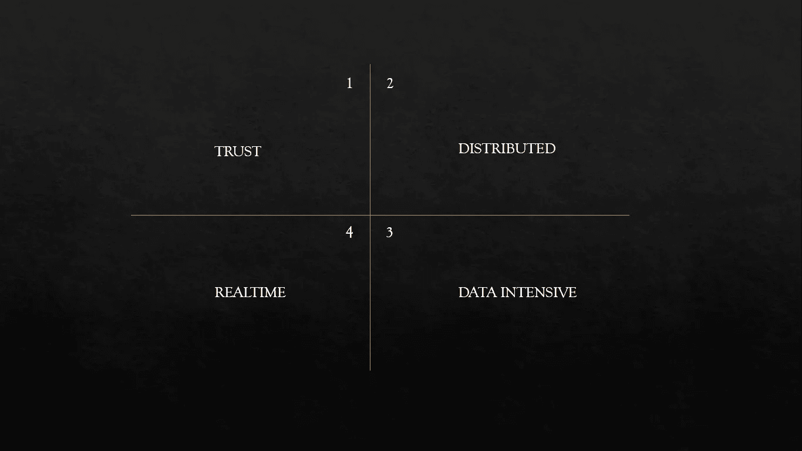

# 四象限方法论:区块链是你的问题需要的解决方案吗？

> 原文：<https://medium.com/nerd-for-tech/the-four-quadrant-methodology-is-blockchain-the-solution-your-problem-needs-c2f12c50bd92?source=collection_archive---------1----------------------->

区块链目前风靡一时。任何人都想用最新流行的 la deeda 区块链来实现他们的解决方案。

区块链已经将信任内置到平台中。它通过消除第三方并向所有参与者提供通用的数据视图来提高效率。它就像一个不能被擦除/撕掉或销毁的笔记本。然而，区块链并不适合解决所有问题。事实上，它有时会对问题的整体解决不利。

在这里，我会给你一个四象限方法来确定你的问题是否需要在区块链空间中解决。

象限图

象限 1:信任

对于问题陈述，用“是”或“否”回答下列问题:

*   您的应用程序是否需要多方信任彼此的数据？
*   在你的系统的参与者中有很多信息共享吗？
*   您的系统是否有多个第三方系统用于数据捕获和跟踪？

如果不止一个问题的答案是肯定的，那么你可以进入下一个象限。

象限 2:分布式

对于问题陈述，用“是”或“否”回答下列问题:

*   您的系统是多节点系统吗？
*   您的系统是否有多个参与者使用彼此相似的数据集执行相似的功能？

如果任何问题的答案是肯定的，那么你可以进入下一个象限。

象限 3:数据密集型

对于问题陈述，用“是”或“否”回答以下问题。请仔细考虑该象限的结果，因为这可能会有效地决定区块链是否合适。

*   您的系统捕获大量数据和信息吗？
*   你的系统需要存储和引用大量数据吗？
*   您的系统是否对收集的数据进行大量分析？

如果任何一个问题的答案是肯定的，那么区块链就不是选择平台的问题。一些原因是—

*   区块链无法存储大量数据，因为数据是以哈希形式存储在链上的
*   在链上存储大量数据是非常昂贵的
*   检索大量数据效率不是很高

象限 4:实时

如果您的系统需要实时更新和处理数据，这对于事务时间的可预测性非常重要，那么区块链不是考虑的平台。块被提交以包含到链上，并且包含的时间以及事务的终结是不可预测或实时的。

这是我的类比和观点，试图简化区块链是否可能为你的问题陈述工作的问题。当然，对于区块链拓扑的进一步选择，还有更多的考虑，这是我下一篇文章的主题。

请在评论中告诉我这是否有帮助！:)