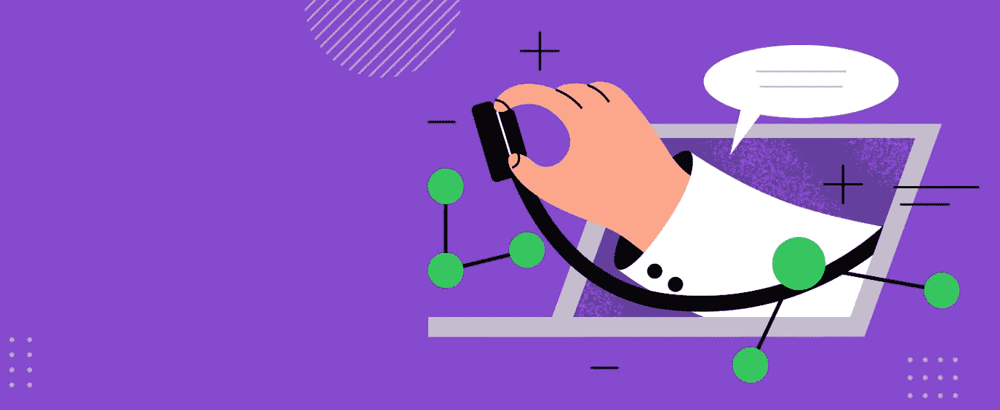
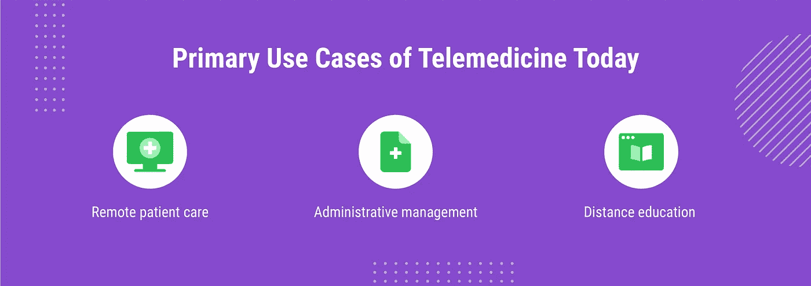
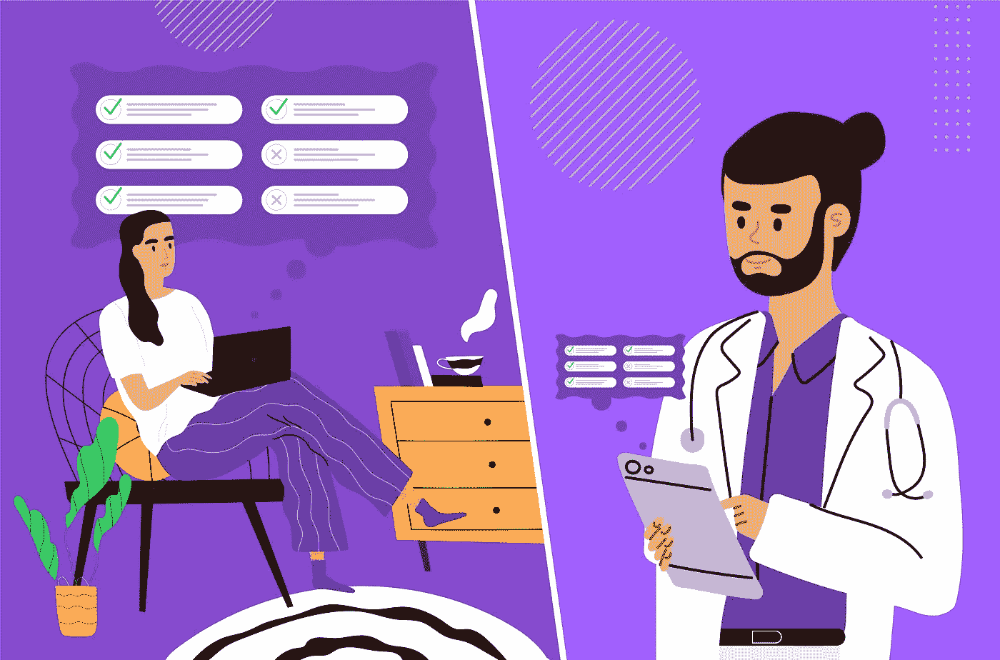
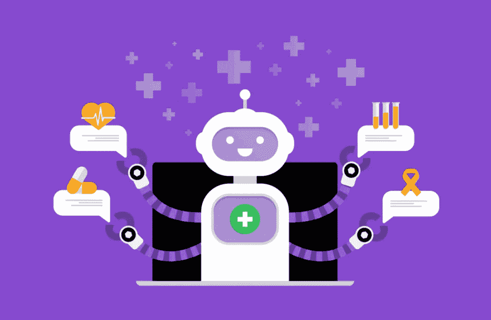

# 远程医疗的未来:未来几年要考虑的关键技术

> 原文：<https://medium.com/nerd-for-tech/the-future-of-telemedicine-key-technologies-to-consider-in-the-coming-years-8a079532be51?source=collection_archive---------11----------------------->

许多人都会同意，我们生活在一个技术力量越来越强大的世界，将传统的服务模式转变为数字模式。当然，医学也不例外。事实上，它现在可以作为技术如何重塑未来的光辉典范，远程医疗就是其中之一。

虽然今天它主要被认为是传统医疗保健的替代品，但它作为医疗保健服务提供的首选模式的地位与日俱增。尤其是当你考虑到全球疫情和世界范围内采取的隔离措施。因此，医学自信地从医院和诊所走向家庭，人们相信有一天它将完全取代传统模式。例如，远程医疗公司 eVisit 的联合创始人兼首席技术官迈尔斯·罗姆尼表示，2050 年“远程医疗”将不复存在，因为它将只是“健康”。

那么什么是远程医疗，它现在如何使用，以何种形式使用，什么样的创新推动它走向未来，我们可以期待它会变成什么样？让我们试着弄清楚。

# 什么是远程医疗？

远程医疗并不新鲜。这可能令人惊讶，但它已经存在一段时间了。早在 1879 年，电报被用来报告伤亡情况，以减少不必要的办公室访问。在 20 世纪 50 年代，人们试图通过电话共享医疗信息，后来在 1994 年，视频咨询被用于慢性病管理。但是由于人们普遍认为病人和医生更喜欢面对面的咨询，远程医疗最近主要被那些由于某种原因不能去医生办公室的病人使用。

随着新冠肺炎疫情的爆发和世界范围内采取的隔离措施，情况开始发生变化。因为远程医疗的重点是提供远程医疗服务，它的受欢迎程度急剧增加。考虑到向在线平台和远程交付的转变将持续到许多其他行业，医疗保健也不会例外。更确切地说，大多数医生认为，远程医疗肯定会成为我们未来的重要组成部分，特别是在精神健康、慢性病管理、血液测试结果和药物审查方面。

# 今日远程医疗:它是如何使用的？

**远程患者护理**

当然，今天远程医疗最广泛的应用之一是提供远程病人护理。有一些主要的划分，包括:

**远程咨询**

远程会诊解决方案涵盖了患者监护、诊断和治疗，使临床医生能够提高医疗保健服务的交付效率。例如，它们可以用于快速准确地传输 x 射线和实验室结果，使专业人员能够了解患者病情的最新变化，从而提高患者管理的协调性。

**远程监控**

它允许远程监控患者的生物、心理和生物特征参数，减少他们在医院的停留时间，同时提供所需的护理。通常，这种类型的远程患者护理用于帮助患有慢性疾病的人。

**远程手术**

用于远程患者护理的远程医疗的最热门的使用案例之一是远程手术，它允许使用机器人和虚拟现实进行手术。虽然这种类型的远程医疗相对较新，但其革命性确保了它将继续发展。

**行政管理**

在远程医疗的帮助下，有可能确保更有效和准确的行政管理，无论是关于预约安排还是其他与行政管理有关的程序，如医疗测试数据的传输。

**远程教育**

由于远程医疗，专业人员更容易建立有效的协作工作和加强沟通。当谈到专业人员的教育时，它促进了更容易获得高价值的信息，并允许专业人员向最好的人学习。

在不久的将来，我们可以从远程医疗中期待什么？为了回答这个问题，让我们看看今天塑造其面貌的创新技术。

# 远程医疗提供的当前创新方法

在这一部分，我们将讨论远程医疗的最新创新，这些创新在新冠肺炎疫情爆发期间为医疗保健做出了积极贡献。以下是 2020 年和 2021 年医疗保健行业如何受益于远程医疗的几个例子。

**患者就诊前的远程筛查**

随着新冠肺炎的爆发，医院和提供家庭护理的组织已经开始使用在线问卷调查来检测可能患有冠状病毒的患者。这样，就有可能将不必要的风险降至最低，并为每个人提供高质量的护理。此外，这种方法有助于医院在使用有限资源的同时保持最高效率。虽然这种筛查目前主要用于安全原因，但它们将继续发展和传播，提供额外的便利并减少患者在医院的时间。

**对医学图像采集的远程支持**

由于医疗保健专业人员之间的沟通非常重要，提供商对提供商的远程医疗解决方案也越来越受欢迎。这种系统提供的主要好处包括有效协作的工具和为患者提供更容易的护理。

医学成像是最近也是最杰出的例子之一。[放射科操作指挥中心](https://www.philips.com/a-w/about/news/archive/standard/news/press/2020/20201124-philips-introduces-industry-first-vendor-neutral-radiology-operations-command-center-at-rsna-2020.html)允许影像技师为经验不足的同事提供远程培训。因此，当患者躺在扫描台上时，该解决方案支持专业人员之间的协作，从而提供高质量的护理。

**虚拟候诊室和在线预约排班**

在新冠肺炎疫情期间，医院采取的另一项安全和便利措施是个性化短信，提醒患者即将到来的考试，并虚拟化他们的登记流程。至于后者，它允许在到达医院后通过短信进行登记。当患者入住时，工作人员会通过 EHR 收到自动通知。一旦医生准备好给病人看病，他们会再发送一次通知。

# 塑造远程医疗未来的技术

毫无疑问，上述场景将继续推进，逐渐使我们今天知道的医疗保健成为科幻电影的场景。那里的人们有微型植入物，可以连续扫描身体以检测任何异常，自动分析收到的数据，并向医疗专家发送报告以采取及时行动。虽然从我们今天目睹的情况来看，这种景象似乎太不现实，但一些技术专家认为，在未来几十年里，它完全有可能成为我们的日常规范。以下是实现这一目标的关键驱动因素:

**物联网**

互联设备在医疗保健领域的应用已经表明，在提供医疗服务方面，这些技术可以为我们带来多大的进步。现代人不再需要心脏监护仪、计步器、脉搏血氧仪、血糖仪等设备，因为它们嵌入在手表、手镯和其他设备中，可以自动进行检查并将接收到的数据传输到手机或其他设备。随着医疗物联网(IoMT)的发展，在未来几年，这些设备有可能能够进行身体扫描和其他诊断测试。

**艾**

2020 年和 2021 年显示了人工智能应用于医疗保健的价值，它允许执行多项任务，从预诊断到预约安排。当然，对于人工智能在健康咨询中的应用仍然有很多担忧，看医生仍然是许多人的优先事项。然而，10 年前，很难想象你可以简单地在手机上回答一系列问题来获得推定诊断。我们的未来会怎样？我们走着瞧。但毫无疑问，人工智能将以某种形式存在，无论是我们今天知道的形式还是某种新的形式。

**手机应用**

已经有了一个移动应用程序来处理所有的事情，并且随着时间的推移，移动医疗继续用新的解决方案给我们带来惊喜，这些新的解决方案是患者和医生之间强大的联系。尽管对优质移动健康应用的需求增加，但该行业继续欢迎各种技术进步:无论是人工智能、机器学习、情感分析等解决方案。

例如，为了响应新冠肺炎疫情，在 2020 年，我们团队在优步方案的基础上开发了一个[医疗保健 app。该产品确保了医疗专业人员的工作便利性，以及需要及时医疗帮助或 Covid 测试的管理员和患者的易用性。虽然该应用程序仍在支持中，并定期增加新功能以适应市场，但即使在今天，它仍为客户提供了一系列具有竞争力的业务优势:](https://emerline.com/portfolio/uber-like-app-for-doctors)

*   该应用程序的用户可以在最短的时间内获得医疗帮助，方便地在家中使用，移动解决方案简单易用，共同提高了患者的忠诚度和信任度。
*   交付系统的便利性也对客户员工的保留率产生了积极影响。
*   团体请求允许接收大量订单。例如，可以是婚礼、公司活动、宴会等。，要求客人提供阴性 RT-聚合酶链式反应测试。
*   客户可以通过在其他州运营的第三方提供商收取使用该应用程序的费用。
*   开发的定制电子病历系统具有易于使用的定制文档编辑器，也可以作为独立的解决方案出售给第三方提供商。

该解决方案的第一个版本在几个月内交付，使客户能够以独特的需求产品胜过竞争对手。因此，如果您正在寻找通过创新的远程医疗解决方案在市场中脱颖而出的方法，我们将随时为您提供帮助。[随时联系我们](https://emerline.com/contact-us)进行免费咨询。

*最初发表于 https://emerline.com*[*。*](https://emerline.com/)