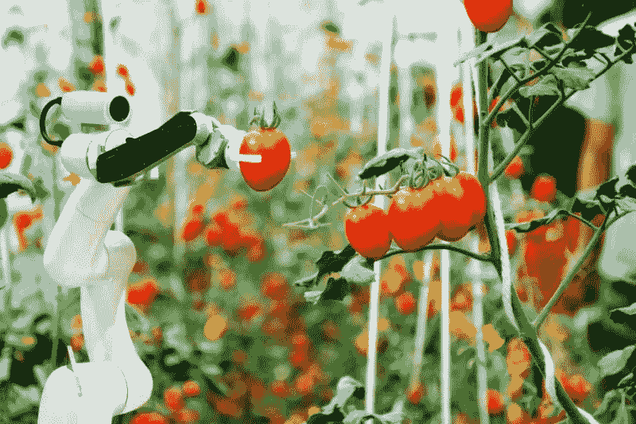

# 全球农业机器人市场将在 2026 年翻两番

> 原文：<https://medium.com/nerd-for-tech/the-global-agricultural-robot-market-will-quadruple-in-2026-d6feba83d74?source=collection_archive---------6----------------------->

来源:机器人-中国网

亚太市场被认为是全球市场中农业机器人市场增速最高的地区。在预测期内，农业部门自动化使用的增加以及政府的有利举措(如补贴)将提振亚太市场。**到 2026 年，亚太农业机器人市场预计年复合增长率为 19.7%，收入将达到 37.983 亿美元。**

根据市场研究公司 Research Dive 的报告，到 2026 年，全球农业机器人市场规模预计将翻两番。

2018 年农业机器人市场规模为 40.828 亿美元，预计到 2026 年将达到 166.404 亿美元。将以 19.2%的年复合增长率增长。

在北美，2018 年收入为 14.698 亿美元，预计年复合增长率为 18.9%。

农业机器人是为农业工作开发的机器人。目前，这些机器人主要用于收割阶段。这些全自动化机器人将推动农业产业的整体发展，降低人类工作强度，减少人类支出和农业劳动时间，提高工作效率。

农业机器人可以执行土壤勘探、杂草控制、植物播种、环境监测、云播种、收获等任务。农业机器人配备了许多工具，可以同时执行多项任务。

## 工业机器人的市场驱动力和制约因素

对食品供应的需求增加、人口增长以及新的“垂直农业”的应用是推动农业机器人市场增长的一些因素。

根据世界卫生组织(世卫组织)的数据，世界人口目前正在加速增长。据预测，到 2050 年，世界人口将达到 97 亿。

与此同时，对粮食供应的需求将显著增加。在机器人的帮助下，农业农场的工作可以更快地完成，农产品的收获和加工过程也可以大大缩短。

**“垂直农业”的概念正在全世界加速实施。**这种耕作模式可以节约灌溉用水，同时最大限度地利用土地，减少农业用地，提高产量。

**农业机器人的高成本被认为是制约其发展的最大因素之一**，**限制了市场的增长**。由于机器人价格昂贵，很多缺乏资金的农民用不起，直接导致市场增长缓慢。除了成本问题，农民对机器人操作的不了解也将成为阻碍市场增长的一大因素。

## 无人机预计将有最高的增长率

农业无人机细分市场预计将在 2026 年占据最大的市场份额。2018 年该板块收入为 4.083 亿美元，预计到 2026 年将达到 17.63 亿美元。

这些机器人有助于提高作物产量，也有助于监测作物生长。它们还可以帮助农民优化农业经营，这将进一步提高土地利用效率。

无人驾驶拖拉机细分市场在 2018 年的估值为 9.39 亿美元，预计到 2026 年将达到 37.143 亿美元。无人驾驶拖拉机可以在没有监督的情况下自动检测其位置和速度，并在执行任务时避开障碍物。许多国家在农田中采用了无人驾驶拖拉机，这有助于他们降低劳动力成本。

## 定制数据集

随着 AI 商业化进程的加快，以及辅助驾驶、客服聊天机器人等 AI 技术在各行各业的应用，人们对特殊场景下的数据质量的期望越来越高。**高质量的标签数据将是人工智能公司的核心竞争力之一。**

如果说之前的算法模型使用的一般数据集是粗粮，那么算法模型目前需要的是定制的营养餐。如果公司想要进一步提高某些模型的商业化，他们必须逐步从通用数据集向前发展，以创建独特的数据集。

# 结束

将你的数据标注任务外包给 [ByteBridge](https://tinyurl.com/43j9u3va) ，你可以更便宜更快的获得高质量的 ML 训练数据集！

*   无需信用卡的免费试用:您可以快速获得样品结果，检查输出，并直接向我们的项目经理反馈。
*   100%人工验证
*   透明和标准定价:[有明确的定价](https://www.bytebridge.io/#/?module=price)(包括人工成本)

为什么不试一试？

资料来源:https://36kr.com/p/1269359597393539