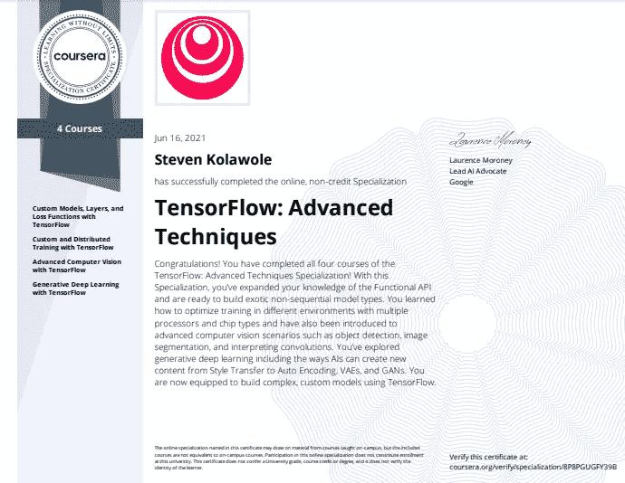

# 好的，不太好的，坏的:完成 tensor flow——高级技术专业后的回顾

> 原文：<https://medium.com/nerd-for-tech/the-good-the-not-so-good-the-bad-my-review-after-completing-the-tensorflow-advanced-534c9528d6b?source=collection_archive---------5----------------------->

大家好！有一段时间了。:)

我刚刚完成 TensorFlow —高级技术专业，我想分享一下我所学到的东西，包括该专业最好和最差的亮点。如果你想从事同样的专业，这可能对你有所启发。

# 专业介绍

Coursera 上的[专业化是一系列相关课程，旨在帮助掌握特定主题。](https://learner.coursera.help/hc/en-us/articles/208280296-Specializations)

这种特殊的专业化专注于扩展学习者在 TensorFlow 上的知识库，足以完成高级任务，包括 ML 研究、自定义模型、对象检测、图像分割、一般敌对网络等。

## 我选择这门课程的动机

我一直在参加[深度学习专业](https://www.coursera.org/specializations/deep-learning)(目前在 CNN 的第四个课程上)，以了解当我利用 TensorFlow APIs 创建模型以及随后的 ML 应用程序时，在引擎盖下发生了什么。我觉得任何体面的 ML 研究员都应该知道这些。

尽管深度学习课程非常有趣，吴恩达教授也是一位优秀的老师，但在某些时候，我厌倦了死记硬背理论，我决定尝试高级张量流技术专业化。由于它利用 TensorFlow 作为深度学习专业化中教授的大多数理论和概念的构建模块，包括编写最先进的研究作品，因此尝试这个系列似乎是一个不错的主意。

## 必备知识

学生应具备:

*   对基本的微积分、代数、统计和核心深度学习概念有一个舒适的理解。
*   深度学习框架的经验。具体来说是张量流。在这方面， [TensorFlow in Practice 专业证书](https://www.coursera.org/professional-certificates/tensorflow-in-practice)值得推荐。

## 4 道菜

该专业包含 4 门课程，分别是:

*   [**用 TensorFlow**](https://www.coursera.org/learn/custom-models-layers-loss-functions-with-tensorflow?specialization=tensorflow-advanced-techniques) 自定义模型、图层和损失函数

专业化的第一个过程需要使用函数式 API 和模型子类化来构建定制的模型架构、层和损失函数。

当需要构建复杂的架构，包括分支模型、多类模型、动态和递归网络等时，顺序 API 是没有用的。这就是利用更高级的 API 的地方。

*   [**用 TensorFlow**](https://www.coursera.org/learn/custom-distributed-training-with-tensorflow?specialization=tensorflow-advanced-techniques) 定制和分布式训练

本课程涉及不同的模块，深入探究张量流的底层方面。我从来没有意识到 TensorFlow 有多强大，直到我体验了所有这些更低级的能力。

该课程描述了 TensorFlow 后端可用于的数学函数，它们是对 Numpy 函数的强烈回忆。还有自定义训练循环的梯度磁带功能，这将在专业化的其余部分发挥巨大作用。本课程还解释了基于 Eager 的代码执行和基于 Graph 的代码执行之间的区别，以及在什么情况下可以相互利用。最后，本文深入研究了使用不同策略的分布式训练，包括 TPUStrategy、GPUMirroredStrategy 等。

*   [**带 TensorFlow 的高级计算机视觉**](https://www.coursera.org/learn/advanced-computer-vision-with-tensorflow?specialization=tensorflow-advanced-techniques)

本课程深入研究高级计算机视觉术语，包括图像定位、目标检测、实例与语义分割等。同时也深入了解其他计算机视觉的主要内容，如 CNN、迁移学习等。

剖析了目标检测的 SOAT 结构，包括 R-CNN 和快速 R-CNN。详细介绍了图像分割的体系结构，包括 U-Net、FCNN 和 Mask-RCNN。实现了用于对象检测(IoU 和骰子分数)的定制损失函数。

最后，还有一个模型可解释性模块，它涵盖了人们如何看到模型如何做出决策以及如何解释输入其中的数据。有实验用不同的方法来解释模型，包括显著图、类激活图和梯度图。

*   [**用 TensorFlow 生成式深度学习**](https://www.coursera.org/learn/generative-deep-learning-with-tensorflow?specialization=tensorflow-advanced-techniques)

最后一门课程着眼于通过深度学习方法生成数据的不同方式，包括风格转移、自动编码器、变分自动编码器(带噪声的自动编码器)和生成对抗网络。

## 我最喜欢的部分

我不能在高级 CV 课程和定制模型、图层和损耗课程之间选择最好的一个。高级计算机视觉课程与我产生了很大的共鸣，这很好地扩大了我的计算机视觉知识的前沿，并看到了我可以利用这些知识的许多方式。你可以看看我根据我所学到的知识制作的尼日利亚手语检测器。我觉得还有更多的要来:)

自定义模型、图层和损失函数课程也很不错。深入研究各种最先进的架构是如何构建的，并自己复制这个过程，这非常酷。我对构建 VGG19、ResNet50、Inception 等架构感到非常兴奋——这些是我自 2019 年以来一直在使用的模型，解构它们并自己构建它们非常有趣，令人大开眼界。

## **我最不喜欢的部分**

这对我来说绝对是生成性深度学习课程——并不是因为课程本身。这只是因为，在目前这个时刻，我对生成性深度学习不感兴趣(至少现在是这样)。

我终于能够压缩我的注意力了(这不是一件容易的事！)进入*“打造 ML 产品，即生产 ML，包括 CV 和 NLP，* ***和*** *在 CV(重点)和 NLP 中做 ML 研究”*关心 GANs 和 likes 对我来说不是现在的书，除非我绝对需要。

但是很高兴通过这门课程，了解各种生成性深度学习方法之间的差异。

## 该系列的精彩特征

*   对我来说，学生的宽松工作空间是一个突出的特点。除了作为一个与其他学生交流的平台，就所教授的概念交换想法，当陷入最佳解决方案的过程中时，从导师和学生那里获得帮助和指导也很棒。各个部分和频道也精心而优雅地组织起来。
*   劳伦斯·莫罗尼是个很棒的教练。他的解释精彩、简洁、直截了当。如果没有他优雅的解释，我怀疑理解所有陈述的研究论文是否会如此容易。
*   作业实验室很有挑战性，但也不太有挑战性(我们有宽松的工作空间，以便在遇到困难时获得帮助)。听说 TensorFlow 在实践专业证书这方面乏善可陈。此外，导师也在不断更新实验室，他们对查询的反应也相当快。

## 这个系列不太好的特点

*   分配给作业实验室的时间，真的！使用 Functional API 创建 VGG 模型的实验室被分配了 3 个小时，我花了一个小时才完成。僵尸检测的物体检测实验室被分配了 1 个小时，我花了整整 5 个小时才完成。这有点烦人:(
*   未分级的实验室只是“运行细胞”而已。我觉得这对学生来说太简单了。我自己通过创建新的笔记本来弥补这个缺陷，并尝试在之后自己编写代码。

## 专业化的总体评估

我没有真正完成很多课程。尽管我涉猎了相当多的课程(在 Coursera 上和在 Coursera 之外)，但我从来不觉得有义务去完成它们。一旦我得到了我需要的东西，或者材料没有吸引力，或者课程/专业变得越来越不相关或结构不良(让我想起 IBM 人工智能工程专业)，我就会和课程/专业说再见。

这个特殊的专业让我着迷到最后的事实证明了它的神奇。我很容易给它打 4.5 分(满分 5 分)。

## 我的下一步是什么？

深度学习专业化应该用我开始 ML 研究所需的所有理论来武装我。我会回去完成剩下的两门我还没有完成的课程。

我已经开始阅读研究论文了，它们让人非常不舒服。我希望能更好地阅读论文，直到它变得直观，我会开始写自己的论文。

我还计划开发几个 ML 应用程序。高级计算机视觉课程在我心中播下了几个令人敬畏的计算机视觉项目想法的种子，我打算致力于其中的几个。我目前正在使用对象检测创建一个尼日利亚手语检测器，同时还将结果通过文本到语音合成来生成通过手语交流的人类语音。

## 最后…

如果你正计划参加专业化，或者如果你正考虑拓宽和深化你的深度学习和/或张量流知识，我希望你发现这本书是有帮助的。谢谢你读到这里。

请随意在推特和 T2 的 LinkedIn 上和我打招呼。