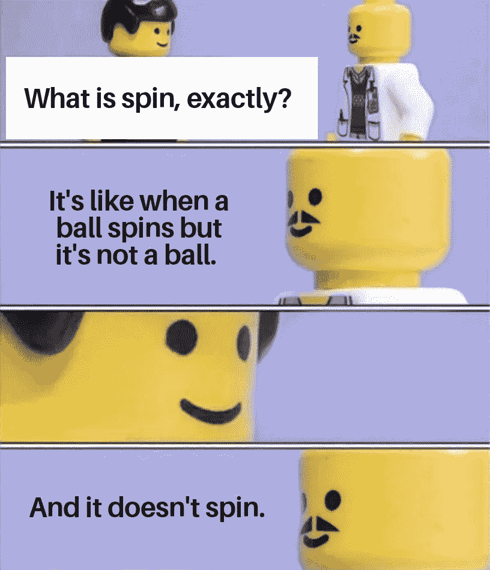
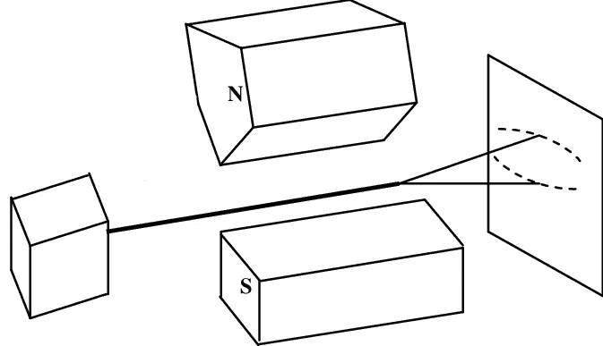

# 自旋到底是什么？

> 原文：<https://medium.com/nerd-for-tech/the-heck-is-spin-af704ad6447c?source=collection_archive---------17----------------------->

不幸的是，就像电流从正方向流向负方向，电池两端之间的电势被称为电动势一样，由于历史原因，我们一直被“自旋”这个名称所困扰。

为了理解这个星球上一些最聪明的头脑在命名事物时的怪癖，我们应该理解自旋是什么以及它是如何被发现的。

经典力学认为，每当带电粒子运动时，都会产生磁场。当你让一个带电粒子做圆周运动时，它会产生一个磁场，这个磁场看起来和条形磁铁产生的磁场一样。因为这是在量子力学之前就已经知道的东西，所以它包含在量子力学的所有方程中。然而，后来的一些实验表明，带电粒子一定有其他的磁源(除了它们运动时产生的磁场之外)。这种磁力来源被称为自旋。

斯特恩-格拉赫装置

证明这一点的实验之一是 Stern-Gerlach 实验。如果你在 Stern-Gerlach 仪器中放置一个小的条形磁铁，那么它会告诉你磁铁的方向(只在设置的方向)。它通过在磁铁最指向的方向上施加一个力来做到这一点。在某些方向上，磁铁根本不会受到任何力的作用。因此，如果我们随机放置一堆磁铁，我们希望看到它们以相当平稳的分布通过仪器:一些会上升，一些会下降，一些不会移动，另一些只会移动一半的距离。如果我们扔掉磁铁，把电子(不做任何循环)扔进仪器，会发生一些非常奇怪的事情。不仅所有的电子都受到一个力的作用，而且这种作用不是平稳的。一半往上走，一半往下走。如果电子真的是微小的磁铁，那么它们应该在空间中随机取向，而这些电子显然不是。

Stern-Gerlach 仪器可以用来测量物体在任何方向上的“磁性”。如果我们把仪器转到一边，那么机器就会测量出磁铁在空间中指向左/右的方向。但是对电子这样做，我们得到完全相同的结果，那就是:一半电子向左，一半向右。

哦，这里发生了什么事？电子不是在做小循环，但它们的行为好像是在做小循环。发现这一思想的人认为，也许电子是绕着自己的轴旋转的，就像地球绕着自己的轴旋转一样。这应该是可行的，因为电子上的电荷会做圆周运动并产生磁场。因此这个性质被称为自旋。但是，后来的计算表明，电子必须以超过光速的速度旋转，才能获得我们观察到的那种磁性。但是，这显然不可能发生。所以电子显然没有在旋转。如今，当我们不把电子当作波来讨论时，我们把它们当作无限小的点来讨论，而那些点肯定不能旋转。

你会问，什么是旋转？自旋是粒子的属性，使它们像磁铁一样，它与粒子实际自旋无关。不多不少。试图向蚂蚁解释如何使用电饭锅，你可能会比寻找一个精确的旋转的经典类比更幸运，因为它根本不存在。