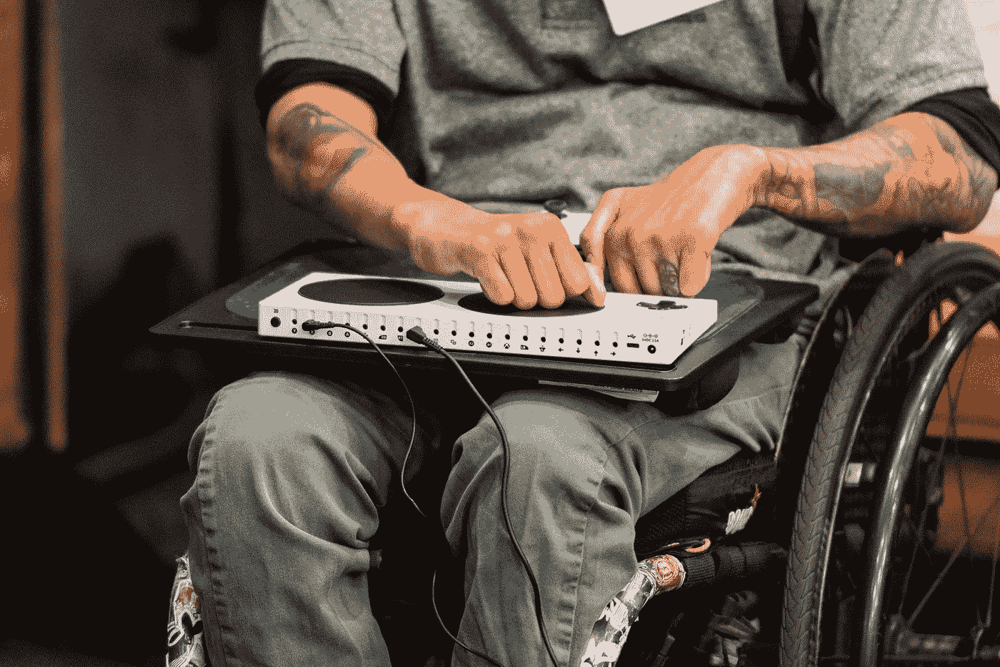
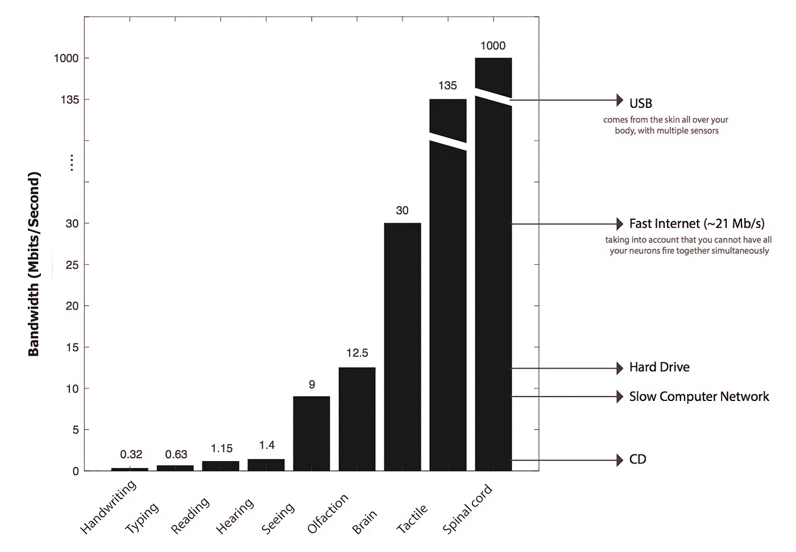
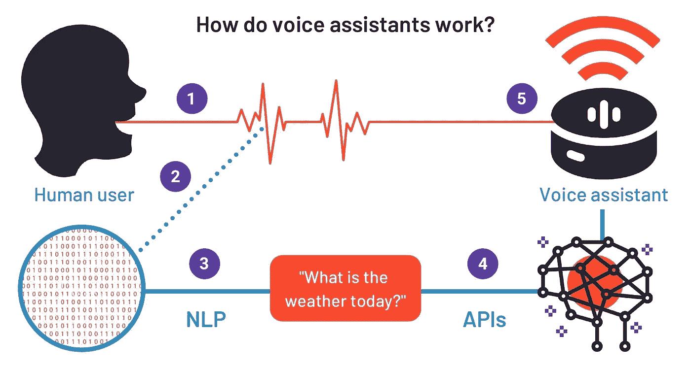

# 脑机接口对万维网的影响

> 原文：<https://medium.com/nerd-for-tech/the-influence-of-brain-computer-interfaces-on-the-world-wide-web-f93a329816cd?source=collection_archive---------12----------------------->

神经技术正在改变人类生活的方方面面。作为一名好奇的主要从事网络技术的软件工程师，我质疑这个令人兴奋的新技术领域的发展会如何改变我们使用万维网的方式。

本文讨论了脑-机接口进步的可访问性方面，以及当直接的脑-脑通信成为现实时，作为信息媒介的万维网的日益增加的复杂性如何可能彻底改变它的形状。

图 1:思想者雕像的小版本(Unsplash，2021)。

# **1。简介**

2017 年，博客 Wait But Why 发表了关于埃隆·马斯克当时新成立的公司 Neuralink 的首批文章之一。博客背后的人蒂姆·厄本(Tim Urban)与几位 Neuralink 团队成员谈论了这家初创公司的动机，并通过各种思想实验解释了对人类的潜在影响。他澄清和评估这个令人兴奋的新技术领域背后的更大图景的方式提供了一个鼓舞人心和令人信服的前景，这是我有一天进入神经技术行业的主要动力。

然而，在这篇文章中，我想结合蒂姆当时的想法(其中大部分仍然相关)来分享的是，我试图回答以下问题:就可访问性而言，脑机接口可能对万维网的使用产生什么影响？

> “我确信……[neural ink]设法在工程事业的大胆性和任务的宏伟性方面超越了特斯拉和 SpaceX。另外两家公司旨在重新定义未来人类将会做什么——neural ink 希望重新定义未来人类将会是什么样子。”—蒂姆·厄本，2017 年

# **2。网络无障碍的重要性**

图 2:坐在轮椅上的人，带着微软无障碍控制器(Fleming，2019)。

想象一下，如果你不得不忍受新冠肺炎的封锁而无法访问万维网。你会如何与你的家人和朋友沟通？你会如何让自己保持消息灵通？根据你的职业，你会怎样做好你的工作呢？对于一些人，甚至整个行业来说，万维网是他们生存的支柱，从谷歌搜索简单的问题到最关键的任务。疫情已经显示了进入万维网是多么的重要。现在，想象一下，世界上有数百万人因为基因缺陷或长期受伤而无法使用电脑，他们是其中之一(世界银行，2021 年)。

例如，如果你是盲人、聋人或截瘫患者，访问万维网是有限的，有时甚至是不可能的。包容性网站的定义决定了其背后所需的工作量，以确保其内容和功能的最佳可访问性。网页可访问性有益于个人、企业和社会。它甚至可以帮助你的网站在搜索引擎中获得更高的网页排名，从而吸引更多的有机访问者。有许多最佳实践可以让你在视觉上和技术上优化你的网站，使它更容易被诸如屏幕阅读器或替代输入设备等辅助技术使用。

有些人甚至走得更远，以可访问性第一的心态创建网站，以尽可能具有包容性。但这是我看到一个问题的地方:听起来可能很奇怪，我们为设备和技术创建网站，而不是为想要使用它们的人。我在移动优先或搜索引擎优化优先的方法中看到了同样的问题；它更多的是关于设备或爬虫机器人，而不是人们的实际利益。例如，如果你曾经目睹过文案为搜索引擎创作文本，你就会知道他们实际上是为搜索引擎算法而写，而不是为阅读它们的人而写。大多数现代网页设计和开发方法——就像网页可访问性一样——主要服务于中间商，而不是直接服务于最终用户。

# **3。环球网作为中间人**

> “当两个人在一起交谈时，他们使用的是 50000 年前的技术。”—蒂姆·厄本，2017 年

在《等待，但为什么》这篇博客文章中，Tim Urban 描述了我们如何使用古老的技术与他人交流:自然语言。自然语言大约在 50，000-100，000 年前进化而来(Evans，2015)，并且仍然是我们今天使用的主要通信技术。一些改编和抽象带来了一些优势，例如，书写，这使得与另一个人异步交流成为可能——不受时间和地点的限制。

在生物进化史上，第一次不需要遗传学就可以将信息传递给下一代。然后是印刷，然后是电报、传真、电子邮件、短信等等。今天，我们有了万维网，它整合了大量相同基本概念的细粒度变体:自然语言，以任何多媒体形式打包，随时异步可用，只需点击几下鼠标。你可以和某人聊天，给他们发一封电子邮件，写一篇博客，或者录制一段视频并上传到 YouTube，让数百万人一窥你的想法。万维网，像其他媒介一样，充当着沟通的中间人:从一个人到另一个人。或者用蒂姆·厄本的话来解释埃隆·马斯克的思想:从大脑到大脑。

# **4。比烟雾信号更糟糕**

图 3 以简化的形式展示了如果我们牢记“脑对脑中间人”的概念，自然语言(即使是在面对面的对话中)是如何分解成其基本构件的:

图 3:沟通分解到其基本构件(截图，Urban，2017)。

在上面的图像中，我们可以看到空气或电信网络作为媒介来展示从一个大脑向另一个大脑发送信息所需的步骤。在蒂姆的文章中，他还描述了一条信息到达另一个大脑所需的时间，无论是通过敲击键盘还是打电话给某人。但我想说的不仅仅是将信息从一个大脑发送到另一个大脑所需的时间，而是创建和协调这些中间人所需的时间和复杂性。

在我看来，万维网是最低效的中间人之一，甚至比制造烟雾信号还要糟糕。创建一个现代网站所需的复杂程度——具有良好的可访问性、高安全性、快速等。—是荒谬的。一个网站变得越高级，它需要的功能越多，抽象的层次就越多。我过去几年的个人经验表明，这种发展趋势的方向似乎没有尽头。我有时怀疑，当人们只想在网站上交换信息时，这些用 TypeScript 编写的用于增量静态服务器端呈现的 NextJS 应用程序的花哨的代码生成的 GraphQL 查询是否还有必要。如果我们试图用今天的万维网标准来包括所有用来传递脑对脑信息的技术，我将需要用至少 20 张图来扩展蒂姆·厄本的可视化。

上面提到的现代 web 设计和开发方法只是为了技术而引入了更多的复杂性，而不是主要为了人类的使用而优化。如果我们考虑到所有需要考虑的因素，这听起来是合理的，但对我来说，似乎我们只是专注于解决药物治疗引起的问题，而不是试图治疗疾病本身。我们创建的抽象越多，我们就越关注这些抽象本身，而不是潜在的目标。但这正是脑机接口发挥作用的地方。

# **5。省去中间人**

脑-机接口——或者更具体地说，脑-脑直接通信领域——专注于消除这些中间人，而不是让信息对计算机来说是可理解的，然后试图让它对屏幕另一边的人来说是可理解的或容易访问的。

图 4:带宽图，对比了神经连接与其他技术的速度(截图，Urban，2017)。

脑-机接口和直接的脑-脑交流对残障人士来说尤其有趣。那些不能说话或听不见的人会很高兴能够不需要他们的声带或耳朵而直接与人交流。如果你不需要使用键盘、浏览器、网站，只是以文本的形式与某人交流，而是可以通过脑机接口直接与他们分享想法，我们将大幅消除中间的许多技术不必要的东西，并更加关注沟通的质量和包容性。

但是这对万维网意味着什么呢？如果直接的脑对脑交流成为现实，我们还会在不久的将来创建网站吗？

# **6。人类的互联网**

脑对脑直接交流的想法目前仍是科幻小说，但它有可能在未来几十年成为现实。当然，我们无法预测未来 50 年的细节，就像 20 世纪 70 年代的人们几乎没有机会预测当前形式的万维网一样。然而，如果我们把万维网及其网站看作是大脑之间异步信息交换的中间人，我们肯定知道，如果它在 2D 显示器上显示内容的主要目的停止，它的形状将发生巨大变化。

考虑到目前神经技术领域的进展速度，这些牵强的概念之一是人类互联网的概念。我相信你对“物联网”这个术语很熟悉，它本质上描述了日常事物的高度连接性，特别是在家里，这些事物通常不会以基本形式连接到互联网。人类互联网的概念描述了几乎相同的东西，只是它是人体本身之间直接连接的概念，特别是从包括大脑连接的角度来看(齐格勒，2021)。

引用谷歌前首席执行官埃里克·施密特(Eric Schmidt)在回答关于他如何看待互联网未来的问题时的话:“我会非常简单地回答，互联网将会消失”(史密斯，未注明日期)。埃里克·施密特是这样一个人，他相信几乎所有的东西有一天都会连接起来，所有的东西都会无缝地协同工作。这已经成为现实。由于谷歌语音助手的互联性，我可以通过与语音助手交谈来简单地控制我公寓的恒温器和灯。

但现在想象一下，不是所有的东西，而是每个人都将彼此直接相连，拥有他们需要的所有信息和控制。信息将不仅仅是一次点击，而是一个想法，而且是同时进行的，根本不需要网站或用户界面。

# **7。就像聊天机器人**

图 5:语音助手如何工作的概念性概述(截图，Pickell，2019)。

如果你曾经创建过聊天机器人应用程序，或者至少为它设计过对话流和树状状态机逻辑，你就知道你必须经历怎样的思维转变才能重新思考我们与计算机交互的方式。下面的问题可以进一步说明这一点:你是否曾经在脑海中想象过一次对话，并思考过对话可能带来的问题和方向？然后，你已经创建了一个非线性的自然语言信息流，就像你创建聊天机器人一样——以一种更技术性的方式。与传统的用户界面相比，聊天机器人是一种完全不同的方法，只使用自然语言为软件或平台创建 API。

# **8。不需要用户界面**

我们已经与聊天机器人或语音助手交流的方式是我想象的未来万维网上两个大脑之间的交流方式。未来的网站将是一个无 UI、基于自然语言的应用编程接口；互动、直观、智能。

你想用谷歌搜索一些东西，你的脑机接口会把你连接到 google.com，搜索你的查询，并返回你大脑中最相关的条目。不用像今天标准的语音助手那样大声朗读，你实际上不必先读就能在脑子里得到一个概述；你只是看到你头脑中的信息，并能直接理解它。

万维网的使用将只是一个想法，在浏览器中网页的经典使用可能会像 2021 年打印网页的印刷媒体查询类型一样过时和怀旧；仍然在这里，但不再相关。

# **9。结论**

为了缩小网页可访问性的差距，让我介绍另一个场景:当有创新时——比如最新的小工具——它通常不是为残疾人设计的；对可访问性的担忧是后来才出现的。即使在万维网发明的时候，也是过了几年才开始实施网络内容可访问性指南(万维网联盟，1997 年)。新车、电脑和几乎所有其他东西也是如此。但这一次，有了脑-机接口和直接的脑-脑通信，我们首先关注可访问性方面，因为这一次我们必须这样做；这是唯一的办法。除了可达性本身没有其他中间人，因为连接性和大脑与计算机结合的功能性使用以其基本形式代表了纯粹的可达性。

就我个人而言，我认为这是正确的方向，它再次表明神经技术领域是人类进化的全新篇章。引用 Kernel 首席执行官 Bryan Johnson 的话:“我们即将进入人类历史上最重大的革命，在这场革命中，我们可以控制我们的认知进化”(Gaby and Southern，2020)。人类的互联网将成为其中不可或缺的一部分——采用可访问性优先的方法，而不是可访问性最后的方法。

图 6:蒂姆·厄本(Tim Urban)表示，我们目前正处于脑对脑直接交流时代的边缘(截图，厄本，2017)。

在“等待，但为什么”的博文中，Tim Urban 很好地展示了这一旅程的发展现状。我们正处于间接大脑交流(由于万维网和其他不受时间和地点影响的媒介，彼此异步交流的可能性)和大脑直接交流时代的边缘。以我的背景，尤其是网络开发方面的背景，很难接受当前形式的万维网会在未来几年过时。

万维网只是迈向直接脑对脑交流时代的又一小步。我不知道你，但我只能鼓励你对即将到来的阶段感到兴奋。我邀请你参与这场文化进化，因为这是为了人类更好，包括每个人。

# **参考书目**

神经权利倡议(未标明)，"挑战:神经技术的进步超过了治理"*纽约市哥伦比亚大学*【在线】https://nri.ntc.columbia.edu[(2021 年 7 月 8 日访问)](https://nri.ntc.columbia.edu)

Evans，V. (2015)“语言有多古老？”*今日心理学*【在线】可在[https://www . psychologytoday . com/us/blog/language-in-the-mind/2015 02/how-old-is-language](https://www.psychologytoday.com/us/blog/language-in-the-mind/201502/how-old-is-language)(2021 年 7 月 7 日访问)

Fleming，S. (2019)“技术正在改变残疾人体验世界的 5 种方式”*微软公司-关于这些问题*[在线]可在[https://news . Microsoft . com/On-the-Issues/2019/05/14/inclusive-technology-changing-people-disabilities-experience-world](https://news.microsoft.com/on-the-issues/2019/05/14/inclusive-technology-changing-people-with-disabilities-experience-world)(2021 年 7 月 3 日访问)

Gaby，e .和 Southern，T. (2020)《我是人类》 *1091 媒体*【影片】可在[https://vimeo.com/ondemand/iamhuman1091](https://vimeo.com/ondemand/iamhuman1091)获得(2021 年 6 月 6 日获得)

Ienca，m .和 Andorno，R. (2017 年)"走向神经科学和神经技术时代的新人权"*生命科学、社会和政策*DOI:10.1186/s 40504–017–0050–1

Pickell，D. (2019)“什么是语音助手，它们是聊天机器人的未来吗？” *G2* 【在线】可在[https://www.g2.com/articles/voice-assistant](https://www.g2.com/articles/voice-assistant)(2021 年 7 月 6 日访问)

史密斯博士(未注明日期)，"互联网将会消失"*商业内幕*【在线】见[https://www . Business Insider . com/Google-chief-Eric-Schmidt-The-Internet-Will-away-2015-1](https://www.businessinsider.com/google-chief-eric-schmidt-the-internet-will-disappear-2015-1)(2021 年 7 月 5 日访问)

世界银行(2021 年)“残疾包容概览”*世界银行网站*可在[https://www.worldbank.org/en/topic/disability](https://www.worldbank.org/en/topic/disability)查阅(2021 年 7 月 6 日查阅)

t . urban(2017)“neural ink 和大脑的神奇未来”*等待，但为什么博客*【在线】可在[https://waitbutwhy.com/2017/04/neuralink.html](https://waitbutwhy.com/2017/04/neuralink.html)获得(2021 年 7 月 7 日访问)

万维网联盟(1997 年)“W3C 启动 WAI 国际计划办公室” *W3C 新闻稿*【在线】可在[https://www.w3.org/Press/IPO-announce](https://www.w3.org/Press/IPO-announce)查阅(2021 年 7 月 8 日查阅)

Ziegler，K.-C. (2021)“人类的互联网(IoH)”*数字商务— Die Post* 【在线】可在[https://Digital-Commerce . Post . ch/en/pages/blog/2021/Internet-of-human](https://digital-commerce.post.ch/en/pages/blog/2021/internet-of-humans)查阅(2021 年 7 月 7 日查阅)

# **附录**

亲爱的读者，我希望你喜欢这篇文章。如果你没有读过这篇文章的原始博文，我强烈建议你读完之后再看。由于我在我的文章中只是触及了一些表面，所以你将在 Tim 的博客文章中对 Neuralink、神经技术行业和大脑本身有更深入的了解。由于他在博客的结尾对这些发展表示了担忧，我也想谈谈这些问题。意识到这一点很好，在这种情况下，技术的进步正向我们走来；我们的大脑。我们的全部意识都在我们的大脑中，我们也必须自己处理后果。

关于脑机接口的使用，有许多关于操纵、隐私保护和神经黑客的担忧(Ienca 和 Andorno，2017)。纽约市的哥伦比亚大学启动了一项名为神经权利(NeuroRights)的计划，试图让人类为先进的脑机接口做好准备。我推荐看一看他们的网站:[https://nri.ntc.columbia.edu](https://nri.ntc.columbia.edu)。

> “当 1948 年通过《世界人权宣言》时，神经技术和人工智能的未来挑战几乎无法想象。因此，人权文件中没有处理技术创新带来的新风险的条款。随着神经技术的出现，曾经被视为理所当然的权利，如精神隐私或认知自主权，已经岌岌可危。”神经权利倡议