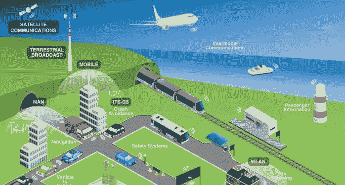
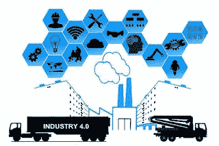

# 交通运输中的物联网

> 原文：<https://medium.com/nerd-for-tech/the-internet-of-things-in-transportation-4402ef011ced?source=collection_archive---------3----------------------->

# 介绍

在过去的许多年里，交通领域的物联网已经变得非常复杂。它们是用计算机和昂贵的技术嵌入的，这不仅有助于驾驶，也有助于维护。目前，汽车通过空中传输将活跃的数据传回经销商，让他们知道什么时候需要修理或更新。

如今，某些汽车通过无线方式获得空中电脑更新；因此，经营者不再需要安排与经销商的维修预约。物联网(IoT)通过深刻改变运输系统收集数据和信息的方式，已经进入了运输行业。

[物联网通过使用嵌入式传感器、致动器和其他设备来实现物理对象的联网，这些设备可以收集和传输关于网络中实时行为的信息](https://www.technologiesinindustry4.com/2020/11/internet-of-things-what-is.html)。从这些设备收集的数据随后可由运输专家进行分析，以:

*   发展旅行者体验，
*   提高安全性，
*   减少拥挤和能源消耗，
*   提高运营绩效，

# 描述

物联网传感器适用于运输卡车行业的动态部分，允许卡车联合行驶时的排队能力。通过自动化的高速公路系统，道路的通行能力必然会大大提高。它通过电子设备缩短汽车或卡车之间的距离。

物联网网络和设备同样有助于监控货物温度、方向和速度，以提高燃油效率。这不仅有助于卡车运输业，也同样有助于消费者和零售企业，在这些企业中，包裹以更及时的方式和更低廉的成本运送。

通过车联网能力，交通流量不仅变得无害，而且变得有条不紊。通过在我们的高速公路和道路上增加物联网传感器和摄像头的数量来收集交通信息，这些数据将有助于减轻交通负担，并在拥挤点出现之前预测它们。许多汽车制造商此前与合作伙伴合作，将物联网平台引入云，以支持将汽车连接到物联网网络。

# 物联网在交通领域的发展

物联网解决方案承诺让运输组织在准备工作中变得更聪明、更有成效。物联网是部队重新设计交通的关键，以提供更好的安全性、更便捷的旅行、增强的车辆和飞机维护以及新的战略交通管理。运输物联网示例包括:

超高效、廉价的公共交通，服务于传感器网络、普通摄像机和通信系统，以提高系统容量，改善乘客安全和舒适，同时降低成本和风险。智能交通系统的主动式路边信息符号。这些标志显示传感器和摄像头例行传递的实时道路状况、收费率、车道终点和行驶时间。
独立车辆能够感知周围环境，预测行为，与其他车辆及其周围环境连接，并对现实生活中的高速公路情况做出快速反应。
视频检查解决方案，其特点是在安全的机场和火车站安装高分辨率闭路电视摄像机，反复监控护照控制关卡以及人员和人群的流动。[智能视频检查软件有助于及早发现可疑行为和失控行李。](https://www.technologiesinindustry4.com/2020/11/internet-of-things-what-is.html)

# 物联网给交通带来的好处

与交通行业使用物联网技术相关的许多更广泛的好处包括:

**改善客户体验**

*   物联网技术支持通过更精确、更知情的实时数据为客户提供服务，从而更好地规划行程和促进沟通。

**更好的安全性**

*   使用物联网技术跟踪列车速度、飞机部件状况、道路温度和连接车辆数量等信息的能力，可能有助于恢复全球交通系统的安全性。

**操作显示**

*   接受物联网技术的运输机构现在开始在运营法规方面受益。城市可以很好地监控关键设置并开发组织良好的流程，以降低运营成本并增加系统容量。

**环境发展**

*   通过很好地监控拥挤，物联网系统可以对发展中的交通模式和实时数据做出快速反应，以帮助人们更好地规划他们的旅行。减少聚众闹事和能源使用对环境有积极的影响。

# 物联网技术在交通领域的应用

物联网在交通领域最常见的应用有:

**交管局**

当它起源于物联网技术的接受时，道路是交通运输中最大的部分。随着我们朝着 2023 年的方向前进，这是可以预测的。在内陆城市，可以从闭路电视中收集数据，闭路电视将车辆相关数据传送到交通管理中心。使用物联网技术的应用包括:

*   智能停车
*   红绿灯
*   智能事故援助

**收费和售票**

直接收费系统正迅速变得无效。由于道路上的车辆激增，收费亭的人龙已成为公众视线，更不用说在繁忙的公路上操作收费亭所需的人手了。尽管带有 RFID 标签的自动收费系统提高了交通流量的质量，但物联网技术的使用也使其他发展成为可能。

当今的许多现代车辆都配备了物联网连接。一辆车可能在一公里之外被注意到，而不是在一个收费站，这个收费站是众所周知的，并且栅栏被升起以供车辆通过。另一方面，对于较老的车辆，上市的智能手机可以提供类似的驱动，吸引人的自动支付从连接到手机的数字钱包。

**联动车**

现在的汽车信任连接性，这主要是因为现在有几款新车配备了互联网连接、传感器和执行器。[他们都在监控广泛的应用，从刹车和发动机到轮胎压力和废气排放控制。](https://www.technologiesinindustry4.com/2020/11/internet-of-things-what-is.html)

有一天，联网汽车将使用车载网络、雷达和摄像头来支持一种感觉并相互连接，阻止碰撞并帮助支持顺畅的交通流。

**车辆追踪系统**

车辆跟踪系统主要用于货运部门，帮助公司成功管理车队。它们同样有助于监控驾驶员的行为，并可能汇集有关怠速时间和驾驶风格的数据。物联网支持的功能包括:

**行程准备**

*   车队追踪
*   驾驶时间和驾驶员休息时间规划
*   超速、急转弯、加速或刹车警告
*   检查车辆负载
*   行驶距离和油耗

**公共交通组织**

NEC 运营的一个主要部分是智能交通，重点是公共交通部门。物联网技术现已在这一领域得到广泛应用。我们的解决方案包括组合售票和自动售检票、乘客信息和信息显示系统，以及先进的车辆物流解决方案。这些都是利用物联网技术来帮助解决社会和经济问题，例如公共交通中的交通拥挤。

面向互联公共交通系统的物联网技术具有以下优势:

实际车辆跟踪-这支持公共交通机构与客户沟通，并通过移动设备提供准确的到达时间，乘客信息显示在公交车站和车站
数据检查和实际管理-该技术允许公交机构实时观察进度，并针对意外事件(例如事故、道路施工、紧急情况等)做出改变。，有助于重新安排路线并提高旅行效率
修改旅行信息—交通机构可以跟踪和显示旅行者的行为和旅行设计，并将重要变更(例如延期、车站终止或重新安排路线)的初始信息直接发送到他们的智能手机。

更多详情请访问:[https://www . technologiesinindustry 4 . com/2021/07/the-internet-of-things-in-transportation . html](https://www.technologiesinindustry4.com/2021/07/the-internet-of-things-in-transportation.html)