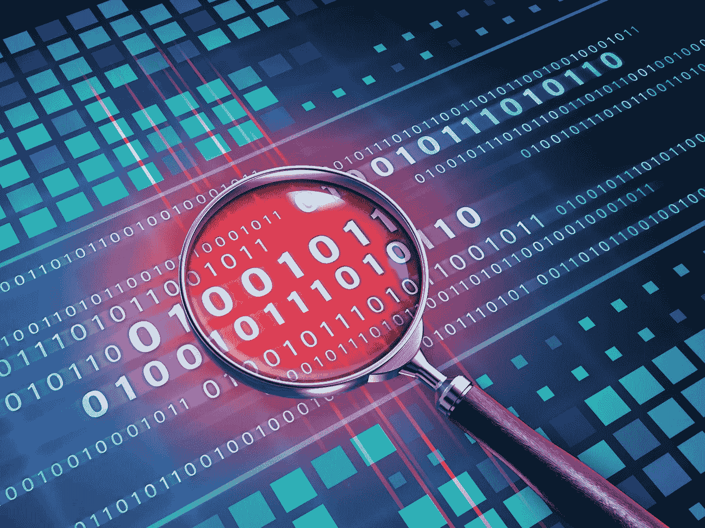

# 发现并修复软件漏洞的关键？合作

> 原文：<https://medium.com/nerd-for-tech/the-key-to-finding-and-fixing-software-vulnerabilities-cooperation-ac3d8eb6fcac?source=collection_archive---------2----------------------->

人类并不完美。而且既然人类写软件代码，那也不是完美的。这意味着，鉴于软件正在[【吞噬世界】](https://www.wsj.com/articles/SB10001424053111903480904576512250915629460)有一场无休止的猫捉老鼠游戏，在试图利用软件漏洞的网络罪犯和试图保护软件免受攻击的人之间展开较量。

对于软件维护者来说，最大限度地减少应用程序、网络和系统缺陷的最好方法是在软件开发过程中，在软件中建立安全的[。](https://www.bsimm.com/?cmp=pr-sig&utm_medium=referral)

但是一旦软件投入使用，目标就是在犯罪分子发现并利用它们之前，找到并修复不可避免的剩余缺陷。虽然标题可能暗示捍卫者很少成功，但很多时候他们成功了——尤其是当伦理研究者与构建和使用软件的公司联手时。最近， [Synopsys 网络安全研究中心](https://www.synopsys.com/software-integrity/cybersecurity-research-center.html?cmp=pr-sig&utm_medium=referral) (CyRC)的研究人员宣布了与开源基础设施监控公司 Nagios 的成功“查找并修复”操作，这一合作得到了展示。

CyRC 研究人员在 5 月份私下向该公司通报了 Nagios XI 的三个漏洞，这是一个 web 应用程序，用于监控关键任务企业基础架构组件，包括应用程序、服务、操作系统、网络协议、系统指标和网络基础架构。

CyRC 的安全工程师斯科特·托利(Scott Tolley)说，Nagios 在 7 月 15 日、6 月 10 日和 9 月 2 日发布了补丁，对通知“反应非常积极”。“他们给了我们很好的补充信息，帮助我验证他们实施的修复措施。这是整个过程的重要组成部分，”他说。

是什么把他吸引到纳吉奥斯？他说，他在一个黑客公共广播技术播客上听说了这家公司，“这让我思考，因为网络监控/管理软件显然是如此特权，以至于它是攻击者的一个有吸引力的目标。”

事实上，如果攻击者能够控制监控软件，他们就能获得网络上任何地方的“钥匙”。“几乎从定义上来说，它可以广泛访问网络和终端，”Tolley 说。

此外，他还对测试最新版本的 [Seeker](https://www.synopsys.com/software-integrity/security-testing/interactive-application-security-testing.html?cmp=pr-sig&utm_medium=referral) 的功能感兴趣，这是一款 Synopsys 自动化交互式应用程序安全测试工具，旨在跟上基于容器的应用程序的软件开发速度的指数增长。他说，CyRC 和 Nagios 这样的公司都从中受益。

**双赢**

“做这种研究是双赢的，”他说，“因为它帮助我们看到这个工具有多有效。然后，当然，供应商可以在发布(漏洞)之前修复他们软件中的问题。”

这三个缺陷都是所谓的“后认证”，这意味着黑客必须进入网络——也许是通过用网络钓鱼攻击欺骗一个粗心的员工——才能利用它们。这些缺陷由 MITRE 公司的 [CVE 项目](https://cve.mitre.org/)进行编号，该项目对公开披露的网络安全漏洞进行识别、定义和分类。

其中包括 SQL 注入(CVE-2021–33177)，NagVis 报告系统中的路径遍历漏洞(CVE-2021–33178)，以及核心配置管理器中的跨站点脚本错误(CVE-2021–33179)。

根据[通用漏洞评分系统](https://www.first.org/cvss/) (CVSS)，这三种漏洞的严重性都被评为中到低，考虑到攻击者可能滥用这些漏洞的特权，这看起来可能有点奇怪。但托利说，这是因为排名更侧重于技术层面，而这些“本身并不是零互动的现成漏洞，这是你以高影响力的发现为目标的那种东西。”

他称这个排名是“一个有趣的、边缘性的哲学问题”他说他同意 CVSS 的观点，因为攻击者在进行任何破坏之前都必须获得认证。

“但你肯定想修复所有这些漏洞，因为该系统价值如此之高，”他说。

“我认为考虑这个问题的正确方式是，CVSS 发布漏洞的技术评级，但你必须在自己的环境背景下评估实际影响。真正的影响取决于您在哪里部署 Nagios。如果它在监控核电站的网络，那么你对任何事情的容忍度都可能会降低。”

没有什么是完美的

任何成功的查找和修复都应该有一个重要的警告:这并不意味着软件现在是完美的。事实上，纳吉奥斯·Xi 已经修复了几十个漏洞，这意味着未来肯定会发现更多的漏洞。

根据其网站，Nagios Xi 5.8 版本有 [23 个已识别的漏洞](https://www.nagios.com/products/security/)。今年四月， [Port Swigger 报告](https://portswigger.net/daily-swig/vulnerability-in-nagios-xi-exploited-by-cryptojacking-crooks-to-hijack-systems)称“不法分子正在利用一个新发现的漏洞”在早期版本(5.7.5)的 Nagios XI 中运行加密挖掘恶意软件。"

五月份 [Skylight Cyber 报道](https://skylightcyber.com/2021/05/20/13-nagios-vulnerabilities-7-will-shock-you/),其研究人员仅用了一天时间就发现了 Nagios XI 和 Nagios 融合服务器中的 13 个漏洞，包括“我们用来控制整个 Nagios 部署的 5 个漏洞”

这并不意味着 Nagios 软件比其他组织的更好或更差。不过，它更加透明，因为它的大部分代码都是开源的，任何人都可以免费访问。

托利还指出，Nagios XI 是“功能丰富的软件，已经存在很长时间了，有很多功能、插件和客户。如果你有很多软件，就会有漏洞，其中一些会成为安全漏洞。”

他说，最重要的一点是，这是一个例子，说明伦理研究人员和开发和/或使用软件的组织如何能够合作，使软件更加安全。这就是“负责任的披露”应该如何运作。

“你真的有两种选择，”他说。让你的软件尽可能靠近你的胸部，并停止研究人员评估它或保持开放。Nagios 的核心是开源的，你可以下载 Nagios XI 的试用版，我就是这么做的。然后与研究人员合作，尽快披露并修复不可避免的安全问题。"

“据我所知，Nagios 似乎更接近后者。这对全世界的软件消费者，也就是我们所有人的利益来说绝对是正确的行为，应该受到鼓励，”他说。