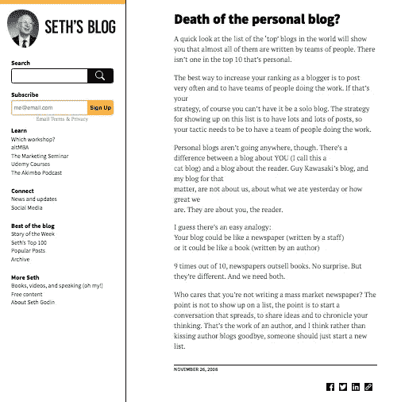

# 下一个博客

> 原文：<https://medium.com/nerd-for-tech/the-next-blogs-4ef123ebca2a?source=collection_archive---------23----------------------->

下一个写了很多博客文章的博主

# 下一个博客

过去的博客和个人博客是接下来的事情，就像我现在写的这种类型，右边有这个截图，我甚至不区分左右，我只是把鼠标指向这个 Seth 的博客文章的截图，关于个人博客的死亡，因为使用媒体编辑图标来获得答案，但它没有提供答案。我想象着自己转过身，站在我的电脑前想出答案。比如，用体验理论来解释莱考夫教授，体验理论让我们代替我们想要理解的事物，以观察他们是如何看的，或者他们是如何想的。我们也占有一些东西，把它们变成我们的。我们说我的电脑，我的鼠标，我的个人电脑，我的笔记本电脑，我的光盘，我的 u 盘，现在我的智能手机，但我的电脑更有可能来自早期的技术采纳者，一个极客，一个书呆子。文字告诉我们是谁，我们知道。个人博客是由真实的人说的话组成的，他们说他们是谁，他们关心什么，他们属于哪个部落，在地上留下一个清晰显示现在和未来的图形网络。这就是为什么个人博客告诉未来，顺便说一下，这是从以市场为中心的初创公司机器学习机器人加密 IPO 博客的拥挤在线内容中出现的下一个东西。

只是忘了告诉 NFT，通过加密首次公开募股就足以将我的想法与你分享。

这个体现理论与甘地神经元有关，这个神经元处理移情作用。

执行截图故事的第二种形式，甚至不知道我正在执行我在这里描述的想法。

这篇文章和[这篇文章](https://mkrdiop.medium.com/reddit-stackoverflow-wikipedia-and-analogy-c5ddd7fab617)讲的是同一个主题，有相同的特色图片，但它们不是双胞胎，这篇文章讲的是实现，而[另一篇文章](https://mkrdiop.medium.com/reddit-stackoverflow-wikipedia-and-analogy-c5ddd7fab617)讲的是抽象概念。