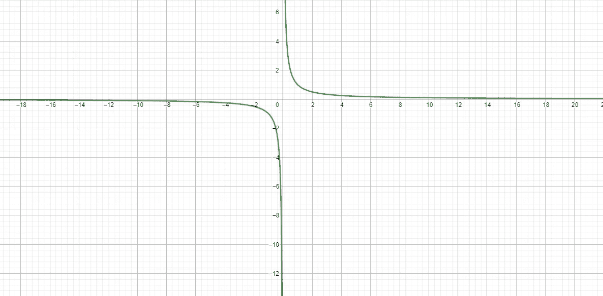
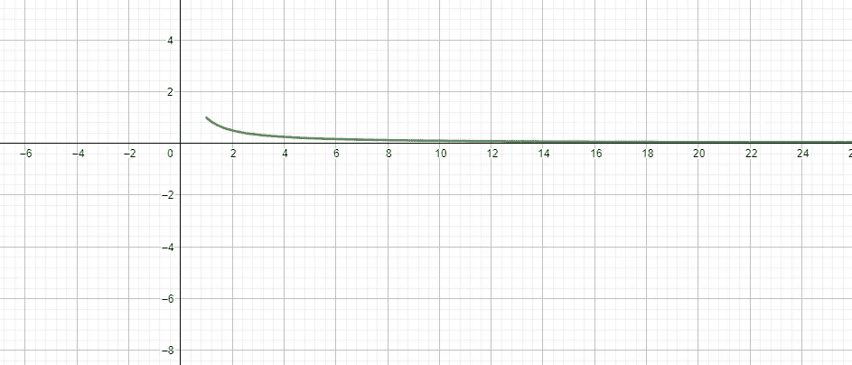
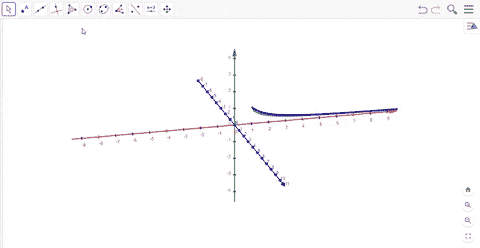
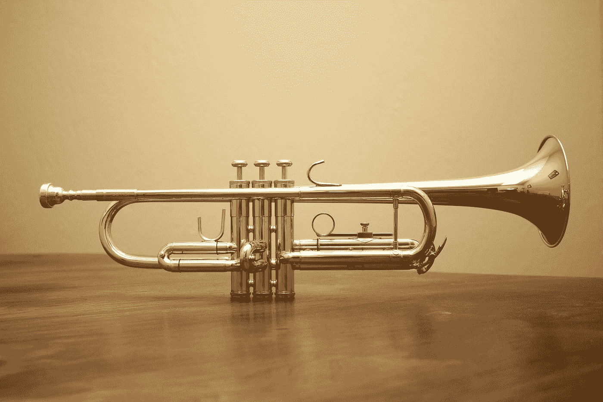
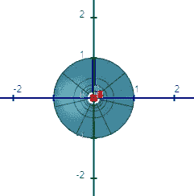
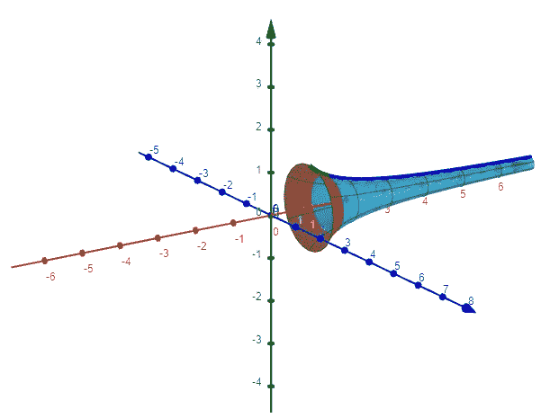
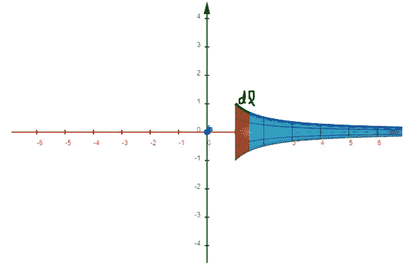
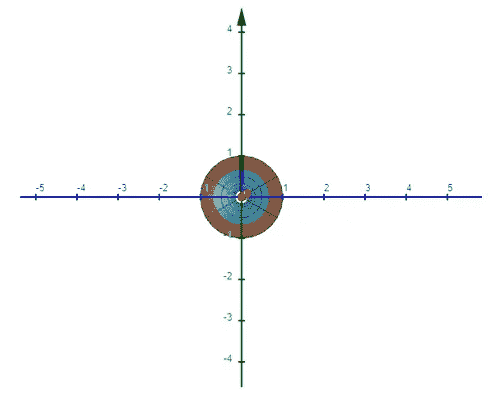

# 画家的悖论

> 原文：<https://medium.com/nerd-for-tech/the-painters-paradox-fc0bd1d0e4e7?source=collection_archive---------0----------------------->

## 简直令人震惊

悖论是看起来完全荒谬，但可以被证明是真实的东西。悖论总能让我大吃一惊，最近我就遇到了一个这样的数学悖论。让我们来看看。

考虑以下函数:

这么简单的功能不可能对我们造成任何伤害，对吗？这个函数在我分解它的时候给了我相当大的麻烦。首先，让我们绘制这个函数:

你可以清楚地看到，从等式或图形中，随着 x 趋向于 0，y 趋向于无穷大。另一端，随着 x 趋于无穷大，y 趋于 0。现在，让我们看看这个函数，当它的定义域是 x≥1 时。

如果我们要计算这个图形下的面积，我们将计算这个函数的积分，下限为 1，上限为∞:

简化这个等式，我们会得到:

这很清楚。1/x 图形下的区域未定义。但这就是奇迹发生的地方。假设我们像这样绕 x 轴旋转图形:

这个结构看起来有点像一个很长的小号的管状部分，如下图所示。

哈尔·盖特伍德在 [Unsplash](https://unsplash.com?utm_source=medium&utm_medium=referral) 上拍摄的照片

我们现在试着计算这个结构的体积。从另一个角度来看这个结构，我们注意到这个图基本上是许多许多的圆圈，一个接一个地放置，并且大小递减。

因此，我们可以使用积分来计算其体积，方法是通过以下公式将所有圆的面积相加:

我们将公式中的 r 替换为(1/x ),因为所有圆的半径基本上是图中 x 值处的 y 值，因为所有圆都以原点为中心。解决了这个问题，我们得到:

在这里，我们看到图形有一个有限的体积！但这说不通，是吗？直观地说，图形的体积可以说是在原图形下增加了许多倍的面积。这意味着该图的体积也应该是未定义的。但是我们刚刚证明了体积是有限的。很疯狂，对吧？现在让我们来看看喇叭的表面积。

在上面的图像中，你可以看到加百利角周围有一个棕色的圆环。你可以看到喇叭是由许多这样的环组成的，所以喇叭的表面积是所有这些环的表面积之和。让我们分解这个图像来帮助计算一个环的面积:

正如我们在这两幅图中看到的，你可以通过将圆的周长乘以 *dl* 来计算圆环的面积。假设圆环尽可能小， *dl* 将几乎是一条直线。因此，我们可以使用毕达哥拉斯定理来计算 *dl* ，您会得到:

现在我们有了 *dl* ，我们可以计算环的表面积，然后用一个积分求出总表面积:

为了计算这个，我们需要使用这个重要的观察:

这个观察给了我们这个惊人的发现:

这向我们展示了加百列之角不仅体积有限，而且表面积无限！这显示了这个结构是多么矛盾:它的一部分有无限的面积，它的整体有有限的体积，而它的整体表面积也是无限的！这又回到了它最初的名字:画家的悖论。把这个角想象成一个油漆桶；你可以用颜料完全填满它，因为它的体积是有限的，但是你不能完全涂上它的表面！

数学中充满了许多这样的悖论，乍一看似乎难以置信，但可以用我们拥有的工具系统地证明。这些悖论一直都存在——它们只是在等待我们去发现它们。