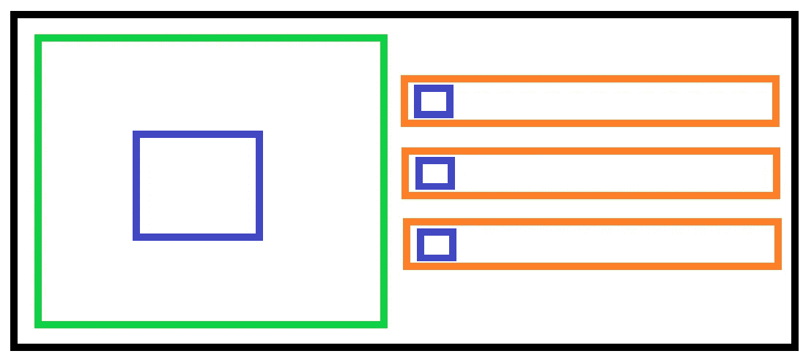
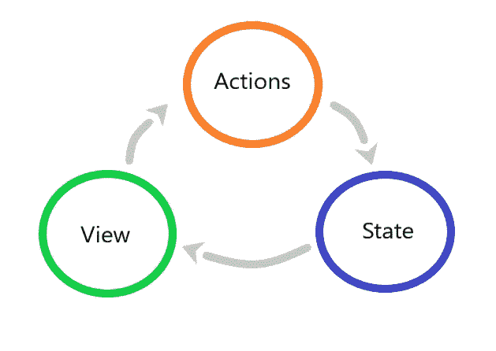

# 没有 Redux 的 React 应用程序的问题

> 原文：<https://medium.com/nerd-for-tech/the-problem-of-a-react-application-without-redux-4735cf60ac9?source=collection_archive---------11----------------------->

# 介绍

你好(克诺比将军)。让我们稍微讨论一下 Redux 是什么，并理解我们如何用 react 实现它而不会太复杂。在我们讨论 redux 之前，我们需要了解一些事情，以确保每个人都在同一页面上，因为您可能是初学者，也可能没有任何使用 React 的经验。如果你对 react 一无所知，也不要担心，因为我会用一种你会明白我们在这里试图解决什么样的问题的方式向你解释。

# 了解基础知识

让我们来看看，认为所有的东西都是一个块，在一个块里面可以有一个子块，这个子块可以接收信息，只有这个子块有这个信息，但是这是什么意思呢？

1.  为了使蓝色块接收绿色块的信息，它需要在绿色块内部。
2.  如果橙色块需要绿色块中的信息，则需要将该信息移到黑色块中。



如您所见，我们遇到了一个问题，因为如果一个块需要另一个组件拥有的信息，就必须将它移动到两个组件共有的父组件中。现在，我们有了这样一个问题的解决方案，因为我们可以将我们的信息移动到顶部块，因为我们需要共享该信息的组件的父组件内部有这两个组件。

# 问题是

想象一下，您有一个复杂的大型应用程序，您需要将数据从顶层组件传递到底层组件。这可能是复杂的编码，并且将数据提供给一个永远不会使用它的组件。我们称之为支柱钻探。

# Redux

## **什么是状态管理？**

从本文开始，我们只讨论了如何跨组件处理状态，以及如何用您自己的状态处理组件。状态管理是关于当你的应用程序增长时我们如何解决这个问题。

## **Redux 是什么？**

Redux 是一个用于管理应用程序状态的库。

## **我为什么要用 Redux？**

正如我们之前看到的，管理跨组件共享的状态变得很困难。

## **什么时候应该使用 Redux？**

这是一个很好的问题，因为使用 react 的人知道还有另一种方法，对于那些想知道的人来说，我指的是 React hooks、mobx 和其他。

我在这里不是告诉你应该使用什么，因为这取决于你正在构建和工作的应用程序的类型，但是如果应用程序不是很复杂，你可以使用 React 钩子。

# 冗余术语



*   状态是描述部分应用程序的对象。
*   我们的观点是基于国家的。
*   行动改变我们的状态。
*   回到视图，当一个动作改变了我们的状态时，视图将会重新呈现。

# 重复概念

*   **Redux 中的 Actions:**action 基本上是一个有效载荷，它描述了从我们的应用程序向我们的商店发送数据。

```
{type: "todos/addTodo",payload: {text:"Redux"}}
```

*   **动作创建者:**动作由动作创建者创建，动作创建者在组件内被调用并分派动作。

```
const addTodo = text => {
 return {
  type: 'todos/addTodo',
  payload: text
 }
}
```

*   **Redux 中的 reducer:**reducer 是纯函数，指定应用程序的状态如何改变并返回新的状态。Reducers 不允许修改现有状态，它的状态是基于新状态的，它们不做任何异步逻辑，也从不保存像 Datetime 这样的 obj。

```
const todoReducer= (state = {}, action) => {
   switch (action.type) {
     case "todos/addTodo":
       return {
         ...state,
         ...action.payload
       };
     default:
       return state;
   }
 };
```

*   **Store in Redux:** Store 是我们应用的状态，我们可以访问数据并更新它。

```
const store = createStore(todoReducer);
```

*   **分派:**分派是更新状态的唯一方式。

```
store.dispatch(addTodo("Todo"))
```

*   **选择器:**基本上选择器知道如何从商店中获取特定的数据。

```
const getTodos = state => state.value//getState returns the current state 
const todos = getTodos(store.getState())
```

# 循序渐进(Redux 工具包)

现在我们将看到 React 和 Redux 的整个通量。为了练习，我选择了 redux 工具包，因为当我开始用 react 学习 redux 时，它很难理解，但当我开始使用 Redux 工具包时，我意识到用 Redux 更容易理解 React。您不需要编写太多代码，配置设置很简单，Redux toolkit 可以解决大量样板代码。

*   **第一步:**我们需要导入 createSlice，这个 helper 函数允许我们定义我们的 reducer 和初始状态，它还负责动作创建者和类型的生成。如果你仔细看看 createSlice 中的代码，有一个名为“name”的键，这个名称是每个 reducer 的类型的第一部分，我们的类型的第二部分是每个 reducer 的键。我们有类似的东西，类型的第一部分是名字“todos”+第二部分是键“addTodo”。每个动作创建者都与 reducer 函数同名。

```
//src\todoSlice.js
import { createSlice } from '@reduxjs/toolkit'
const todoSlice = createSlice({
 name: 'todos',
 initialState: {
   value: {}
 },
 reducers: {
   addTodo: (state, action) => {
     const {payload, type} = action;
     state.value[payload] = {id: payload, value: payload};
   }
 }
})
export const { addTodo } = todoSlice.actions;
export default todoSlice.reducer;
```

*   **第二步:**配置好 todoSlice 后，我们需要传递我们的 reducer 函数，如果你回头看看 todoSlice，默认情况下，reducer 正在导出。因此，我们只需要将它添加到 configureStore 的 reducer 参数中。如果你有一个以上的切片，你只需要把它放在 de reducer 里面。稍后我将向您解释如何使用多个切片来访问数据。

```
//src\store.js
import { configureStore } from '@reduxjs/toolkit'
import todoSlice from './todoSlice';
 export default configureStore({
  reducer: {
    todos: todoSlice,
  //system
 }
})
```

*   **第三步:**为了让 useSelector 和 useDispatch 正常工作，我们需要将我们的存储传递给它们。为此，我们需要导入一个提供者，并将其包装在我们的应用程序中。使得每个组件(块)都可以访问这些数据。

```
//src\App.js 
import React from 'react';
import ReactDOM from 'react-dom';
import { Provider } from 'react-redux'
import App from './App';
import store from './store';
ReactDOM.render(
 <Provider store={store}>
  <React.StrictMode>
   <App />
  </React.StrictMode>
 </Provider>,
 document.getElementById('root')
);
```

*   **第四步:**这个组件负责添加一个 todo，它有自己的状态来保存文本，在存储中保存输入的值没有意义。因此，这里我们分派一个 action creator，我们在“src\todoSlice.js”中导出它，并导入 useDispatch，因为在这个组件中，我们不能访问 store.disptach，但是钩子会处理它，我们只需要传递一个 action。

```
//src\form import React, {useState} from 'react';
import { useDispatch } from 'react-redux';
import {addTodo} from './todoSlice';
const Form = () => {
   const [text, setText] = useState(''); 
   const dispatch = useDispatch(); 
   const onSaveTodo = () => {
       dispatch(addTodo(text));
       setText('');
   } return (
       <>
           <input onChange={(e) => setText(e.target.value)} value=              {text}/>
           <button onClick={() => onSaveTodo()} >Add</button>        </>
    );
}  
export default Form;
```

*   **第五步:**该从商店读取数据，听他们的变化了。这里我们导入了 useSelector，只选择了我们需要的信息。如果你看一下 state 中的代码，正如我前面说过的，如果你的应用程序中有不止一个片，你可以通过 state +(你在 creatingStore 中给 reducer 起的名字)访问存储数据。当存储“state.todos.value”中的数据发生变化时，该组件将重新呈现您的视图。

```
import React from 'react';
import { useSelector } from 'react-redux';
const List = () => {
   const todos = useSelector((state) => state.todos.value); 
   const values = Object.values(todos);
   return (
      <>
          {
              values.map((todo, index) => <div key={todo.id}>{index + 1} - {todo.value}</div>)
          }
      </>
   );
}
export default List;
```

*   **第六步:**正如我所说的，如果你通过将信息移动到两个组件的公共父组件来传递信息，但是使用 redux，我们的应用组件是干净的，它不会保留任何它不需要的信息。

```
import React from 'react';
import Form from './form';
import List from './List';
const App = () => {
  return (
   <div>
     <Form/>
     <List/>
   </div>
 );
}
export default App;
```

# 结论

正如你所看到的，理解和实现 redux 并不困难，使用 Redux toolkit 我们仅仅写了几行代码。使用 Redux Toolkit 很容易解决在组件之间共享信息的问题，如果您的应用程序中有很多组件，您就不会在不需要它的组件之间传递信息。我强烈推荐您阅读关于 redux toolkit 的文档，并尝试使用它做一些项目