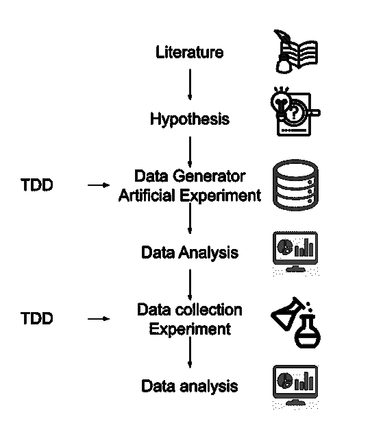

# 研究中对可靠性的追求:代码测试能有所作为吗？

> 原文：<https://medium.com/nerd-for-tech/the-pursuit-of-reliability-in-research-can-code-testing-make-a-difference-f03dc04d04c1?source=collection_archive---------5----------------------->

确保研究结果的可靠性是研究人员最优先考虑的事情之一。这是我们一砖一瓦建立世界知识的基础。当可靠性的条件得不到满足时，我们对这个系统的信任就会遭受可怕的后果。由于各种原因，从数据操纵到诚实的错误([retractionwatch.com](https://retractionwatch.com/))，数十亿美元和数年的工作都因缺乏可靠性而浪费了。

> **“直接、明显的损害是浪费了国家卫生研究院的资金和浪费了该领域的思考，因为人们正把这些结果作为自己实验的起点。”**
> 
> **托马斯·苏德霍夫|斯坦福大学**

到目前为止，解决方案是通过执行小的迭代来依赖结果的再现性。为了验证新的假设，研究人员首先需要确认他们的同行发表的结果。然而，研究中臭名昭著的“不发表就灭亡”的趋势阻碍了这种健康方法的实践。研究人员被迫匆忙提交新的结果，否则他们可能会失去资助。这种竞相发表的现象也意味着在确保结果质量方面做得很少。

除了研究世界的黯淡景象，研究的复杂性也显著增加，研究人员需要获得更多的知识和技能，而学习和提高的时间却很少。正如我在上一篇文章中提到的，已经为数据收集构建了更多的工具；实验变得越来越复杂，但在促进产生可靠的结果方面几乎没有做什么。由于目前的实验室结构，在缺乏监督的情况下，研究人员在他们的代码中积累小错误来收集和分析数据。他们的代码没有经过编程测试、同行评审或记录。

因此，对研究至关重要的数据变得越来越不可靠。

而其他部门(产品管理、人力资源、软件工程等。)制定了规则，并努力优化他们的工作技术和流程，但公共研究却没有跟上步伐。尽管当代形式的研究已经存在了半个多世纪，但显然缺乏一致认可的方法。很少有实验室表示有兴趣讨论人力资源管理、数据采集、分析或项目管理。所以，没有共识。

我们可以开发哪种方法来提高结果的可靠性？可以借鉴其他领域的思路吗？让我们来看看软件工程如何提供可靠性和健壮性。

# 测试代码

手动测试是每个软件开发人员都要学习的。这意味着运行您刚刚编写的代码，并通过调试器、日志或输出来检查代码是否满足所需的功能。例如，检查您刚刚添加到图形用户界面的按钮是否正在启动实验，或者数据是否以正确的格式保存在正确的位置。随着代码的发展，开发人员必须手动确保他们的新代码不会中断先前开发的功能。

开发人员决定以编程方式测试他们的代码，而不是手动重新测试每一点代码，这将是巨大的时间浪费。这意味着他们编写代码来测试先前编写的代码的功能。当他们添加新代码时，他们可以验证它没有破坏以前开发的功能。这个概念是先写功能代码，然后写测试代码。随着代码库的复杂性和规模的增加，测试变得越来越少，因为开发人员需要快速切换到开发下一个功能。因此，编写测试变得越来越困难(我强烈推荐[有效地使用来自 Michael Feathers](https://amzn.to/3zqW0iL) 的遗留代码)。

测试驱动开发(TDD)是一种软件开发方法，包括三个主要步骤:首先编写测试，编写足够的代码以通过测试，以及清理代码。开发人员应该重复这三个小步骤，以获得一致和可靠的结果。

虽然这种技术似乎是世界上所有研究问题的神奇工具，但它依赖于强大的隐含假设来实现效率。

第一个假设是它有详细的需求。开发团队接收由客户或产品经理定义的功能需求。随着时间的推移，会有一些修改，但是开发者会有一个明确的方向。

第二个假设是，代码的使用次数将比编写或编辑的次数多。这对所有开发人员来说都是显而易见的，因为这是在公司中编写代码的主要原因。

第三个假设是，编写的代码将有很长的生命周期。TDD 的开发考虑到了可持续性。随着时间的推移，几代开发人员会对代码进行更新和升级。

拥有可靠的、经过测试的、健壮的代码是每个研究人员应该努力的目标。研究在可重复的实验中蓬勃发展，因为一个愚蠢的错误而获得错误的发现不是任何研究人员想要的情况。那么，你应该强迫自己遵循这样一种僵化的方法，花两倍的时间开发同样数量的功能代码吗？

简而言之，答案是肯定的，但是实现可能取决于您想要达到的目标。

# 在研究中应用 TDD

研究中的软件开发不同于公司中的工作。这是研究工作中相对次要的一部分，可能不构成优先事项。如果不满足 TDD 的基本假设，应用 TDD 方法将会使花费在编码上的时间加倍，因为可能不会提高研究质量。让我们探讨一下代码库研究人员工作的两种类型的目标、需求和条件:**数据收集**和**数据分析(清理、处理和报告)**。

## **数据收集或实验**

正如引言中所提到的，研究人员通常独自完成他们的研究项目。因此，他们几乎没有可重复使用的代码来帮助他们收集数据，因为他们必须定义他们想要记录什么类型的数据以及在什么条件下记录。虽然有些人可以利用他们的录音设备公司提供的无代码工具，但许多人需要自己开发整个实验。这是涉及多个传感器记录、闭环实验等的实验的情况。在这个过程中，他们编写的代码需要 100%没有错误，因为他们的整个研究都依赖于此。如果数据被转移或部分损坏，整个项目都岌岌可危！

在开始一项实验之前，研究人员适当地定义一个或几个假设和一个实验方案，由同行或研究人员自己验证。类似于软件工程行业，研究人员在开始编写实验代码之前遵循需求和规范。这些需求的存在验证了 TDD 的第一个假设。有了这些，研究人员-开发人员将拥有所有必要的信息来遵循测试驱动的开发方法。

研究的一个关键方面是结果的可重复性，这需要记录足够的数据来推断所获得结果的统计能力。从纵向研究到队列研究，为收集数据而开发的代码被使用/运行的次数将超过它被编写的次数。因此，它满足 TDD 的第二个假设。

与公司软件的预期寿命相比，数据收集代码的寿命通常很短。从单个实验(1 个月)到整个博士(约 4 年)不等。如果实验室认为共享一个数据收集代码对团队更有利，那么数据收集代码的生命周期可能会突然延长。这个过程更接近于公司的软件开发方法。

为获得可靠和可重复的结果而开发的代码必须通过密集的测试证明没有错误。正如我们已经看到的，在这种情况下，所有三个 TDD 的假设都得到满足。因此，对研究人员来说，将 TDD 应用到他们的数据收集代码中是非常有益的。

## **数据清理、处理和分析**

在许多情况下，研究人员会编写代码来清理、处理和分析他们在之后**收集的数据。他们将用新的假设和数据处理技术“探索”数据。数据分析开发是软件工程的一种独特形式，它比普通的软件工程更接近于脚本，并且缺乏明确的需求和目标。在进行数据分析的同时，绘制图表。代码编写并运行一次。大多数时候，它是单个数据科学家(开发人员)的工作，其代码库通常不会增长。因为代码只分析一个实验，所以它的生命周期相对较短。因此，TDD 在这里似乎不相关，因为它的假设没有得到满足。**

那么，我们应该停止依赖可信和可靠的研究结果吗？为了回答这些问题，我们，研究人员，应该讨论什么样的方法可以发展，以确保我们的结果的可靠性。

让我给你一个我作为数据科学家的真实经历，我可以自豪地宣称我的代码没有错误。

我在一个实验室工作，该实验室需要一个复杂的神经科学项目的高级可视化。在那里，我的任务是开发一些数据处理和分析工具。几天后，我已经完成了所有的绘图和后期处理代码。考虑到大量的工作和数据，我如何向我的客户证明我的代码是可靠的？他们怎么能相信它来验证他们的假设呢？这个实验没有先例，所以我无法根据以前的实验和结果来验证我的代码的可靠性。我也不能相信这些数据，因为在录音过程中任何事情都可能出错。因此，我必须创建模拟数据来验证合作者假设，有效地将假设转化为软件需求。

从结论(定义明确的需求)开始，我能够编写出生成理想数据的经过测试的第一个代码。这样就很容易验证我的分析代码是没有错误的，因为图显示了预期的结果。

我称这种方法为**测试驱动研究** (TDR)

为了开发前面提到的工具，我还必须深入研究文献以找到分布的估计类型(高斯分布、泊松分布等。)及其相关参数。这也让我能够估计要记录的对象(动物/集群/神经元)的数量，以实现出色的统计功效(验证或拒绝默认假设)。

以下是 TDR 带给我的快速总结:

*   在开始实验之前，正确地定义假设
*   为实验定义统计上足够的受试者人数(统计功效)
*   获取关于神经元模式的所有信息(特定领域的知识)
*   来开发一个经过高度测试的、可重复的、可重用的理想数据生成器
*   创建更可靠的数据处理管道、绘图和图形

# 结论

我们已经看到了测试驱动开发，一种软件工程方法，是如何应用于研究，从数据获取和分析中获得可靠的结果。尽管结构和目标不同，TDD 的高可靠性显然使它成为所有研究人员的必备工具。

虽然在我们并行编写代码和调查相关数据时，数据分析很难测试，但我建议采用测试驱动的研究(TDR ),这将减少数据分析管道中的错误。通过注入由经过良好测试的发生器(带 TDD)人工生成的理想可信数据，数据分析的可靠性大大提高。

这篇文章表明，研究人员不应该停止寻找他们领域之外的方法来解决他们自己的问题。通过每个人的不懈努力，研究将带来知识和持续的创新。

测试驱动的研究管道。人工实验是一个数据生成器，可用于测试数据分析管道的代码。

你有什么办法来保证你的研究结果的可靠性？你遇到过类似的经历吗？请分享您对这一新方法的想法！

# 推荐阅读

罗伯特·c·马丁的《干净的代码》。这本书涵盖了所有语言的现代软件工程的良好实践的基础——每个写代码的人的必备。

[适合你头脑的代码](https://amzn.to/3zYC8Ea)马克·西曼著。这本书就如何优化你的编码方式提供了一些提示和技巧。它比 Robert C. Martin 的干净代码需要更多的软件工程知识。