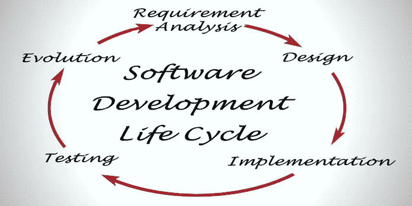

# 软件开发生命周期:2022 年意味着什么？

> 原文：<https://medium.com/nerd-for-tech/the-software-development-lifecycle-what-it-means-in-2022-a97a20d2c128?source=collection_archive---------1----------------------->

# 什么是软件开发生命周期？

软件开发生命周期是一种具有清晰定义的过程的方法，用于创建高质量的软件。它是[企业软件开发公司](https://www.botreetechnologies.com/software-development-company)用来在尽可能短的时间内以低成本生产高质量软件的过程。

软件开发周期提供了一个结构化的阶段流，使软件开发团队能够快速开发出经过良好测试并准备好发布的高质量软件产品。然而，不遵循这个周期对任何开发团队来说都是有害的。

使用 SDLC 简化了开发周期的当前阶段。它有助于清楚地定义每个阶段需要哪些资源，以及您的团队为了成功的开发必须采取什么方向。每个 SDLC 都有几个阶段。以下六个是最常见的软件开发生命周期阶段

*   **分析:**
*   这个预开发阶段致力于理解开发过程中的需求和要采取的行动。在这个 SDLC 周期中，所有的瓶颈和可能的错误都被识别出来。
*   **设计:**
*   它包括产品的界面元素，如布局、按钮和其他 UI 元素。
*   **开发:**
*   软件的设计元素与源代码一起在这个阶段实现。
*   **测试:**
*   进行产品验证的这一阶段是为了识别任何产品脚本错误和其他故障。然后，这些错误被修复并再次测试。在软件开发周期中，软件解决方案要经过多次测试，直到通过设定的基准测试。
*   **部署:**
*   这是走向市场的步骤，软件开发公司最终将产品交给客户或者在市场上公开销售。
*   **维护:**
*   发布后阶段完成了整个开发周期。该阶段旨在保持解决方案的功能，并根据消费者和市场的最新技术要求对其进行更新。

# 软件开发生命周期的好处

*   **适合项目的课程:**
*   将遵循不可靠软件开发方法的组织的成果与那些适应 SDLC 方法的组织的成果进行比较。前者总是产生低质量的结果。
*   在没有 SDLC 流程指导的情况下生产解决方案总是会导致成本增加、交付延迟以及无法满足客户期望的风险。而且，整个项目失败的最大噩梦也有可能成为现实。
*   **更好的范围管理:**
*   SDLC 为开发团队提供了清晰的发展路线图。当开发人员准备好一个清晰的开发计划时，项目的范围管理就变得容易多了，开发问题的机会也变得少了。
*   相反，没有清晰和固定路线图的团队可能会受到开发人员士气低落的影响。它可能会影响团队的整体效率，并可能导致生产延迟和低质量的工作。
*   **提前识别潜在问题:**
*   SDLC 为您提供了预见的超能力。使用软件开发生命周期工具，开发团队可以在任何潜在的工具出现之前识别它们。将人工智能融入软件开发也极大地影响了错误管理过程。人工智能工具识别问题并在没有任何人工干预的情况下解决它们。

# 软件开发生命周期方法

根据项目的复杂性和类型，可以采用不同的软件开发生命周期模型。SDLC 方法可以被描述为适应性的或预测性的。每种型号都适合满足不同的生产需求。

*   **瀑布 SDLC 模型:**
*   它被认为是最古老和最严格的软件开发模型，因为它遵循线性的顺序执行顺序。该框架遵循从需求收集到维护的一步到位的方法。前一步完成后，它将进入下一阶段。
*   当需求从一开始就被很好地描述和稳定时，它被最好地利用。它也适用于时间线较长的项目。
*   **迭代 SDLC 模型:**
*   该模型的 USP 允许在没有明确指定总体项目范围和行动计划的情况下启动项目开发。因此，要启动任何项目，只需要提出功能需求。该模型在一个循环中遵循 SDLC 开发阶段的循环。因此，它为开发人员提供了用每个新版本增强软件的空间。应该谨慎地部署模型，否则它将导致频繁的不必要的变更，耗尽开发资源。
*   **螺旋 SDLC 模型:**
*   该模型将开发过程分成小的阶段，由开发团队来完成。如果项目是新的，并且完成的项目不需要任何文档，这有时会导致不必要的时间和金钱的浪费。对于低风险项目来说，这种模式也可能成本高昂。
*   **敏捷 SDLC 模型:**
*   敏捷软件开发方法以沟通和灵活性为中心。该模型受到敏捷宣言和敏捷原则的支持，提倡更短的周期和渐进的开发和发布。
*   根据一项远程研究，敏捷 SDLC 被 71%的公司使用，同时它已经帮助 98 %的公司完成并增强了软件开发。因此，敏捷方法是目前软件开发行业中使用最多的模型。
*   敏捷系统提供了更大的灵活性，因为它的核心概念是在小而短的阶段内完成产品创造。敏捷方法中开发的每个阶段都能够从开发团队和项目中涉及的其他利益相关者那里获得反馈。这样的反馈循环包括冲刺计划、每日 scrum、冲刺回顾和冲刺回顾。
*   敏捷开发是在“冲刺”阶段进行的，通常持续 2-4 周。每个 sprint 的目标不仅是构建一个 MVP，而且是构建客户可以开始使用的软件片段。

# 简单地说

构建软件是一个过程，它需要一个明确的目标、实现目标的方法以及度量、维护和改进结果的方法。SDLC 提供的不同方法和软件开发生命周期工具提供了所有这些。根据情况和要求，可以选择模型或工具。这将确保软件开发生命周期过程结束时的产品正是您想要的。

2021 年，全球软件市场价值为 4295.9 亿美元。预计从 2022 年到 2030 年，CAGR 将以 11.7%的速度增长。因此，要成为软件开发企业未来二十年成功故事的一部分，SDLC 需要全面贯彻。正确方法论的选择非常重要。然而，这取决于项目的需要和要求。

Shardul 已经在科技行业工作了 18 年。他曾与万事达卡、CIGNEX 等全球领先企业合作。今天，Shardul 是 [Tntra](https://www.tntra.io/) 的首席执行官，Tntra 是一个提供产品工程服务的全球创新生态系统。他还是领先的软件开发公司 [BoTree Technologies](https://www.botreetechnologies.com/) 的首席执行官。他热衷于软件行业的最新创新，并撰写大量文章来指导企业工程师做出更好的开发决策。

*原载于 2022 年 7 月 20 日*[*【https://www.postingsea.com】*](https://www.postingsea.com/the-software-development-lifecycle-what-it-means-in-2022/)*。*