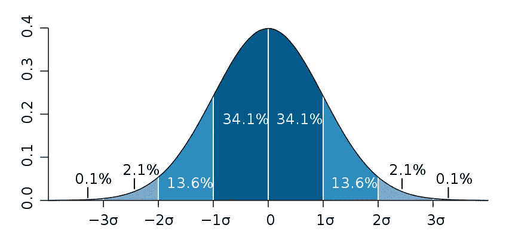
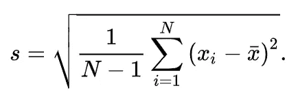
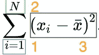
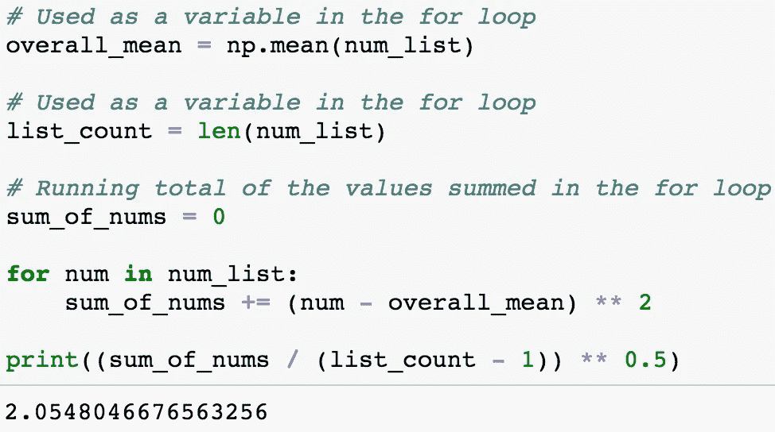
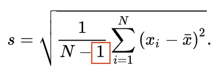

# 标准差函数的标准函数可能会偏离

> 原文：<https://medium.com/nerd-for-tech/the-standard-function-of-standard-deviation-functions-might-deviate-18cb248fe100?source=collection_archive---------15----------------------->

照片由 Sigmund via Unsplash 拍摄

在某些时候，您可能已经计算了数据帧列或数字列表的标准偏差。在本文中，我想解释一下使用 pandas.std()和 numpy.std()之间的一个小区别。我还将回顾为什么使用标准差以及计算是如何进行的。

让我们先来看看这些函数的结果:

作者照片

嗯，他们不一样？！？为什么？

## 快速回答:

Numpy 的版本不使用 n-1 作为分母，或者可以表述为:numpy 的版本默认的 Delta 自由度为 0(有偏)。Pandas 使用默认的 DDOF 1(无偏)。这两个功能都包括改变自由度增量的能力。让我们将 numpy 版本中的 ddof 参数设置为 1:

作者照片

他们现在匹配了！

## 什么是标准差？

根据[维基百科](https://en.wikipedia.org/wiki/Standard_deviation)的说法，标准差是一组数值的变异量或离差量的度量。

如果你像我一样，你可能需要更多的背景知识来更好地理解这一点。

首先，我们来谈谈正态分布:

照片由 M. W. Toews 通过维基百科提供

让我们以美国 18-30 岁男性的身高为例。想象 x 轴上以英寸为单位的高度从 24 英寸(2 英尺)到 96 英寸(8 英尺)。y 轴将代表相应高度的个体数量。24 英寸和 96 英寸都有极少量的记录案例。

该图中位于 x 轴 0 的最高点代表人口的平均身高。我们将使用 70 英寸(5 英尺 10 英寸)作为平均值。平均值两边的深蓝色区域是第一个标准差。这个第一标准偏差将包括大约 68%的记录病例。

假设计算的标准偏差为 3”。这意味着这个群体中大约 68%的人身高在 5 英尺 7 英寸到 6 英尺 1 英寸之间。

现在，第二组包括两边各 13.6%的人口。我们最后得到的是大约 95%的观察值落在第二个标准差的底端和第二个标准差的顶端。用正常的话来说:我们从 5 英尺 10 英寸的平均值开始，减去 6 英寸，再加上 6 英寸。大约 95%的身高记录会在 5 英尺 4 英寸到 6 英尺 4 英寸之间

## 更好地理解传播

本文开头使用的函数计算平均值减去/加上的值，以了解值的分布/范围。如果计算的值是 4”，那么我们可以说 68%的观察值将落在 5'6”和 6'2”之间。然后，95%的观测范围将转移到 5'2 "和 6'6 "。

理解这些术语有助于我更好地理解什么是标准差，以及为什么知道它是有用的。

## 计算标准偏差的编码方式

这是我提出的事情之一，因为听到它以不同的方式说确实帮助我更好地理解了这个概念。首先，这是计算总体标准差的公式:

图片来自维基百科

这是令人困惑的。说实话，我很难读懂这些东西。我读了这段信息，它真的很有帮助:

作者照片

使用 1/蓝框，对于 2/绿框/元素列表中的每个元素，执行 3/黑框中的计算(每个元素值-平均值)。下一步是对每个值求和，用大的适马符号表示。现在，移到公式的这一部分的左边，你可以用这个和除以元素数减 1。最后，求该值的平方根。

让我们使用最初开始时使用的相同数字列表:

作者照片

## DDOF 的论点改变了

回到上面的函数，本质上这两个函数的区别在于红框中的变量的默认设置不同:

作者照片

Pandas 默认使用上面的 1，Numpy 使用 0。

## 把它包起来！

统计数据可能会令人困惑。你大部分时间都在处理概念。我需要更多的实践方法和例子来更好地理解。我写这篇文章是为了那些以类似方式学习的人。

看完这个，你可能会奇怪为什么 n-1 用在分母上。Kahn Academy 上有一个很棒的[视频](https://www.khanacademy.org/math/ap-statistics/summarizing-quantitative-data-ap/more-standard-deviation/v/review-and-intuition-why-we-divide-by-n-1-for-the-unbiased-sample-variance)用例子来帮助解释这一点。