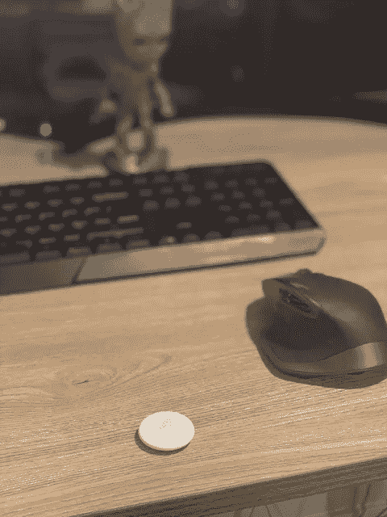
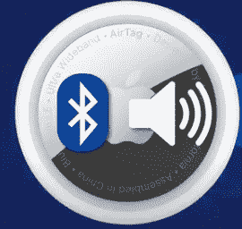
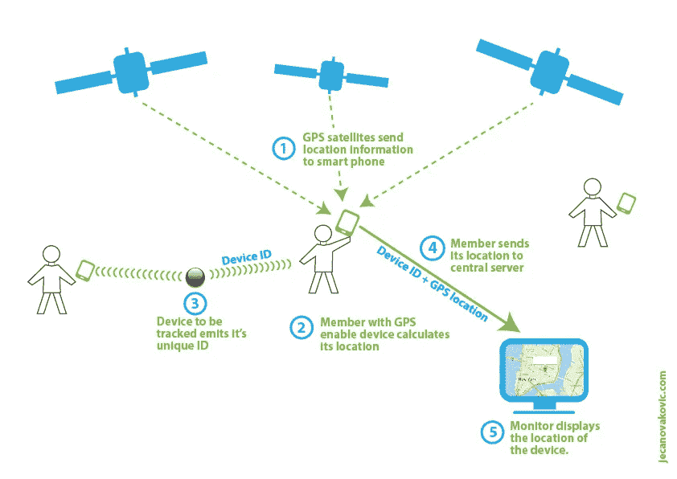
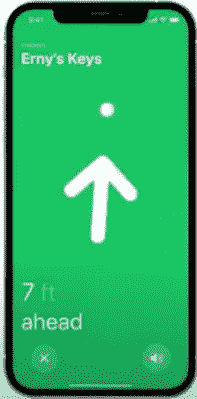

# 苹果 AirTag 背后的技术

> 原文：<https://medium.com/nerd-for-tech/the-technology-behind-apples-airtag-c7983f9322b5?source=collection_archive---------1----------------------->

我的第一次探索物联网世界和推动它的技术。在打开新引入的 AirTag 之后，对它进行了一些试验，揭示了一个共同的主题。

**背景**:苹果 AirTag 被设计成可以贴在钥匙、包、钱包或者任何你想要的物品上。智能标签是一种物联网设备。Air 标签与 iPhone 或 iPad 配对。它们是“查找我的应用程序”功能的一部分。成功设置后，用户可以在 find by an app 中自动看到标签的位置，但这是如何发生的呢？让我们深入研究实现这一点的技术:

# 蓝牙低能耗(LE)

这些设备使用低功率[无线电波](https://electronics.howstuffworks.com/radio.htm)在 2.400 GHz 和 2.483.5 GHz 之间的频带上进行通信。标签配有蓝牙芯片和微型扬声器，它们发送包含唯一加密 ID 的短程蓝牙信号，配对的设备获得这些信号并识别跟踪器的位置。如果标签就在附近。用户既可以通过应用程序播放声音，也可以要求 Siri 在标签丢失或被盗时发出声音警报来定位标签。

# 近场通信(NFC)又名人群 GPS

这些标签利用使用相同蓝牙定位芯片应用程序的人群的帮助，这意味着任何拥有苹果设备的人都可以接收到追踪器的蓝牙信号，然后该设备将标签的 ID 及其当前位置发送到中央服务器，服务器反过来将最后一个纳税地点的通知转发给其所有者。2021 年，苹果全球活跃设备达到 16.5 亿台。这是一个巨大的数字网络。因此，有人在足够近的地方接收到你的税务信号的可能性非常高。

# **超宽带测距又名精确定位**

IEEE[IEEE](https://www.ieee.org/)(电气和电子工程师协会)在 15 年前开发了一个名为 [802.15.4](http://www.ieee802.org/15/) 的 UWB 标准，但它并没有实现其最初的预期用途，即快速发送数据。UWB 的复兴正在发生，因为它的超短无线电脉冲让计算机能够非常精确地计算距离。

装有 U1 芯片的 iphone 提供超宽带(UWB)连接，结合物联网(IoT)技术，可以提供“空间意识”——让你的手机识别周围环境和其中物体的能力。它利用了手机的摄像头，陀螺仪，加速度计和 AR 套件。苹果去年[开始让第三方开发者访问](https://www.imore.com/ios-14-developers-can-now-take-advantage-u1-chip-thanks-new-nearby-interaction-framework)其 U1 芯片，该芯片使用 UWB 技术，通过其“ [NearbyInteraction](https://developer.apple.com/documentation/nearbyinteraction) 框架使 iPhone 具有空间感知能力。

UWB 通过测量超短无线电脉冲在设备之间传播的时间来计算不到半英寸的位置。当 UWB 不在覆盖范围内时，蓝牙连接意味着 AirTags 接入苹果的 Find My system，这让其他人的设备发现你的 AirTag 的位置，并私下与你分享。

## 结论

如果你还没有注意到，这些技术之间的共同模式是*无线电波*。广播、天文学、核磁共振成像、条形码读取、Wi-fi 和无数其他产品的所有无线创新的基石。它打破了我们与物理电缆的联系。试图弄清楚空中标签是如何工作的促使我花一些时间研究无线电波。感谢我这么做了，但将如此丰富的技术视为理所当然，没有它们(或有一个停滞不前的版本)的快乐适应和痛苦将导致厌恶创新。**为拥抱技术带来的价值干杯。**