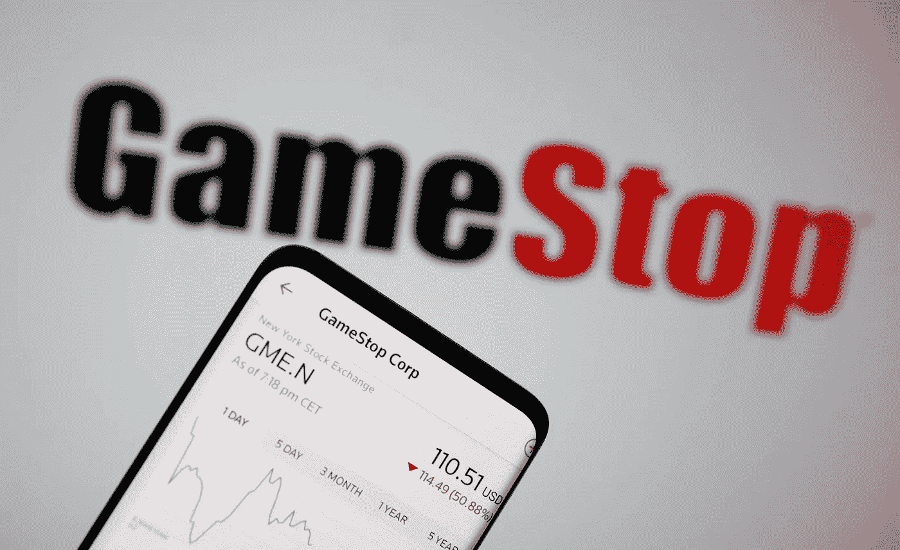
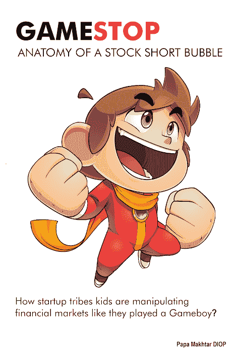

# 然后是社交交易

> 原文：<https://medium.com/nerd-for-tech/then-social-trading-3283b0deb916?source=collection_archive---------28----------------------->

RobinHood 交易应用程序和 Gamestop

在线交易平台被个人投资者大量采用后，他们现在可以从任何连接到互联网的计算机上买卖股票，社交交易平台诞生了，它为已经向公众提供的在线交易平台模式添加了社交组件。这些社交交易平台从脸书和 LinkedIn 革命中受益匪浅，它们只是将这些平台的核心功能应用于交易平台，允许个人交易者联系和讨论，甚至看到其他交易者的投资组合并复制他们的头寸。那就是**复制交易。**

社会交易一直存在，因为我们人类是社会动物，我们的决定常常基于他人的思想和想法。我们喜欢在决定某件事情之前从别人那里收集信息，当我们决定的事情涉及巨额资金，如投资股票时，这一点更是如此。交易者过去常常利用社会关系，因为在交易大厅里，我在讨论过去股票市场的那一章中给你们介绍过，交易者过去常常在交易休息时在大厅里或咖啡馆、酒吧和餐馆里讨论交易策略，每个人都给出了自己对一支股票的看法。在互联网出现之前，交易者和投资者开始在交易俱乐部中分组，分享投资机会、策略或任何有帮助的想法。但就像互联网通过扩大我们的社交范围和行为对其他领域所做的那样，首先是电子邮件的创建，它允许创建投资邮件列表，这与我们现在知道的社交交易具有相同的效果。因此，复制交易并不是 Etoro 引入的金融市场的新功能，即使在我工作的 society general 这样的银行的交易部门，交易员也会相互复制，只是互联网让复制变得更容易，增加了我们可以复制的交易员数量。

PS:这是我即将出版的书《游戏停止，剖析股票空头泡沫》中的一段话

帕帕·马赫塔尔·DIOP 所著的《游戏停止，剖析股票空头泡沫》一书的封面