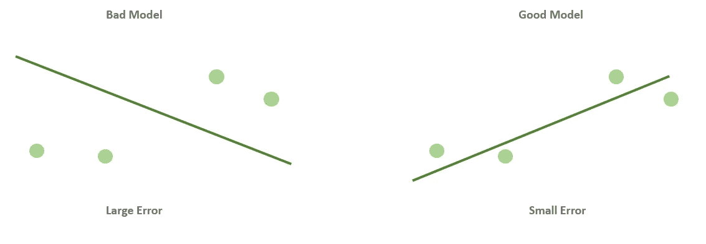
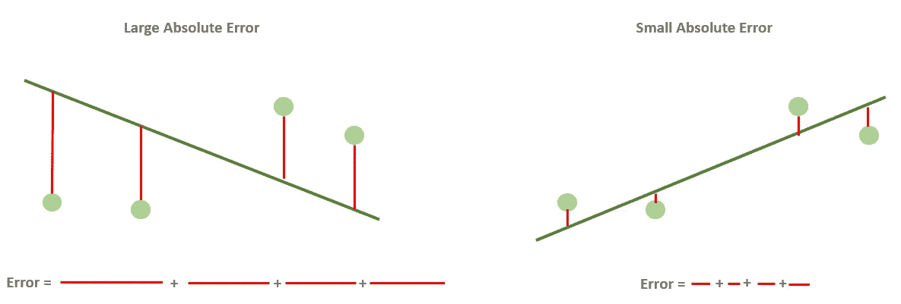
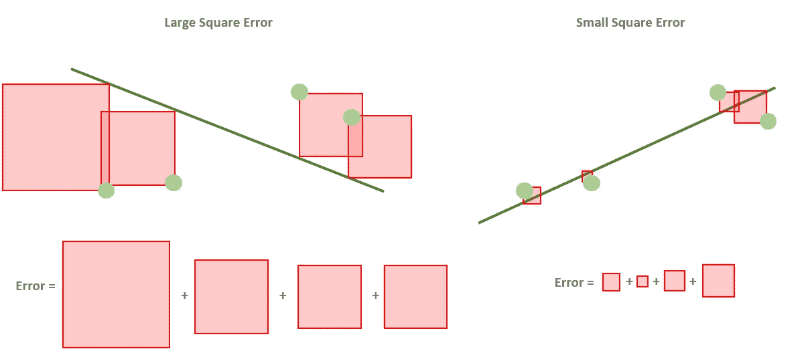
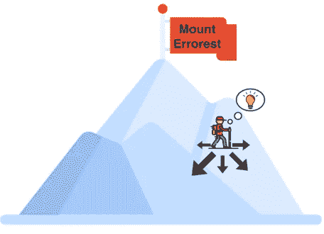
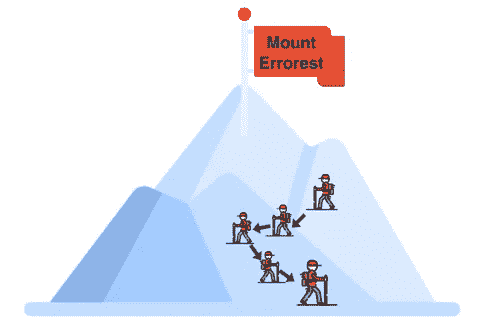
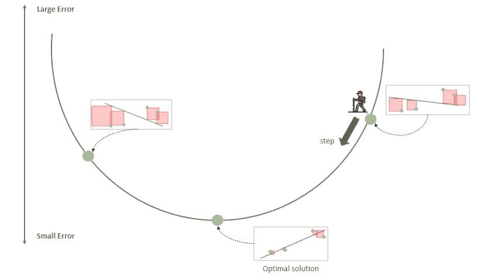
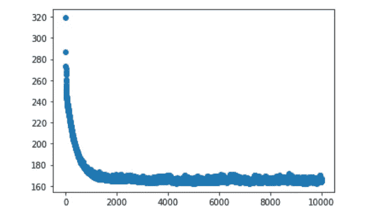

# # 03TheNotSoToughML |回归:错误→从山顶下降

> 原文：<https://medium.com/nerd-for-tech/thenotsotoughml-regression-errors-descending-from-a-mountain-top-39c748137a3?source=collection_archive---------20----------------------->

> “这个世界充满了神奇的东西，耐心地等待我们的感官变得更加敏锐。”——w·b·叶芝

# #(标签)是怎么回事？

就在不久前，我开始了一个新的系列，致力于它所说的——一个系列，我通过解释算法/概念背后的直觉，而不是直接给出数学，来消除人们可能对算法/概念的一些差距。这只是试图让你明白 **ML 并不强硬。更多的是直觉——通过算法证明。**

在[系列的第一篇](https://anaa-vs.medium.com/thenotsotoughml-fit-a-line-what-do-we-even-mean-f05f55f3c1ee)文章中，我们经历了— *当我们说“拟合一条线”时，换句话说，线性回归是什么意思。它解释了算法背后的直觉，以及我们希望通过将这条线拟合到我们的数据上来实现什么。*

在[第二篇](/analytics-vidhya/thenotsotoughml-tricks-to-fit-a-line-af982eeac01a)文章中，我们讨论了不同的*技巧，*我们使用这些技巧，通过根据线周围数据点的位置调整**权重**和**偏差**来逐渐获得我们想要的“拟合”线。

我们留下了我们在第二篇文章中一起编织的故事，关于以下问题:

**Q1。我们应该调整多少权重？**

**Q2。我们应该重复这个过程多少次？**

**Q3。我怎么知道这个模型有效呢？**

为了能够回答上述问题，我们需要理解一些概念，这就是我们在本文中要探讨的。

让我们深入了解这些概念吧！

# 概念 1:误差函数——测量我们的结果



当你看着上面的两个模型对比，你的结论是不是也和我一样？与右边的模型相比，你认为坏模型“坏”吗？如果是，那么你在看到模型时所做的一切就是平均地(或一起)从每个数据点和*看到*线的“间隙”或**距离**，与右侧的模型相比，左侧的模型似乎在点和线之间有更大的间隙。**

一个**误差函数**帮助我们计算出完全相同的结果！*这是一个告诉我们模型表现如何的指标。*

*误差函数会将较大的值分配给左边的模型，而将较小的值分配给右边的模型。*这些在文献中也被称为**损失函数**或**成本函数**。

现在，让我们来看一个重要的问题——

*我们如何为线性回归模型定义一个好的误差函数？*

这就是我们将要谈论的**绝对误差**和**平方误差的地方。**

## 绝对误差——一个将距离相加并告诉我们模型有多好的指标

这是最容易理解和解读的。

这只是数据点和直线之间距离的简单求和。它被称为“绝对”,因为距离可以是正的，也可以是负的，这取决于数据点到直线的位置。因此，为了避免遗漏任何行为，我们采用误差的绝对值。

好的，我们知道一个好的线性回归模型是直线靠近数据点的模型。

**但是，什么是亲密？**

我们是否选择一条靠近某些点而远离其他点的线？或者我们选择一条接近所有点的线？

这就是绝对误差函数派上用场的地方。*我们选择使绝对误差*最小的直线，即从每个点到直线的垂直距离之和最小。

下图显示了绝对误差的差异。



现在，让我们进入下一个错误技巧。

## 平方误差——一种将距离的平方相加并告诉我们模型有多好的指标

平方误差与绝对误差非常相似，只是我们不是采用标签和预测标签之差的绝对值，而是采用平方，这将使数字再次变为正值。

让我们试着把它可视化，就像我们对绝对误差做的那样！



(原谅我没几个方块看起来怪怪的。希望你得到精华。)

*在实践中，平方误差比绝对误差更常用。*为什么？一个原因是平方比绝对值有更好的导数，这在训练过程中很方便。

当我们进一步阅读这篇文章时，我们会理解得更多。

## 平均绝对误差和(根)均方误差——更常见和有用的误差

虽然上面显示的绝对误差和平方误差只是让您开始了解误差是什么以及可能是什么样的——机器学习项目中最常用的误差(当我们处理回归模型时)是——平均绝对误差(MAE)和均方误差(MSE)。

它们的定义非常相似，除了*我们不是计算总和，而是计算平均值。*

因此，**MAE 是从点到线的垂直距离的平均值，MSE 是这些相同距离的平方的平均值。**

这些比我们在上一节中计算的绝对误差和平方误差更有用，因为如果我们试图在两个不同的数据集上拟合相同的模型，其中一个数据集只有 10 个数据点，而另一个数据集有 100 万个数据点，在误差是数量之和的情况下(如绝对误差或平方误差)，在 100 万个数据点的数据集上，误差可能会高得多，因为我们会添加更多的数字。

另一方面，当我们使用平均值时，这个问题就解决了。

另一个有用的是**均方根误差(RMSE)。**顾名思义，这个被定义为均方差的**根。** *这个用来匹配问题中的单位，也让我们更好的了解模型在预测中会产生多大的误差。*

# 概念 2:梯度下降——通过从山上缓慢下降来降低误差函数

在**的最后两篇文章**中，每当我们讨论或说——*“在这个方向上移动一点点”*——我们都在理想地计算误差函数的导数，并用它来给我们一个移动线的方向。

因为这整个系列的意图总是谈论直觉和在绝对必要的地方使用数学，我们将避免在这里进入技术细节。但是，如果你有兴趣了解正在后台发生的计算，以及现在将要发生的计算，当我带你通过梯度下降时，请随意跳转到[这个](https://builtin.com/data-science/gradient-descent)网站来了解它。

请继续关注我的#TheNotSoToughMath 系列，我也计划很快开始(希望如此)。

现在，*我们将尝试“理解梯度下降如何帮助我们减少模型误差，而不使用任何技术数学”——一个谦卑的尝试。*

我们将尝试按以下顺序解决上述问题-

1.  简要理解梯度下降是如何工作的
2.  理解它如何与我们减少误差的问题相关并解决它
3.  理解这如何引导我们决定何时停止运行算法

## 梯度下降是如何工作的

想象一下你在一座高山的山顶上——比如说“错误山”。

你希望下降，但是雾很大，你只能看到离你大约 1 米远的地方。你是做什么的？一个好的方法是环顾四周，找出你可以向哪个方向迈出一步，以一种你走得最多的方式。



图片来源:机器学习书籍

当你找到这个方向时，你迈出一小步，因为这一步是朝着最高下降的方向迈出的，那么很可能你已经下降了一小步。



图片来源:机器学习书籍

你所要做的就是多次重复这个过程，直到你(希望)到达底部。

我说“希望如此”，因为我们通过回避这里的数学问题，掩盖了太多的警告。你可以到达谷底，或者你也可以到达一个山谷，但无处可去。但是当然，我们现在不会讨论所有这些。

这里的想法就是*在梯度下降中，我们一次向最低点*(在我们的例子中是山的底部)迈一步。

## 它如何关系到并解决我们减少误差的问题

让我们重温一下我们在[上一篇文章](/analytics-vidhya/thenotsotoughml-tricks-to-fit-a-line-af982eeac01a)中学到的关于使用正方形或绝对技巧拟合直线的内容。

我们以下列方式定义线性回归算法:

1.  从任何一行开始。
2.  使用绝对或正方形技巧，找到移动我们线的最佳方向。
3.  朝这个方向移动线。
4.  多次重复步骤 2-3。

如果我们必须总结我们在上一节是如何理解梯度下降的，这就是它是如何工作的—

1.  从山里的某个地方开始。
2.  找到最佳方向，迈出一小步。
3.  迈出这一小步。
4.  多次重复步骤 2-3。

看着眼熟？让我们看看下面的视觉效果—



与我们理解的线性回归的唯一区别是——这个误差函数看起来不像一座山，更像一个山谷，而**我们的目标是下降到最低点。** *这个山谷中的每个点都对应着某个试图拟合我们数据的模型(线)。*点的高度就是那个模型给定的误差。于是，*坏的型号在上面，好的型号在下面。我们正努力做到尽可能低。每一步都把我们从一个模型带到一个稍微好一点的模型。如果我们多次采取这样的步骤，我们最终会得到最好的模型(或者至少是一个相当好的模型！).*

总结:我们想要做的是什么？

我们想找到最符合我们数据的线。我们有一个叫做误差函数的指标，它告诉我们一条线离数据有多远。因此，如果我们能尽可能地减少这个数字，我们就找到了最佳的拟合线。这个过程在数学的很多领域都很常见，叫做*极小化函数*。也就是说，找到一个函数可以返回的最小可能值。在这种情况下，我们试图最小化的函数是我们模型的误差(绝对值或平方)。我们用梯度下降来最小化这个函数。

## 这将如何引导我们决定何时停止运行算法

如果我们为任何数据集计算 RMSE，其中我们试图预测未知(“标签”)并在模型运行后获得新标签(“预测”):

```
def rmse(labels, predictions):
 n = len(labels)
 differences = np.subtract(labels, predictions)
 return np.sqrt(1.0/n * (np.dot(differences, differences)))
```

并把它与你的模型运行的时期(迭代)数对应起来，你可以得到类似于我在一个样本数据集上得到的结果——



我们看到，在大约 1000 次迭代后，它迅速下降，之后没有太大变化。它告诉我们，对于这个特定的模型，我们可以只运行 1000 或 2000 次迭代的训练算法，而不是 10，000 次，仍然可以得到类似的结果。

一般来说，误差函数为我们提供了很好的信息来决定何时停止运行算法。很多时候，这个决定是基于我们可用的时间和计算能力。然而，在实践中还有其他常用的有用的基准。

*   当损失函数达到我们预先设定的某个值时。
*   当损失函数在几个时期内没有减少时。

# 接下来呢？

虽然这只是误差函数如何工作以及梯度下降如何帮助我们减少误差函数的一个简短亮点，但这应该足以让你直观地看到我为了避免复杂化而隐藏在地毯下的各个层。当这种情况出现时，无论何时何地，只要你有问题，一定要通过深入挖掘来满足它。尽管如此，这应该有助于您理解大多数模型是如何工作的。**你其实不需要数学来理解机器学习！**

在**的下一篇文章**中，我们将利用另一种形式的拟合——对我们的数据进行多项式拟合(并且不是线性的),并进一步使用它来了解我们如何才能避免模型“欠拟合/过拟合”。

最重要的是，我们将了解— **误差函数和梯度下降的概念如何帮助我们调整权重，通过最优地终止过程来找到最优解，并找出如何识别我们的模型确实有效！**

这篇文章(以及更多后续文章)受到了我正在阅读的新书的启发，这本书的作者是 *Luis Serrano* 。这本书还没有发行，但是我提前买了一本，我认为这是一个明智的选择。相信我，他们的书/材料绝对值得任何想要了解算法和模型如何工作背后的真实想法的人阅读。

我将在六月底写一篇书评，但是如果你已经对这本书感兴趣，你可以在这里浏览它的内容。

如果您想在 LinkedIn 上与我联系，请在此处[给我发送一封短信或一个请求](http://www.linkedin.com/in/anaa-vs)。

当然，你也可以在这里留下你的评论！我也很乐意回答任何问题。

直到下一次，继续唱，唱，唱。最重要的是，不断学习:)