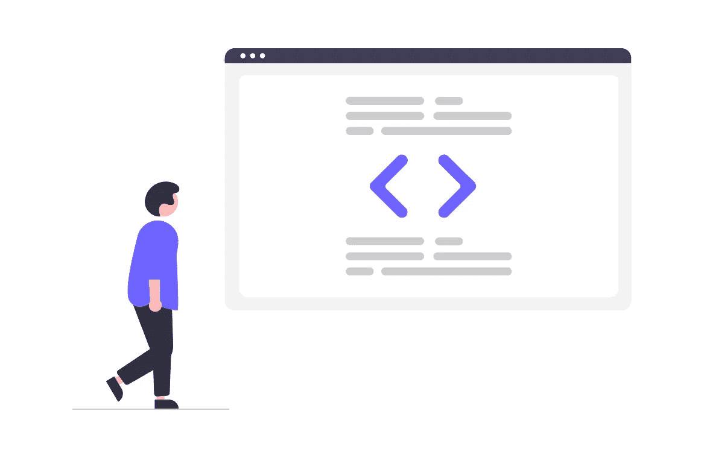

# 开始使用 React.js 时需要记住的事项

> 原文：<https://medium.com/nerd-for-tech/things-to-keep-in-mind-while-starting-with-react-js-cde16c03e084?source=collection_archive---------10----------------------->

**在我们用 React.js 开发应用程序时查看基本清单之前，我们应该先了解 React.js 是如何工作的**

我们都听说过 React 有虚拟 DOM 的概念，这有助于提高 SPA(单页应用程序)的性能，所以让我们来揭开这个虚拟 DOM 是什么的神秘面纱

> 虚拟 DOM 是 React 保存真实 DOM 的 UI 表示的内存

下一个问题出现在脑海中，React Virtual DOM 如何帮助提高性能，让我们接下来找到它

> *这些变化发生在用户界面中，而与应用程序的交互，无论是由某些事件还是某些 API 请求或副作用，都不会直接影响真实的 DOM，而是将这些变化传递到虚拟 DOM，然后使用 React Diffing 算法在虚拟 DOM 和真实 DOM 之间进行比较，因此存在差异的节点将反映在真实 DOM 中，其余节点在用户界面更新期间保持不变*

现在我们知道了 React.js 的基本功能，所以我们可以研究一下在开始使用 React.js 应用程序时需要记住的一些要点。我们将使事情变得非常简单，这样任何从 React.js 开始的人都会发现这篇文章很有帮助

**制造原子级别的小组件，然后将它们组合起来，构建大型组件**

*那么，将组件做得更小的原因是什么？*
正如我们之前所了解的，React 在虚拟 DOM 上工作，如果它发现组件中的差异，它将在实际 DOM 上重新渲染整个组件(虽然在重新渲染时有多种情况，但我们在这里保持事情简单，以便任何开始使用 React 的人都会发现这很有帮助)。比方说，如果我们有几百行代码的大型组件，这意味着它可能有更多的逻辑，更多的状态，这意味着如果有一些只是更新单个状态的事件，将重新呈现整个组件，因此在关注的基础上保持组件独立将有助于在单个更改时只更新组件的所需部分

**仅在需要时提升状态**

我们应该尽可能地保持组件本身的状态，而不是提升父组件的状态，这背后的原因是，如果有一些状态传递给子组件，这是为了单个子组件的唯一目的，在这种情况下，如果该状态有任何变化，它将重新呈现作为父组件一部分的其他子组件，让我们看一个例子

在上面的例子中，我们可以看到，如果我们增加 Component1 中的计数器，它不仅会重新呈现 Component1，还会重新呈现父组件和 Component2，因为它会改变父组件中的状态，而对于 Component2，如果我们增加计数器，它只会重新呈现 Component2。

> *虽然有提升状态的理由和防止重新呈现其他子组件的方法，但这超出了本文的范围，我们将在下一篇博客*中讨论这些

**躲避道具钻**

*在我们深入探究道具演练之前，我们必须知道什么是道具，什么是道具演练？*

> *属性是我们从一个组件传递到另一个组件的属性，而属性钻取是将属性从父组件传递到叶组件的方法，方法是将属性传递到父组件和叶组件之间所有不需要这些数据的组件*

*现在，为什么要避免道具钻？*

> *避免道具钻孔的原因有很多，其中一些是，那些组件不需要道具，没有必要让那些道具穿过它们，可能会有意外改变道具的机会，或者道具在中间被修改*

**根据关注点分离上下文**

在我们研究分离上下文以及由于不小心使用而导致的问题之前，有必要了解一下 React 中的上下文 API

> *上下文 API 是使用父节点到叶节点的数据的方法，无需通过不需要它的中间组件传递属性*

现在，让我们来看看上下文对于性能来说过于重要的场景

> *如果我们在使用上下文时不小心，它会对组件进行不必要的渲染，从而影响应用程序的性能。
> 假设我们有一个上下文，其中放置了用户和产品的数据，然后如果有任何事件更新了产品的数据，但用户数据在这种情况下没有改变，则上下文的所有消费者都会触发重新呈现，而不管它是消费产品数据还是用户，所以这就是为什么我们也应该基于关注点来尝试分离上下文。 因此，在我们的场景中，我们可以创建两个单独的上下文，一个用于用户，一个用于产品，这样，如果产品数据发生任何变化，用户的消费者就不会触发重新呈现。
> 通过使用 Redux 等各种状态管理库，有许多其他方法可以避免这种情况，但这超出了本文的范围*

因此，现在让我们用这些基本要点来总结这篇文章，在开发 React 应用程序时，我们可以记住这些要点，这不仅有助于以良好的方式组织应用程序，还有助于提高应用程序的性能。