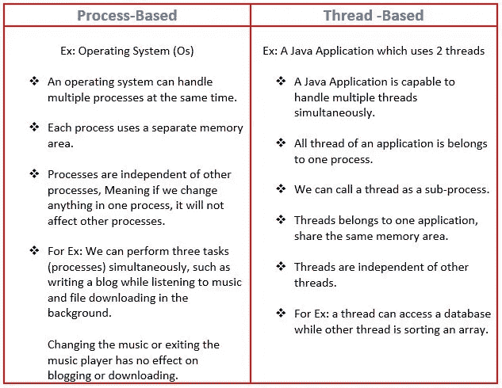
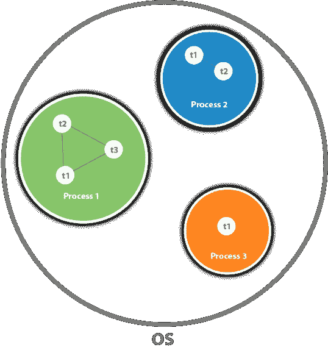
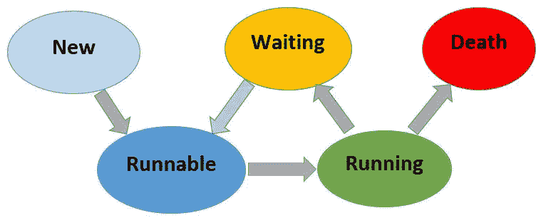
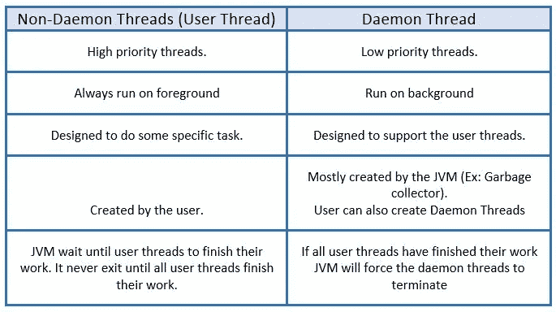

# 去面试之前，你应该知道的关于 JAVA 线程的事情

> 原文：<https://medium.com/nerd-for-tech/things-you-should-know-about-java-threads-before-going-to-an-interview-57e95e2c5278?source=collection_archive---------4----------------------->


马丁·威尔纳在 [Unsplash](https://unsplash.com?utm_source=medium&utm_medium=referral) 上的照片

让我们从基础开始。什么是 Java 线程？**线程是一个独立的执行流**。一个线程能够独立执行我们分配给它的任务。一个 Java 程序可以有多个线程来执行多任务处理。线程是独立的，这意味着当 Java 程序使用多线程时，如果一个线程发生错误，它不会影响其他线程。每个线程将同时执行分配给它的任务。

我们可以把多任务分成两类



多任务类型



进程与线程——photo by-[Java 教程要点](https://www.javatpoint.com/multithreading-in-java)

在本文中，我们集中讨论多线程(基于线程的多任务处理)

# 使用线程的目的

考虑下面的场景，一个应用程序必须执行 10 个任务。如果使用 1 个线程完成执行需要 10 秒，那么使用 10 个线程可以将执行时间减少到 1 秒吗？

具体要看执行情况。如果这些任务是相互独立的，这意味着没有任务要等到另一个任务完成，那么我们可以为每个线程分配一个任务。因此，这 10 个任务可以同时并行执行，我们可以节省一些时间。

但是如果这些任务依赖于其他任务，这意味着如果一个任务应该等待其他任务完成它的执行，那么我们不能并行执行那些依赖的任务。因此，我们不能通过简单地增加线程数量来减少时间。

此外，我们不能通过将相同的任务分配给 2 个线程来减少时间。因为两个线程执行任务的时间是一样的。

因此，作为结论，我们可以说我们可以使用多线程来执行独立的任务，而增加线程来执行依赖任务是没有意义的。

# 线程生命周期

理解**线程生命周期**对于理解线程的行为至关重要。让我们看看线程生命周期的每个状态。



线程生命周期

## 新状态

在新创建的线程实例上调用 start()方法之前，线程处于“新状态”。

## 可运行状态

该线程在调用 start()方法后处于“可运行状态”，但尚未被线程调度器选为运行线程。

## 运行状态

如果线程调度器选择它作为运行线程，它就处于“运行状态”。一个线程只有在处于“运行状态”时才会执行它的任务。

## 等待状态

当一个线程仍然存在，但没有资格运行时，该线程就处于“等待状态”。线程可以通过某些条件从“运行状态”转移到“等待状态”，例如:sleep()、wait()。同样，线程可以通过某些条件从“等待状态”转移到“可运行状态”，例如:notify()、interrupt()。

## 死亡状态

当一个线程完成了分配给它的所有任务，或者当它的 run()方法退出时，它将成为一个死线程。

# 创建线程

我们可以用两种不同的方式创建线程，它们是

1.  扩展线程类
2.  实现可运行接口

但是线程对象的行为在两种方式下是相同的。

# 方法 1:扩展线程类

线程创建方法 1

我们可以简单地通过在新创建的线程对象上调用 start()方法来创建线程。请参见下面的代码片段。

线程创建方法 1

## **这种线程创建方式的缺点**

我们知道 Java 不支持多重继承。这样，由于用户创建的类(Mythread)从“线程类”继承了特征，所以用户创建的类(Mythread)不能继承另一个类。

> 考虑下面的场景:“Employee”是父类，而“Manager”是子类。换句话说，“经理”类继承了“雇员”类的特征。现在，如果我们通过从“线程”类扩展来使“经理”类成为一个线程，“经理”类应该失去它与“雇员”类的关系，这意味着“经理”不再是“雇员”

## 关于扩展线程类创建的线程的一些事实

1.  **什么是 start()方法和 run()方法？**

答:我们覆盖 run()方法，并指定我们希望分配给新创建的线程的任务。然后，我们在创建的线程实例上调用 start()方法。请记住，start()方法属于“Thread”类，它将在内部调用 run()方法。

**2。如果我们没有覆盖 run()方法会发生什么？**

No run()方法

```
Output: <nothing>
```

答:将创建一个线程，但它什么也不做，然后它将进入死亡状态。

> 解释:当我们调用 start()方法时，将会创建一个线程。start()方法将在内部调用 run()方法。然后 JVM 检查子类是否包含 run()方法。如果是，那么将执行子类的 run 方法。如果没有，JVM 将执行父(线程)类的 run()方法。在 Java“Thread”类的 run()方法中不包含任何任务。因此，如果我们没有覆盖 run()方法，线程类的 run()方法将被调用，它什么也不做。

**3。我们可以重载 run()方法吗？**

重载的 run()方法

```
Output: Hi!! This is from child thread's default run method
```

答:是的，我们可以重载 run()方法。但是 start()方法只会调用没有参数的 run()方法。因此，重载的 run()方法不会被 start()方法调用。

**4。我们可以调用 run()方法而不是 start()方法吗？**

直接调用 run()方法

```
Output: This method is executed by: main
```

答:我们可以直接调用 run()方法。但是它不会创建新的子线程。相反，父线程将执行子线程对象的 run()方法。这将是一个典型的 OOP 方法调用。

> 解释:当我们调用 start()方法时，它执行许多任务。
> 
> 它确定线程是否已经存在。如果是，将会抛出一个错误。如果不是，则启动一个新线程，并且状态从 new 变为 runnable。当线程调度器有机会运行时，新线程将调用自己的 run()方法。
> 
> 所以如果我们调用 run()方法而不是 start()方法，start()方法的上述职责就无法执行了。因此，不会创建新线程。因此，父线程将像普通的方法调用一样调用子线程的 run()方法。

**5。我们可以覆盖 start()方法吗？**

覆盖开始方法

```
Output: This is start method
```

答:是的，我们可以覆盖 start()方法。但是这里将执行子线程的 start()方法的主体。因此，不会创建新线程，也不会执行 run 方法。

> 解释:只有“Thread”类的 start()方法有启动线程的指令。当我们调用 start()方法时，它检查子类是否有 start 方法。如果没有，它执行父线程的 start()方法。在这里，由于我们覆盖了 start()方法，现在子类有了自己的 start()方法。因此，当我们在这里调用 start()方法时，它将只执行子节点的 start()方法。

# 方法 2:实现 Runnable 接口

要通过 runnable 接口创建线程，我们必须创建一个实现 runnable 接口的类。

通过可运行接口创建线程

在实现了 runnable 接口之后，我们可以简单地通过创建一个线程对象来创建线程。

通过可运行接口创建线程

```
Output: Hi!! This is from a child thread which is created by runnable interface
```

## 使用实现可运行接口方法创建线程的优势

正如我们前面看到的，要创建一个线程，我们不能将“thread”类扩展到一个已经继承了另一个类的类。但是通过实现 runnable 接口，我们可以创建一个线程而不丢失它的继承关系。

> 还记得前面的“经理”和“员工”的例子吗？通过使用这种方法,“雇员”可以同时是“职员”和线程。

# 线程调度程序

只需多次执行上述代码。每次执行都会得到不同的输出，对吗？它的发生是因为执行的顺序。在多线程“**中，线程调度器“**决定哪个线程应该先执行，哪个是下一个。线程调度器根据其 JRE 中指定的机制来决定执行顺序。不同的 JRE 可以有不同的机制来决定执行的顺序。

## 线程优先级

在多线程**中，“线程调度器”**根据**线程的优先级**将线程分配给处理器。具有最高优先级的线程将有机会在其他线程之前执行。

当我们在 Java 中创建一个线程时，它总是被赋予一个优先级。优先级可以在线程创建时由 JVM 定义，也可以由程序员直接定义。线程可接受的优先级范围是 1 到 10，10 为最高，1 为最低。

如果线程优先级设置为 1-10 以外的值，应用程序将抛出“非法参数异常”

如果两个线程具有相同的优先级，我们无法预测哪个线程将首先运行。它由线程调度器的算法决定(循环、先来先服务等)

**主线程的优先级默认设置为 5**。当我们创建新线程时，它们将**继承其父线程**的优先级。

给线程分配**优先级**的步骤如下所述。

设置优先级的代码段

# 螺纹类型

java 中有两种类型的线程。



守护进程与非守护进程线程

我们可以创建一个非守护线程。setDaemon(true)。

创建守护线程的代码片段

# 线程中的一些重要方法

## 螺纹连接

。join() —当前线程等待指定线程死亡。

。加入或。join(long millis，int nanos) —当前线程等待指定时间，以等待指定线程死亡。

join()方法的代码片段

> 在上面的例子中，主线程将一直等到子线程(mythread)完成它的执行。

## 产量法

yield 方法向调度程序暗示当前线程愿意给其他线程机会。Yield 是一种本机方法，程序员通常使用这种方法进行调试。

yield()方法的代码片段

> 这里，当 yield 方法被调用时，主线程将把机会给任何其他线程(mythread1 或 mythread2 ),它将进入等待状态。线程调度器决定下一个运行的线程。

## 睡眠方法

当前正在运行的线程将在指定的时间内进入睡眠(等待状态)。

```
Ex: Thread.sleep(5000); //current thread will for 5 sec
```

## **中断方法**

该方法可以中断处于等待状态的线程(sleep()、wait()、join())。因此，被中断的线程可以唤醒并执行其任务。

```
Ex: t1.interrupt();
```

> 上面的代码会中断 t1 线程。

当我们调用 interrupt()方法时，如果指定的线程没有休眠(没有处于等待状态)，那么中断将一直等待，直到该线程进入休眠状态(等待状态)。如果线程进入睡眠状态，那么 interrupt()方法将中断线程。

## 该同步方法

如果我们使用 synchronize 方法，一次只有一个线程可以访问同一个对象中的方法。当线程调用一个同步方法时，该方法的对象被自动锁定，并在线程完成其任务时被释放。

```
public synchronized void myfunction(){
    //your code
}
```

## 等待方法

如果我们调用 wait()方法，当前线程将释放锁并进入**等待状态**。当另一个线程调用该对象的 notify()方法或 notifyAll()方法时，它将返回到**可运行状态**。

```
synchronized (obj){
   obj.wait();
}
```

## 通知方法

当我们调用 notify()方法时，等待特定对象的线程之一将回到**的可运行状态。**

```
synchronized (obj){
   obj.notify();
}
```

## 通知所有方法

当我们调用 notifyAll()方法时，等待特定对象的每一个线程都会回到 **Runnable 状态。**

```
synchronized (obj){
   obj.notifyAll();
}
```

## 继续学习❤️

# 参考

2018.*Java 01 中的线程*。[视频]可在:<[https://www.youtube.com/watch?v=Y9JDbm8edOk](https://www.youtube.com/watch?v=Y9JDbm8edOk)>【2021 年 5 月 12 日访问】。

[www.javatpoint.com。](http://www.javatpoint.com.) 2021。*教程—Java point*。[在线]可在:<[https://www.javatpoint.com/](https://www.javatpoint.com/)>【2021 年 5 月 12 日访问】。

Docs.oracle.com 2021 年。*线程(Java 平台 SE 7 )* 。[在线]见:<[https://docs . Oracle . com/javase/7/docs/API/Java/lang/thread . html](https://docs.oracle.com/javase/7/docs/api/java/lang/Thread.html)>【2021 年 5 月 12 日访问】。