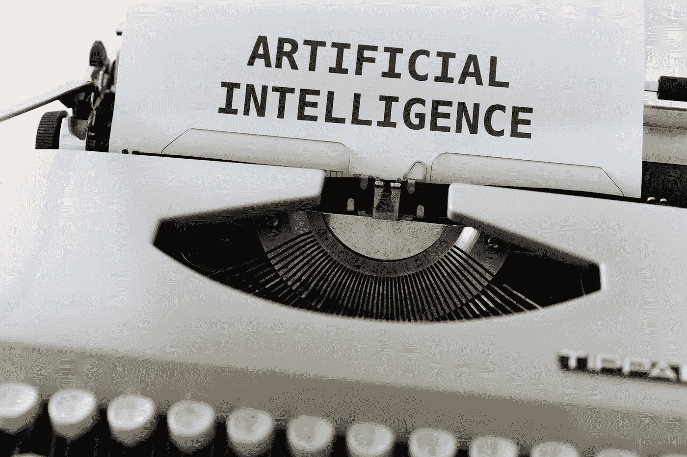

# 关于人工智能的三个误区

> 原文：<https://medium.com/nerd-for-tech/three-misunderstandings-about-artificial-intelligence-1483281a9521?source=collection_archive---------3----------------------->

人工智能技术正在进入工作环境，取代普通重复的手工工作，以其他方式改变其他任务。人工智能技术渗透到业务的各个方面，并驱动组织战略。研究公司 Gartner 预测，到 2025 年，人工智能将成为驱动组织基础设施决策的主要技术之一。然而，即使人们对人工智能的兴趣上升，对这项技术的一些误解仍然存在。

## **误区 1:人工智能在疫情是奢侈品**

**事实:**即使在危机期间，组织对人工智能的兴趣和投资也在继续增长。Gartner 最近的一项调查发现，自爆发以来，24%的组织增加了对人工智能的投资，42%的组织保持不变。

在疫情继续蔓延的同时，人工智能帮助医疗保健和政府首席信息官承担预测病毒传播和优化应急资源等任务。尽管如此，在疫情之后，各公司加快复苏也是至关重要的。人工智能一直是成本优化和业务连续性的重要推动者，在不中断业务的情况下支持收入增长，并改善客户互动。

## **误区二:人工智能只能替代普通重复的任务**

随着时间的推移，许多技术影响了人们的工作方式。因此，某些职业已经消失，而新的职业不断出现。例如，今天几乎没有打字员，就像十年前几乎没有社交媒体营销经理一样。

然而，人工智能不仅具有自动化平凡或重复任务的潜力，还可以通过完成更高价值的任务来帮助改善或改变其他工作。例如，人工智能可以在几分钟内阅读数千份法律合同，并比工作人员更快、更好地提取有用的信息。

## **神话 3:人工智能完全是关于算法和模型的**

构建和应用机器学习算法来创建预测模型通常是人工智能项目中最简单的部分。更具挑战性的部分包括:

*   确保人工智能解决的问题定义明确。
*   收集和管理足够的正确数据。
*   部署是人工智能项目中最具挑战性的部分。

# 人工智能对高质量数据的依赖

人工智能行业有一个重要共识:

训练数据的质量直接决定了最终 AI 模型的性能。数据的可伸缩性和准确性越高，算法就越稳健。

随着 AI 商业化进程的加快，以及辅助驾驶、客服聊天机器人等 AI 技术在各行各业的应用，人们对特殊场景下的数据质量的期望越来越高。高质量的标签数据将是人工智能公司的核心竞争力之一。

如果说之前的算法模型使用的一般数据集是粗粮，那么算法模型目前需要的是定制的营养餐。如果公司想要进一步提高某些模型的商业化，他们必须逐步从通用数据集向前发展，以创建独特的数据集。

# 结束

将你的数据标注任务外包给 [ByteBridge](https://tinyurl.com/mrx5ht55) ，你可以更便宜更快的获得高质量的 ML 训练数据集！

*   无需信用卡的免费试用:您可以快速获得样品结果，检查输出，并直接向我们的项目经理反馈。
*   100%人工验证
*   透明标准定价:[有明确的定价](https://www.bytebridge.io/#/?module=price)(含人工成本)

**为什么不试一试？**

资料来源:https://www.robot-china.com/news/202104/01/65860.html