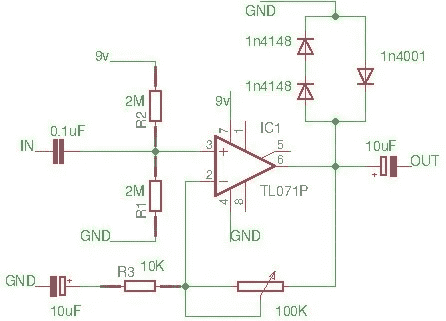
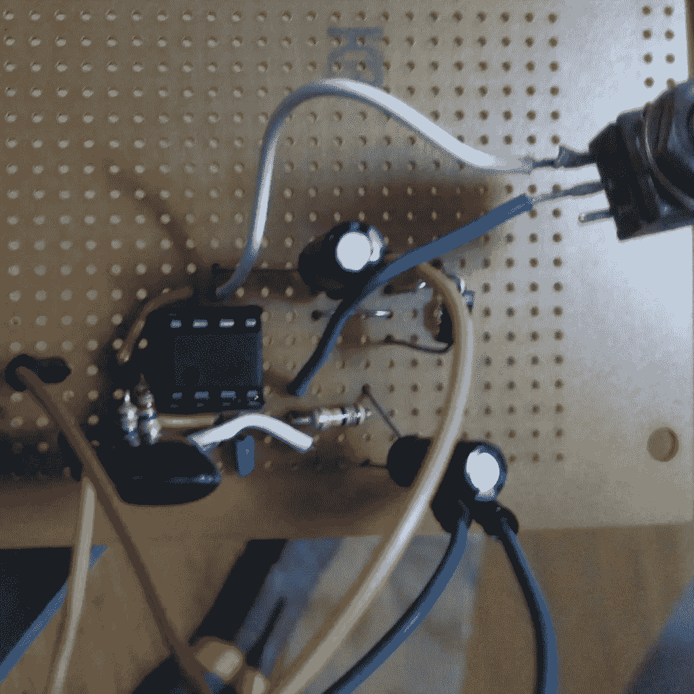

# TL071 嘎吱嘎吱！

> 原文：<https://medium.com/nerd-for-tech/tl071-crunch-70fc020d4eec?source=collection_archive---------12----------------------->

## 使用 TL071 作为信号放大器的简单效果踏板。

作者图片

距离我上次尝试制作自己的效果踏板已经有一段时间了。到目前为止，我的大部分设计要么非常简单，要么过于复杂，毫无特色。我决定把它带回基础，建立一个单一的增益级超速/加速器踏板。

作者图片

这不是一个新的运算放大器，它已经存在了很长一段时间，你可能有一个或两个效果踏板，无论是这个还是它的兄弟，TL072(双通道 TL071)。他们使用 JFET 作为输入晶体管，听起来显然更好，他们是一个相当不错的声音运算放大器，所以我倾向于同意。

TL071 作为低噪声、JFET 输入、通用运算放大器销售。我选择使用 TL071，主要是因为我需要一个单增益级电路，并且有几个这样的电路。我很高兴我做到了！

我使用相当标准的输入和输出电容，输入电容为 0.1uF，输出电容为 10uF。我在网上看了一些图表后选了这些。我为每一个测试了一些不同的值，并决定这些非常适合我的吉他和放大器。我用绿色电容作为输入电容，用低压电解电容作为输出电容。

最初，我使用运算放大器以大约 100 倍的增益(一只老鼠)驱动它进行削波。这实际上听起来令人惊讶的好，但当试图驯服控制有点性交。我决定将增益范围设置电阻从 1k 提高到 10k(我只有 100k pots atm，因此 100 倍增益降至 10 倍增益)。这听起来真的很好，作为一个加速踏板(那些输入/输出上限值听起来很好！)，但我想从中获得更多的分手感。

我决定加入一些二极管剪辑。过去，我大多在运算放大器的反馈路径上使用更柔和的削波，但这次我只想将这些峰值转储到地。最近，我用 Ge/Si 信号二极管、FET 和一些功率二极管做了一些不同类型的削波。我真的很喜欢一边是两个 4148，另一边是一个 4001 的不对称声音。这些都是硅二极管，它们听起来很棒，我可以与 FET 和 Ge 二极管竞争削波。他们都有细微的差别，可能只是我的功放和吉他，但我觉得 Si 在这个应用中听起来更好。

作者图片

这个踏板不是很响，当我像这样限幅信号时，我直接将输出转储到地，这将给我大约 `(0.6v+0.6v) + 0.5v = 1.7v`的最大摆动。我的其他一些踏板在削波后有增益级来提高输出。当我有机会的时候，我会把示波器放在上面，我很好奇我是否正确理解了这条电路。

我可以增加另一个运算放大器来缓冲分压器的输出，而不是直接使用分压器，这样显然可以提供更稳定的电源，因为输入端的任何其它电阻都不会改变分压器的值。我以前没有尝试过这种方法，但是我在网上的各种齿轮制造论坛上听说过它的良好效果。

我想添加一个开关，并在踏板外部放置一些插座，以便在其他剪辑设置之间进行交换，或者甚至使用外部插座即时构建一个。添加一些选择器开关，以在输入/输出上限的较高/较低值之间切换。这将是一个有趣的踏板，使它在不同的放大器/吉他设置之间更加通用。

*最初发表于*[*【https://blog.schlerp.net】*](https://blog.schlerp.net/tl071-crunch.html)*。*