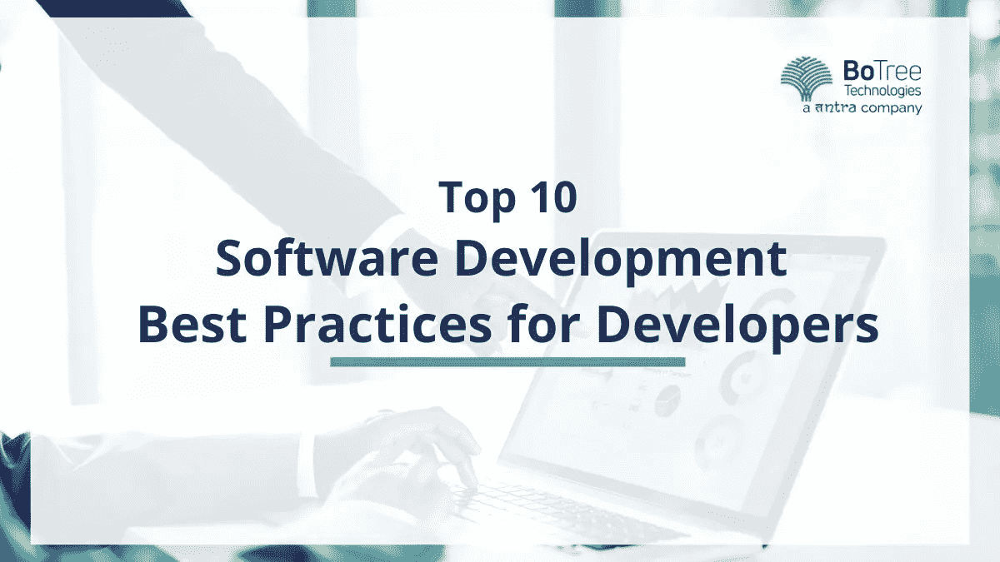

# 2023 年十大软件开发最佳实践

> 原文：<https://medium.com/nerd-for-tech/top-10-software-development-best-practices-for-developers-49bff3ccc92?source=collection_archive---------2----------------------->

随着软件开发的不断发展，我们开发应用程序的方式正在发生转变。在本指南中，我们将了解 2023 年顶级[软件开发实践](https://www.botreetechnologies.com/blog/7-best-software-development-practices-to-follow-in-2022/)以及企业软件开发公司遵循的技术。我们还在网上收录了一些我们最喜欢的关于这些主题的文章。

# 开发人员的软件开发最佳实践

1.  **机器学习:**

*   人工智能的领域和机器学习的范围非常广泛。它是一种编程技术，使计算机能够在没有明确教授的情况下学习。换句话说，利用历史数据，机器学习可以用来预测未来的结果。
*   预测分析使用算法和统计模型来分析关于客户或潜在客户的大量数据，是机器学习经常使用的领域。这意味着它有助于企业在业务运营方面做出更好的决策。例如，如果你正在经营一家在线企业，并想知道哪种产品最适合你的目标市场，你可以使用机器学习算法来查看与他们相似的客户以前的购买情况，以了解哪些产品可能也最适合他们！

**2。敏捷开发:**

*   敏捷开发是一种软件开发方法，一家顶级软件开发公司[遵循这种方法](https://www.botreetechnologies.com/)，该公司希望将功能软件置于全面文档之上，并将人和交互置于比过程和技术更重要的位置。它建立在持续关注客户需求、快速迭代(快速反馈周期)、持续适应不断变化的需求以及所有团队成员之间持续面对面交流的原则之上(这在远程团队中尤其重要，因为在那里每个人都无法简单地看到其他人在做什么)。
*   希望他们的产品或服务比传统流程更快可用的组织通常采用敏捷方法。这可以通过利用敏捷框架来实现，比如 Scrum 或看板，它们提供了团队应该如何协作的指导，以便比瀑布或遗留模型等更传统的方法更快地生产出高质量的产品。

**3。分布式计算:**

*   随着软件开发变得越来越复杂，分布式计算变得越来越必要。在各种机器之间传播计算是被称为分布式计算的计算机科学学科的焦点。随着更好的稳定性和安全性，它使软件解决方案公司能够构建更加灵活和可伸缩的软件。
*   有几个软件开发最佳实践可以用来提高分布式计算的效率。首先要设计适合传播的算法。这需要考虑网络的特征和每个节点上可访问的资源。为了确保节点之间有效和可靠的通信，仔细选择合适的通信协议也很重要。最后，为了成功地管理和跟踪系统的性能，从整体上很好地理解系统是至关重要的。

**4。人工智能:**

*   [人工智能](https://www.botreetechnologies.com/artificial-intelligence-solutions)是最具变革性的技术之一。借助人工智能，企业可以实现任务自动化，提高效率，做出更好的决策。
*   在软件开发方面，人工智能可以用来创建更友好的用户界面，加快测试和调试过程，甚至帮助开发人员编写代码。
*   这里有一些在软件开发中使用人工智能的最佳实践:
*   用 AI 创造更人性化的界面。
*   用人工智能加速测试和调试过程。
*   用 AI 帮助开发者写代码。
*   利用人工智能提高软件质量保证
*   使用人工智能监控软件开发过程。

**5。网络安全:**

*   对于软件工程师来说，技术的动态本质带来了新的困难。跟上最新的软件开发实践对于开发和网络安全保持领先至关重要。
*   保护互联网需要一个团队。尽管每家公司都有自己的网络安全政策和程序，但是将安全性集成到您的软件开发生命周期中是应对网络攻击的最佳方式。
*   网络安全可以被视为整个软件开发过程的重要组成部分，积极参与项目的每个阶段，从需求收集到测试和部署。此外，重要的是你的员工中有人知道如何防御网络危险，如网络钓鱼邮件和公司计算机上的恶意软件感染，应该通过使用具有网络保护功能的防病毒软件来保护[。这些杀毒软件将保护你的电脑数据免受恶意软件和特洛伊木马的侵害。你对网络攻击了解得越多，你就越有可能保证数据的安全。](https://www.safetydetectives.com/blog/best-antivirus-with-internet-security/)
*   软件开发生命周期的每个元素都应该考虑网络安全，包括设计、开发和测试阶段，以及维护周期、与供应商合作，甚至董事会议！

**6。微服务:**

*   自从互联网出现以来，微服务已经极大地改变了软件开发。它们使小团队能够独立运作，同时保持对产品的共同理解。
*   微服务是作为独立的应用程序创建的，它们通过 API 相互通信。对于开发人员来说，在不中断系统其他组件的情况下添加新功能更加简单，因为每个微服务都有自己的代码库和部署过程。此外，您可以这样做，而不必担心它会如何影响您的应用程序或基础架构的其他组件，从而允许您独立地扩展各个组件(反之亦然)。

**7。快速原型和创新:**

*   创建软件的过程总是在变化，变得更加棘手。组织必须不断地在研发上投入资金，以掌握最新的趋势和最佳实践。原型是研发的关键组成部分之一。
*   组织可以通过原型快速而经济地测试新概念。它是创新的重要工具，因为它使开发人员能够测试新的想法，并评估它们在现实世界中的表现。此外，原型制作使企业能够在开发过程的早期获得用户输入，这可以增强最终产品。
*   原型可以用多种方式完成，一个组织的最佳行动方案将取决于它的特定需求。然而，测试驱动开发、极限编程和敏捷开发是一些最受欢迎的方法。
*   此外，组织希望在加速原型开发的设备和定制软件上花钱。软件和硬件工具都属于这一类。例如，3D 打印机可以用来快速高效地生产物理原型。此外，有许多软件平台使开发人员能够快速有效地生成数字原型。
*   组织可以通过投资快速原型开发来保持领先并保持竞争优势。

**8。现场可靠性工程:**

*   高性能、高可用性和可伸缩性的网站或服务是使用一套被称为站点可靠性工程(SRE)的实践和方法来设计、构建和运营的。对业务至关重要的软件系统的架构和实施是 SRE 专业职位的重点。
*   sre 应该专注于他们的应用程序如何支持这些应用程序，例如允许客户交互的网站或客户服务门户。这些应用程序可能是移动优先的，也可能是基于桌面的，所以为了确保每个人都能顺利运行，你需要一家熟悉这两种平台的[企业软件开发公司](https://www.botreetechnologies.com/enterprise-software-development-company)。

**9。持续集成和持续交付(CI/CD):**

*   一种被称为持续集成和持续交付(CI/CD)的软件开发技术近年来越来越流行。您可以使用 CI/CD 自动化软件开发、测试和发布过程。敏捷团队从中受益，因为这使得他们比以往更快地交付新特性成为可能。
*   除了使发布更快之外，CI/CD 还帮助团队在完成后立即开始添加新特性。这种情况的主要原因是，开发人员在刚开始开发项目的代码库时，比开发后期要做的工作要少。一些组件已经为实现或测试做好了准备(单元测试之类的元素)。

**10。云原生技术:**

*   云原生技术是那些被设计在云中运行的技术。它们被构建为可扩展、可靠且易于管理。云原生技术包括平台即服务(PaaS)、基础设施即服务(IaaS)和软件即服务(SaaS)。
*   PaaS 为开发人员在云中构建、测试和部署应用程序提供了一个平台。IaaS 提供基础设施级别的服务，如存储、网络和计算能力。SaaS 是一种通过互联网交付的软件应用程序。
*   在为您的项目选择云原生技术时，考虑您的应用程序的需求非常重要。您还应该考虑不同的[企业软件解决方案公司](https://www.botreetechnologies.com/blog/types-of-enterprise-software-for-companies/)的能力，并选择最符合您需求的一个。