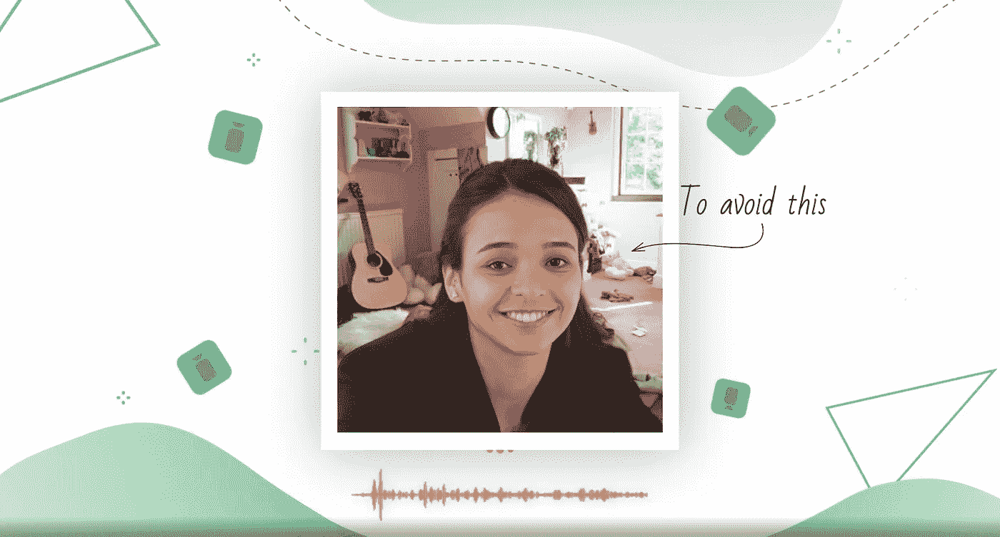
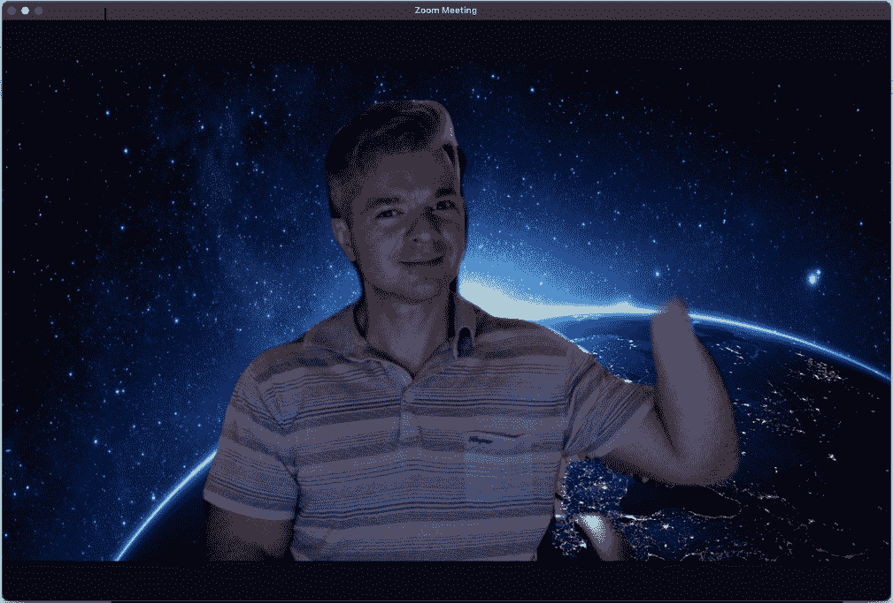
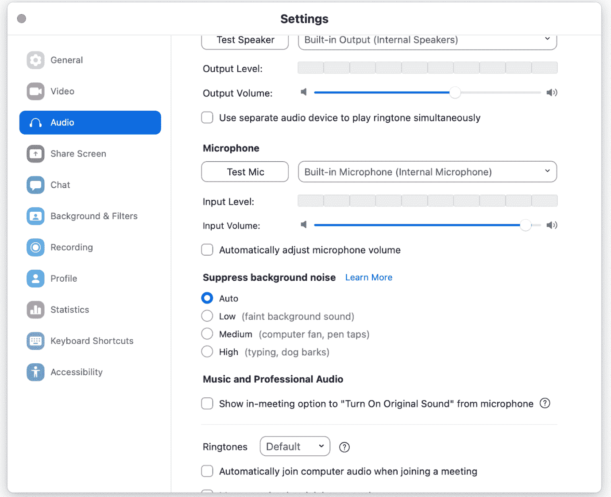
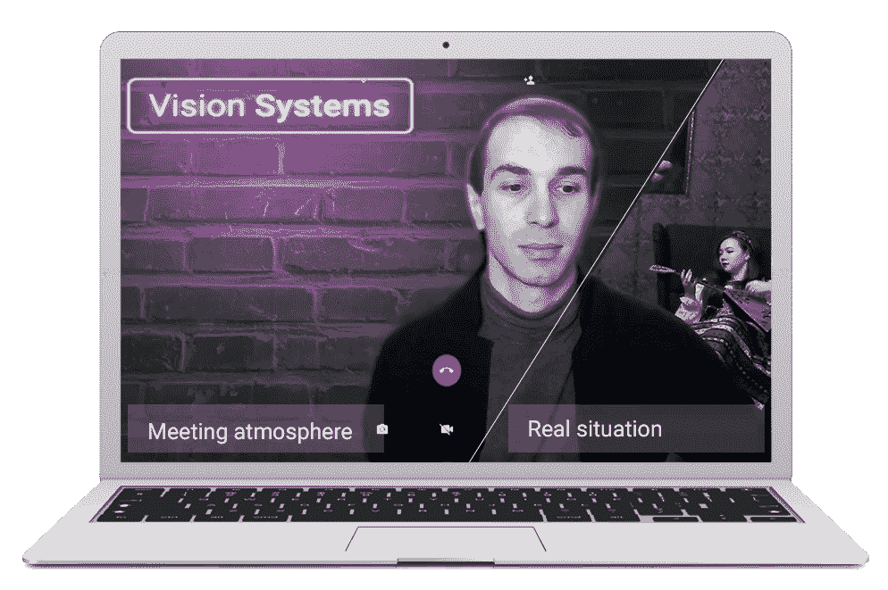

# 顶级 3 + 1 智能工具，让在家召开会议变得更加便捷

> 原文：<https://medium.com/nerd-for-tech/top-3-1-smart-tools-to-make-conferencing-from-home-convenient-6468895e2c2b?source=collection_archive---------22----------------------->

今天的疫情现实已经极大地影响了几乎所有公司的工作流程。对我们许多人来说，在家远程工作已经成为一个重大挑战。在厨房里快速安排会议的能力或者在重要电话中说服家人和宠物保持安静的能力已经成为简历中值得一提的关键成功要素

在这篇文章中，我们想分享一些流行的工具，它们可以使在线通话更加方便，同时也是我们自己的工具，让你在这种新的远程工作环境中的生活更加轻松。

# 关于我们的几句话

我们公司 [*VisionSystems*](https://visionsystems.tech/) 几年来一直是人工智能和计算机视觉领域的开发者。一直以来，我们都在为私人客户做项目，包括智能视频监控系统、视频欺诈检测、用于视频会议的自动分析系统(包括识别与会者的情绪)、自动会议记录、用于在会议中快速找到必要信息的事件标记等等。

尽管我们在视频和音频通信领域有两年多的经验，但和大多数其他公司一样，我们没有为疫情的爆发做好准备。与客户的交流已经完全转移到了网上。我们的一些客户使用 zoom 和 skype 作为在线交流的标准工具，而其他人则选择 webex、google meet、微软团队和其他解决方案。由于不得不处理视频聊天应用的整个“动物园”，我们的团队意识到**所有产品都提供不同的功能**，有**它们自己的设置菜单逻辑**，并且**市场还没有开发出任何单一的标准**来方便拨打工作电话。让我们看看我们认为有用的流行产品的功能、定制选项，并探索我们决定创建自己的解决方案的原因。

尽管视频通话系统有丰富的不同功能，但其中两项在我们的体验中非常关键:

1.  **消除外来噪音**的能力(即街道噪音，或来自邻居的家庭维修噪音，该邻居在自我隔离中决定最终这样做并在墙上挂一幅画)；
2.  **用一些中性的室内场景图片替换人后面的背景**，允许你隐藏你当前位置的不必要的细节，这可能会分散对话者的注意力，甚至提出不想要的问题(如果一个突然迟到的电话抓住了你，比如说，在啤酒吧)。

有了这些可能性中的两个，你可以在家里、嘈杂的咖啡馆或街道上安全地交流，而会议的其他参与者不会意识到这一点。你不再需要让你周围的每个人都踮着脚围着你，或者寻找一个好的角度来设置你的相机。但是如何配置这些功能呢？

有两种方法可以做到这一点:使用视频通话应用程序，如果这些功能已经存在，或者安装一个单独的产品与视频会议程序集成。

先说第一个。

具有内置功能的应用程序

让我们以两个最流行的解决方案为例进行分析:Zoom 和 Webex，它们分别普遍存在于大众和企业市场。Skype、Google Meet、微软团队等其他应用也反映了类似的趋势。

## 1.一款云视频会议软件

**把背景换成虚拟的**

有质量相当稳定的基本功能。它包括使用短视频作为虚拟背景和上传自己的背景的能力。有时候，在引擎盖下使用的算法可以“切断”用户身体的一部分。例如，在正确识别说话者的手方面存在已知的困难。

我们的测试表明，该功能无法在最新一代的入门级双核 i3 笔记本电脑处理器上运行。

不幸的是，尽管该应用程序正在积极开发中，但在最新版本中，仍然没有市场上要求的附加可选功能，例如将用户面部的照明调整到虚拟背景的照明。除此之外，还不能将演示文稿用作虚拟背景。

**过滤外来噪音**

这个特性被很好地完全实现了，但是由于某种原因，它在默认情况下是禁用的。在默认的“自动”模式下，噪音等大声音不会被过滤。为了实现有效的过滤，有必要对设置进行一些修改。毫不奇怪，我们采访的 90%广泛使用变焦并在会议中遇到背景噪音问题的人都不知道这一功能，也不准备尝试手动设置。此外，该应用程序没有过滤来自对话者的视频流的能力。这意味着一个人在一个嘈杂的地方足以让所有参与者同时难以沟通。

## 2.Webex

**将背景更改为虚拟背景**

背景替换的质量明显不如 Zoom 和许多其他流行的视频聊天应用。在背景和人的边界处，特别是在弱光条件下，经常会有明显的中断或不规则，从而引起不必要的注意。默认的背景设置也不是很多样化。

**过滤外来噪音**

我们测试的版本有噪音过滤功能，但与 Zoom 不同，它无法在保留人声的同时消除噪音。相反，他们使用 VAD 方法(语音活动检测)来自动阻止麦克风，如果没有人说话。自然地，在发言时，所有伴随的噪声继续进入声音馈送，并被传输到所有的会议参与者。

***总结已经内置在热门应用中的功能:***

*+* *基本功能开箱即用。*

*+* *可用的工具工作可靠，在它们的实现背后有强大的开发团队。*

*+*+*做好系统负载优化。*

*-不同的应用程序提供不同的功能。每个应用程序都有自己的风格，需要单独的测试和设置，而大多数用户还没有做好准备。*

*-对于大型视频会议服务，这些功能并不重要。现在的市场领导者根本无力向市场推出超级新鲜、未经检验的创意，以免吓跑现在的观众。*

## 独立产品

由于一些视频会议应用同时具有声音清理和背景替换功能，而另一些则没有，因此市场上开始出现了承担这些任务的独立解决方案:

*   **克里斯普**

从音频流中过滤外来噪声的最流行的应用程序之一。Krisp 使用神经网络来完成它的工作，这允许在过滤噪声的同时保留整个频率范围，从而以最不受干扰的形式保留更多有用的信号，即人类语音。这种工艺的质量是市场上最好的之一，而且它能够同时过滤来自你的麦克风和打电话给你的人的麦克风的噪音。免费版的声音过滤限制为每周 120 分钟。

*   **XSplit VCam**

此工具用于在没有此类选项或现有选项质量差的应用程序中用虚拟背景替换背景。应用的优化和稳定性比 Zoom 和 Webex 稍差。在我们的测试中，在入门级处理器上使用该应用程序被证明是有问题的。

*   **嗯嗯**

这是一项虚拟演示服务。除了用虚拟背景替换背景之外，实现的一个很酷的功能是使用演示幻灯片代替虚拟背景。这非常方便，可以让你的演示更自然，传递演讲者的面部表情和手势。

**总结一下:**

市场上有许多独立的产品可以提高在办公室外召开会议的便利性:

优点:

+几乎所有视频通话服务都支持这些功能。

+快速实现用户要求的新功能，如演示的背景替换和两个音频通道中的噪声过滤。

缺点:

-优化和响应速度可能落后于主要视频会议服务的内置功能。

-每个应用程序都涵盖其自身的特定任务，并不提供全面的解决方案。要打电话，用户需要安装几个额外的应用程序，把他的电脑变成一架战斗机的驾驶舱。

## 4.净化器——人工智能视频会议助手

*可在本文末尾的产品搜索链接上找到。*

*为什么我们还需要一个视频会议助理？*

我们想创建**多功能**应用。这意味着所有的基本工具必须组装在一个包中，通过直观的设置在所有视频会议服务中统一可用。该应用程序在后台工作，无需您的关注，允许您在所有视频会议服务中替换背景并执行双向噪音过滤，甚至在入门级处理器上只需按一下按钮。

利用我们在计算机视觉和数字信号处理方面的丰富经验，我们设法创建了自己的神经网络实施方案来取代背景，并对其进行优化，以便与声音同时工作。这不是一个简单的任务，许多公司花费了数百万来解决这个问题，现在看来我们成功了。

**当前版本解决方案的优缺点:**

+在一个应用程序中提供所有有用的功能。

+极简设置，设置一次就忘了。

+甚至可以在入门级处理器上运行。

-第一个版本仅在 MAC OS 上可用(请将您的应用程序保留在等待列表中，以便在准备就绪后立即免费访问 Windows 版本)。

-该应用程序仍处于测试阶段。随着我们离发布越来越近，工作质量和特性集将会提高。

我们知道下一步该做什么

在目前版本的净化器中，只有过滤噪音和背景两个基本功能，但我们相信我们的助手应该可以做得更多。在未来的版本中，我们计划增加一些新功能:

*   代替虚拟背景的幻灯片演示演示，
*   一个创建品牌企业背景的工具，
*   用手势画画，
*   记录和存储会议，
*   会议日志，
*   AR 表情。

# 成为第一批用户！

该应用程序最近在产品搜索上推出。在那里，您可以找到更多相关信息，观看声音过滤的视频示例，并下载应用程序。我们将非常感谢您参与我们的测试以及任何反馈。作为奖励，我们的第一批用户将能够免费使用该产品，快速接收新鲜的更新，当然，由于他们的想法，直接影响产品的开发。

点击链接，下载应用程序并升级您的视频聊天！[https://www.producthunt.com/posts/purifier](https://www.producthunt.com/posts/purifier)