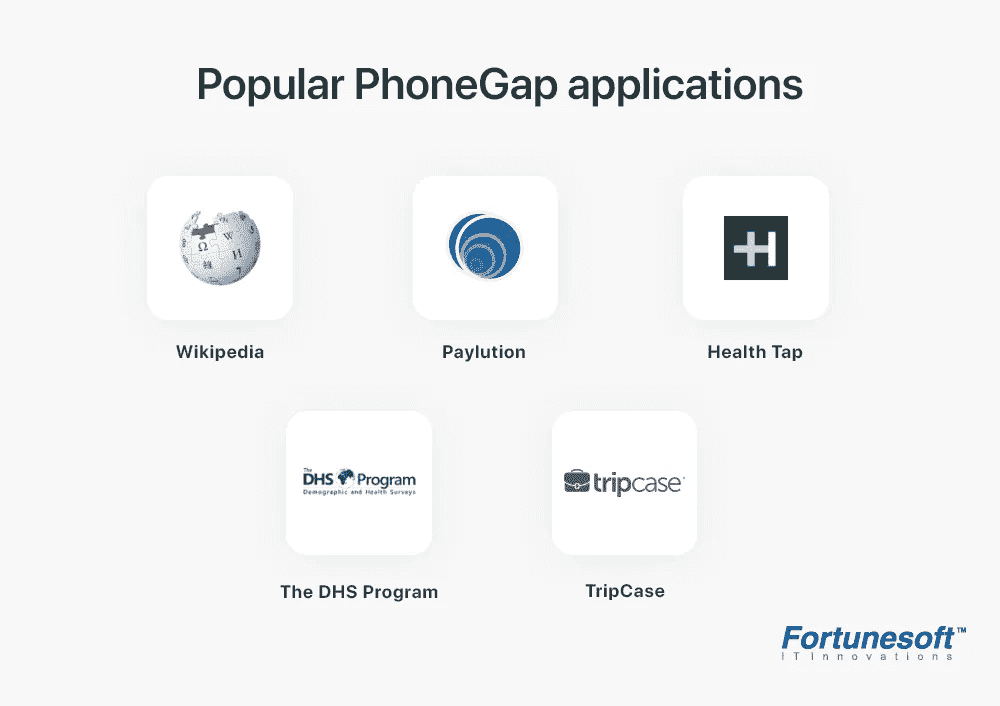
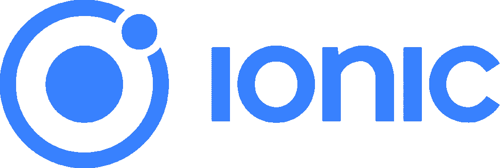
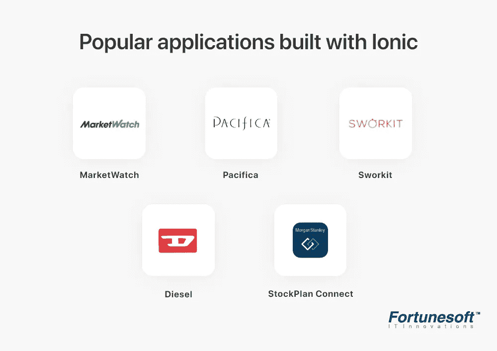
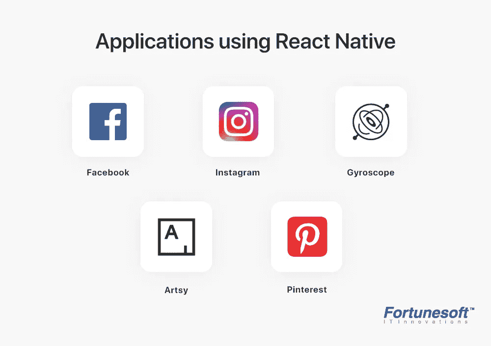
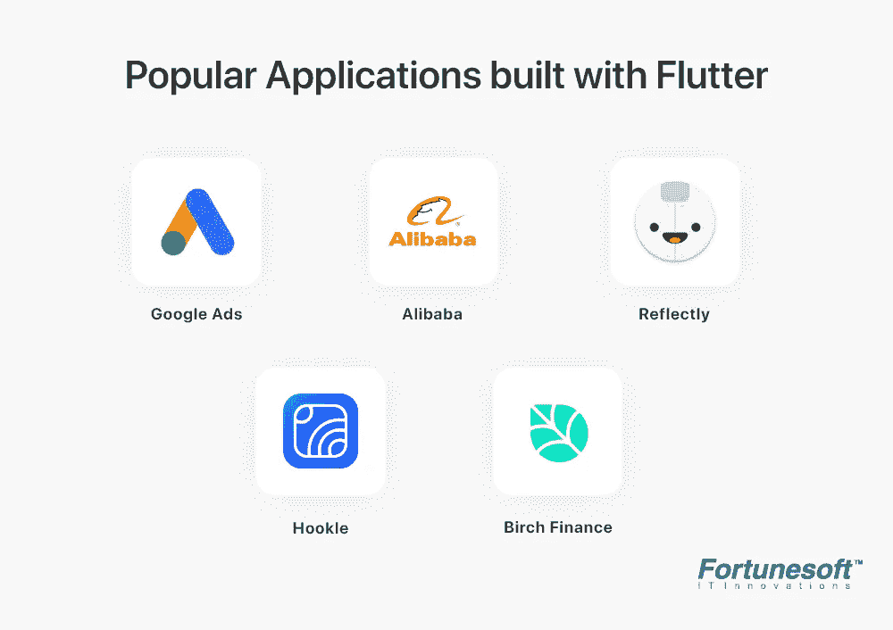
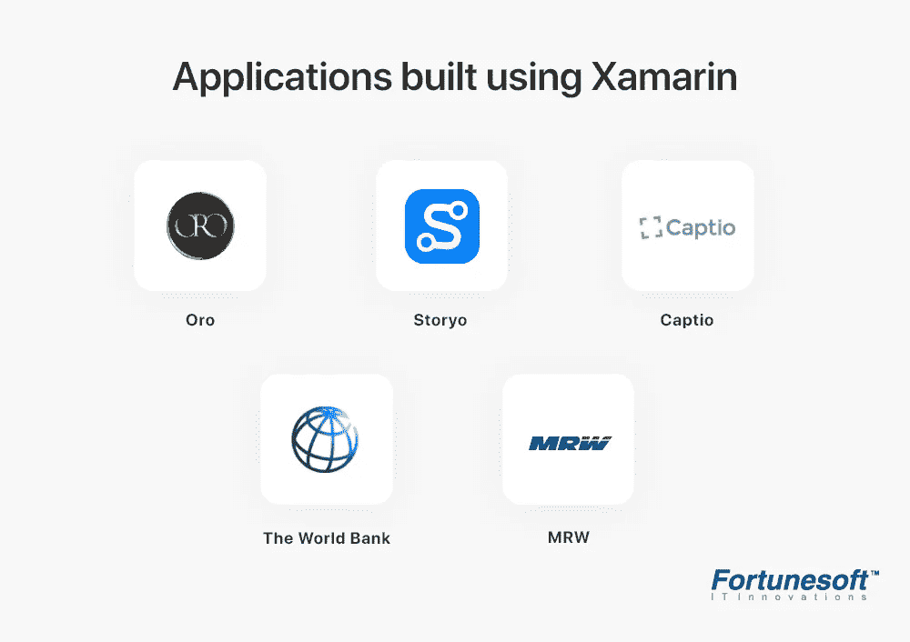

# 2021 年你需要知道的 5 大跨平台应用开发框架

> 原文：<https://medium.com/nerd-for-tech/top-5-cross-platform-app-development-frameworks-you-need-to-know-in-2021-405404cf12fd?source=collection_archive---------1----------------------->

企业不能错过他们在 Google Play 或苹果应用商店等平台上的存在。根据这份[报告](https://www.grandviewresearch.com/industry-analysis/mobile-application-market)，2019 年全球移动市场份额价值 1540.5 亿美元，预计从 2020 年到 2027 年，CAGR 将以每年 11.5%的速度增长。

企业希望通过高度直观和引人入胜的移动应用程序深入市场，因为这些应用程序可以随时通过便携式设备轻松地将企业与用户联系起来。随着可变设备的采用和多个领域的客户群的增加，移动市场经历了巨大的变化和最大的增长。

但是企业寻求最佳的、便于携带的解决方案。因此，组织选择原生应用。这让跨平台应用有理由成为 Android 和 iOS 上移动应用开发的重要和无可匹敌的选择。

让我们来看看 2021 年前 5 大跨平台应用开发框架。

# 1.PhoneGap

PhoneGap 是一个开源的跨平台应用程序开发框架，使移动应用程序开发人员能够以一种轻松的方式进行编码。它提供了使用不同语言的灵活性，对开发者没有任何硬件限制。PhoneGap 由 Adobe 开发，它提供基于云的解决方案，允许移动应用程序开发人员直接在平台上开发移动应用程序。

**背景**

1.带有 Apache License 2.0 的开源跨平台应用程序开发框架

2.PhoneGap 的最新版本是 2020 年 8 月 4 日的 10.0.0。

3.PhoneGap 适用于 Android、iOS、Windows 和电子平台

4.使用的编程语言有 JavaScript、HTML、CSS、Java、HTML5、Objective-C、C#、C++

5.PhoneGap 允许移动应用程序开发人员访问原生 API，以便您的移动应用程序可以使用所有原生功能，如摄像头、地理定位、加速度计、联系人等。

6.如果您正在寻找一个具有本机外观的简单移动应用程序，同时节省一些开发费用，PhoneGap 是最佳选择。

**PhoneGap 的优点**

*   健壮的后端:提供更快的开发过程，同时减少开发人员的工作量。
*   **灵活性:**提供 JavaScript、HTML、CSS、Java、HTML5、Objective-C、C#、C++的移动应用开发
*   **多平台:**为多平台提供具有原生外观和感觉的移动应用程序开发
*   **UI 库:**提供了大量的 UI 库，有助于改善不同目标观众的观看体验
*   **更快的开发:**提供了一个快速的开发过程，因为它提供了灵活性
*   **大型社区基地:**提供大型社区基地和充足的支持
*   **接入设备硬件:**完全利用设备功能，如摄像头、地理定位，以获得更好的用户体验

**PhoneGap 的弊端**

*   不适合有很多图形元素的应用程序
*   缺少对应用程序开发至关重要的描述性文档
*   不适合游戏应用
*   缺少对有钩子的插件的支持

# 流行的 PhoneGap 应用程序

# 2.离子的

现在，使用 Ionic 应用程序开发框架，混合应用程序开发变得更加容易。如果你正在寻找更快的商业应用程序开发，Ionic 是最适合你的。Ionic 使用单一代码库。它有一个巨大的工具库，由最新的组件组成。Ionic 继承了一些 iOS 和 Android 设计元素，允许它构建类似原生的混合应用程序和渐进式网络应用程序。雇佣 Ionic 应用程序开发人员来制作可以在多种设备上无缝运行的混合应用程序。

**背景**

1.面向混合应用开发的开源跨平台框架

2.爱奥尼亚是 2013 年 Drifty 公司的马克斯·林奇、本·斯佩里和亚当·布拉德利

3.最新版本是 2021 年 2 月 4 日的 5.5.4

4.爱奥尼亚是建立在安古拉吉斯和阿帕奇科尔多瓦

5.它由麻省理工学院许可证组成

6.Ionic 使用 HTML、CSS、JavaScript 和 Angular 等前端技术进行应用开发

7.Ionic 主要用于开发 PWAs 和原生应用。如果你想同时针对 web 和移动，Ionic 是合适的。

**Ionic 框架的优点**

*   **更快的开发和更短的上市时间:**与原生应用相比，Ionic 在更短的时间内在两个平台上制作您的移动应用。如果您为每个平台构建应用程序，不仅会耗费大量时间，还会导致上市时间延迟和成本增加。
*   **浏览器支持:** Ionic 提供浏览器支持，证明对开发者和创业者都有好处。Ionic 专家通过在浏览器中使用 web 视图提供 Angular 移动应用程序开发。他们不需要任何复杂的 ide 或编辑器，只需要浏览器 web 视图来构建应用程序布局。
*   **编程语言:** Ionic 使用 JavaScript、HTML、CSS、Angular 等前端 web 技术。它利用 HTML5。作为一家初创公司，你可能需要咨询一家领先的[移动应用开发公司](https://www.fortunesoftit.com/mobile-app-development-company/)，该公司将指导你的应用开发，将你对两种平台的业务需求与新技术结合起来。
*   **各种 UI 组件:** Ionic 提供各种插件和 UI 组件，以提高 Ionic 专家的工作效率，减少开发时间和成本。
*   **原生插件:** Ionic 有很多原生插件，可以帮助开发者访问原生设备 API。这为 iOS 和 Android 平台的应用程序用户提供了最佳体验。

**离子架构的弊端**

*   由不稳定的本机插件组成
*   Ionic 框架的调试很困难
*   包含大量图形和动画的应用程序不适合 Ionic 开发

# 用 Ionic 构建的流行应用

# 3.反应自然

React Native 是一个流行的跨平台应用开发框架，适用于 iOS 和 Android。React Native 正在不断改进，并得到了一个大型社区的支持。React Native 基于 React，不涉及 WebView 和 HTML 技术的使用。React Native 拥有 JSX 和 CSS 形式的平台组件，如 polyfills。另外，React Native 没有 DOM API。它有可能结合 JavaScript 和 React.JS 的最佳特性。

React Native 最适合 Android 和 iOS 所需的应用程序。如果你正在寻找一个需要定制设计的移动应用程序，那么 React Native 可以达到这个目的。React Native 是要求更短上市时间和降低生产成本的应用程序的良好候选。

**背景**

1.  开源移动应用开发框架
2.  由脸书于 2015 年正式发布，用于混合移动应用开发
3.  最初开发于 2013 年，是一个网络界面平台
4.  最新版本是 0.63
5.  React Native 提供更稳定的原生体验
6.  React Native 用于为 Android、Android TV、iOS、macOS、tvOS、Web、Windows 和 UWP 开发应用程序
7.  React Native 使用 JavaScript、Java、C++、Objective-C 和 Python 编程语言
8.  它支持 Android、Android TV、iOS、macOS、tvOS、Microsoft Windows 平台

**React Native 的优点**

1.  **更短的上市时间:**提供更快的开发速度，因为它有可能使用相同的代码库为多个平台构建应用程序。它共享 iOS、Android 和 Web 的代码库(带有 ReactXP 和 React Native for Web)
2.  **经济高效:**由于使用单一代码库为多个平台开发应用程序，使用 React Native 构建的移动应用程序经济高效，因为它节省了时间和金钱。
3.  **一个团队负责多个平台:**由于只需要一个代码库，你可以让一个熟悉 JavaScript 的开发团队开发你的应用。这就降低了手机 app 开发成本。你不需要为每个平台雇佣不同的团队。
4.  **丰富的生态系统:**提供了加速的软件开发过程，因为它可以访问大量的库和工具，从而提高了开发人员的工作效率。
5.  **确保稳定增长:**提供了一组组件，这些组件知道如何在特定平台上显示应用程序。React Native 在不深入平台的情况下开发应用程序的潜力，允许开发人员纯粹专注于应用程序开发。这导致了稳定和有抵抗力的应用程序开发特性的过程以及特性的有组织的发布。

除了 React native 应用程序开发的上述优势之外，React native 还提供了其他一些优势:

*   与本机应用程序无缝集成
*   简单设置
*   简化样式组件的使用
*   热/实时重装功能
*   低应用开发成本
*   由外部工具支持

**反应土著的弊**

*   需要从头开始开发新的解决方案
*   需要文档升级
*   由于使用 Javascript、Objective-C、Java 和 C / C ++，调试很困难
*   它不是一个本地解决方案，因为 React Native 是一个跨平台的应用程序开发框架，为了给它一个本地的感觉，它必须在本地世界和 JavaScript 之间建立一个通信。
*   React Native 有时比它的原生对应物慢，并且占用更多的空间
*   React 本地应用面临缓慢的测试时间
*   该团队应该精通 web 技术和本机技术，因为 React Native 是跨平台的

# 使用 React Native 的应用程序

# 4.摆动

Flutter 是谷歌打造的开源移动应用开发平台。它是一种面向对象的语言，有助于从单一代码库为 Android、iOS、Linux、Mac、Windows、Google Fuchsia 和 web 等平台开发应用程序。

**背景**

1.  Flutter 最初是由谷歌在 2017 年发布的
2.  Flutter 的最新版本是 1.22.6。它于 2021 年 1 月 26 日发布。
3.  Flutter 是用 C，C++，Dart 写的。
4.  它是一个具有新 BSD 许可证的应用程序框架。
5.  Flutter 用于开发 Android、iOS、Google Fuchsia、Web 平台、Linux、macOS 和 Windows 中的应用程序。
6.  Flutter 的主要组件是 Dart 平台、Flutter 引擎、基础库和特定于设计的小部件。
7.  Flutter 最适合 MVP，尤其是你是创业公司的话。

**颤振的利弊**

*   **速度:**由于 iOS 和 Android 平台的单一代码库，开发速度更快，节省了大量时间、精力和金钱
*   **Hot reload:** 帮助对代码进行修改，并立即查看结果，而无需重新编译代码。这简化了 bug 修复和各种 UI 元素的实验。
*   **定制和快速渲染:**由于 Flutter 的分层架构，Flutter 使您能够控制屏幕上的像素，并允许无缝集成和使用叠加和动画图形、视频、文本和控件。
*   **测试更少:**由于不同平台使用相同的代码，flutter app 开发需要的测试更少。
*   **相同 UI:** Flutter 允许在所有平台上共享 UI 代码和 UI。
*   **类似于本地应用性能:**应用性能在 Flutter 的情况下是最好的，因为它不依赖于任何中间代码表示或解释。Flutter 应用程序被开发成消除解释过程中任何性能错误的机器代码。

**扑之弊**

*   不成熟的框架
*   缺少高级功能
*   不完全稳定
*   许多功能尚不支持
*   Dart 相对较新
*   Dart 包含的功能较少，现有的功能也不够完善
*   Flutter 应用程序需要大量空间，下载和更新需要更长时间
*   Flutter 应用的外观和感觉与原生解决方案并不完全相同
*   Dart 语言的频繁变化使得代码难以长期运行

# 用 Flutter 构建的流行应用程序

# 5.Xamarin

Xamarin 是一款用于为 iOS、Android 和 Windows 开发跨平台原生应用的工具。Xamarin 使用。它分享了其他平台上 90%的代码，用于制作直观和吸引人的移动应用程序。

Xamarin 借助与原生 Android 和 iOS APIs 的 C#绑定来备份 Android 和 iOS 应用程序，从而产生原生用户界面、通知、图形、动画和其他设备功能。

Xamarin 使用单一代码库，有助于更快地开发跨所有平台的移动应用程序。如果你想让你的移动应用在所有平台上都有一致的外观，或者提供一个原生的外观和感觉，那么 Xamarin。表单，一个开源的移动用户界面框架将服务于这个目的。

简而言之，Xamarin 有潜力提供现代的、未来的、快速的、高性能的本地移动应用。NET 和 C#跨所有平台。

**背景**

1.  Xamarin 的最新版本是 5.0 版本 3
2.  它基于微软技术栈
3.  在主要平台上共享 90%的代码
4.  Xamarin 使用 C#语言，基于。NET 框架
5.  Xamarin 支持安卓和苹果可穿戴设备

**Xamarin 的优点**

**所有平台使用相同的堆栈:**它使用 C#与。适用于任何平台的移动应用程序开发。您可以使用 Visual Studio 或 Visual Studio 代码进行 Xamarin 应用程序开发。

**性能接近原生:** Xamarin 应用被视为原生应用，因为它的性能在不断改进，以符合原生开发标准。

**用户体验:** Xamarin 由于使用了特定于平台的 UI 元素，因此提供了最佳的用户体验。

**硬件支持:** Xamarin 消除了硬件兼容性问题，并且能够跨平台使用常见设备

**维护:** Xamarin 由于其跨平台的特性，维护和更新更容易。它简化了 iOS 和 Android 应用程序的更改和更新部署。

**资源:**xa marin 上有很多学习资源，可以帮助人们开发这个框架的技术技能。

**支持:** Xamarin 支持电视、可穿戴设备和物联网等多种平台的便携版本

**本品的缺点**

*   它面临着与第三方库和工具的兼容性问题
*   与本地应用相比，Xamarin 应用更大
*   对母语的基础知识有要求
*   Xamarin 提供对开源库的有限访问

# 使用 Xamarin 构建的应用程序

**简单地说**

跨平台应用程序开发为移动市场中的初创公司、中小企业和大型企业提供了足够的发展空间。由于 Android 和 iOS 是[移动应用开发](https://www.fortunesoftit.com/mobile-app-development-company/)世界中的两大平台，跨平台应用开发为进步和创新铺平了道路。要为您的项目选择最佳的跨平台应用程序框架，您需要一家领先的跨平台应用程序开发公司的专家咨询，以做出明智的决定。有了正确的技术框架，您将获得一款业务应用，它将为您的业务带来快速增长。