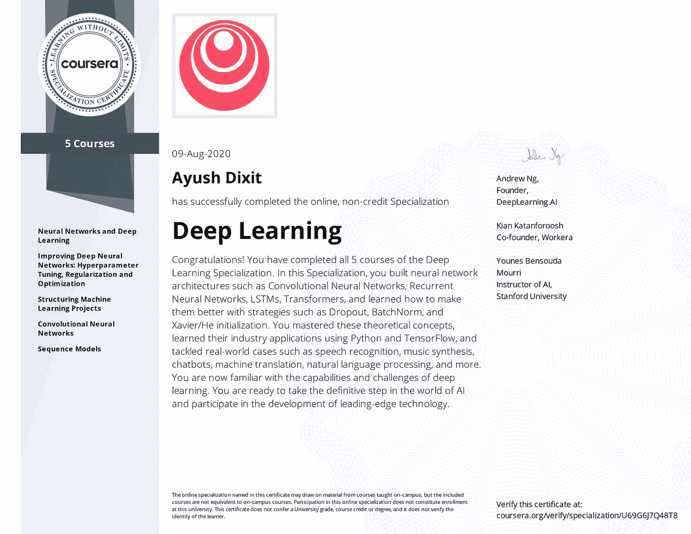
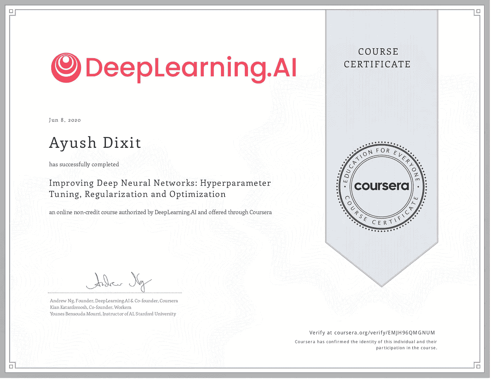
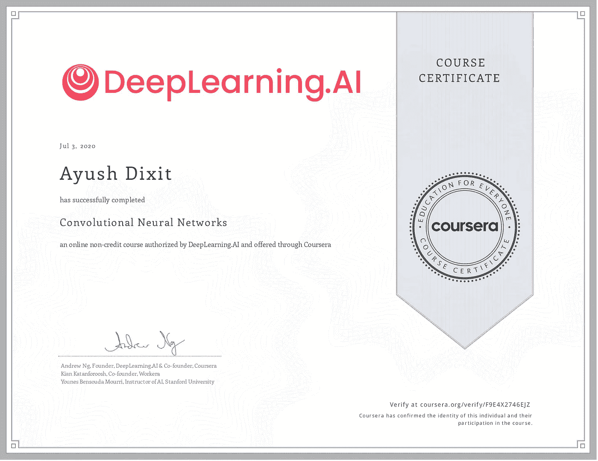
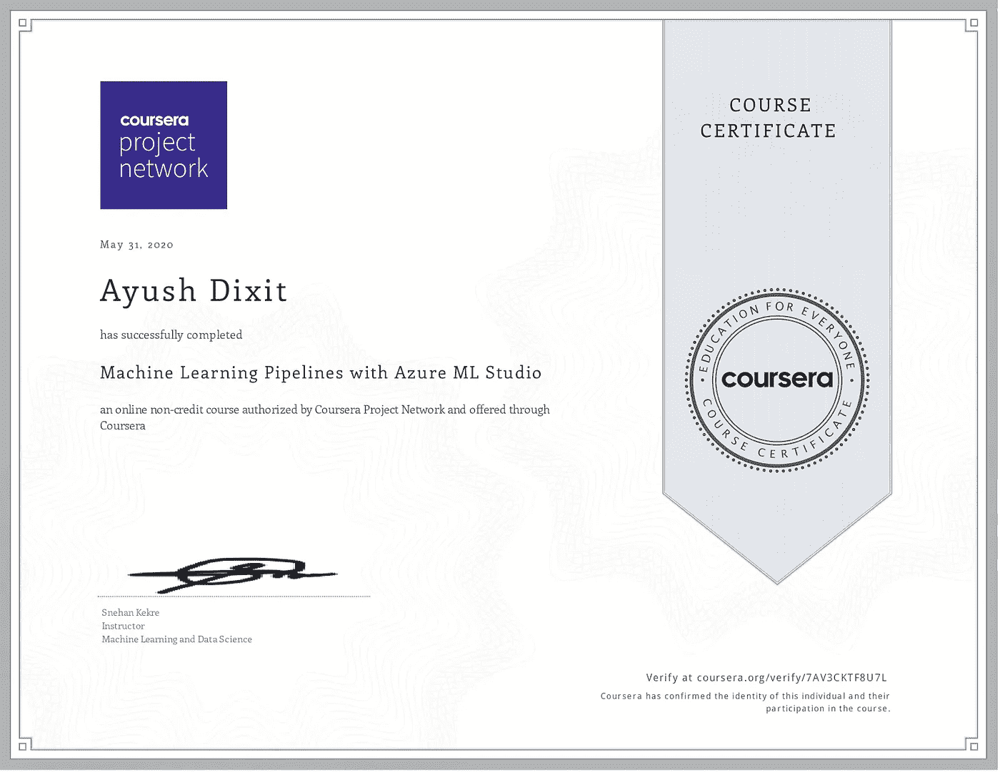
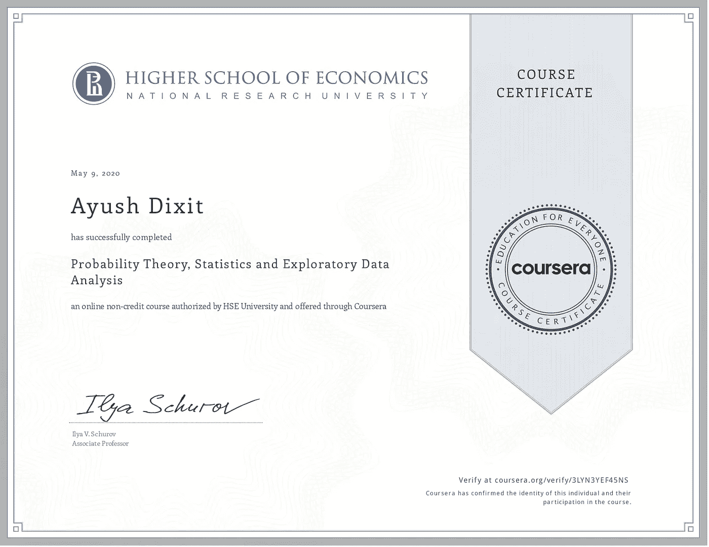

# 开始数据科学之旅的 7 大认证

> 原文：<https://medium.com/nerd-for-tech/top-7-certifications-to-begin-your-data-science-journey-ad4115d90891?source=collection_archive---------0----------------------->

决定学习数据科学的路线图可能很困难。尤其是在一个生态系统中，几乎每个企业组织都在提供相关课程和专业知识。

当我在印多尔的印度理工学院攻读研究生学位时。我对机器学习和人工智能(深度学习)产生了兴趣，并选修了这门课。

作为一名自学者，我更喜欢在一天中的任何时候自己探索和学习概念。然而，我发现，面对过多的课程，我很难决定选择哪门课程或专业来开始我的旅程。

经过几轮试错，我发现以下课程对学习 ML/AI 有益。

感谢 IIT-印多尔公司赞助这些认证，这对我的 ML 旅程帮助很大。

因此，以下是 Coursera 上提供的 7 大认证，你应该考虑开始你的数据科学之旅，以及我建议的完成顺序。

让我们直接开始吧。

## **1。吴恩达深度学习专业化**

这门课是由机器学习和人工智能领域最重要的先驱 Adrew Ng 提供的。这门课程由他亲自教授。

> Andrew Yan-Tak Ng 是英国出生的美国计算机科学家和技术企业家，专注于机器学习和人工智能。Ng 是谷歌大脑的联合创始人和负责人，也是百度的前首席科学家，他将该公司的人工智能团队建设成了一个几千人的团队:[维基](https://en.wikipedia.org/wiki/Andrew_Ng)。

本课程与其他课程的不同之处在于，它没有导入 scikit 库来实现机器学习算法。Andrew 从头开始介绍了每种 ML 算法的基本概念。编码练习给出了对所涵盖的理论概念的正确理解和实际实现。

事实上，我在课程中发现令人兴奋的是 Andrew 将困难的数学/统计概念与真实世界的例子和应用联系起来的能力。

> **如果讲师仅仅停留在统计概念上，深度学习会非常无聊。令人欣慰的是，Andrew 清楚地指导了课程，没有任何概念上的障碍，让学生在每个模块后都有清晰明确的应用意识。强烈推荐！**

## 2.改进深度神经网络:超参数调整、正则化和优化

接下来，当你对机器学习算法有了一个坚实的理解时，你手头的下一个任务就是改进它们或者通过优化超参数来调整它们。

**“改进深度神经网络:超参数调整、正则化和优化”**由 Andrew 提供。它深入到 ML 框架，并介绍了正则化的概念，如 L1 和 L2。超参数调谐。我发现超参数调整是课程的关键。

学习超参数调整在你的 ML 旅程中会有很长的路要走，特别是如果我们想提高 ML 模型的准确性。即使是小的小数点后两位的增长也能让你赢得一次黑客马拉松！从个人经验来说。

## **3。卷积神经网络**

我独立完成了这门课程，也是我深度学习专业的一部分。卷积神经网络在图像处理和 DNN 深度神经网络中有巨大的应用。

学习 CNN 对初学者来说是一个困难的挑战。我们的相机照片过滤器或 instagram 过滤器都基于 CNN 的基本概念，或者至少可以作为学习 CNN 的类比。

基本上，卷积神经网络(ConvNet/CNN)是一种深度学习算法，可以接受输入图像，为图像中的各个方面/对象分配重要性(可学习的权重和偏差)，并能够区分彼此。与其他分类算法相比，ConvNet 中所需的预处理要低得多。虽然在原始方法中，滤波器是手工设计的，但经过足够的训练，ConvNets 有能力学习这些[滤波器/特性](https://towardsdatascience.com/a-comprehensive-guide-to-convolutional-neural-networks-the-eli5-way-3bd2b1164a53)。

## **4。神经网络和深度学习**

**人工神经网络(ANN)和深度神经网络(ANN)有什么区别？**

大多数数据科学家都会纠结于这个答案。毫无疑问，除非我们有一个基于项目的学习，否则我们无法提供一个合理的理解。

我上这门课，是为了更深入地理解这些概念，并理解两者之间的鲜明对比。

> 虽然神经网络使用神经元通过连接以输入值和输出值的形式传输数据，但深度学习与特征的转换和提取相关联，该特征试图在刺激和大脑中存在的相关神经响应之间建立关系。
> -[Upgrad.com](https://www.upgrad.com/blog/deep-learning-vs-neural-networks-difference-between-deep-learning-and-neural-networks/#:~:text=While%20Neural%20Networks%20use%20neurons,responses%20present%20in%20the%20brain.)

此外，理解[深度学习和强化学习](https://www.forbes.com/sites/bernardmarr/2018/10/22/artificial-intelligence-whats-the-difference-between-deep-learning-and-reinforcement-learning/?sh=f8560a5271e1)之间的差异将会使人受益。

## 5.使用 Azure ML Studio 的机器学习管道

Azure ML Studio 是训练和部署 ML 模型的一个很好的工具，不需要任何编码。Azure 提供的用户界面是基于不用手操作的 GUI 的。从数据预处理到部署的任何事情。只需简单的拖放即可完成。

Azure Studio 提供 ML 即服务。使用户能够快速部署 ML 管道和相关的自动化 ML。coursera 推出实时项目学习课程已经有一段时间了。对于任何对 ML 模型的工业级部署感兴趣的人来说，这是最好和最有用的。

## 6.构建机器学习项目

安德鲁的另一颗宝石。“构建 ML 项目”为基于 ML 的项目设计了一个框架。

可以推测 ML 管道有以下几个阶段:

> **数据预处理→模型训练→模型评估→模型部署**

通常，我们发现模型部署部分是一个棘手的部分。因为在实际项目中复制模型评估中获得的结果可能是一个棘手的问题。考虑到随机种子同步和数据集的易失性，当我们采用基于 docker 的 ML 部署时，这肯定是另一个讨论。

对于初学者来说，这门课程无疑是 ML 管道框架的开端。也就是说，ML 项目的有效结构导致了部署。

## 7.概率论、统计学和探索性数据分析

许多数据科学家和业内中坚分子会告诉你，机器学习源于统计学。更重要的是，最大似然算法深深植根于统计分析和数学计算中。

本课程有助于牢固掌握算法的基本概念，即概率、统计和数据分析。

:)

我推荐它作为选修课。因为对最大似然算法本身的理解可以对高级数学概念有相当的把握。然而，当涉及到找工作或行业相关的项目部署。以上分享的 6 门课程足以让你在数据科学行业领先一步。

你喜欢我的努力吗？如果是的话，请跟我来获取我的最新帖子和更新，或者更好的是，请我喝杯咖啡！☕

 [## ayushdixit 正在编码、部署项目和写博客

### 嘿👋我刚刚在这里创建了一个页面。你现在可以给我买杯咖啡了！

www.buymeacoffee.com](https://www.buymeacoffee.com/ayushdixit)