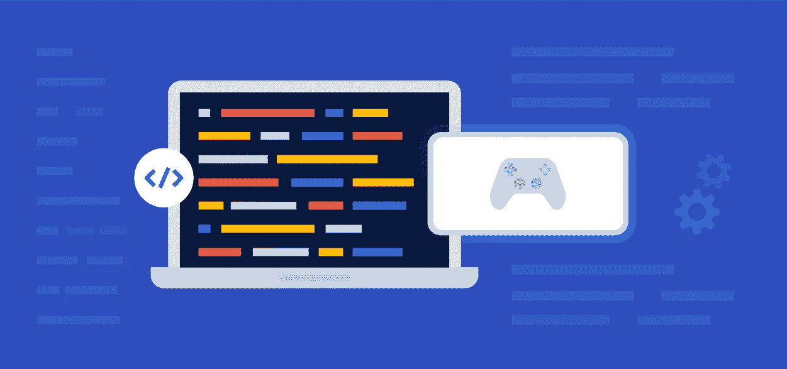

# 创建和启动新游戏的重要提示

> 原文：<https://medium.com/nerd-for-tech/top-tips-for-creating-and-launching-your-new-game-5e1f186a955e?source=collection_archive---------15----------------------->

六月，我在游戏商店发布了我的手机游戏 [Whot Cards](https://play.google.com/store/apps/details?id=com.tariibaba.whotcards) 。从项目开始到发布日花了相当长的时间，在这些早期阶段仍有许多工作要做，但这里是我迄今为止学到的最重要的经验:

# 1.尽快把东西拿出来

虽然你可能对你的游戏有一个很好的愿景，并且花几个月(甚至几年)来开发各种各样的功能是很诱人的，但是如果你致力于游戏最重要的方面，并且有一个最初的准系统版本，那会好得多，风险也小得多。这可能意味着仅仅是核心的游戏机制和一些润色来为你的用户提供基本的体验。

当我第一次开始创建[世界扑克](https://play.google.com/store/apps/details?id=com.tariibaba.whotcards)的时候，我花了很长时间尝试添加排行榜、能量、硬币等等。当时除了我之外，没有任何人关注过这个游戏。几个月后，我意识到首先推出一个最低可行产品(MVP)并获得关键用户反馈的重要性，这将使我能够在初始阶段改进游戏，并知道我是否有值得推出的东西。

# 2.把话传出去

你的游戏不会公布于世。如果你不采取行动，传播意识，人们不会突然听说你创造的神奇的东西。有勇气告诉人们尝试你的游戏。告诉你社交媒体上的朋友和关注者。你是在这里卖东西的人，你不应该害怕拒绝或负面反馈。

# 3.请求帮助

你需要所有你能得到的支持，尤其是如果你是一个独立开发者。早期问问你圈内的人对游戏的看法。他们积极的反馈和建设性的批评可能是非常需要的鼓励，当事情没有按计划进行，你错过了你为自己设定的最后期限，或者你不确定你花的所有时间是否值得时，它们会让你坚持下去。

# 4.使用免费资产

类似于前面的提示，不要一个人做所有的事情。网上有大量令人惊叹的免费内容，包括精灵、音乐、音效、编程库等等，它们会节省你大量的时间和精力，加速开发。

# 5.每天做一些工作

游戏开发需要努力和决心。有时候你会感到沮丧，想要放弃你正在做的项目。但是你能做的最重要的事情之一就是养成每天工作的习惯。任何进步都不会太小，即使你落后于计划，缓慢的进步也比完全没有进步要好。

所以这些是我创建和发布一个新游戏的最高提示。我希望你觉得它们有用。