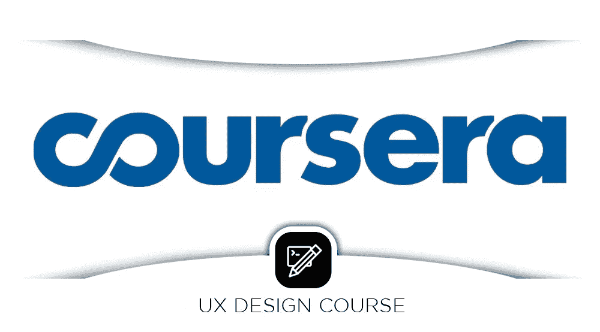
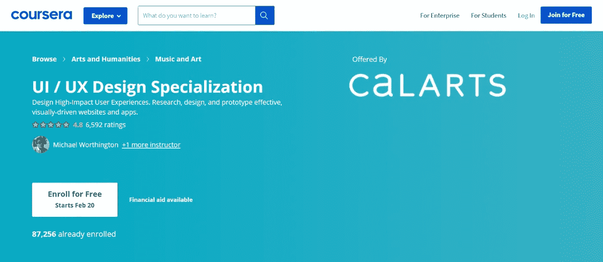
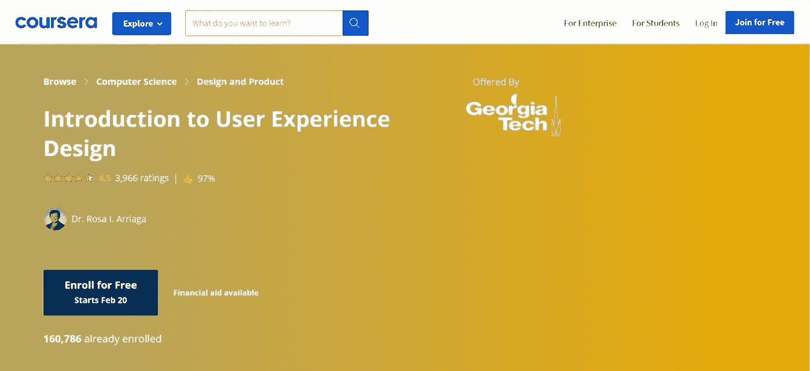
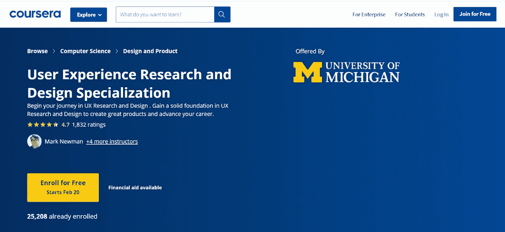
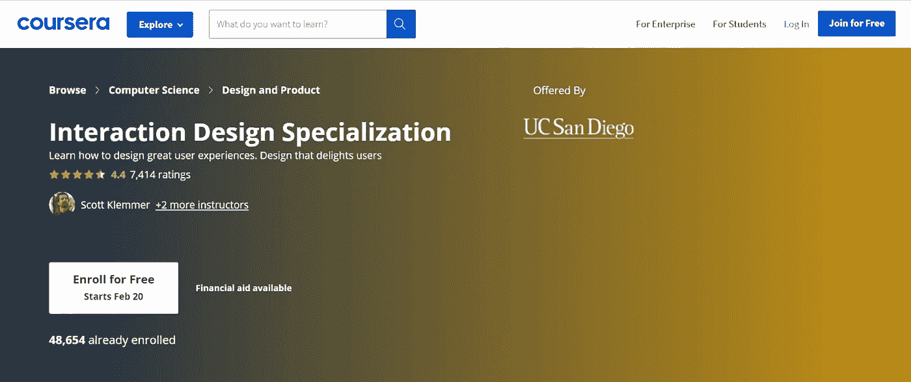
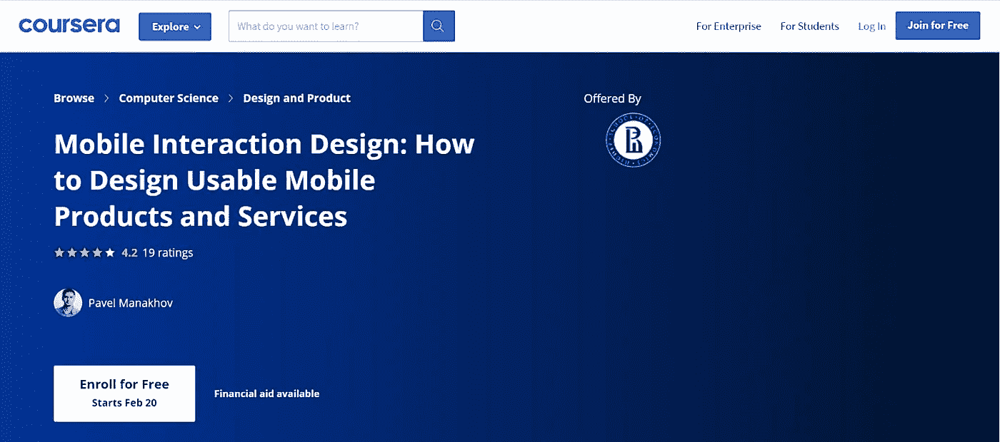
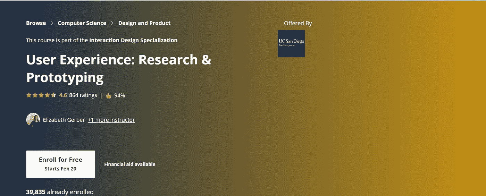
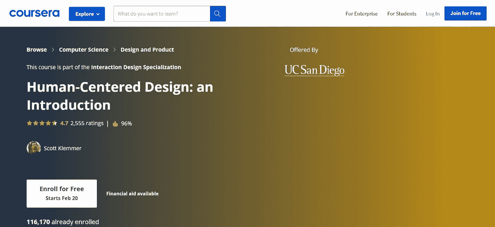
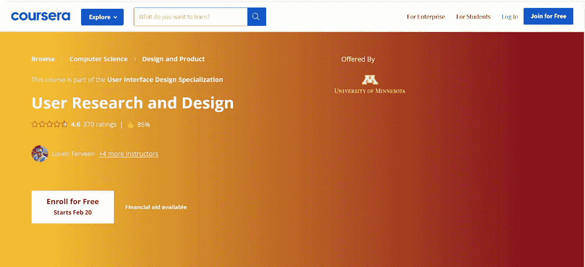
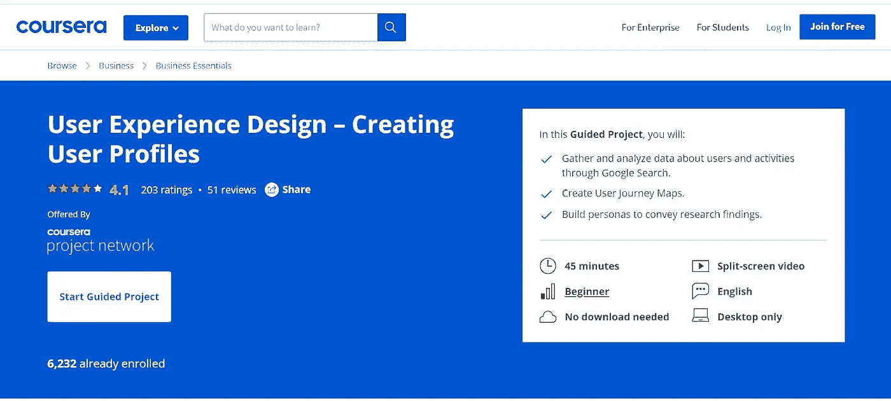

# 顶尖大学支持的 Coursera UX 各级设计课程

> 原文：<https://medium.com/nerd-for-tech/top-university-backed-coursera-ux-design-course-for-every-level-4cf5eede7b76?source=collection_archive---------29----------------------->

自从 X 设计获得了应有的重要性和可信度后，它已经看到了许多新面孔。设计师们一直在尝试各种技术，从 3D 图形到 skeuomorphism 等等。所有这些技术都对人们与数字界面的交互方式产生了巨大的影响，它们的开发和理解需要一些实践、学习和经验。

疫情推动了在线学习，每天都有越来越多的人加入进来。Coursera 是一家大型开放式在线课程提供商，提供大量(确切地说是 175 门)UX 课程。然而，并不是所有的 [Coursera UX 设计课程](https://bit.ly/30ug0QF)都有同等的影响力。在该平台提供的所有课程中， [Wondershare Mockitt](https://bit.ly/3ewCXuz) 选择了前 10 个课程供您参考。

# Coursera 上每个级别的 10 大 UX 设计课程

Coursera 有不同类型的实体参加这些课程。虽然有些是个人教师，但其他课程由机构和学院提供。你可以在列表中找到必要的信息来了解他们。

***1。*** [***UI / UX 设计专业— caLARTS***](https://www.coursera.org/specializations/ui-ux-design)

*   **证书—是**
*   **时间成本—4 个月内每周 5 小时**

这是一门为初学者和教师开设的课程，旨在制定一种以设计为中心的方法来制作娴熟的用户界面，并理解用户体验的作用。两位导师迈克尔·沃星顿和罗曼·贾斯特来自艺术学院，他们帮助学生识别视觉传达的核心方面。

学生们将学习 UX 惯例、格式、偏好，以及如何增强最终用户基于屏幕的体验。因为用户界面和 UX 是高需求领域，所以课程的安排是为了确保学生获得学习和驾驭利用行业相关趋势和构建交互式数字界面所需能力的能力。

在 Coursera 项目接近尾声时，有一个特殊的应用学习项目，要求学生应用他们所学的知识，并建立一个实际的项目。

***2。*** [***用户体验设计介绍—佐治亚理工***](https://www.coursera.org/learn/user-experience-design)

*   **证书—是**
*   **时间成本— 6 小时**

参加这个项目的学生一旦成功完成，将会学到四样东西。这些是可用性、用户体验、用户体验设计和用户界面。本课程教导学生，设计是一个系统化的过程，由数据和对数据的理解驱动。

课程讲师 Rosa I. Arriaga 博士是互动学习学院的高级研究科学家，她向学生讲授四步 UI 循环。学生学习与设计相关的数据收集，如何理解数据，如何使用数据来创建设计，并相应地对接口进行建模。

虽然这个 Coursera UX 设计课程是为初学者设计的，但是如果中级水平的设计师想重温 UX 设计的基础和核心原则，他们也可以参加。

***3。*** [***用户体验研究与设计专业—密歇根大学***](https://www.coursera.org/specializations/michiganux)

*   **证书—是**
*   **时间成本—9 个月内每周 2 小时**

从著名的密歇根大学来的课程必须是好的，不是吗？嗯，确实是。本课程面向初学者，通过为注册学生打下坚实的知识基础，激励他们在 UX 设计领域开创事业。

Coursera UX 项目的目的是帮助学生学习创造伟大的、令人难忘的、以用户为中心的产品，让他们能够推进自己的职业生涯。共有 5 名教师参加该课程，由马克·纽曼负责，整个项目有 6 个子课程。

从介绍 UX 设计原则开始，然后了解用户的需求，与用户一起评估设计，概念化和原型化，UX 设计调查，最后是 UX 顶点。

***4。*** [***交互设计专业化***](https://www.coursera.org/specializations/interaction-design)

*   **证书—是**
*   **时间成本——10 个月内每周 3 小时。**

Coursera UX 设计课程列表中的另一个很好的初学者课程，这个特殊的课程将帮助你学习几个关键的设计技能。从故事板到启发式评估，一直到用户体验原型，如果你想学习这个领域的大部分知识，这是一门你应该学的课程。

证书课程由三位讲师教授，Scott Kelmer、Elizabeth Gerber 和 Jacob O Wobbrock，分为八个模块。这些模块的大部分都与 UX 设计的理论理解和文学方面有关。

它们涵盖了以人为中心的设计、设计原理、社会计算、输入和交互、UX 研究和原型等主题。虽然这些方面非常广泛和多样化，但这个 UI UI Coursera 程序涵盖了所有这些方面的基础知识。请放心，你将能够应用所学知识，并最终创造出一个设计。

***5。*** [***移动交互设计— HSE 大学***](https://www.coursera.org/learn/mobile-interaction-design)

*   **证书—是**
*   **时间成本— 118 小时**

这门课由软件工程学院的副教授 Pavel Manakhov 教授。这个 Coursera UX 课程旨在帮助学生学习塑造人们将使用的产品和服务的艺术。

为了帮助学生提供良好而难忘的用户体验，本课程将带他们了解交互设计的基础知识，识别具有定性焦点的用户研究方法，并理解可用性检查和经验可用性。

我们已经将这个项目列入 Coursera UX 的课程清单，因为它能够创造一种独特的思维方式，一个人可以遵循一个设计过程。此外，它还以提出正确的设计问题的形式，教导了设计师做出决策的恰当表现。

最后，学生们将学会消除设计中的交互问题，并创建具有娴熟用户体验的大型用户界面设计。

***6。*** [***网页设计:线框到原型——caLARTS***](https://www.coursera.org/learn/web-design-wireframes-prototypes)

*   **证书—是**
*   **时间成本——41 小时**

该课程由 caLARTS 提供，由 Roman Jaster 指导，主要关注 UX 研究的早期应用，以及创建用户界面、模型和可点击的原型。网页设计需要响应性和交互性，这个 Coursera UX 设计有助于克服这些挑战。

参加该项目的学生将学习更多关于移动优先的方法，网页排版，以及设计和编程与移交程序之间的关系。所有这一切意味着，这门课程是为那些已经对 UX 设计有了基本了解，并需要进入更综合的概念。

由于这是一门与应用更相关的课程，用户将学习使用 Sketch、AdobeXD、Adobe Illustrator、Balsamiq 和 HTML/CSS。

***7。*** [***用户体验:研究&原型制作—加州大学圣地亚哥分校***](https://www.coursera.org/learn/user-research)

*   **证书—是**
*   **时间成本——11 个小时**

一个中级和高级的 Coursera UX 项目，专注于教授研究和原型的细微差别。在这个项目中，学生将通过人物角色创建、用户研究和人机交互来学习大量的用户体验。

该项目的讲师是 Elizabeth Gerber 和 Scott Klemmer，他们花时间教授用户体验的核心，并花时间帮助学生彻底理解相关概念。一个专注于创造属于自己的东西而不仅仅是找份工作的学生可以加入这个项目。

不仅如此，它还有助于理解设计和研究的基础。一个设计只有在创作之前进行的研究才是好的。此外，该课程向学生传授实用技术。

***8。*** [***人性化设计简介—加州大学圣地亚哥分校***](https://www.coursera.org/learn/human-computer-interaction#syllabus)

*   **证书—是**
*   **时间成本——14 个小时**

现在我们来到了 Coursera 上提供的与 UX 设计相关的高级课程。这个特别的 Coursera UX 设计项目将使你成为快速原型制作、故事板、启发式评估和纸上原型制作的专家。另一门课程是由 Scott Klemmer 单独开设的，这门课程介绍了以人为中心的设计的各个方面。

除此之外，学生将学习如何进行设计的实地调查，并对各方面进行比较评估。在课程结束时，你将学习如何制作纸质原型、低保真度原型和高质量界面。

***9。*** [***用户研究与设计—明尼苏达大学***](https://www.coursera.org/learn/design-research#syllabus)

*   **证书—是**
*   **时间成本— 8 小时**

另一个先进的 Coursera UX 项目，这种特殊的课程是由五个导师负责 Loren Terveen。该课程从一个小的介绍开始，带领用户对用户研究方法有更深入的理解，并帮助学生学习分析和交付所需的用户研究。

在最终设计中，不仅有而且有多种方法和策略来推断用户研究的影响。本课程将带你了解这些新颖和创新的方法，同时也带你了解旧的方法。教授最常见的方法，如调查、对数分析和其他类似的技术。

***10。*** [***用户体验设计—创建用户档案***](https://www.coursera.org/projects/uxdesign-userprofiles)

*   **证书—编号**
*   **时间成本—1 小时**

在所有其他 UX 设计课程中，这门课程由 Coursera 制作，帮助了解 UX 专业人士所拥有的核心技能。这是一个指导性的项目，只运行一个小时，但这一个小时是值得的，因为它将带你从头开始创建用户配置文件的旅程。

由 Mark Veljkov 教授，这是一个指导性的项目，这意味着你可以同时遵循讲师教授的所有内容。本课程的教学大纲包括收集研究信息，组织这些信息，并传达这些信息以创造更好的和有针对性的研究结果。课程以分享最终用户角色结束。

# 结论

Coursera 有一个庞大的课程库，几乎涵盖了每个行业和领域。今天我们讨论了 Coursera UX 十大设计项目，旨在帮助各个层次的个人更好地理解如何浏览用户体验设计的概念。

根据你对 UX 设计的理解程度，选择一门你可以跟随并开始学习的课程。作为初学者，建议从初级课程开始，然后转入中级和专业高级课程。

感谢您花时间阅读这篇文章。[了解更多关于 Mockitt 的信息](https://bit.ly/3ewCXuz)

我们为 UX 初学者创建了一个[终极指南](https://bit.ly/2OLPPlW)，它收集了来自多个 UXers 的知识、经验和建议。

订阅我们的 [YouTube](https://www.youtube.com/channel/UCESxamaRS8nOGpWYvP1VSqA) [脸书](https://www.facebook.com/mockitt) [Instagram](https://www.instagram.com/wondershare.mockitt/)

*原载于*[*https://mockitt.wondershare.com*](https://mockitt.wondershare.com/ui-ux-design/courser-ux-design.html)*。*