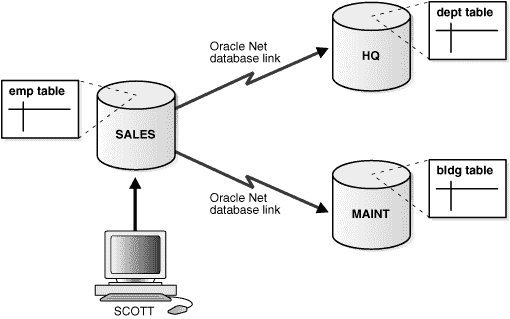
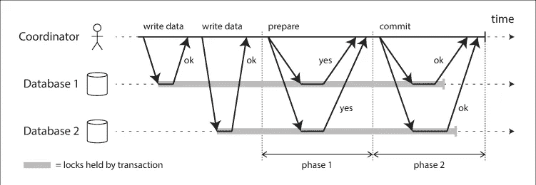
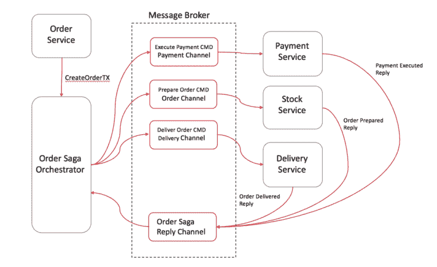
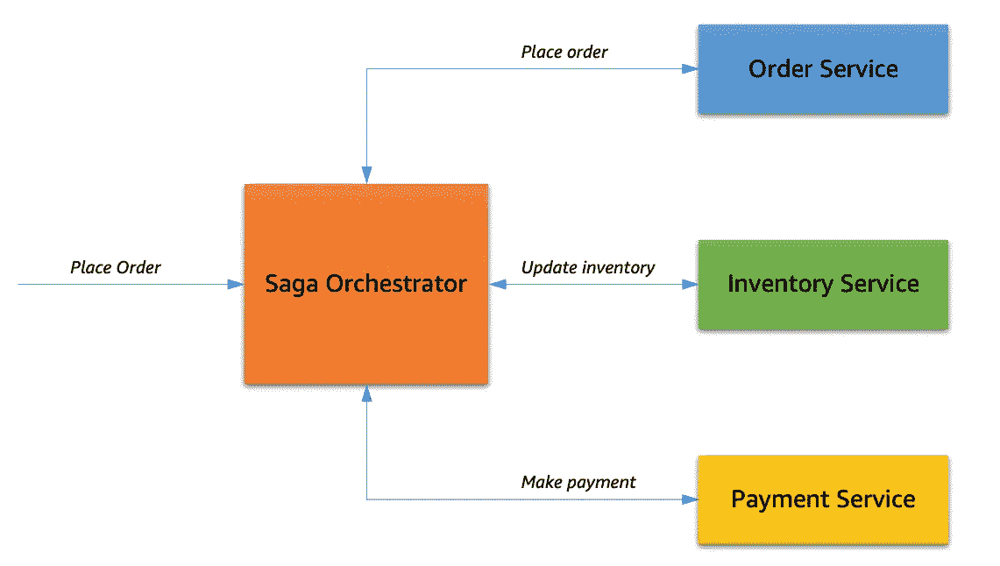
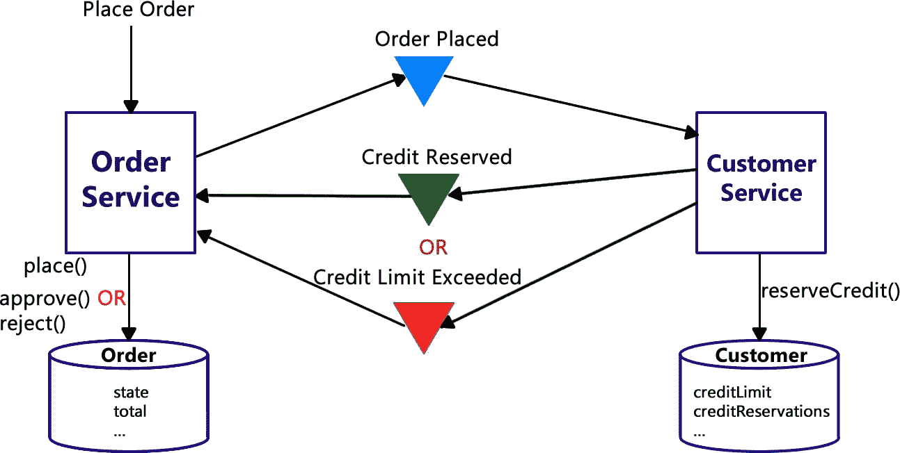

# 分布式系统中的事务

> 原文：<https://medium.com/nerd-for-tech/transactions-in-distributed-systems-b5ceea869d7d?source=collection_archive---------0----------------------->

# 什么是交易？

**事务**表示在数据库管理系统(或类似系统)中针对数据库执行的一个工作单元，并且以独立于其他事务的一致和可靠的方式进行处理。事务通常代表数据库中的任何变化。数据库环境中的事务有两个主要目的:

1.  提供可靠的工作单元，允许从故障中正确恢复，并在系统故障的情况下保持数据库的一致性。例如，当执行过早地意外停止(完全或部分)时，数据库上的许多操作仍未完成，状态不明。
2.  在并发访问数据库的程序之间提供隔离。如果不提供这种隔离，程序的结果可能是错误的。

当分解我们的数据库时，我们已经触及了一些可能导致的问题。维护引用完整性变得很成问题，延迟会增加，并且我们可以使像报告这样的活动变得更复杂。我们已经研究了应对这些挑战的各种模式，但是仍然有一个大问题:交易怎么办？
在一个事务中修改我们的数据库可以使我们的系统更容易推理，因此更容易开发和维护。我们依靠数据库来确保数据的安全性和一致性，让我们去担心其他事情。但是当我们跨数据库分割数据时，我们失去了使用数据库事务以原子方式应用状态变化的好处。在我们探索如何解决这个问题之前，让我们简单地看一下普通的数据库事务给我们带来了什么。

# 酸性交易

通常，当我们谈论数据库事务时，我们指的是 ACID 事务。ACID 是一个缩写词，概括了数据库事务的关键属性，这些属性导致我们可以依赖一个系统来确保我们的数据存储的持久性和一致性。这些特性给了我们:

*   **原子性**:确保事务内完成的所有操作要么全部完成，要么全部失败。如果我们试图进行的任何更改由于某种原因失败了，那么整个操作就会中止，就好像从来没有进行过任何更改一样。
*   一致性:当我们的数据库发生变化时，我们确保它处于有效、一致的状态。
*   **隔离**:允许多个事务同时操作，而不会相互干扰。
    这是通过确保在一个事务期间进行的任何临时状态改变对其他事务不可见来实现的。
*   **持久性:**确保交易完成后，我们确信数据不会在系统出现故障时丢失。

我想说明的是，当我们将数据库分开时，我们仍然可以使用 ACID 风格的事务，但是这些事务的范围缩小了，它们的有用性也减少了。对于单个数据库，这是在单个 ACID 数据库事务的范围内完成的要么写入新行，要么都不写入，我们可以在分布式数据库中做完全相同的事情，但现在每个
更改都是在不同的数据库中进行的。这意味着需要考虑两个事务，每个事务都可以独立工作或失败

这种原子性的缺乏会开始导致严重的问题，特别是如果我们正在迁移以前依赖于这种属性的系统。正是在这一点上，人们开始寻找其他解决方案，让他们能够思考一下同时对多个服务进行的更改。通常，人们开始考虑的第一个选项是分布式事务。让我们看看实现分布式事务的最常见的算法之一，两阶段提交，作为探索与分布式事务相关的整体挑战的一种方式。

# 两阶段提交

两阶段提交算法(有时简称为 2PC)经常被用来尝试让我们能够在分布式系统中进行事务性更改，在这种情况下，多个单独的进程可能需要作为整体操作的一部分进行更新。我想让你提前知道 2pc 有局限性，我们会谈到，但它们是值得了解的。迁移到微服务架构
的团队经常提出分布式事务，更具体地说是两阶段提交，作为解决他们面临的挑战的一种方式。但是正如我们将要看到的，它们可能不能解决你的问题，甚至会给你的系统带来更多的混乱。
该算法分为两个阶段(因此得名两阶段提交):投票阶段和提交阶段。在投票阶段，中央协调器联系所有将成为事务一部分的工人，并请求确认是否可以进行某些状态更改。

当两阶段提交工作时，它们的核心通常只是协调分布式锁。工人需要锁定本地资源，以确保提交可以在第二阶段进行。在单进程系统中管理锁和避免死锁并不有趣。现在想象一下在多个参与者之间协调锁的挑战。不好看。有许多与两阶段提交相关的失败模式，我们没有时间去探究。考虑这样一个问题，一个工人投票决定继续处理事务，但是当要求提交时却没有响应。那我们该怎么办？这些故障模式中有些可以自动处理，但有些会使系统处于需要手动清除的状态。参与者越多，系统中的延迟越长，两阶段提交的问题就越多。它们可能会很快给系统带来大量的延迟，尤其是在锁定范围很大或者事务持续时间很长的情况下。正是因为这个原因，两阶段提交通常只用于非常短暂的操作。操作花费的时间越长，资源被锁定的时间就越长！

## 为什么使用分布式事务不是一个好的决定？

鉴于以上原因，我强烈建议您避免使用像两阶段提交这样的分布式事务来协调分布式系统中的状态变化。所以你还能做什么？
嗯，第一个选择可能是一开始就不要把数据分开。如果您想要以真正原子和一致的方式管理状态的片段，并且您无法解决如何在没有 ACID 风格的事务的情况下明智地获得这些特征，那么将该状态留在单个数据库中，并将
管理该状态的功能留在单个服务中(或者在您的 monolith 中)。如果您正在研究在哪里分割您的整体，以及进行什么样的分解可能容易(或困难)，那么您很可能会认为分割当前在事务中管理的数据现在太难处理了。研究系统的其他部分，稍后再回到这个问题。但是，如果您确实需要拆分这些数据，但又不想承受管理分布式事务的所有痛苦，会发生什么呢？如何在多个服务中执行操作，但避免锁定？如果手术需要几分钟，几天，甚至几个月的时间呢？在这种情况下，我们可以考虑另一种方法:传奇。

# 萨迦

与两阶段提交不同，saga 设计了一种算法，可以协调多个状态变化，但避免了长时间锁定资源的需要。我们通过将所涉及的步骤建模为可以独立执行的离散活动来做到这一点。它带来了额外的好处，迫使我们显式地建模我们的业务流程，这可以带来显著的好处。由埃克托·加西亚-莫利纳和肯尼斯·塞勒姆首先概述的核心思想，10 反映了如何最好地处理他们称为长期事务(LLT)的操作的挑战。这些事务可能需要很长时间(几分钟、几小时，甚至几天)，并且作为该过程的一部分，需要对数据库进行更改。如果您将一个 LLT 直接映射到一个普通的数据库事务，那么一个数据库事务将会跨越它的整个生命周期。这可能会导致多行甚至整个表在 LLT 发生时被长时间锁定，如果其他进程试图读取或修改这些锁定的资源，则会导致严重的问题。相反，论文的作者建议我们应该将这些 llt 分解成一系列事务，每个事务都可以独立处理。这个想法是，每个“子”事务的持续时间将会更短，并且只会修改受整个 LLT 影响的部分数据。因此，随着锁的范围和持续时间大大减少，底层数据库中的争用将会大大减少。虽然 sagas 最初被设想为一种帮助 llt 针对单个数据库进行操作的机制，但是该模型同样适用于协调跨多个服务的变更。我们可以将单个业务流程分解成一组调用，这些调用将作为单个事件的一部分对协作服务进行调用。

## Saga 故障模式

随着一个传奇被分解成单独的事务，我们需要考虑如何处理失败，更具体地说，当失败发生时如何恢复。最初的 saga 论文描述了两种类型的恢复:向后恢复和向前恢复。向后恢复包括恢复故障并在回滚后进行清理。要做到这一点，我们需要定义补偿动作，允许我们撤销以前提交的事务。前向恢复允许我们从失败发生的地方开始，并继续处理。要做到这一点，我们需要能够重试事务，这反过来意味着我们的系统保存了足够的信息来允许进行重试。根据所建模的业务流程的性质，您可能会认为任何故障模式都会触发向后恢复、向前恢复或者两者的混合。

# 实施传奇

到目前为止，我们已经看到了传奇如何工作的逻辑模型，但是我们需要更深入一点来检查实现传奇本身的方式。我们可以看看两种风格的 saga 实现。编排的传奇更紧密地遵循原始的解决方案空间，并且主要依赖于集中的协调和跟踪。这些可以与精心设计的传奇相比，后者避免了集中协调的需要，有利于更松散耦合的模型，但这会使跟踪传奇的进展变得更加复杂。

## 精心策划的传奇故事

编排是集中业务流程逻辑工作流的一种方式。它通过向适当的服务发送命令并使用产生的事件来协调工作流。与编排相反，编排告诉其他服务执行什么动作/命令，而不是这些服务对系统中的其他事件作出反应。

以图片中显示的订单执行流程为例，让我们看看这个中央协调流程是如何作为一组协作服务工作的。在这里，我们的中央订单处理器扮演着协调者的角色，协调我们的执行流程。它知道执行操作需要哪些服务，并决定何时调用这些服务。如果调用失败，它可以决定结果如何。这些编排好的处理器倾向于大量使用服务之间的请求/响应调用:订单处理器向服务(比如支付网关)发送请求，并期望得到响应，让它知道请求是否成功并提供请求的结果。让我们的业务流程在订单处理器中明确建模是非常有益的。它允许我们观察我们系统中的一个地方，并理解这个过程应该如何工作。这可以使新人的入职变得更容易，并有助于更好地理解系统的核心部分。

## 编排的优点和缺点

*   集中式逻辑:这有好有坏
*   更容易理解工作流程，因为它是在一个中心位置定义的
*   通过命令完全控制工作流程步骤
*   故障点
*   更易于调试和测试

# 精心编排的传奇故事

精心设计的传奇旨在将传奇运作的责任分配给多个协作服务。如果编排是命令和控制的，那么编排的传奇就代表了一种信任但验证的架构。正如我们将在图中的示例中看到的，编排好的传奇通常会大量使用事件来进行服务间的协作。这里发生了很多事情，所以值得更详细地探究。首先，这些服务对收到的事件做出反应。从概念上讲，事件是在系统中广播的，感兴趣的各方能够接收到它们。您不会向服务发送事件；您只需发出它们，对这些事件感兴趣的服务就能够接收它们并相应地采取行动。在我们的示例中，当仓库服务收到第一个订单事件时，它知道自己的工作是保留适当的库存，并在完成后触发一个事件。如果无法收到库存，仓库将需要引发一个适当的事件(可能是库存不足事件)，这可能会导致订单被中止

## 编舞的优点和缺点

*   没有集中的逻辑:这可能是好的也可能是坏的
*   适用于小型/简单的工作流程
*   如果涉及大量服务，则很难概念化。
*   如果涉及大量服务，必须进行调试和测试

# 编舞还是配器？

实现精心设计的传奇可以带来你和你的团队可能不熟悉的想法。他们通常假设大量使用事件驱动的协作，这并没有被广泛理解。然而，以我的经验来看，拥有一个更松散耦合的架构所带来的好处几乎总是比跟踪一个传奇的进展所带来的额外的复杂性更重要。抛开我个人的品味，我给出的关于编排和编排的一般建议是，当一个团队拥有整个传奇的实现时，我会非常放松地使用编排的传奇。在这种情况下，更内在耦合的架构更容易在团队范围内管理。如果你有多个团队参与，我更喜欢更加
分解编排的传奇，因为它更容易将实现传奇的责任分配给团队，更松散耦合的架构允许这些团队更加孤立地工作。

## 传奇与分布式事务

正如我所希望的那样，分布式事务伴随着一些重大的挑战，在一些非常特殊的情况之外，我会尽量避免。Pat Helland 是分布式系统的先驱，他提炼了为我们今天构建的各种应用程序实现分布式事务的基本挑战。将业务流程显式建模为一个传奇避免了分布式事务的许多挑战，同时还有一个额外的好处，那就是使原本隐式建模的流程对开发人员来说更加显而易见。使系统的核心业务流程成为一流的概念将会有很多好处。对实现编排和编排的更全面的讨论，以及各种实现细节。

# 结论

管理事务抛出分布式系统是一个大话题我会放一些参考资料来帮助你在这个话题上提高自己。

*   从整体服务到微服务:改变整体服务的进化模式第 4 章
*   [反应式](https://www.researchgate.net/publication/335069774_The_Saga_Pattern_in_a_Reactive_Microservices_Environment)微服务环境中的传奇模式
*   D [分布式事务和分布式并发控制](https://www.researchgate.net/publication/353515034_Distributed_Transactions_and_Distributed_Concurrency_Control)