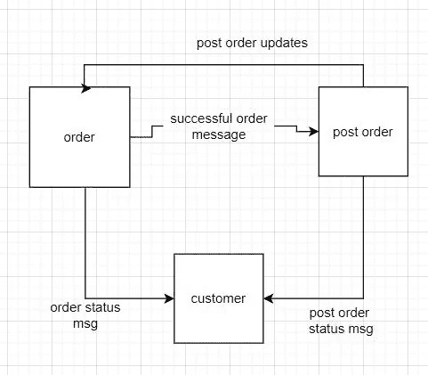
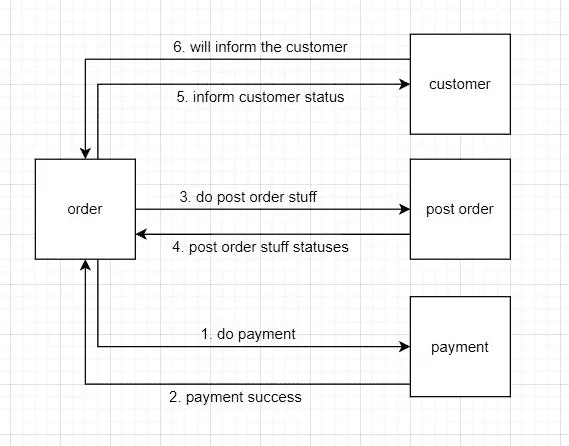

# 软件系统交易

> 原文：<https://medium.com/nerd-for-tech/transactions-in-software-systems-3dfeb77fd6f2?source=collection_archive---------0----------------------->

# 交易

首先问一个简单的问题:什么是事务？简单地说，交易就是商品或服务的交换。现在，当应用于软件系统时，事务将被定义为在实体上完成的操作。

## **一个实体？**

实体是软件系统中现实世界事物的基本单位。例如，金融实体，如货币，资产实体，如财产等。

当需要对实体进行操作时，需要用一组需要满足的标准来完成，这将确保操作之前、期间和之后的实体状态是确定的。

我们通常在持久层即数据库提供的事务的上下文中谈论软件系统**中的**事务**。然而这不是唯一的定义。这种说法更多的时候是在关系数据库和 SQL 数据库是唯一的解决方案，软件服务被限制为单一的整体服务的时候。关系数据库的众所周知的属性是 ACID 属性。酸的概述如下:**

1.  原子性—事务要么成功发生，要么失败。中间没有其他状态。
2.  一致性—这是指数据的完整性，以便数据库在事务处理前后保持一致。
3.  隔离—每个事务独立执行。发生的多个事务互不干扰。
4.  持久性—一旦事务成功完成，即使系统出现故障，它也会保留在系统中。

我觉得交易的一些众所周知的标准很有趣:

1.  要完成一个事务并使数据库更改永久化，必须完整地完成一个事务。
2.  当一个事务成功完成时，数据库更改被称为*提交*；当一个事务没有完成时，变更被 [*回滚*](https://searchsqlserver.techtarget.com/definition/rollback) 。
3.  有不同级别的 ACID 属性可以配置，主要用于一致性和隔离。
4.  事务可以有多步过程来有效地管理它们。

# 单片系统

当您的服务是使用 SQL 数据库的整体服务时，您几乎可以假定来自数据库的 ACID 保证。事务管理可以由您的代码使用 DB 事务管理来处理，因此可以管理您的实体状态。

在事务管理中，单片应用程序的最大优势是单一的公共数据库服务器。事务可以在数据库级别启动，并可以根据事务的最终结果提交或回滚。

在我们讨论跨分布式边界的事务之前，让我们首先理解事务在理论上是如何在 SQL servers 中发生的。SQL Server 可以运行 3 种不同的事务模式，它们是:

1.  **自动提交事务**模式是 SQL Server 的默认事务。在这种模式下，每个 T-SQL 语句都被视为一个事务，并根据其结果进行提交或回滚。成功的语句被提交，失败的语句被立即回滚
2.  **隐式事务**模式使 SQL Server 能够为每个 DML 语句启动隐式事务，但我们需要在语句末尾显式使用提交或回滚命令
3.  **显式事务**模式提供了定义事务的起点和终点

# 分布式系统

但是当您在一个分布式设置中工作时，多个微服务有它们自己的一组域和有界上下文。微服务指南强烈建议您使用单一存储库原则(SRP)，这意味着每个微服务维护自己的数据库，任何其他服务都不应直接访问其他服务的数据库。实体及其共享或相关数据现在跨越多个微服务。

## 微服务中的分布式事务方法

*   两阶段提交协议
*   最终一致性和补偿

## 2PC —两阶段提交

两阶段提交是一种标准化协议，它确保在提交操作必须分成两个独立部分的情况下，跨多个节点的**原子事务提交**得以实现。**保存数据更改被称为提交，撤销更改被称为回滚。**算法中有两个阶段——**准备**和**提交**。该算法包括发起事务的协调节点:

1.  准备:此阶段中事务的所有参与者都将为提交做好准备，并通知事务协调器/消息代理他们已经准备好完成事务
2.  提交或回滚:在此阶段，事务协调器将向所有参与者发出一个命令，即提交或回滚。

当涉及单个服务器时，使用事务日志记录可以相对容易地实现这两个阶段，但是当数据分布在分布式计算中地理位置不同的服务器上时(即，每个服务器是具有单独日志记录的独立实体)，该过程会变得更加棘手。

> 一个真正有趣的用例是使用 2PC 实现**恰好一次的消息处理**。请阅读[这篇文章:“Apache Flink 中端到端恰好一次处理概述”](https://flink.apache.org/features/2018/03/01/end-to-end-exactly-once-apache-flink.html)如果你对为什么必须使用两阶段提交算法来实现恰好一次语义感兴趣。

# 最终一致性和补偿

这种分布式事务模型源于 CAP 定理中放松 C 的概念。损害一致性并信任依赖域根据事务性质采取正确的步骤。其影响是跨节点或域的数据将被更新，但会有一些延迟，这基本上消除了数据新鲜度的保证。我们需要确保系统在未来的某个时间点最终应该是一致的。该模型不强制跨微服务使用 ACID 事务，而是强制使用某种机制来确保一致性。

事务中涉及的每个服务应负责向用户更新事务的正确状态，即使下一个连续的服务未能响应，并且应在服务启动时处理它们，并确保所有计划的事务都已完成并且系统中的数据是一致的。

# 传奇模式

来到微服务，2PC 不是一个选项。我们采用一种叫做传奇模式的东西。Saga 模式定义了不同微服务之间需要如何进行交互，以进行事务传播和事务反转。Saga 模式的两种类型是编排和编排模式。

以传奇的方式。我们实现跨越多个服务的每个业务事务。传奇是一系列本地事务。每个本地事务更新数据库并发布消息或事件来触发 saga 中的下一个本地事务。如果本地事务由于违反业务规则而失败，则 saga 会执行一系列补偿事务，以撤销之前的本地事务所做的更改。

 [## 微服务模式:Sagas

### 您已经按照服务模式应用了数据库。每个服务都有自己的数据库。一些商业交易…

微服务. io](https://microservices.io/patterns/data/saga.html) 

为了更好地理解传奇模式，我们将假设一个
1 的情况。订单服务
2。客服
3。履行服务。

## 舞蹈编排

编排模式认为，每对交互的微服务负责其事务提交或回滚以及合同。

## 管弦乐编曲

编排模式有一个编排器或协调服务，它告诉相关的服务要做什么以及要做的顺序。

## 利益

*   它使应用程序能够在不使用分布式事务的情况下跨多个服务维护数据一致性

## 缺点

*   编程模型更加复杂。需要有补偿事务来显式地撤销之前在传奇中所做的更改。

这篇文章试图帮助人们更好地理解处理这两种架构风格的软件系统中的事务。这两种体系结构的复杂性非常不同。管理事务传播和撤销的方法，以及关于陷阱和示例的细节。以下是微服务架构的非功能方面，它们使得分布式事务处理方式更加复杂。事务路径中的多点故障。
2。多种军种间通信模式。
3。交易路径中系统的可用性。
4。交易路径的可靠性和弹性。
5。跨事务路径中所有点的可伸缩性。

在下一篇文章中，我将讨论分布式系统中的一致性管理。作为其中的一部分，我将讨论一些著名的共识协议，如——Pax OS 和 gossip，它们用于一些著名的分布式系统，如 kafka、cassandra db。