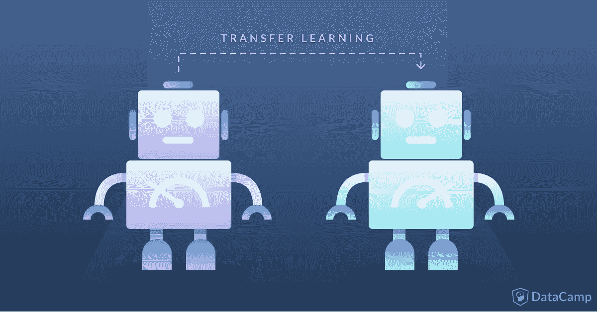
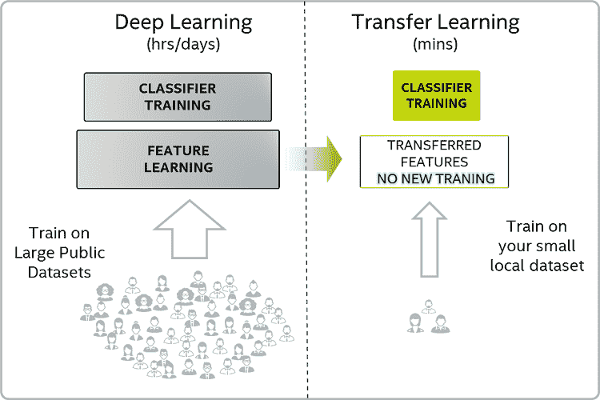

# 迁移学习

> 原文：<https://medium.com/nerd-for-tech/transfer-learning-7914c6ab2b56?source=collection_archive---------2----------------------->

来源:数据营

> 迁移学习将是机器学习成功的下一个驱动力。—吴恩达

## 什么是迁移学习？

迁移学习的一般思想是在只有少量标记数据的环境中，利用从有大量标记数据的任务中学到的知识。创建标记数据成本高昂，因此最佳利用现有数据集是关键。

在传统的机器学习模型中，主要目标是基于从训练数据中学习到的模式来归纳未知数据。在迁移学习中，你试图从已经学习的不同任务的模式开始启动这一概括过程。本质上，你不是从一张(通常是随机初始化的)白纸开始学习过程，而是从已经学会的解决不同任务的模式开始。

来源:走向数据科学

## 作为一名数据科学家，有三个原因需要很好地理解迁移学习:

迁移学习在任何学习中都是必不可少的。人类并不是为了成功完成每一项任务或问题而被教会的。每个人都会遇到从未遇到过的情况，而我们仍然能够以临时的方式解决问题。从大量经验中学习并将“知识”输出到新环境中的能力正是迁移学习的意义所在。

迁移学习是确保深度学习技术在大量小数据设置中取得突破的关键。深度学习在研究中几乎无处不在，但许多现实生活中的场景通常没有数百万个带标签的数据点来训练模型。深度学习技术需要大量数据来调整神经网络中的数百万个参数。

特别是在监督学习的情况下，这意味着你需要大量(非常昂贵的)标记数据。标记图像听起来微不足道，但例如在自然语言处理(NLP)中，需要专业知识来创建大型标记数据集。为了使神经网络成为可行的选择，迁移学习是减少所需数据集大小的一种方式。其他可行的选择正在转向更受概率启发的模型，这些模型通常更适合处理有限的数据集。

迁移学习有明显的优点也有缺点。理解这些缺点对于成功的机器学习应用至关重要。只有在适当的时候，知识的转移才是可能的。在这种情况下，准确定义适当的含义并不容易，通常需要进行实验。你不应该相信一个开着玩具车到处跑的小孩会开法拉利。同样的原则也适用于迁移学习:虽然很难量化，但迁移学习是有上限的。这不是一个适合所有问题的解决方案。

来源:freeCodeCamp

## 迁移学习的要求:-

迁移学习，顾名思义，需要将知识从一个领域转移到另一个领域的能力。迁移学习可以在高层次上解释，也就是说，NLP 模型架构可以在序列预测问题中重用，因为许多 NLP 问题可以固有地简化为序列预测问题。迁移学习也可以从一个较低的层面来理解，你实际上是在一个不同的模型中重用一个模型的参数。